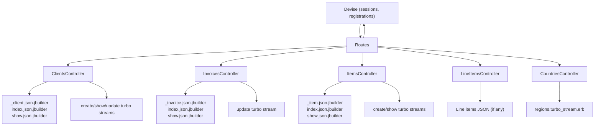
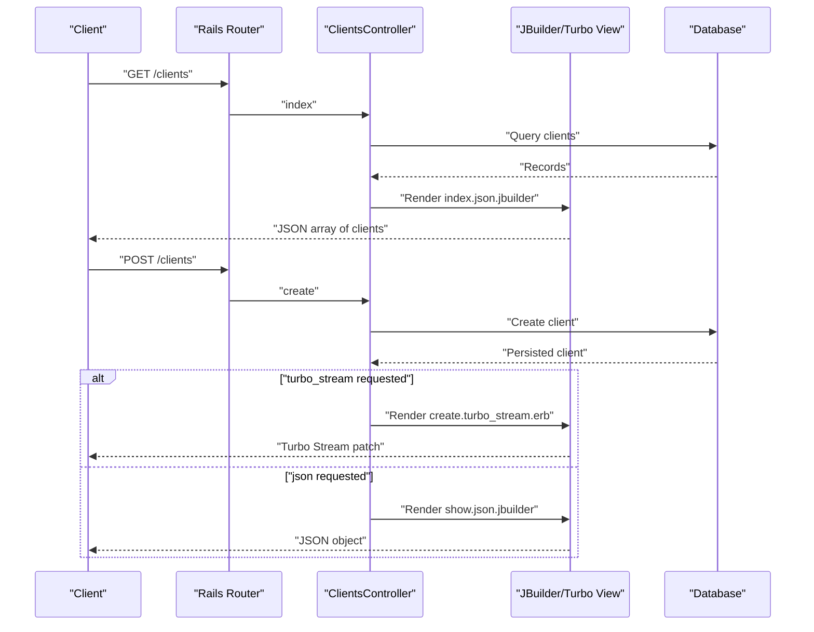
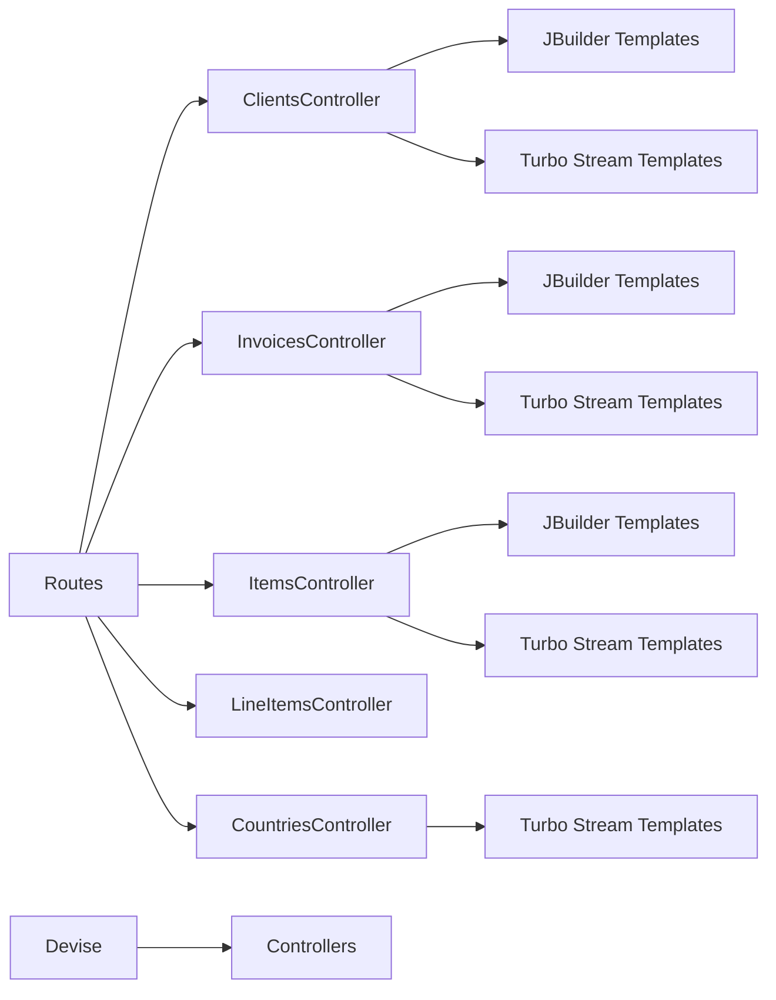

# API Reference

<cite>
**Referenced Files in This Document**
- [routes.rb](file://config/routes.rb)
- [application_controller.rb](file://app/controllers/application_controller.rb)
- [clients_controller.rb](file://app/controllers/clients_controller.rb)
- [invoices_controller.rb](file://app/controllers/invoices_controller.rb)
- [items_controller.rb](file://app/controllers/items_controller.rb)
- [line_items_controller.rb](file://app/controllers/line_items_controller.rb)
- [countries_controller.rb](file://app/controllers/countries_controller.rb)
- [contact_controller.rb](file://app/controllers/contact_controller.rb)
- [charts_controller.rb](file://app/controllers/charts_controller.rb)
- [dashboard_controller.rb](file://app/controllers/dashboard_controller.rb)
- [home_controller.rb](file://app/controllers/home_controller.rb)
- [registrations_controller.rb](file://app/controllers/registrations_controller.rb)
- [user_profile_controller.rb](file://app/controllers/user_profile_controller.rb)
- [client.json.jbuilder](file://app/views/clients/_client.json.jbuilder)
- [clients_index.json.jbuilder](file://app/views/clients/index.json.jbuilder)
- [clients_show.json.jbuilder](file://app/views/clients/show.json.jbuilder)
- [invoice.json.jbuilder](file://app/views/invoices/_invoice.json.jbuilder)
- [invoices_index.json.jbuilder](file://app/views/invoices/index.json.jbuilder)
- [invoices_show.json.jbuilder](file://app/views/invoices/show.json.jbuilder)
- [item.json.jbuilder](file://app/views/items/_item.json.jbuilder)
- [items_index.json.jbuilder](file://app/views/items/index.json.jbuilder)
- [items_show.json.jbuilder](file://app/views/items/show.json.jbuilder)
- [create.turbo_stream.erb (clients)](file://app/views/clients/create.turbo_stream.erb)
- [show.turbo_stream.erb (clients)](file://app/views/clients/show.turbo_stream.erb)
- [update.turbo_stream.erb (clients)](file://app/views/clients/update.turbo_stream.erb)
- [create.turbo_stream.erb (items)](file://app/views/items/create.turbo_stream.erb)
- [show.turbo_stream.erb (items)](file://app/views/items/show.turbo_stream.erb)
- [update.turbo_stream.erb (invoices)](file://app/views/invoices/update.turbo_stream.erb)
- [regions.turbo_stream.erb (countries)](file://app/views/countries/regions.turbo_stream.erb)
- [cable.yml](file://config/cable.yml)
- [application_cable_connection.rb](file://app/channels/application_cable/connection.rb)
- [application_cable_channel.rb](file://app/channels/application_cable/channel.rb)
- [devise.rb](file://config/initializers/devise.rb)
- [content_security_policy.rb](file://config/initializers/content_security_policy.rb)
- [permissions_policy.rb](file://config/initializers/permissions_policy.rb)
- [form_errors.rb](file://config/initializers/form_errors.rb)
- [pagy.rb](file://config/initializers/pagy.rb)
- [schema.rb](file://db/schema.rb)
</cite>

## Table of Contents
1. Introduction
2. Project Structure
3. Core Components
4. Architecture Overview
5. Detailed Component Analysis
6. Dependency Analysis
7. Performance Considerations
8. Troubleshooting Guide
9. Conclusion
10. Appendices

## Introduction
This document provides a comprehensive API reference for the RESTful JSON endpoints and Turbo Stream real-time updates exposed by the application. It covers client management, invoice operations, item catalog APIs, authentication requirements, request/response schemas, error handling, rate limiting considerations, versioning strategy, security posture, and practical implementation guidance for clients.

The application is a Rails-based invoicing system with:
- Standard REST controllers for Clients, Invoices, Items, and Line Items
- JSON serialization via JBuilder templates
- Turbo Stream responses for partial UI updates
- Devise-based authentication
- Action Cable configuration for WebSocket support

## Project Structure
At a high level, HTTP requests are routed to controllers defined under app/controllers. Controllers render JSON via JBuilder templates located under app/views/<resource>/... . Turbo Stream views provide real-time DOM patches. Authentication is handled by Devise.

**Diagram sources**
- [routes.rb](file://config/routes.rb)
- [clients_controller.rb](file://app/controllers/clients_controller.rb)
- [invoices_controller.rb](file://app/controllers/invoices_controller.rb)
- [items_controller.rb](file://app/controllers/items_controller.rb)
- [line_items_controller.rb](file://app/controllers/line_items_controller.rb)
- [countries_controller.rb](file://app/controllers/countries_controller.rb)
- [client.json.jbuilder](file://app/views/clients/_client.json.jbuilder)
- [clients_index.json.jbuilder](file://app/views/clients/index.json.jbuilder)
- [clients_show.json.jbuilder](file://app/views/clients/show.json.jbuilder)
- [invoice.json.jbuilder](file://app/views/invoices/_invoice.json.jbuilder)
- [invoices_index.json.jbuilder](file://app/views/invoices/index.json.jbuilder)
- [invoices_show.json.jbuilder](file://app/views/invoices/show.json.jbuilder)
- [item.json.jbuilder](file://app/views/items/_item.json.jbuilder)
- [items_index.json.jbuilder](file://app/views/items/index.json.jbuilder)
- [items_show.json.jbuilder](file://app/views/items/show.json.jbuilder)
- [regions.turbo_stream.erb (countries)](file://app/views/countries/regions.turbo_stream.erb)
- [create.turbo_stream.erb (clients)](file://app/views/clients/create.turbo_stream.erb)
- [show.turbo_stream.erb (clients)](file://app/views/clients/show.turbo_stream.erb)
- [update.turbo_stream.erb (clients)](file://app/views/clients/update.turbo_stream.erb)
- [create.turbo_stream.erb (items)](file://app/views/items/create.turbo_stream.erb)
- [show.turbo_stream.erb (items)](file://app/views/items/show.turbo_stream.erb)
- [update.turbo_stream.erb (invoices)](file://app/views/invoices/update.turbo_stream.erb)

**Section sources**
- [routes.rb](file://config/routes.rb)
- [application_controller.rb](file://app/controllers/application_controller.rb)

## Core Components
- Clients API: CRUD over clients with JSON and Turbo Stream updates.
- Invoices API: CRUD over invoices with JSON and Turbo Stream updates.
- Items API: Catalog management with JSON and Turbo Stream updates.
- Line Items API: Associated line items for invoices.
- Countries API: Region selection via Turbo Stream.
- Authentication: Devise-managed sessions and registrations.

Key behaviors:
- JSON responses are produced by JBuilder templates.
- Turbo Stream responses update specific DOM elements without full page reloads.
- Authentication is enforced per controller or action as configured.

**Section sources**
- [clients_controller.rb](file://app/controllers/clients_controller.rb)
- [invoices_controller.rb](file://app/controllers/invoices_controller.rb)
- [items_controller.rb](file://app/controllers/items_controller.rb)
- [line_items_controller.rb](file://app/controllers/line_items_controller.rb)
- [countries_controller.rb](file://app/controllers/countries_controller.rb)
- [client.json.jbuilder](file://app/views/clients/_client.json.jbuilder)
- [clients_index.json.jbuilder](file://app/views/clients/index.json.jbuilder)
- [clients_show.json.jbuilder](file://app/views/clients/show.json.jbuilder)
- [invoice.json.jbuilder](file://app/views/invoices/_invoice.json.jbuilder)
- [invoices_index.json.jbuilder](file://app/views/invoices/index.json.jbuilder)
- [invoices_show.json.jbuilder](file://app/views/invoices/show.json.jbuilder)
- [item.json.jbuilder](file://app/views/items/_item.json.jbuilder)
- [items_index.json.jbuilder](file://app/views/items/index.json.jbuilder)
- [items_show.json.jbuilder](file://app/views/items/show.json.jbuilder)

## Architecture Overview
The API follows standard Rails conventions:
- Routes map HTTP verbs and paths to controller actions.
- Controllers orchestrate business logic and delegate to models.
- Views include JBuilder templates for JSON and Turbo Stream templates for real-time updates.
- Authentication is provided by Devise; controllers can enforce login requirements.

**Diagram sources**
- [routes.rb](file://config/routes.rb)
- [clients_controller.rb](file://app/controllers/clients_controller.rb)
- [clients_index.json.jbuilder](file://app/views/clients/index.json.jbuilder)
- [clients_show.json.jbuilder](file://app/views/clients/show.json.jbuilder)
- [create.turbo_stream.erb (clients)](file://app/views/clients/create.turbo_stream.erb)

## Detailed Component Analysis

### Authentication and Security
- Authentication provider: Devise.
- Typical flows:
  - Sign in/out via sessions.
  - Registration via custom or default Devise routes.
- Security headers and policies:
  - Content Security Policy initializer present.
  - Permissions policy initializer present.
- Session cookies and CSRF protection are managed by Rails and Devise.

Implementation notes:
- Controllers may require authentication using before_action hooks.
- Ensure HTTPS in production and secure cookie settings.

**Section sources**
- [devise.rb](file://config/initializers/devise.rb)
- [content_security_policy.rb](file://config/initializers/content_security_policy.rb)
- [permissions_policy.rb](file://config/initializers/permissions_policy.rb)
- [application_controller.rb](file://app/controllers/application_controller.rb)

### Clients API
Endpoints:
- GET /clients
- POST /clients
- GET /clients/:id
- PATCH/PUT /clients/:id
- DELETE /clients/:id

Authentication:
- Typically required for write operations; verify controller-level enforcement.

Request formats:
- JSON: application/json
- Form data: multipart/form-data or application/x-www-form-urlencoded (for HTML forms)
- Turbo Stream: Accept: text/vnd.turbo-stream.html

Response formats:
- JSON: Single resource or collection via JBuilder templates.
- Turbo Stream: HTML fragments that patch DOM elements.

Error handling:
- Validation errors return appropriate status codes (e.g., 422).
- Error messages follow form_errors initializer behavior.

Example response fields:
- See JBuilder templates for exact field names and nesting.

**Section sources**
- [clients_controller.rb](file://app/controllers/clients_controller.rb)
- [clients_index.json.jbuilder](file://app/views/clients/index.json.jbuilder)
- [clients_show.json.jbuilder](file://app/views/clients/show.json.jbuilder)
- [client.json.jbuilder](file://app/views/clients/_client.json.jbuilder)
- [create.turbo_stream.erb (clients)](file://app/views/clients/create.turbo_stream.erb)
- [show.turbo_stream.erb (clients)](file://app/views/clients/show.turbo_stream.erb)
- [update.turbo_stream.erb (clients)](file://app/views/clients/update.turbo_stream.erb)
- [form_errors.rb](file://config/initializers/form_errors.rb)

### Invoices API
Endpoints:
- GET /invoices
- POST /invoices
- GET /invoices/:id
- PATCH/PUT /invoices/:id
- DELETE /invoices/:id

Authentication:
- Typically required for write operations; verify controller-level enforcement.

Request formats:
- JSON: application/json
- Turbo Stream: Accept: text/vnd.turbo-stream.html

Response formats:
- JSON: Single resource or collection via JBuilder templates.
- Turbo Stream: HTML fragments for partial updates.

Error handling:
- Validation errors return 422 with error details.

Example response fields:
- Refer to JBuilder templates for exact structure.

**Section sources**
- [invoices_controller.rb](file://app/controllers/invoices_controller.rb)
- [invoices_index.json.jbuilder](file://app/views/invoices/index.json.jbuilder)
- [invoices_show.json.jbuilder](file://app/views/invoices/show.json.jbuilder)
- [invoice.json.jbuilder](file://app/views/invoices/_invoice.json.jbuilder)
- [update.turbo_stream.erb (invoices)](file://app/views/invoices/update.turbo_stream.erb)
- [form_errors.rb](file://config/initializers/form_errors.rb)

### Items API
Endpoints:
- GET /items
- POST /items
- GET /items/:id
- PATCH/PUT /items/:id
- DELETE /items/:id

Authentication:
- Typically required for write operations; verify controller-level enforcement.

Request formats:
- JSON: application/json
- Turbo Stream: Accept: text/vnd.turbo-stream.html

Response formats:
- JSON: Single resource or collection via JBuilder templates.
- Turbo Stream: HTML fragments for partial updates.

Error handling:
- Validation errors return 422 with error details.

Example response fields:
- Refer to JBuilder templates for exact structure.

**Section sources**
- [items_controller.rb](file://app/controllers/items_controller.rb)
- [items_index.json.jbuilder](file://app/views/items/index.json.jbuilder)
- [items_show.json.jbuilder](file://app/views/items/show.json.jbuilder)
- [item.json.jbuilder](file://app/views/items/_item.json.jbuilder)
- [create.turbo_stream.erb (items)](file://app/views/items/create.turbo_stream.erb)
- [show.turbo_stream.erb (items)](file://app/views/items/show.turbo_stream.erb)
- [form_errors.rb](file://config/initializers/form_errors.rb)

### Line Items API
Endpoints:
- GET /line_items
- POST /line_items
- GET /line_items/:id
- PATCH/PUT /line_items/:id
- DELETE /line_items/:id

Notes:
- Line items are typically associated with invoices.
- Request/response structures depend on model associations and serializers.

**Section sources**
- [line_items_controller.rb](file://app/controllers/line_items_controller.rb)

### Countries and Regions (Turbo Stream)
Endpoints:
- GET /countries/:country_id/regions (or similar route pattern)
- Response: Turbo Stream fragment updating region select options based on selected country.

Use case:
- Dynamically populate dependent dropdowns without reloading the page.

**Section sources**
- [countries_controller.rb](file://app/controllers/countries_controller.rb)
- [regions.turbo_stream.erb (countries)](file://app/views/countries/regions.turbo_stream.erb)

### Additional Endpoints
- Charts: GET /charts/* for chart data or views.
- Dashboard: GET /dashboard/* for dashboard content.
- Home: GET /home/* for static pages.
- Contact: POST /contact for contact form submissions.
- User Profile: GET/PUT /user_profile/* for profile management.
- Registrations: Custom registration flows beyond Devise defaults.

**Section sources**
- [charts_controller.rb](file://app/controllers/charts_controller.rb)
- [dashboard_controller.rb](file://app/controllers/dashboard_controller.rb)
- [home_controller.rb](file://app/controllers/home_controller.rb)
- [contact_controller.rb](file://app/controllers/contact_controller.rb)
- [user_profile_controller.rb](file://app/controllers/user_profile_controller.rb)
- [registrations_controller.rb](file://app/controllers/registrations_controller.rb)

## Dependency Analysis
Controllers depend on:
- Models for persistence and validations.
- JBuilder templates for JSON serialization.
- Turbo Stream templates for real-time updates.
- Devise for authentication.

**Diagram sources**
- [routes.rb](file://config/routes.rb)
- [clients_controller.rb](file://app/controllers/clients_controller.rb)
- [invoices_controller.rb](file://app/controllers/invoices_controller.rb)
- [items_controller.rb](file://app/controllers/items_controller.rb)
- [line_items_controller.rb](file://app/controllers/line_items_controller.rb)
- [countries_controller.rb](file://app/controllers/countries_controller.rb)
- [client.json.jbuilder](file://app/views/clients/_client.json.jbuilder)
- [invoice.json.jbuilder](file://app/views/invoices/_invoice.json.jbuilder)
- [item.json.jbuilder](file://app/views/items/_item.json.jbuilder)
- [create.turbo_stream.erb (clients)](file://app/views/clients/create.turbo_stream.erb)
- [update.turbo_stream.erb (invoices)](file://app/views/invoices/update.turbo_stream.erb)
- [show.turbo_stream.erb (items)](file://app/views/items/show.turbo_stream.erb)
- [regions.turbo_stream.erb (countries)](file://app/views/countries/regions.turbo_stream.erb)
- [devise.rb](file://config/initializers/devise.rb)

**Section sources**
- [routes.rb](file://config/routes.rb)
- [application_controller.rb](file://app/controllers/application_controller.rb)

## Performance Considerations
- Use pagination for list endpoints if implemented (check Pagy initializer).
- Prefer Turbo Stream for frequent UI updates to reduce payload size.
- Cache expensive queries where appropriate.
- Avoid N+1 queries by eager loading associations in controllers.
- Compress responses in production.

[No sources needed since this section provides general guidance]

## Troubleshooting Guide
Common issues:
- Authentication failures: Verify session validity and CSRF tokens.
- Validation errors: Check 422 responses and error message format.
- Turbo Stream not applied: Ensure correct Accept header and target element IDs match.
- CORS issues: Confirm CSP and permissions policies allow required origins.

Debugging steps:
- Inspect network tab for request payloads and responses.
- Validate Turbo Stream targets and attributes.
- Review server logs for stack traces and validation errors.

**Section sources**
- [form_errors.rb](file://config/initializers/form_errors.rb)
- [content_security_policy.rb](file://config/initializers/content_security_policy.rb)
- [permissions_policy.rb](file://config/initializers/permissions_policy.rb)

## Conclusion
The API provides robust REST endpoints for managing clients, invoices, items, and related entities, complemented by Turbo Stream for efficient real-time updates. Authentication is handled by Devise, and security is reinforced through CSP and permissions policies. Follow the guidelines below to integrate effectively and securely.

[No sources needed since this section summarizes without analyzing specific files]

## Appendices

### Request/Response Schemas
- Clients:
  - Fields and nesting are defined in JBuilder templates.
- Invoices:
  - Fields and nesting are defined in JBuilder templates.
- Items:
  - Fields and nesting are defined in JBuilder templates.

To determine exact schema, inspect the corresponding JBuilder templates.

**Section sources**
- [client.json.jbuilder](file://app/views/clients/_client.json.jbuilder)
- [clients_index.json.jbuilder](file://app/views/clients/index.json.jbuilder)
- [clients_show.json.jbuilder](file://app/views/clients/show.json.jbuilder)
- [invoice.json.jbuilder](file://app/views/invoices/_invoice.json.jbuilder)
- [invoices_index.json.jbuilder](file://app/views/invoices/index.json.jbuilder)
- [invoices_show.json.jbuilder](file://app/views/invoices/show.json.jbuilder)
- [item.json.jbuilder](file://app/views/items/_item.json.jbuilder)
- [items_index.json.jbuilder](file://app/views/items/index.json.jbuilder)
- [items_show.json.jbuilder](file://app/views/items/show.json.jbuilder)

### Turbo Stream Patterns
- Create/Update/Create patterns:
  - Render Turbo Stream fragments to append or replace DOM nodes.
- Dependent selects:
  - Update region options based on country selection.

**Section sources**
- [create.turbo_stream.erb (clients)](file://app/views/clients/create.turbo_stream.erb)
- [show.turbo_stream.erb (clients)](file://app/views/clients/show.turbo_stream.erb)
- [update.turbo_stream.erb (clients)](file://app/views/clients/update.turbo_stream.erb)
- [create.turbo_stream.erb (items)](file://app/views/items/create.turbo_stream.erb)
- [show.turbo_stream.erb (items)](file://app/views/items/show.turbo_stream.erb)
- [update.turbo_stream.erb (invoices)](file://app/views/invoices/update.turbo_stream.erb)
- [regions.turbo_stream.erb (countries)](file://app/views/countries/regions.turbo_stream.erb)

### WebSocket Communication (Action Cable)
- Configuration exists for Action Cable.
- No channel implementations were found in the repository; WebSocket features may be minimal or disabled.

**Section sources**
- [cable.yml](file://config/cable.yml)
- [application_cable_connection.rb](file://app/channels/application_cable/connection.rb)
- [application_cable_channel.rb](file://app/channels/application_cable/channel.rb)

### Rate Limiting
- No explicit rate limiter was identified in the repository.
- Consider implementing middleware or using a reverse proxy (e.g., Nginx) for rate limiting in production.

[No sources needed since this section provides general guidance]

### Versioning Strategy
- No explicit API versioning was found in routes.
- Recommended strategies:
  - URL prefix (/api/v1/...)
  - Header-based versioning (Accept: application/vnd.myapp.v1+json)

[No sources needed since this section provides general guidance]

### Security Considerations
- Enforce HTTPS in production.
- Secure cookies and CSRF protection are enabled by default in Rails and Devise.
- Review CSP and permissions policies to restrict unsafe behaviors.
- Validate and sanitize all inputs at the controller/model layer.

**Section sources**
- [devise.rb](file://config/initializers/devise.rb)
- [content_security_policy.rb](file://config/initializers/content_security_policy.rb)
- [permissions_policy.rb](file://config/initializers/permissions_policy.rb)

### Client Implementation Guidelines
- Authentication:
  - Obtain a session via Devise sign-in.
  - Include CSRF token in non-GET requests when using cookies.
- JSON APIs:
  - Set Content-Type: application/json for JSON payloads.
  - Handle 422 responses and parse error messages.
- Turbo Stream:
  - Send Accept: text/vnd.turbo-stream.html to receive Turbo Stream responses.
  - Ensure target element IDs match those expected by Turbo Stream templates.
- Pagination:
  - If available, use query parameters as configured by Pagy.

[No sources needed since this section provides general guidance]

### Common Use Cases
- Create a client and append it to a list via Turbo Stream.
- Update an invoice total and refresh the summary section via Turbo Stream.
- Populate regions dynamically after selecting a country.

**Section sources**
- [create.turbo_stream.erb (clients)](file://app/views/clients/create.turbo_stream.erb)
- [update.turbo_stream.erb (invoices)](file://app/views/invoices/update.turbo_stream.erb)
- [regions.turbo_stream.erb (countries)](file://app/views/countries/regions.turbo_stream.erb)

### Data Model References
For field definitions and relationships, consult the database schema.

**Section sources**
- [schema.rb](file://db/schema.rb)