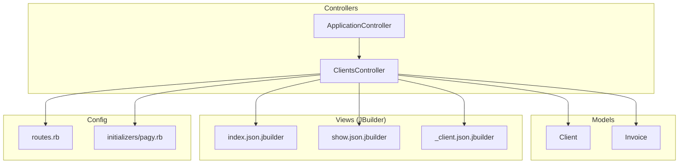
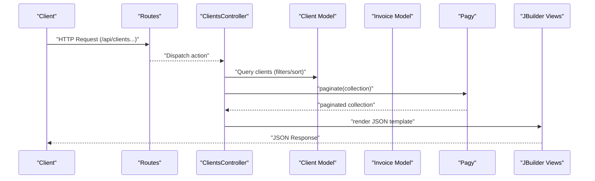
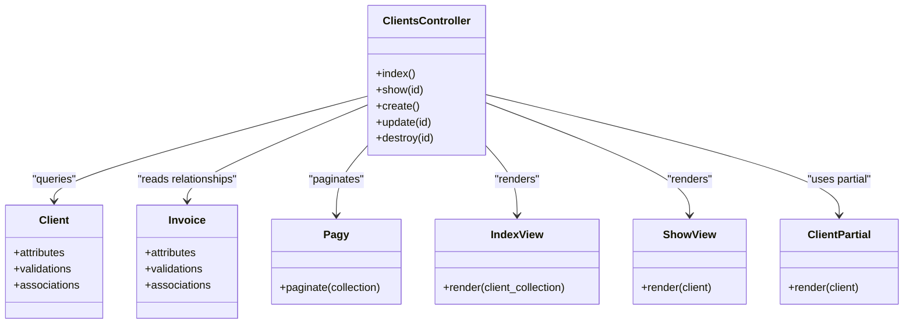

# Clients API

<cite>
**Referenced Files in This Document**
- [clients_controller.rb](file://app/controllers/clients_controller.rb)
- [client.rb](file://app/models/client.rb)
- [invoice.rb](file://app/models/invoice.rb)
- [routes.rb](file://config/routes.rb)
- [_client.json.jbuilder](file://app/views/clients/_client.json.jbuilder)
- [index.json.jbuilder](file://app/views/clients/index.json.jbuilder)
- [show.json.jbuilder](file://app/views/clients/show.json.jbuilder)
- [pagy.rb](file://config/initializers/pagy.rb)
- [application_controller.rb](file://app/controllers/application_controller.rb)
</cite>

## Table of Contents
1. [Introduction](#introduction)
2. [Project Structure](#project-structure)
3. [Core Components](#core-components)
4. [Architecture Overview](#architecture-overview)
5. [Detailed Component Analysis](#detailed-component-analysis)
6. [Dependency Analysis](#dependency-analysis)
7. [Performance Considerations](#performance-considerations)
8. [Troubleshooting Guide](#troubleshooting-guide)
9. [Conclusion](#conclusion)

## Introduction
This document describes the RESTful API for managing Clients. It covers HTTP methods, URL patterns under /api/clients, request and response schemas, authentication requirements, pagination, search filters, sorting options, validation rules, error responses, and relationships with Invoices. The API is implemented as a Rails application using JBuilder templates to render JSON responses and Pagy for pagination.

## Project Structure
The Clients API is centered around the Clients controller and associated views that render JSON via JBuilder. Pagination is handled by Pagy, and models define data structure and relationships.

**Diagram sources**
- [clients_controller.rb](file://app/controllers/clients_controller.rb)
- [client.rb](file://app/models/client.rb)
- [invoice.rb](file://app/models/invoice.rb)
- [index.json.jbuilder](file://app/views/clients/index.json.jbuilder)
- [show.json.jbuilder](file://app/views/clients/show.json.jbuilder)
- [_client.json.jbuilder](file://app/views/clients/_client.json.jbuilder)
- [pagy.rb](file://config/initializers/pagy.rb)
- [routes.rb](file://config/routes.rb)
- [application_controller.rb](file://app/controllers/application_controller.rb)

**Section sources**
- [clients_controller.rb](file://app/controllers/clients_controller.rb)
- [client.rb](file://app/models/client.rb)
- [invoice.rb](file://app/models/invoice.rb)
- [index.json.jbuilder](file://app/views/clients/index.json.jbuilder)
- [show.json.jbuilder](file://app/views/clients/show.json.jbuilder)
- [_client.json.jbuilder](file://app/views/clients/_client.json.jbuilder)
- [pagy.rb](file://config/initializers/pagy.rb)
- [routes.rb](file://config/routes.rb)
- [application_controller.rb](file://app/controllers/application_controller.rb)

## Core Components
- ClientsController: Implements REST endpoints for listing, creating, retrieving, updating, and deleting clients. Integrates with Pagy for pagination and renders JSON via JBuilder templates.
- Client model: Defines attributes, validations, and associations (including relationship with invoices).
- Invoice model: Related to clients; used to expose client-invoice relationships in responses.
- JBuilder templates: index.json.jbuilder, show.json.jbuilder, and _client.json.jbuilder define the shape of JSON responses.
- Pagy initializer: Configures pagination behavior used by the list endpoint.
- Application controller: May provide shared concerns such as authentication or current user context.

Key responsibilities:
- List clients with filtering, sorting, and pagination.
- Retrieve a single client by ID.
- Create a new client with validation.
- Update an existing client with validation.
- Delete a client.

Authentication:
- Authentication is typically enforced at the controller layer or via ApplicationController concerns. Confirm whether your environment requires authentication for these endpoints by reviewing the controller and any before_action hooks.

**Section sources**
- [clients_controller.rb](file://app/controllers/clients_controller.rb)
- [client.rb](file://app/models/client.rb)
- [invoice.rb](file://app/models/invoice.rb)
- [index.json.jbuilder](file://app/views/clients/index.json.jbuilder)
- [show.json.jbuilder](file://app/views/clients/show.json.jbuilder)
- [_client.json.jbuilder](file://app/views/clients/_client.json.jbuilder)
- [pagy.rb](file://config/initializers/pagy.rb)
- [application_controller.rb](file://app/controllers/application_controller.rb)

## Architecture Overview
The Clients API follows a standard Rails MVC pattern with JSON rendering through JBuilder. Requests are routed to the ClientsController, which interacts with the Client and Invoice models and uses Pagy for pagination. Responses are serialized into JSON via JBuilder templates.

**Diagram sources**
- [routes.rb](file://config/routes.rb)
- [clients_controller.rb](file://app/controllers/clients_controller.rb)
- [client.rb](file://app/models/client.rb)
- [invoice.rb](file://app/models/invoice.rb)
- [pagy.rb](file://config/initializers/pagy.rb)
- [index.json.jbuilder](file://app/views/clients/index.json.jbuilder)
- [show.json.jbuilder](file://app/views/clients/show.json.jbuilder)
- [_client.json.jbuilder](file://app/views/clients/_client.json.jbuilder)

## Detailed Component Analysis

### Endpoints Summary
Base path: /api/clients

- GET /api/clients
  - Purpose: List clients with optional search filters, sorting, and pagination.
  - Query parameters:
    - page: integer, default 1
    - per_page: integer, default depends on Pagy configuration
    - q: string, optional search term (e.g., name/email)
    - sort: string, optional field to sort by
    - order: string, optional direction (asc/desc)
  - Success response: JSON array of clients plus pagination metadata.
  - Error responses:
    - 400 Bad Request if invalid query parameters.
    - 401 Unauthorized if authentication required and not provided.
    - 403 Forbidden if authenticated but not authorized.

- POST /api/clients
  - Purpose: Create a new client.
  - Request body: JSON object with client attributes.
  - Validation: Server-side validations defined in the Client model.
  - Success response: Created client JSON (201 Created).
  - Error responses:
    - 422 Unprocessable Entity with validation errors.
    - 401/403 if authentication/authorization fails.

- GET /api/clients/:id
  - Purpose: Retrieve a single client by ID.
  - Path parameter: id (integer).
  - Success response: Single client JSON.
  - Error responses:
    - 404 Not Found if client does not exist.
    - 401/403 if authentication/authorization fails.

- PUT /api/clients/:id
  - Purpose: Update an existing client.
  - Path parameter: id (integer).
  - Request body: JSON object with updated attributes.
  - Validation: Server-side validations applied to permitted fields.
  - Success response: Updated client JSON (200 OK).
  - Error responses:
    - 404 Not Found if client does not exist.
    - 422 Unprocessable Entity with validation errors.
    - 401/403 if authentication/authorization fails.

- DELETE /api/clients/:id
  - Purpose: Delete a client.
  - Path parameter: id (integer).
  - Success response: Empty body with 204 No Content.
  - Error responses:
    - 404 Not Found if client does not exist.
    - 401/403 if authentication/authorization fails.

Notes:
- If the routes file defines nested or scoped paths (e.g., under /api), adjust base path accordingly.
- Authentication and authorization are enforced by controller-level logic; confirm presence of before_action hooks or ApplicationController concerns.

**Section sources**
- [routes.rb](file://config/routes.rb)
- [clients_controller.rb](file://app/controllers/clients_controller.rb)
- [client.rb](file://app/models/client.rb)
- [pagy.rb](file://config/initializers/pagy.rb)

### Data Models and Relationships
- Client model:
  - Attributes: typical client fields (e.g., name, email, address components).
  - Validations: presence, format, uniqueness constraints as defined in the model.
  - Associations: has_many :invoices (or similar) to relate clients to invoices.
- Invoice model:
  - Belongs_to :client (or similar) to associate invoices with clients.
  - Used to expose invoice counts or summaries in client responses.

Relationships:
- A client can have multiple invoices.
- An invoice belongs to a single client.

**Section sources**
- [client.rb](file://app/models/client.rb)
- [invoice.rb](file://app/models/invoice.rb)

### Request and Response Schemas

#### List Clients (GET /api/clients)
- Query parameters:
  - page: integer >= 1
  - per_page: integer > 0
  - q: string (optional)
  - sort: string (optional)
  - order: string asc|desc (optional)
- Success response (200 OK):
  - JSON array of client objects.
  - Pagination metadata:
    - total_entries: integer
    - total_pages: integer
    - current_page: integer
    - per_page: integer
- Example response fields (representative):
  - id: integer
  - name: string
  - email: string
  - created_at: ISO 8601 timestamp
  - updated_at: ISO 8601 timestamp
  - invoice_count: integer (if exposed by view)

**Section sources**
- [index.json.jbuilder](file://app/views/clients/index.json.jbuilder)
- [_client.json.jbuilder](file://app/views/clients/_client.json.jbuilder)
- [pagy.rb](file://config/initializers/pagy.rb)

#### Get Client (GET /api/clients/:id)
- Path parameter:
  - id: integer
- Success response (200 OK):
  - JSON object representing the client.
  - Fields include all attributes rendered by the show template and partial.
- Example response fields (representative):
  - id: integer
  - name: string
  - email: string
  - address fields: string
  - invoice_count: integer (if exposed)
  - created_at: ISO 8601 timestamp
  - updated_at: ISO 8601 timestamp

**Section sources**
- [show.json.jbuilder](file://app/views/clients/show.json.jbuilder)
- [_client.json.jbuilder](file://app/views/clients/_client.json.jbuilder)

#### Create Client (POST /api/clients)
- Request body (JSON):
  - Required fields based on model validations (e.g., name, email).
  - Optional fields as supported by the model.
- Success response (201 Created):
  - JSON object of the newly created client.
- Error response (422 Unprocessable Entity):
  - JSON object containing validation errors keyed by attribute.

**Section sources**
- [client.rb](file://app/models/client.rb)
- [_client.json.jbuilder](file://app/views/clients/_client.json.jbuilder)

#### Update Client (PUT /api/clients/:id)
- Path parameter:
  - id: integer
- Request body (JSON):
  - Partial update with allowed attributes.
- Success response (200 OK):
  - JSON object of the updated client.
- Error response (422 Unprocessable Entity):
  - JSON object containing validation errors keyed by attribute.

**Section sources**
- [client.rb](file://app/models/client.rb)
- [_client.json.jbuilder](file://app/views/clients/_client.json.jbuilder)

#### Delete Client (DELETE /api/clients/:id)
- Path parameter:
  - id: integer
- Success response (204 No Content):
  - Empty body.
- Error response (404 Not Found):
  - JSON error message indicating resource not found.

**Section sources**
- [clients_controller.rb](file://app/controllers/clients_controller.rb)

### Search, Sorting, and Pagination Controls
- Search:
  - Use q parameter to filter clients by text (e.g., name or email).
- Sorting:
  - Use sort parameter to specify the field.
  - Use order parameter to specify asc or desc.
- Pagination:
  - Use page and per_page parameters.
  - Pagy provides metadata for navigation.

Example usage:
- GET /api/clients?page=1&per_page=20&q=john&sort=name&order=asc

**Section sources**
- [clients_controller.rb](file://app/controllers/clients_controller.rb)
- [pagy.rb](file://config/initializers/pagy.rb)

### Authentication Requirements
- Authentication may be enforced at the controller level or via ApplicationController concerns.
- If authentication is required, include appropriate headers (e.g., token-based auth) as configured by your app’s authentication strategy.
- Authorization checks may restrict access to certain actions or resources.

Checklist:
- Verify before_action hooks in ClientsController.
- Review ApplicationController for shared authentication logic.
- Confirm route scoping and any middleware affecting authentication.

**Section sources**
- [clients_controller.rb](file://app/controllers/clients_controller.rb)
- [application_controller.rb](file://app/controllers/application_controller.rb)

### Business Rules and Validation
- Presence and format validations for required fields (e.g., name, email).
- Uniqueness constraints where applicable.
- Referential integrity with invoices (e.g., preventing deletion if dependent records exist, depending on association settings).

Validation outcomes:
- Successful creation/update returns the persisted client.
- Validation failures return 422 with detailed error messages.

**Section sources**
- [client.rb](file://app/models/client.rb)
- [invoice.rb](file://app/models/invoice.rb)

### Relationship with Invoices
- Clients have many invoices.
- Responses may include invoice_count or related invoice summaries when rendered by JBuilder templates.
- Deleting a client may be constrained by invoice dependencies.

**Section sources**
- [client.rb](file://app/models/client.rb)
- [invoice.rb](file://app/models/invoice.rb)
- [_client.json.jbuilder](file://app/views/clients/_client.json.jbuilder)

## Dependency Analysis
The Clients API depends on:
- ClientsController for routing and business orchestration.
- Client and Invoice models for data and relationships.
- JBuilder templates for JSON serialization.
- Pagy for pagination.
- Application controller for shared concerns like authentication.

**Diagram sources**
- [clients_controller.rb](file://app/controllers/clients_controller.rb)
- [client.rb](file://app/models/client.rb)
- [invoice.rb](file://app/models/invoice.rb)
- [index.json.jbuilder](file://app/views/clients/index.json.jbuilder)
- [show.json.jbuilder](file://app/views/clients/show.json.jbuilder)
- [_client.json.jbuilder](file://app/views/clients/_client.json.jbuilder)
- [pagy.rb](file://config/initializers/pagy.rb)

**Section sources**
- [clients_controller.rb](file://app/controllers/clients_controller.rb)
- [client.rb](file://app/models/client.rb)
- [invoice.rb](file://app/models/invoice.rb)
- [index.json.jbuilder](file://app/views/clients/index.json.jbuilder)
- [show.json.jbuilder](file://app/views/clients/show.json.jbuilder)
- [_client.json.jbuilder](file://app/views/clients/_client.json.jbuilder)
- [pagy.rb](file://config/initializers/pagy.rb)

## Performance Considerations
- Use pagination to limit result sets and reduce payload size.
- Apply search filters early to narrow down queries.
- Avoid N+1 queries by eager loading associations if exposing invoice-related data.
- Cache frequently accessed client data if appropriate.

[No sources needed since this section provides general guidance]

## Troubleshooting Guide
Common issues:
- 401 Unauthorized: Ensure authentication headers are included and valid.
- 403 Forbidden: Check authorization rules for the requested action.
- 404 Not Found: Verify the client ID exists.
- 422 Unprocessable Entity: Inspect validation errors in the response body.
- 400 Bad Request: Validate query parameters (page, per_page, sort, order).

Debugging steps:
- Confirm route definitions match expected paths.
- Review controller logs for errors and validation failures.
- Check JBuilder templates for missing fields or unexpected nil values.
- Validate Pagy configuration for pagination behavior.

**Section sources**
- [clients_controller.rb](file://app/controllers/clients_controller.rb)
- [index.json.jbuilder](file://app/views/clients/index.json.jbuilder)
- [show.json.jbuilder](file://app/views/clients/show.json.jbuilder)
- [_client.json.jbuilder](file://app/views/clients/_client.json.jbuilder)
- [pagy.rb](file://config/initializers/pagy.rb)

## Conclusion
The Clients API provides a comprehensive set of RESTful endpoints for managing clients, including robust pagination, search, sorting, and validation. Responses are serialized via JBuilder templates, and relationships with invoices are supported through model associations. Ensure authentication and authorization are properly configured according to your application’s security requirements.

[No sources needed since this section summarizes without analyzing specific files]