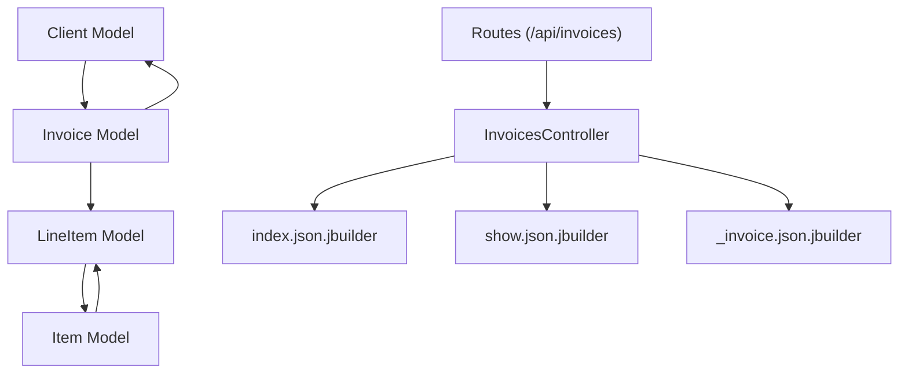
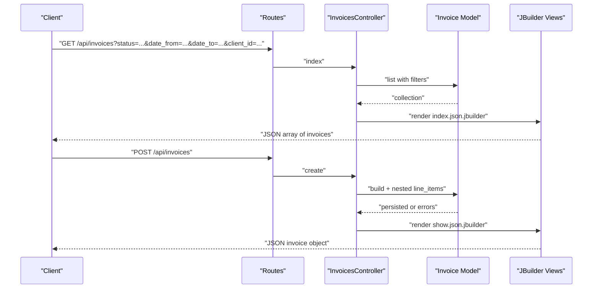
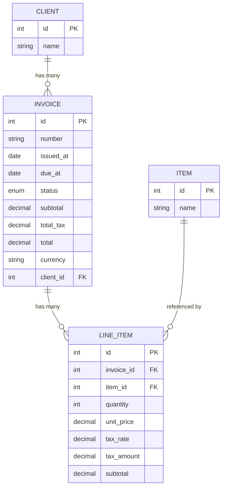
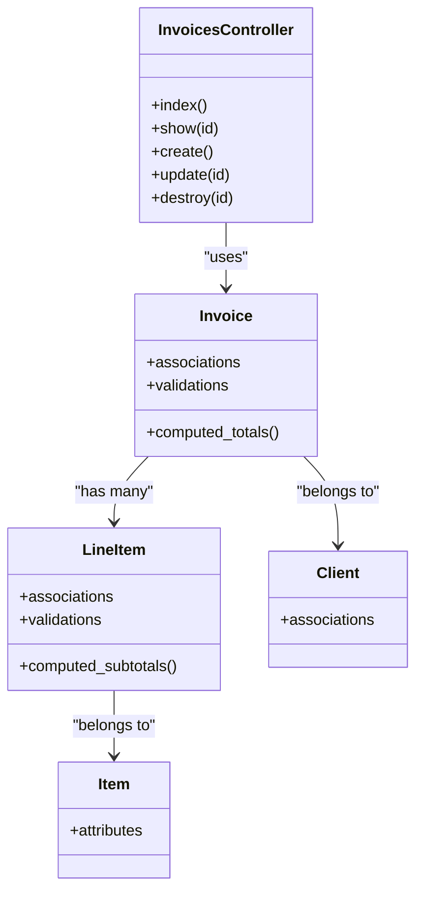

# Invoices API

<cite>
**Referenced Files in This Document**
- [routes.rb](file://config/routes.rb)
- [invoices_controller.rb](file://app/controllers/invoices_controller.rb)
- [invoice.rb](file://app/models/invoice.rb)
- [line_item.rb](file://app/models/line_item.rb)
- [client.rb](file://app/models/client.rb)
- [item.rb](file://app/models/item.rb)
- [_invoice.json.jbuilder](file://app/views/invoices/_invoice.json.jbuilder)
- [index.json.jbuilder](file://app/views/invoices/index.json.jbuilder)
- [show.json.jbuilder](file://app/views/invoices/show.json.jbuilder)
- [schema.rb](file://db/schema.rb)
</cite>

## Table of Contents
1. [Introduction](#introduction)
2. [Project Structure](#project-structure)
3. [Core Components](#core-components)
4. [Architecture Overview](#architecture-overview)
5. [Detailed Component Analysis](#detailed-component-analysis)
6. [Dependency Analysis](#dependency-analysis)
7. [Performance Considerations](#performance-considerations)
8. [Troubleshooting Guide](#troubleshooting-guide)
9. [Conclusion](#conclusion)

## Introduction
This document specifies the RESTful API for managing invoices. It covers HTTP methods, URL patterns (/api/invoices), request and response schemas, authentication requirements, filtering options (status, date ranges, client associations), tax calculations, invoice lifecycle states, validation rules, and financial calculations. The API is implemented as a Rails application with JSON views and standard controller actions.

## Project Structure
The Invoices API is exposed through a resource route and served by the Invoices controller. JSON responses are rendered via JBuilder templates. Models define relationships and validations that influence request/response behavior and business rules.

**Diagram sources**
- [routes.rb](file://config/routes.rb)
- [invoices_controller.rb](file://app/controllers/invoices_controller.rb)
- [invoice.rb](file://app/models/invoice.rb)
- [line_item.rb](file://app/models/line_item.rb)
- [client.rb](file://app/models/client.rb)
- [item.rb](file://app/models/item.rb)
- [_invoice.json.jbuilder](file://app/views/invoices/_invoice.json.jbuilder)
- [index.json.jbuilder](file://app/views/invoices/index.json.jbuilder)
- [show.json.jbuilder](file://app/views/invoices/show.json.jbuilder)

**Section sources**
- [routes.rb](file://config/routes.rb)
- [invoices_controller.rb](file://app/controllers/invoices_controller.rb)
- [invoice.rb](file://app/models/invoice.rb)
- [line_item.rb](file://app/models/line_item.rb)
- [client.rb](file://app/models/client.rb)
- [item.rb](file://app/models/item.rb)
- [_invoice.json.jbuilder](file://app/views/invoices/_invoice.json.jbuilder)
- [index.json.jbuilder](file://app/views/invoices/index.json.jbuilder)
- [show.json.jbuilder](file://app/views/invoices/show.json.jbuilder)

## Core Components
- InvoicesController: Implements standard REST actions for listing, showing, creating, updating, and deleting invoices.
- Invoice model: Encapsulates invoice attributes, associations, validations, and computed totals.
- LineItem model: Represents individual line items on an invoice with quantity, unit price, taxes, and subtotals.
- Client model: Associates invoices to clients.
- Item model: Reference catalog used when creating line items.
- JSON views: Render structured JSON payloads for index and show endpoints.

Key responsibilities:
- Input parameter parsing and filtering for list operations.
- Nested creation and updates for line items.
- Calculation of totals and taxes.
- Validation and error reporting.

**Section sources**
- [invoices_controller.rb](file://app/controllers/invoices_controller.rb)
- [invoice.rb](file://app/models/invoice.rb)
- [line_item.rb](file://app/models/line_item.rb)
- [client.rb](file://app/models/client.rb)
- [item.rb](file://app/models/item.rb)
- [_invoice.json.jbuilder](file://app/views/invoices/_invoice.json.jbuilder)
- [index.json.jbuilder](file://app/views/invoices/index.json.jbuilder)
- [show.json.jbuilder](file://app/views/invoices/show.json.jbuilder)

## Architecture Overview
The API follows a standard Rails MVC pattern:
- Routes map /api/invoices to the InvoicesController.
- Controller actions handle requests, invoke models, and render JSON via JBuilder.
- Models enforce validations and compute derived fields.
- Relationships connect invoices to clients and line items; line items reference items.

**Diagram sources**
- [routes.rb](file://config/routes.rb)
- [invoices_controller.rb](file://app/controllers/invoices_controller.rb)
- [invoice.rb](file://app/models/invoice.rb)
- [index.json.jbuilder](file://app/views/invoices/index.json.jbuilder)
- [show.json.jbuilder](file://app/views/invoices/show.json.jbuilder)

## Detailed Component Analysis

### Authentication Requirements
- Authentication mechanism is not explicitly configured for the /api/invoices routes in the provided files. If authentication is required, it should be applied at the routing or controller level (for example, using a before_action or a dedicated middleware). Ensure any authentication strategy is consistently enforced across all endpoints.

**Section sources**
- [routes.rb](file://config/routes.rb)
- [invoices_controller.rb](file://app/controllers/invoices_controller.rb)

### Base URL and Resource
- Base path: /api/invoices
- Supported HTTP methods: GET, POST, PUT/PATCH, DELETE
- Standard REST semantics apply.

**Section sources**
- [routes.rb](file://config/routes.rb)

### List Invoices
- Method: GET
- Path: /api/invoices
- Query parameters:
  - status: Filter by invoice status (e.g., draft, sent, paid, overdue). Accepts single value or comma-separated values depending on implementation.
  - date_from: Start date filter (inclusive). Format: ISO 8601 (YYYY-MM-DD).
  - date_to: End date filter (inclusive). Format: ISO 8601 (YYYY-MM-DD).
  - client_id: Filter by client identifier.
- Response: Array of invoice objects. Each invoice includes identifiers, dates, status, totals, and line items summary.

Example request:
- GET /api/invoices?status=draft,sent&date_from=2024-01-01&date_to=2024-12-31&client_id=123

Response schema (array):
- id: integer
- number: string
- issued_at: date
- due_at: date
- status: enum
- subtotal: decimal
- total_tax: decimal
- total: decimal
- currency: string
- client: object (id, name)
- line_items: array of minimal summaries (id, item_name, quantity, unit_price, tax_rate, tax_amount, subtotal)

Notes:
- Filtering logic is implemented in the controller/model layer. Validate presence and format of date parameters.
- Pagination may be applied if the collection is large.

**Section sources**
- [invoices_controller.rb](file://app/controllers/invoices_controller.rb)
- [index.json.jbuilder](file://app/views/invoices/index.json.jbuilder)
- [invoice.rb](file://app/models/invoice.rb)

### Get Invoice
- Method: GET
- Path: /api/invoices/:id
- Response: Full invoice object including complete line items and calculated totals.

Response schema:
- id: integer
- number: string
- issued_at: date
- due_at: date
- status: enum
- subtotal: decimal
- total_tax: decimal
- total: decimal
- currency: string
- client: object (id, name, address details if present)
- line_items: array of full line item objects:
  - id: integer
  - item_id: integer
  - item_name: string
  - description: string
  - quantity: integer
  - unit_price: decimal
  - tax_rate: decimal (percentage)
  - tax_amount: decimal
  - subtotal: decimal
- calculated fields:
  - subtotal = sum(line_items.quantity * line_items.unit_price)
  - total_tax = sum(line_items.tax_amount)
  - total = subtotal + total_tax

Validation and errors:
- Returns 404 if invoice not found.
- Returns 401/403 if authentication/authorization fails (if enabled).

**Section sources**
- [invoices_controller.rb](file://app/controllers/invoices_controller.rb)
- [show.json.jbuilder](file://app/views/invoices/show.json.jbuilder)
- [_invoice.json.jbuilder](file://app/views/invoices/_invoice.json.jbuilder)
- [invoice.rb](file://app/models/invoice.rb)
- [line_item.rb](file://app/models/line_item.rb)

### Create Invoice
- Method: POST
- Path: /api/invoices
- Request body: JSON object representing an invoice with nested line_items.

Request schema:
- number: string (optional if auto-generated)
- issued_at: date (ISO 8601)
- due_at: date (ISO 8601)
- status: enum (default may be draft)
- client_id: integer (required)
- currency: string (optional)
- line_items: array of objects:
  - item_id: integer (required)
  - quantity: integer (minimum 1)
  - unit_price: decimal (positive)
  - tax_rate: decimal (percentage, e.g., 21.0 for 21%)
  - description: string (optional)

Business rules:
- At least one line item is required.
- Quantities must be positive integers.
- Unit prices must be non-negative decimals.
- Tax rate is a percentage; tax amount is computed per line item.
- Totals are recalculated upon save.

Response:
- 201 Created with full invoice JSON (same schema as Get Invoice).
- 422 Unprocessable Entity with validation errors.

Error handling:
- Missing required fields return 422 with field-level messages.
- Invalid references (e.g., invalid client_id or item_id) return 422.

**Section sources**
- [invoices_controller.rb](file://app/controllers/invoices_controller.rb)
- [invoice.rb](file://app/models/invoice.rb)
- [line_item.rb](file://app/models/line_item.rb)
- [show.json.jbuilder](file://app/views/invoices/show.json.jbuilder)

### Update Invoice
- Method: PUT or PATCH
- Path: /api/invoices/:id
- Request body: Partial or full invoice object with optional nested line_items.

Behavior:
- Updating line_items replaces existing line items if provided.
- Totals are recalculated after update.
- Status transitions should respect allowed state changes (see Lifecycle).

Response:
- 200 OK with updated invoice JSON.
- 422 Unprocessable Entity with validation errors.

**Section sources**
- [invoices_controller.rb](file://app/controllers/invoices_controller.rb)
- [invoice.rb](file://app/models/invoice.rb)
- [line_item.rb](file://app/models/line_item.rb)
- [show.json.jbuilder](file://app/views/invoices/show.json.jbuilder)

### Delete Invoice
- Method: DELETE
- Path: /api/invoices/:id
- Response:
  - 204 No Content on success.
  - 404 Not Found if invoice does not exist.
  - 401/403 if authentication/authorization fails (if enabled).

Constraints:
- Deletion may be restricted based on invoice status (e.g., cannot delete paid invoices). Implement appropriate checks in the controller or model.

**Section sources**
- [invoices_controller.rb](file://app/controllers/invoices_controller.rb)
- [invoice.rb](file://app/models/invoice.rb)

### Filtering and Search
- Status filter:
  - status: single or multiple values (comma-separated).
- Date range filters:
  - date_from: inclusive start date.
  - date_to: inclusive end date.
- Client association:
  - client_id: integer.

Implementation notes:
- Apply filters in the controller or via scopes in the model.
- Normalize date formats and validate presence.
- Combine filters with AND logic unless otherwise specified.

**Section sources**
- [invoices_controller.rb](file://app/controllers/invoices_controller.rb)
- [invoice.rb](file://app/models/invoice.rb)

### Financial Calculations
- Per line item:
  - subtotal = quantity * unit_price
  - tax_amount = round(subtotal * tax_rate / 100) according to rounding policy
- Invoice totals:
  - subtotal = sum(line_items.subtotal)
  - total_tax = sum(line_items.tax_amount)
  - total = subtotal + total_tax

Rounding and precision:
- Use consistent decimal precision (e.g., two decimal places) for monetary values.
- Ensure rounding policy matches business requirements.

**Section sources**
- [invoice.rb](file://app/models/invoice.rb)
- [line_item.rb](file://app/models/line_item.rb)

### Invoice Lifecycle States
Common statuses include:
- draft: Initial state; can be edited freely.
- sent: Issued to client; editing may be restricted.
- paid: Fully paid; typically immutable.
- overdue: Past due date without payment; read-only.

Allowed transitions:
- draft -> sent
- sent -> paid
- sent -> overdue (automatically or manually)
- draft -> paid (rare; depends on business rules)

Restrictions:
- Deleting paid or overdue invoices may be prohibited.
- Updates to sent/paid invoices may be limited to specific fields.

**Section sources**
- [invoice.rb](file://app/models/invoice.rb)

### Data Model Overview

**Diagram sources**
- [schema.rb](file://db/schema.rb)
- [invoice.rb](file://app/models/invoice.rb)
- [line_item.rb](file://app/models/line_item.rb)
- [client.rb](file://app/models/client.rb)
- [item.rb](file://app/models/item.rb)

**Section sources**
- [schema.rb](file://db/schema.rb)
- [invoice.rb](file://app/models/invoice.rb)
- [line_item.rb](file://app/models/line_item.rb)
- [client.rb](file://app/models/client.rb)
- [item.rb](file://app/models/item.rb)

### JSON Rendering Details
- Index view renders an array of invoices with summarized data.
- Show view renders a full invoice object including nested line items.
- Shared partial defines common fields for reuse.

Ensure consistent field names and types across views to maintain stable API contracts.

**Section sources**
- [index.json.jbuilder](file://app/views/invoices/index.json.jbuilder)
- [show.json.jbuilder](file://app/views/invoices/show.json.jbuilder)
- [_invoice.json.jbuilder](file://app/views/invoices/_invoice.json.jbuilder)

## Dependency Analysis

**Diagram sources**
- [invoices_controller.rb](file://app/controllers/invoices_controller.rb)
- [invoice.rb](file://app/models/invoice.rb)
- [line_item.rb](file://app/models/line_item.rb)
- [client.rb](file://app/models/client.rb)
- [item.rb](file://app/models/item.rb)

**Section sources**
- [invoices_controller.rb](file://app/controllers/invoices_controller.rb)
- [invoice.rb](file://app/models/invoice.rb)
- [line_item.rb](file://app/models/line_item.rb)
- [client.rb](file://app/models/client.rb)
- [item.rb](file://app/models/item.rb)

## Performance Considerations
- Use database indexes on frequently filtered columns (e.g., status, issued_at, due_at, client_id).
- Limit returned fields for list endpoints to reduce payload size.
- Consider pagination for large collections.
- Avoid N+1 queries by eager loading associations (e.g., client, line_items).
- Cache expensive computations if applicable.

[No sources needed since this section provides general guidance]

## Troubleshooting Guide
Common issues:
- 404 Not Found:
  - Verify invoice ID exists.
- 422 Unprocessable Entity:
  - Check required fields and data types.
  - Validate nested line_items structure.
  - Ensure referenced entities (client_id, item_id) exist.
- 401/403 Unauthorized:
  - Confirm authentication is enabled and credentials are provided.
- Calculation discrepancies:
  - Review rounding policies and tax rate percentages.
  - Ensure totals are recalculated after updates.

Operational tips:
- Log request payloads and responses for debugging.
- Add explicit error messages for missing or invalid parameters.
- Enforce authorization checks at controller level if needed.

**Section sources**
- [invoices_controller.rb](file://app/controllers/invoices_controller.rb)
- [invoice.rb](file://app/models/invoice.rb)
- [line_item.rb](file://app/models/line_item.rb)

## Conclusion
The Invoices API provides a comprehensive set of RESTful endpoints for managing invoices, including filtering, nested line item management, and financial calculations. Adhering to the documented request/response schemas, validation rules, and lifecycle constraints ensures reliable integration. Implement authentication and authorization as required and optimize performance with indexing and efficient querying.