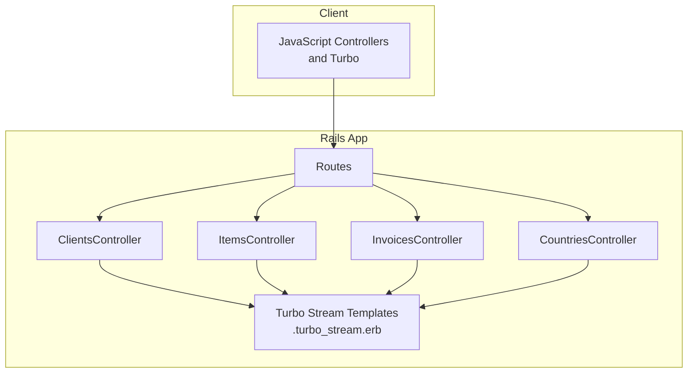
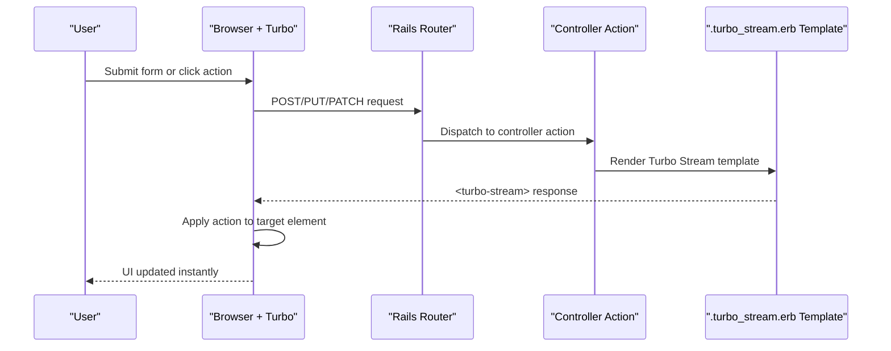
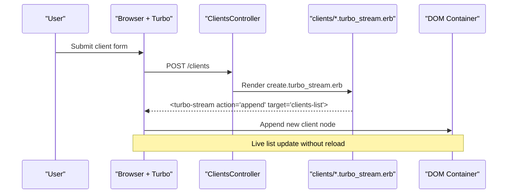
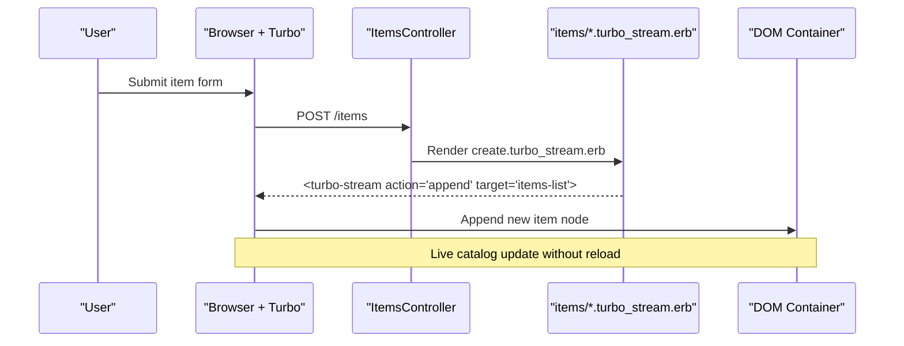
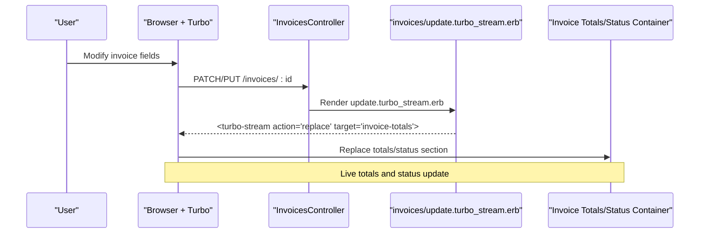
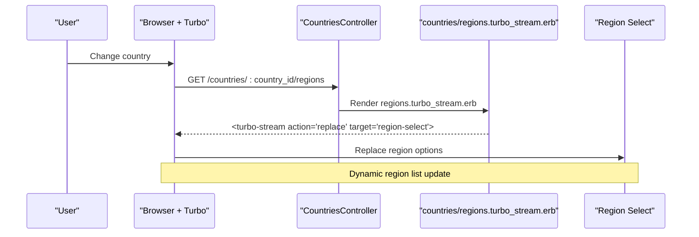
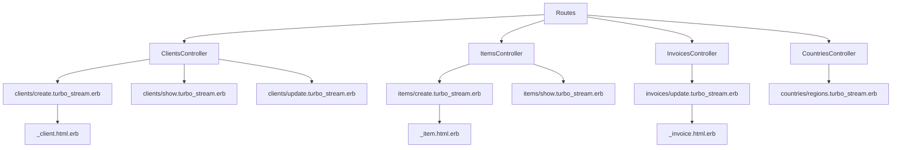

# Turbo Streams API

<cite>
**Referenced Files in This Document**
- [routes.rb](file://config/routes.rb)
- [cable.yml](file://config/cable.yml)
- [application_cable/connection.rb](file://app/channels/application_cable/connection.rb)
- [application_cable/channel.rb](file://app/channels/application_cable/channel.rb)
- [clients_controller.rb](file://app/controllers/clients_controller.rb)
- [items_controller.rb](file://app/controllers/items_controller.rb)
- [invoices_controller.rb](file://app/controllers/invoices_controller.rb)
- [countries_controller.rb](file://app/controllers/countries_controller.rb)
- [create.turbo_stream.erb](file://app/views/clients/create.turbo_stream.erb)
- [show.turbo_stream.erb](file://app/views/clients/show.turbo_stream.erb)
- [update.turbo_stream.erb](file://app/views/clients/update.turbo_stream.erb)
- [create.turbo_stream.erb](file://app/views/items/create.turbo_stream.erb)
- [show.turbo_stream.erb](file://app/views/items/show.turbo_stream.erb)
- [update.turbo_stream.erb](file://app/views/invoices/update.turbo_stream.erb)
- [regions.turbo_stream.erb](file://app/views/countries/regions.turbo_stream.erb)
- [_client.html.erb](file://app/views/clients/_client.html.erb)
- [_invoice.html.erb](file://app/views/invoices/_invoice.html.erb)
- [_item.html.erb](file://app/views/items/_item.html.erb)
- [_form.html.erb](file://app/views/clients/_form.html.erb)
- [_form.html.erb](file://app/views/items/_form.html.erb)
- [_form.html.erb](file://app/views/invoices/_form.html.erb)
- [form_validation_controller.js](file://app/javascript/controllers/form_validation_controller.js)
- [recalculate_controller.js](file://app/javascript/controllers/recalculate_controller.js)
- [removeitem_controller.js](file://app/javascript/controllers/removeitem_controller.js)
- [filter_controller.js](file://app/javascript/controllers/filter_controller.js)
- [index.js](file://app/javascript/controllers/index.js)
- [application.js](file://app/javascript/application.js)
</cite>

## Table of Contents
1. [Introduction](#introduction)
2. [Project Structure](#project-structure)
3. [Core Components](#core-components)
4. [Architecture Overview](#architecture-overview)
5. [Detailed Component Analysis](#detailed-component-analysis)
6. [Dependency Analysis](#dependency-analysis)
7. [Performance Considerations](#performance-considerations)
8. [Troubleshooting Guide](#troubleshooting-guide)
9. [Conclusion](#conclusion)
10. [Appendices](#appendices)

## Introduction
This document describes the Turbo Stream real-time communication endpoints and patterns used in the application. It explains how server responses are delivered as Turbo Stream messages, how clients consume them to update DOM elements, and how form submissions integrate with live feedback. The documentation covers message formats, target element selectors, action types (append, replace, remove), stream names, HTML partial structures, JavaScript event handling, connection management, error recovery strategies, performance optimizations, and debugging approaches.

## Project Structure
Turbo Stream is implemented via Rails controller actions that respond with .turbo_stream.erb templates. These templates render small HTML fragments wrapped in <turbo-stream> tags. Clients receive these updates over HTTP and apply them to the page without a full reload.

**Diagram sources**
- [routes.rb](file://config/routes.rb)
- [clients_controller.rb](file://app/controllers/clients_controller.rb)
- [items_controller.rb](file://app/controllers/items_controller.rb)
- [invoices_controller.rb](file://app/controllers/invoices_controller.rb)
- [countries_controller.rb](file://app/controllers/countries_controller.rb)
- [create.turbo_stream.erb](file://app/views/clients/create.turbo_stream.erb)
- [show.turbo_stream.erb](file://app/views/clients/show.turbo_stream.erb)
- [update.turbo_stream.erb](file://app/views/clients/update.turbo_stream.erb)
- [create.turbo_stream.erb](file://app/views/items/create.turbo_stream.erb)
- [show.turbo_stream.erb](file://app/views/items/show.turbo_stream.erb)
- [update.turbo_stream.erb](file://app/views/invoices/update.turbo_stream.erb)
- [regions.turbo_stream.erb](file://app/views/countries/regions.turbo_stream.erb)

**Section sources**
- [routes.rb](file://config/routes.rb)
- [clients_controller.rb](file://app/controllers/clients_controller.rb)
- [items_controller.rb](file://app/controllers/items_controller.rb)
- [invoices_controller.rb](file://app/controllers/invoices_controller.rb)
- [countries_controller.rb](file://app/controllers/countries_controller.rb)

## Core Components
- Controller actions: Respond with Turbo Stream templates for create, show, update, and nested resource updates.
- Turbo Stream templates: Render <turbo-stream> tags with actions like append, replace, and remove targeting specific DOM nodes.
- Client-side controllers: Handle form submissions, live validation, recalculation, and removal of items using Turbo events and custom logic.

Key responsibilities:
- Server: Generate targeted DOM updates via Turbo Stream responses.
- Client: Subscribe to Turbo events and apply updates to the UI.

**Section sources**
- [clients_controller.rb](file://app/controllers/clients_controller.rb)
- [items_controller.rb](file://app/controllers/items_controller.rb)
- [invoices_controller.rb](file://app/controllers/invoices_controller.rb)
- [countries_controller.rb](file://app/controllers/countries_controller.rb)
- [create.turbo_stream.erb](file://app/views/clients/create.turbo_stream.erb)
- [show.turbo_stream.erb](file://app/views/clients/show.turbo_stream.erb)
- [update.turbo_stream.erb](file://app/views/clients/update.turbo_stream.erb)
- [create.turbo_stream.erb](file://app/views/items/create.turbo_stream.erb)
- [show.turbo_stream.erb](file://app/views/items/show.turbo_stream.erb)
- [update.turbo_stream.erb](file://app/views/invoices/update.turbo_stream.erb)
- [regions.turbo_stream.erb](file://app/views/countries/regions.turbo_stream.erb)
- [form_validation_controller.js](file://app/javascript/controllers/form_validation_controller.js)
- [recalculate_controller.js](file://app/javascript/controllers/recalculate_controller.js)
- [removeitem_controller.js](file://app/javascript/controllers/removeitem_controller.js)
- [filter_controller.js](file://app/javascript/controllers/filter_controller.js)
- [index.js](file://app/javascript/controllers/index.js)
- [application.js](file://app/javascript/application.js)

## Architecture Overview
The application uses Turbo Streams over HTTP to deliver incremental DOM updates. There is no WebSocket channel implementation present; instead, client requests trigger controller actions that return .turbo_stream.erb responses.

**Diagram sources**
- [routes.rb](file://config/routes.rb)
- [clients_controller.rb](file://app/controllers/clients_controller.rb)
- [items_controller.rb](file://app/controllers/items_controller.rb)
- [invoices_controller.rb](file://app/controllers/invoices_controller.rb)
- [countries_controller.rb](file://app/controllers/countries_controller.rb)
- [create.turbo_stream.erb](file://app/views/clients/create.turbo_stream.erb)
- [show.turbo_stream.erb](file://app/views/clients/show.turbo_stream.erb)
- [update.turbo_stream.erb](file://app/views/clients/update.turbo_stream.erb)
- [create.turbo_stream.erb](file://app/views/items/create.turbo_stream.erb)
- [show.turbo_stream.erb](file://app/views/items/show.turbo_stream.erb)
- [update.turbo_stream.erb](file://app/views/invoices/update.turbo_stream.erb)
- [regions.turbo_stream.erb](file://app/views/countries/regions.turbo_stream.erb)

## Detailed Component Analysis

### Clients Turbo Stream Endpoints
- Actions:
  - Create: Renders a Turbo Stream response to add a new client entry to the list.
  - Show: Renders a Turbo Stream response to display client details.
  - Update: Renders a Turbo Stream response to refresh client data after edits.
- Stream names and targets:
  - Stream name typically corresponds to the model name (e.g., clients).
  - Target selectors match container IDs where lists or forms are rendered.
- Actions:
  - append: Adds a new client row/card to the list.
  - replace: Replaces an existing client card with updated content.
  - remove: Removes a client entry from the list when applicable.
- HTML partials:
  - Partial for rendering a single client item.
- Client behavior:
  - Forms submit via Turbo, receiving Turbo Stream responses that update the DOM.

**Diagram sources**
- [clients_controller.rb](file://app/controllers/clients_controller.rb)
- [create.turbo_stream.erb](file://app/views/clients/create.turbo_stream.erb)
- [show.turbo_stream.erb](file://app/views/clients/show.turbo_stream.erb)
- [update.turbo_stream.erb](file://app/views/clients/update.turbo_stream.erb)
- [_client.html.erb](file://app/views/clients/_client.html.erb)

**Section sources**
- [clients_controller.rb](file://app/controllers/clients_controller.rb)
- [create.turbo_stream.erb](file://app/views/clients/create.turbo_stream.erb)
- [show.turbo_stream.erb](file://app/views/clients/show.turbo_stream.erb)
- [update.turbo_stream.erb](file://app/views/clients/update.turbo_stream.erb)
- [_client.html.erb](file://app/views/clients/_client.html.erb)

### Items Turbo Stream Endpoints
- Actions:
  - Create: Renders a Turbo Stream response to add a new item to the catalog list.
  - Show: Renders a Turbo Stream response to display item details.
- Stream names and targets:
  - Stream name typically corresponds to the model name (e.g., items).
  - Target selectors match container IDs where item lists are rendered.
- Actions:
  - append: Adds a new item row/card to the list.
  - replace: Replaces an existing item card with updated content.
  - remove: Removes an item entry from the list when applicable.
- HTML partials:
  - Partial for rendering a single item.
- Client behavior:
  - Form submissions use Turbo to receive incremental updates.

**Diagram sources**
- [items_controller.rb](file://app/controllers/items_controller.rb)
- [create.turbo_stream.erb](file://app/views/items/create.turbo_stream.erb)
- [show.turbo_stream.erb](file://app/views/items/show.turbo_stream.erb)
- [_item.html.erb](file://app/views/items/_item.html.erb)

**Section sources**
- [items_controller.rb](file://app/controllers/items_controller.rb)
- [create.turbo_stream.erb](file://app/views/items/create.turbo_stream.erb)
- [show.turbo_stream.erb](file://app/views/items/show.turbo_stream.erb)
- [_item.html.erb](file://app/views/items/_item.html.erb)

### Invoices Turbo Stream Endpoints
- Actions:
  - Update: Renders a Turbo Stream response to refresh invoice totals and status after changes.
- Stream names and targets:
  - Stream name typically corresponds to the model name (e.g., invoices).
  - Target selectors match containers for totals, status badges, or line item sections.
- Actions:
  - replace: Updates invoice totals or status area.
  - remove: Removes invalid or deleted line items if applicable.
- HTML partials:
  - Partial for rendering a single invoice.
- Client behavior:
  - Recalculation controllers coordinate with Turbo Stream updates to reflect totals and status.

**Diagram sources**
- [invoices_controller.rb](file://app/controllers/invoices_controller.rb)
- [update.turbo_stream.erb](file://app/views/invoices/update.turbo_stream.erb)
- [_invoice.html.erb](file://app/views/invoices/_invoice.html.erb)

**Section sources**
- [invoices_controller.rb](file://app/controllers/invoices_controller.rb)
- [update.turbo_stream.erb](file://app/views/invoices/update.turbo_stream.erb)
- [_invoice.html.erb](file://app/views/invoices/_invoice.html.erb)

### Countries Regions Turbo Stream Endpoint
- Action:
  - regions: Renders a Turbo Stream response to populate region dropdowns based on selected country.
- Stream names and targets:
  - Stream name typically corresponds to the nested resource (e.g., countries_regions).
  - Target selector matches the region select element.
- Actions:
  - replace: Replaces the options inside the region select.
- Client behavior:
  - Country selection triggers a Turbo Stream update to refresh available regions.

**Diagram sources**
- [countries_controller.rb](file://app/controllers/countries_controller.rb)
- [regions.turbo_stream.erb](file://app/views/countries/regions.turbo_stream.erb)

**Section sources**
- [countries_controller.rb](file://app/controllers/countries_controller.rb)
- [regions.turbo_stream.erb](file://app/views/countries/regions.turbo_stream.erb)

### Message Formats, Targets, and Actions
- Message format:
  - Responses are <turbo-stream> tags containing an action attribute and a target selector.
- Common actions:
  - append: Inserts content at the end of the target container.
  - replace: Replaces the entire content of the target container.
  - remove: Removes the target element from the DOM.
- Target selectors:
  - Use CSS selectors matching container IDs or classes where updates should be applied.
- Stream names:
  - Typically derived from the model or resource name (e.g., clients, items, invoices, countries_regions).

[No sources needed since this section provides general guidance]

### Real-Time Client Updates
- Client creation:
  - Submitting the client form appends a new client entry to the list via append action.
- Client editing:
  - Updating a client replaces the corresponding client card via replace action.
- Client deletion:
  - Removing a client removes the entry from the list via remove action.

**Section sources**
- [clients_controller.rb](file://app/controllers/clients_controller.rb)
- [create.turbo_stream.erb](file://app/views/clients/create.turbo_stream.erb)
- [update.turbo_stream.erb](file://app/views/clients/update.turbo_stream.erb)
- [_client.html.erb](file://app/views/clients/_client.html.erb)

### Invoice Status Changes
- Status updates:
  - After modifying invoice fields, the update action renders a Turbo Stream response replacing the totals/status area.
- Totals recalculation:
  - Recalculate controller coordinates with Turbo Stream to reflect updated totals.

**Section sources**
- [invoices_controller.rb](file://app/controllers/invoices_controller.rb)
- [update.turbo_stream.erb](file://app/views/invoices/update.turbo_stream.erb)
- [recalculate_controller.js](file://app/javascript/controllers/recalculate_controller.js)

### Item Catalog Modifications
- Adding items:
  - Creating an item appends a new item entry to the catalog list via append action.
- Editing/removing items:
  - Updating or removing items replaces or removes entries via replace/remove actions.

**Section sources**
- [items_controller.rb](file://app/controllers/items_controller.rb)
- [create.turbo_stream.erb](file://app/views/items/create.turbo_stream.erb)
- [show.turbo_stream.erb](file://app/views/items/show.turbo_stream.erb)
- [_item.html.erb](file://app/views/items/_item.html.erb)

### Real-Time Form Submissions and Live Validation
- Form submissions:
  - Forms submit via Turbo, receiving Turbo Stream responses to update errors or success messages.
- Live validation:
  - A dedicated controller handles validation feedback and applies it to the DOM using Turbo Stream.
- Progressive enhancement:
  - Forms remain functional without JavaScript by falling back to standard responses.

**Section sources**
- [_form.html.erb](file://app/views/clients/_form.html.erb)
- [_form.html.erb](file://app/views/items/_form.html.erb)
- [_form.html.erb](file://app/views/invoices/_form.html.erb)
- [form_validation_controller.js](file://app/javascript/controllers/form_validation_controller.js)

### JavaScript Event Handling Patterns
- Controllers:
  - Index controller wires up Stimulus controllers.
  - Application bootstraps Turbo and Stimulus.
- Specific behaviors:
  - Remove item controller handles removal interactions.
  - Filter controller manages filtering logic.
  - Recalculate controller updates totals dynamically.

**Section sources**
- [index.js](file://app/javascript/controllers/index.js)
- [application.js](file://app/javascript/application.js)
- [removeitem_controller.js](file://app/javascript/controllers/removeitem_controller.js)
- [filter_controller.js](file://app/javascript/controllers/filter_controller.js)
- [recalculate_controller.js](file://app/javascript/controllers/recalculate_controller.js)

## Dependency Analysis
Turbo Stream responses depend on:
- Routing configuration mapping URLs to controller actions.
- Controller actions selecting appropriate .turbo_stream.erb templates.
- Templates referencing partials for consistent HTML structure.
- Client-side controllers listening to Turbo events and applying updates.

**Diagram sources**
- [routes.rb](file://config/routes.rb)
- [clients_controller.rb](file://app/controllers/clients_controller.rb)
- [items_controller.rb](file://app/controllers/items_controller.rb)
- [invoices_controller.rb](file://app/controllers/invoices_controller.rb)
- [countries_controller.rb](file://app/controllers/countries_controller.rb)
- [create.turbo_stream.erb](file://app/views/clients/create.turbo_stream.erb)
- [show.turbo_stream.erb](file://app/views/clients/show.turbo_stream.erb)
- [update.turbo_stream.erb](file://app/views/clients/update.turbo_stream.erb)
- [create.turbo_stream.erb](file://app/views/items/create.turbo_stream.erb)
- [show.turbo_stream.erb](file://app/views/items/show.turbo_stream.erb)
- [update.turbo_stream.erb](file://app/views/invoices/update.turbo_stream.erb)
- [regions.turbo_stream.erb](file://app/views/countries/regions.turbo_stream.erb)
- [_client.html.erb](file://app/views/clients/_client.html.erb)
- [_item.html.erb](file://app/views/items/_item.html.erb)
- [_invoice.html.erb](file://app/views/invoices/_invoice.html.erb)

**Section sources**
- [routes.rb](file://config/routes.rb)
- [clients_controller.rb](file://app/controllers/clients_controller.rb)
- [items_controller.rb](file://app/controllers/items_controller.rb)
- [invoices_controller.rb](file://app/controllers/invoices_controller.rb)
- [countries_controller.rb](file://app/controllers/countries_controller.rb)

## Performance Considerations
- Keep Turbo Stream payloads minimal:
  - Render only necessary DOM fragments.
  - Avoid heavy computations in view templates.
- Use efficient selectors:
  - Prefer ID-based targets for faster DOM operations.
- Batch updates:
  - Group related changes into a single Turbo Stream response when possible.
- Debounce frequent updates:
  - For live typing scenarios, debounce input events before triggering updates.
- Cache partials:
  - Fragment caching can reduce rendering overhead for complex partials.
- Monitor network usage:
  - Inspect Turbo Stream responses in browser dev tools to optimize payload size.

[No sources needed since this section provides general guidance]

## Troubleshooting Guide
- Connection management:
  - Turbo Streams operate over HTTP; ensure routes and controller actions are correctly configured.
  - Verify cable configuration exists but is not required for Turbo Streams unless WebSockets are used elsewhere.
- Error recovery strategies:
  - Implement fallback responses for failed Turbo Stream requests.
  - Display user-friendly error messages and allow retrying submissions.
- Debugging tools:
  - Use browser developer tools to inspect Turbo Stream responses and DOM mutations.
  - Log controller actions and template rendering times to identify bottlenecks.
- Monitoring approaches:
  - Track response sizes and latency for Turbo Stream endpoints.
  - Add analytics for Turbo Stream interactions to understand usage patterns.

**Section sources**
- [cable.yml](file://config/cable.yml)
- [application_cable/connection.rb](file://app/channels/application_cable/connection.rb)
- [application_cable/channel.rb](file://app/channels/application_cable/channel.rb)

## Conclusion
Turbo Streams provide a lightweight mechanism for delivering incremental DOM updates without full page reloads. By structuring controller actions to respond with .turbo_stream.erb templates and targeting specific DOM elements, the application achieves responsive, real-time-like interactions for clients, items, invoices, and nested resources. Proper error handling, performance optimization, and debugging practices ensure a robust user experience.

## Appendices

### Appendix A: Stream Names and Targets Reference
- Clients:
  - Stream name: clients
  - Targets: client list container, individual client cards
- Items:
  - Stream name: items
  - Targets: item list container, individual item cards
- Invoices:
  - Stream name: invoices
  - Targets: totals/status container, invoice detail sections
- Countries Regions:
  - Stream name: countries_regions
  - Targets: region select element

**Section sources**
- [clients_controller.rb](file://app/controllers/clients_controller.rb)
- [items_controller.rb](file://app/controllers/items_controller.rb)
- [invoices_controller.rb](file://app/controllers/invoices_controller.rb)
- [countries_controller.rb](file://app/controllers/countries_controller.rb)

### Appendix B: HTML Partials Reference
- Client partial: _client.html.erb
- Item partial: _item.html.erb
- Invoice partial: _invoice.html.erb

**Section sources**
- [_client.html.erb](file://app/views/clients/_client.html.erb)
- [_item.html.erb](file://app/views/items/_item.html.erb)
- [_invoice.html.erb](file://app/views/invoices/_invoice.html.erb)