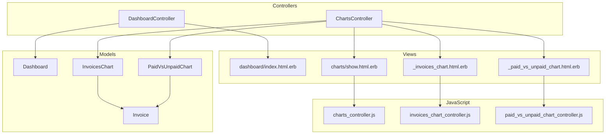
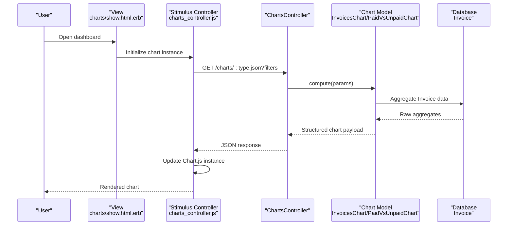
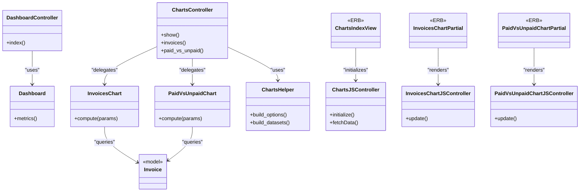

# Analytics & Reporting

<cite>
**Referenced Files in This Document**
- [dashboard_controller.rb](file://app/controllers/dashboard_controller.rb)
- [dashboard.rb](file://app/models/dashboard.rb)
- [charts_controller.rb](file://app/controllers/charts_controller.rb)
- [invoices_chart.rb](file://app/models/charts/invoices_chart.rb)
- [paid_vs_unpaid_chart.rb](file://app/models/charts/paid_vs_unpaid_chart.rb)
- [charts_helper.rb](file://app/helpers/charts_helper.rb)
- [charts/index.html.erb](file://app/views/charts/show.html.erb)
- [_invoices_chart.html.erb](file://app/views/charts/_invoices_chart.html.erb)
- [_paid_vs_unpaid_chart.html.erb](file://app/views/charts/_paid_vs_unpaid_chart.html.erb)
- [charts_controller.js](file://app/javascript/controllers/charts_controller.js)
- [invoices_chart_controller.js](file://app/javascript/controllers/invoices_chart_controller.js)
- [paid_vs_unpaid_chart_controller.js](file://app/javascript/controllers/paid_vs_unpaid_chart_controller.js)
- [routes.rb](file://config/routes.rb)
- [invoice.rb](file://app/models/invoice.rb)
</cite>

## Table of Contents
1. [Introduction](#introduction)
2. [Project Structure](#project-structure)
3. [Core Components](#core-components)
4. [Architecture Overview](#architecture-overview)
5. [Detailed Component Analysis](#detailed-component-analysis)
6. [Dependency Analysis](#dependency-analysis)
7. [Performance Considerations](#performance-considerations)
8. [Troubleshooting Guide](#troubleshooting-guide)
9. [Conclusion](#conclusion)
10. [Appendices](#appendices)

## Introduction
This document explains the analytics and reporting system, focusing on the dashboard implementation, chart visualizations powered by Chart.js, and financial metrics calculations. It covers the Dashboard model, Charts service objects (chart models), and JavaScript controllers that render interactive charts. It also details paid vs unpaid invoice tracking, revenue analysis, performance metrics, strategies for adding new chart types, customizing dashboards, exporting reports, data aggregation, caching, and performance optimization for large datasets.

## Project Structure
The analytics and reporting features are implemented across controllers, models, helpers, views, and Stimulus controllers:

- Controllers:
  - Dashboard controller renders the main dashboard view.
  - Charts controller serves chart data via JSON endpoints.
- Models:
  - Dashboard aggregates high-level metrics for the dashboard.
  - Chart models encapsulate data aggregation logic for specific charts.
- Helpers:
  - Charts helper provides shared rendering utilities for chart views.
- Views:
  - Chart partials render Chart.js containers and configuration.
  - A dedicated charts show page demonstrates multiple charts.
- JavaScript:
  - Stimulus controllers initialize and update Chart.js instances.
- Routes:
  - Define routes for dashboard and chart endpoints.

**Diagram sources**
- [dashboard_controller.rb](file://app/controllers/dashboard_controller.rb)
- [charts_controller.rb](file://app/controllers/charts_controller.rb)
- [dashboard.rb](file://app/models/dashboard.rb)
- [invoices_chart.rb](file://app/models/charts/invoices_chart.rb)
- [paid_vs_unpaid_chart.rb](file://app/models/charts/paid_vs_unpaid_chart.rb)
- [invoice.rb](file://app/models/invoice.rb)
- [charts/index.html.erb](file://app/views/charts/show.html.erb)
- [_invoices_chart.html.erb](file://app/views/charts/_invoices_chart.html.erb)
- [_paid_vs_unpaid_chart.html.erb](file://app/views/charts/_paid_vs_unpaid_chart.html.erb)
- [charts_controller.js](file://app/javascript/controllers/charts_controller.js)
- [invoices_chart_controller.js](file://app/javascript/controllers/invoices_chart_controller.js)
- [paid_vs_unpaid_chart_controller.js](file://app/javascript/controllers/paid_vs_unpaid_chart_controller.js)

**Section sources**
- [dashboard_controller.rb](file://app/controllers/dashboard_controller.rb)
- [charts_controller.rb](file://app/controllers/charts_controller.rb)
- [dashboard.rb](file://app/models/dashboard.rb)
- [invoices_chart.rb](file://app/models/charts/invoices_chart.rb)
- [paid_vs_unpaid_chart.rb](file://app/models/charts/paid_vs_unpaid_chart.rb)
- [invoice.rb](file://app/models/invoice.rb)
- [charts/index.html.erb](file://app/views/charts/show.html.erb)
- [_invoices_chart.html.erb](file://app/views/charts/_invoices_chart.html.erb)
- [_paid_vs_unpaid_chart.html.erb](file://app/views/charts/_paid_vs_unpaid_chart.html.erb)
- [charts_controller.js](file://app/javascript/controllers/charts_controller.js)
- [invoices_chart_controller.js](file://app/javascript/controllers/invoices_chart_controller.js)
- [paid_vs_unpaid_chart_controller.js](file://app/javascript/controllers/paid_vs_unpaid_chart_controller.js)

## Core Components
- Dashboard model: Aggregates key financial metrics such as total revenue, outstanding amounts, and counts used to populate the dashboard overview.
- InvoicesChart: Encapsulates time-series or categorical aggregation of invoices for trend visualization.
- PaidVsUnpaidChart: Computes totals for paid versus unpaid invoices to visualize cash flow health.
- Charts controller: Exposes JSON endpoints consumed by Chart.js via Stimulus controllers.
- Charts helper: Provides reusable methods for building chart options and dataset structures.
- Stimulus controllers: Initialize Chart.js instances, handle interactivity, and refresh data when filters change.

Key responsibilities:
- Data aggregation is centralized in chart models to keep controllers thin and views focused on presentation.
- Financial metrics are computed using ActiveRecord aggregations over Invoice records.
- Frontend components are decoupled from backend logic through JSON APIs.

**Section sources**
- [dashboard.rb](file://app/models/dashboard.rb)
- [invoices_chart.rb](file://app/models/charts/invoices_chart.rb)
- [paid_vs_unpaid_chart.rb](file://app/models/charts/paid_vs_unpaid_chart.rb)
- [charts_controller.rb](file://app/controllers/charts_controller.rb)
- [charts_helper.rb](file://app/helpers/charts_helper.rb)
- [invoices_chart_controller.js](file://app/javascript/controllers/invoices_chart_controller.js)
- [paid_vs_unpaid_chart_controller.js](file://app/javascript/controllers/paid_vs_unpaid_chart_controller.js)
- [charts_controller.js](file://app/javascript/controllers/charts_controller.js)

## Architecture Overview
The analytics pipeline follows a layered approach:
- Controllers receive requests and delegate computation to chart models.
- Chart models query Invoice records and return structured data suitable for Chart.js.
- Views render Chart.js canvases and pass configuration to Stimulus controllers.
- Stimulus controllers fetch JSON data and update charts dynamically.

**Diagram sources**
- [charts_controller.rb](file://app/controllers/charts_controller.rb)
- [invoices_chart.rb](file://app/models/charts/invoices_chart.rb)
- [paid_vs_unpaid_chart.rb](file://app/models/charts/paid_vs_unpaid_chart.rb)
- [invoice.rb](file://app/models/invoice.rb)
- [charts/index.html.erb](file://app/views/charts/show.html.erb)
- [charts_controller.js](file://app/javascript/controllers/charts_controller.js)

## Detailed Component Analysis

### Dashboard Model
Responsibilities:
- Compute summary metrics for the dashboard (e.g., total revenue, outstanding balance, invoice counts).
- Provide a single interface for the dashboard controller to render overview cards and KPIs.

Design considerations:
- Use ActiveRecord aggregations to minimize Ruby-side processing.
- Scope queries by user context to ensure data isolation.

Usage:
- The dashboard controller instantiates the model and passes results to the view.

**Section sources**
- [dashboard.rb](file://app/models/dashboard.rb)
- [dashboard_controller.rb](file://app/controllers/dashboard_controller.rb)

### InvoicesChart Service Object
Responsibilities:
- Aggregate invoice data by date or category for trend analysis.
- Return labels and datasets compatible with Chart.js line/bar configurations.

Data aggregation strategy:
- Group by period (e.g., month) and sum relevant monetary fields.
- Filter by user scope and optional parameters (date range, status).

Output format:
- JSON structure containing labels array and one or more datasets with values.

**Section sources**
- [invoices_chart.rb](file://app/models/charts/invoices_chart.rb)
- [charts_controller.rb](file://app/controllers/charts_controller.rb)
- [_invoices_chart.html.erb](file://app/views/charts/_invoices_chart.html.erb)
- [invoices_chart_controller.js](file://app/javascript/controllers/invoices_chart_controller.js)

### PaidVsUnpaidChart Service Object
Responsibilities:
- Calculate totals for paid versus unpaid invoices.
- Provide pie/donut chart data reflecting payment status distribution.

Logic highlights:
- Sum amounts grouped by invoice status.
- Normalize percentages for display.

**Section sources**
- [paid_vs_unpaid_chart.rb](file://app/models/charts/paid_vs_unpaid_chart.rb)
- [charts_controller.rb](file://app/controllers/charts_controller.rb)
- [_paid_vs_unpaid_chart.html.erb](file://app/views/charts/_paid_vs_unpaid_chart.html.erb)
- [paid_vs_unpaid_chart_controller.js](file://app/javascript/controllers/paid_vs_unpaid_chart_controller.js)

### Charts Controller
Responsibilities:
- Expose JSON endpoints for chart data.
- Accept filter parameters (e.g., date ranges, statuses).
- Delegate computation to chart models and respond with structured payloads.

API contract:
- Endpoint path: /charts/:type.json
- Query params: type, start_date, end_date, status, etc.
- Response: JSON with labels and datasets.

**Section sources**
- [charts_controller.rb](file://app/controllers/charts_controller.rb)
- [routes.rb](file://config/routes.rb)

### Charts Helper
Responsibilities:
- Provide shared methods to build Chart.js options and dataset structures.
- Standardize formatting for currency, dates, and tooltips.

Usage:
- Invoked from chart partials to generate consistent configuration.

**Section sources**
- [charts_helper.rb](file://app/helpers/charts_helper.rb)
- [_invoices_chart.html.erb](file://app/views/charts/_invoices_chart.html.erb)
- [_paid_vs_unpaid_chart.html.erb](file://app/views/charts/_paid_vs_unpaid_chart.html.erb)

### Stimulus Controllers for Interactive Charts
Responsibilities:
- Initialize Chart.js instances when elements become visible.
- Fetch chart data from the Charts controller based on current filters.
- Handle events like filter changes to refresh charts without full page reloads.

Controllers:
- charts_controller.js: Base controller for common chart behaviors.
- invoices_chart_controller.js: Specific behavior for invoice trends.
- paid_vs_unpaid_chart_controller.js: Specific behavior for payment status distribution.

Interactivity patterns:
- Debounced input handling for filter fields.
- Graceful error handling and fallback states.

**Section sources**
- [charts_controller.js](file://app/javascript/controllers/charts_controller.js)
- [invoices_chart_controller.js](file://app/javascript/controllers/invoices_chart_controller.js)
- [paid_vs_unpaid_chart_controller.js](file://app/javascript/controllers/paid_vs_unpaid_chart_controller.js)
- [charts/index.html.erb](file://app/views/charts/show.html.erb)

### Adding New Chart Types
Steps:
1. Create a new chart model under app/models/charts/ implementing a compute method that returns labels and datasets.
2. Add an action in ChartsController to dispatch to the new chart model.
3. Create a partial under app/views/charts/ to render the Chart.js canvas and configuration.
4. Implement a Stimulus controller to initialize and update the chart.
5. Wire up routes if needed and include the partial in the dashboard or charts show page.

Best practices:
- Keep chart models stateless and pure functions of inputs.
- Validate and sanitize all incoming parameters.
- Use the charts helper to standardize options and formatting.

**Section sources**
- [invoices_chart.rb](file://app/models/charts/invoices_chart.rb)
- [paid_vs_unpaid_chart.rb](file://app/models/charts/paid_vs_unpaid_chart.rb)
- [charts_controller.rb](file://app/controllers/charts_controller.rb)
- [_invoices_chart.html.erb](file://app/views/charts/_invoices_chart.html.erb)
- [_paid_vs_unpaid_chart.html.erb](file://app/views/charts/_paid_vs_unpaid_chart.html.erb)
- [invoices_chart_controller.js](file://app/javascript/controllers/invoices_chart_controller.js)
- [paid_vs_unpaid_chart_controller.js](file://app/javascript/controllers/paid_vs_unpaid_chart_controller.js)

### Customizing Dashboards
Approaches:
- Compose multiple chart partials within the dashboard view.
- Use query parameters to filter data per chart.
- Leverage Stimulus controllers to coordinate cross-chart interactions (e.g., selecting a date range updates all charts).

Recommendations:
- Centralize filter state in a parent controller or component.
- Cache expensive computations at the model level.

**Section sources**
- [dashboard_controller.rb](file://app/controllers/dashboard_controller.rb)
- [charts/index.html.erb](file://app/views/charts/show.html.erb)
- [charts_controller.js](file://app/javascript/controllers/charts_controller.js)

### Exporting Reports
Options:
- CSV export: Generate tabular data from chart models or direct queries and stream responses.
- PDF export: Use a PDF gem to render HTML templates into documents.
- Excel export: Utilize spreadsheet libraries to produce .xlsx files.

Implementation tips:
- Reuse aggregation logic from chart models to ensure consistency between charts and exports.
- Paginate large datasets before export to avoid memory issues.

[No sources needed since this section provides general guidance]

### Data Aggregation Strategies
- Prefer SQL-level aggregations (GROUP BY, SUM, COUNT) to reduce Ruby overhead.
- Use scopes and conditions to limit datasets early.
- Precompute frequently accessed metrics in background jobs if necessary.

**Section sources**
- [invoices_chart.rb](file://app/models/charts/invoices_chart.rb)
- [paid_vs_unpaid_chart.rb](file://app/models/charts/paid_vs_unpaid_chart.rb)
- [invoice.rb](file://app/models/invoice.rb)

### Caching Mechanisms
Strategies:
- Fragment caching around chart partials keyed by filter parameters.
- Low-level cache store for aggregated results with appropriate expiration.
- HTTP caching headers for chart JSON endpoints where appropriate.

Considerations:
- Ensure cache keys include user scoping to prevent data leakage.
- Invalidate caches when underlying data changes (e.g., after invoice updates).

[No sources needed since this section provides general guidance]

### Performance Optimization for Large Datasets
- Limit default time windows (e.g., last 12 months) and allow users to expand.
- Implement server-side pagination for raw data exports.
- Use database indexes on commonly filtered columns (e.g., created_at, status).
- Offload heavy computations to background jobs and serve cached results.

[No sources needed since this section provides general guidance]

## Dependency Analysis
The following diagram shows how controllers depend on chart models and how views and JavaScript interact with them.

**Diagram sources**
- [dashboard_controller.rb](file://app/controllers/dashboard_controller.rb)
- [charts_controller.rb](file://app/controllers/charts_controller.rb)
- [dashboard.rb](file://app/models/dashboard.rb)
- [invoices_chart.rb](file://app/models/charts/invoices_chart.rb)
- [paid_vs_unpaid_chart.rb](file://app/models/charts/paid_vs_unpaid_chart.rb)
- [invoice.rb](file://app/models/invoice.rb)
- [charts_helper.rb](file://app/helpers/charts_helper.rb)
- [charts/index.html.erb](file://app/views/charts/show.html.erb)
- [_invoices_chart.html.erb](file://app/views/charts/_invoices_chart.html.erb)
- [_paid_vs_unpaid_chart.html.erb](file://app/views/charts/_paid_vs_unpaid_chart.html.erb)
- [charts_controller.js](file://app/javascript/controllers/charts_controller.js)
- [invoices_chart_controller.js](file://app/javascript/controllers/invoices_chart_controller.js)
- [paid_vs_unpaid_chart_controller.js](file://app/javascript/controllers/paid_vs_unpaid_chart_controller.js)

**Section sources**
- [dashboard_controller.rb](file://app/controllers/dashboard_controller.rb)
- [charts_controller.rb](file://app/controllers/charts_controller.rb)
- [dashboard.rb](file://app/models/dashboard.rb)
- [invoices_chart.rb](file://app/models/charts/invoices_chart.rb)
- [paid_vs_unpaid_chart.rb](file://app/models/charts/paid_vs_unpaid_chart.rb)
- [invoice.rb](file://app/models/invoice.rb)
- [charts_helper.rb](file://app/helpers/charts_helper.rb)
- [charts/index.html.erb](file://app/views/charts/show.html.erb)
- [_invoices_chart.html.erb](file://app/views/charts/_invoices_chart.html.erb)
- [_paid_vs_unpaid_chart.html.erb](file://app/views/charts/_paid_vs_unpaid_chart.html.erb)
- [charts_controller.js](file://app/javascript/controllers/charts_controller.js)
- [invoices_chart_controller.js](file://app/javascript/controllers/invoices_chart_controller.js)
- [paid_vs_unpaid_chart_controller.js](file://app/javascript/controllers/paid_vs_unpaid_chart_controller.js)

## Performance Considerations
- Favor database-level aggregations to reduce memory usage.
- Apply indexes on frequently filtered columns (e.g., created_at, status).
- Use fragment caching for chart partials and low-level caching for aggregated results.
- Limit default data windows and provide progressive loading for historical data.
- Avoid N+1 queries by eager-loading associations when necessary.

[No sources needed since this section provides general guidance]

## Troubleshooting Guide
Common issues and resolutions:
- Empty charts: Verify that chart models return valid labels and datasets; check filter parameters passed to the Charts controller.
- Stale data: Ensure cache invalidation occurs after invoice updates; clear fragment caches if needed.
- Slow load times: Profile SQL queries, add indexes, and consider background jobs for heavy computations.
- JavaScript errors: Confirm Chart.js initialization and correct JSON structure returned by endpoints.

Validation checklist:
- Confirm routes exist for chart endpoints.
- Validate JSON schema matches Chart.js expectations.
- Inspect browser network tab for failed requests.

**Section sources**
- [charts_controller.rb](file://app/controllers/charts_controller.rb)
- [invoices_chart.rb](file://app/models/charts/invoices_chart.rb)
- [paid_vs_unpaid_chart.rb](file://app/models/charts/paid_vs_unpaid_chart.rb)
- [charts_controller.js](file://app/javascript/controllers/charts_controller.js)

## Conclusion
The analytics and reporting system separates concerns cleanly: controllers orchestrate requests, chart models encapsulate aggregation logic, views render Chart.js components, and Stimulus controllers manage interactivity. This design supports extensibility for new chart types, customization of dashboards, and robust performance strategies for large datasets. By leveraging database aggregations, caching, and well-defined APIs, the system delivers responsive and accurate financial insights.

## Appendices

### Example: Adding a New Chart Type
- Create a new chart model with a compute method returning labels and datasets.
- Add a corresponding action in ChartsController.
- Build a partial to render the chart and a Stimulus controller to initialize it.
- Include the partial in the dashboard or charts show page.

**Section sources**
- [invoices_chart.rb](file://app/models/charts/invoices_chart.rb)
- [paid_vs_unpaid_chart.rb](file://app/models/charts/paid_vs_unpaid_chart.rb)
- [charts_controller.rb](file://app/controllers/charts_controller.rb)
- [_invoices_chart.html.erb](file://app/views/charts/_invoices_chart.html.erb)
- [_paid_vs_unpaid_chart.html.erb](file://app/views/charts/_paid_vs_unpaid_chart.html.erb)
- [invoices_chart_controller.js](file://app/javascript/controllers/invoices_chart_controller.js)
- [paid_vs_unpaid_chart_controller.js](file://app/javascript/controllers/paid_vs_unpaid_chart_controller.js)

### Example: Customizing Dashboards
- Compose multiple chart partials in the dashboard view.
- Use shared filter controls coordinated by a parent Stimulus controller.
- Apply consistent styling and formatting via the charts helper.

**Section sources**
- [dashboard_controller.rb](file://app/controllers/dashboard_controller.rb)
- [charts/index.html.erb](file://app/views/charts/show.html.erb)
- [charts_controller.js](file://app/javascript/controllers/charts_controller.js)

### Example: Exporting Reports
- Implement CSV/PDF/Excel exporters that reuse chart model aggregation logic.
- Stream responses for large datasets and paginate where applicable.

[No sources needed since this section provides general guidance]