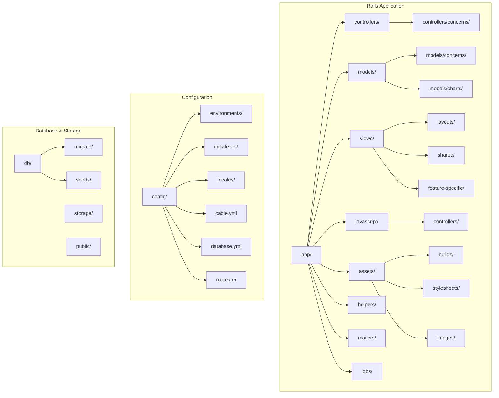
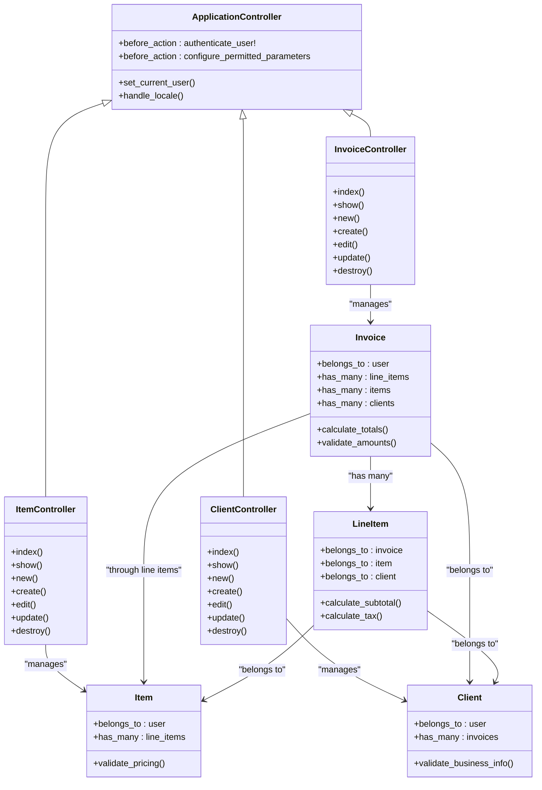
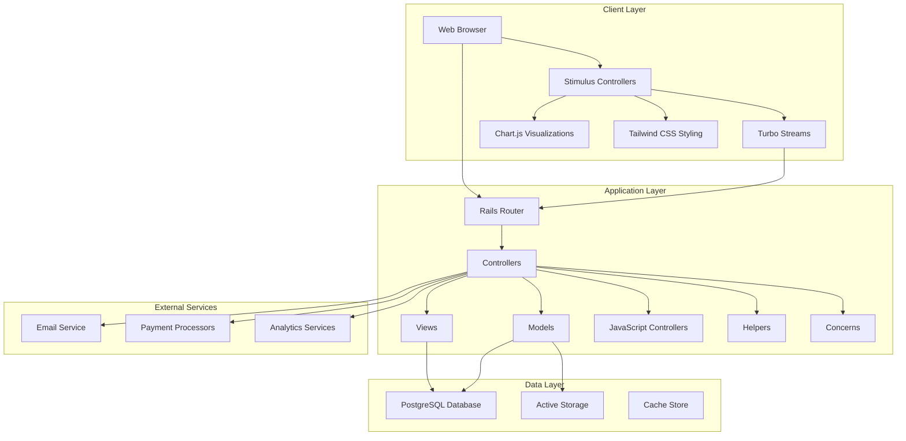
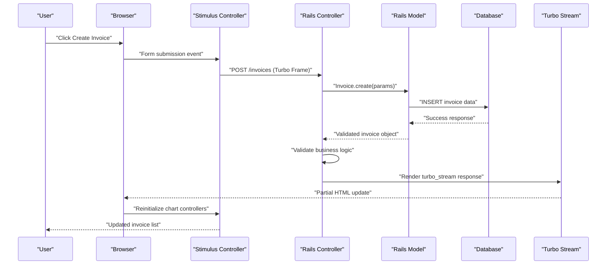
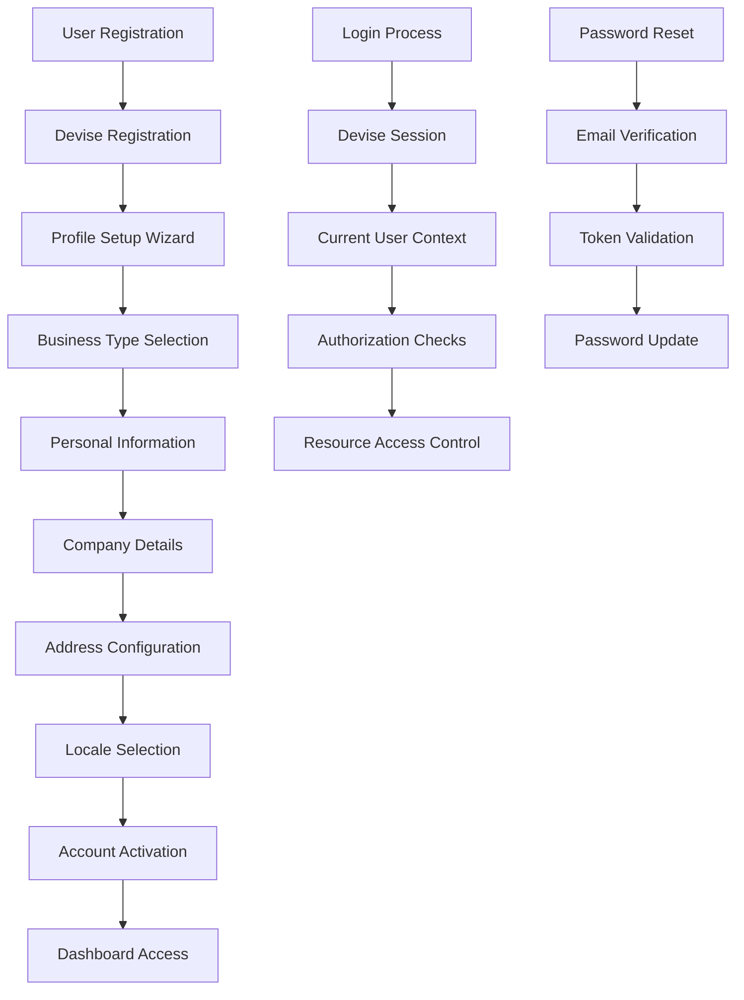
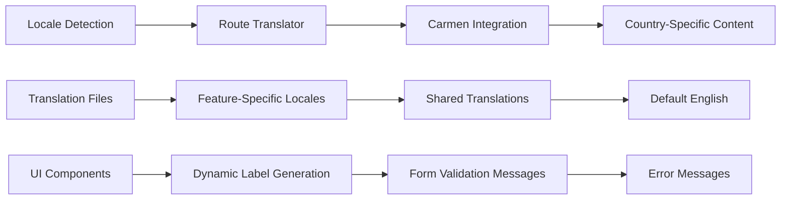
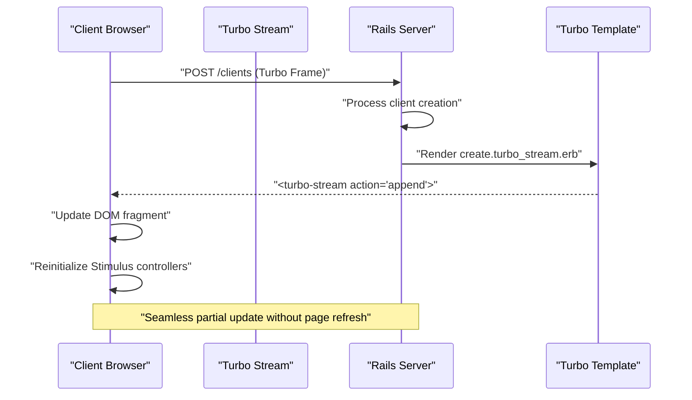
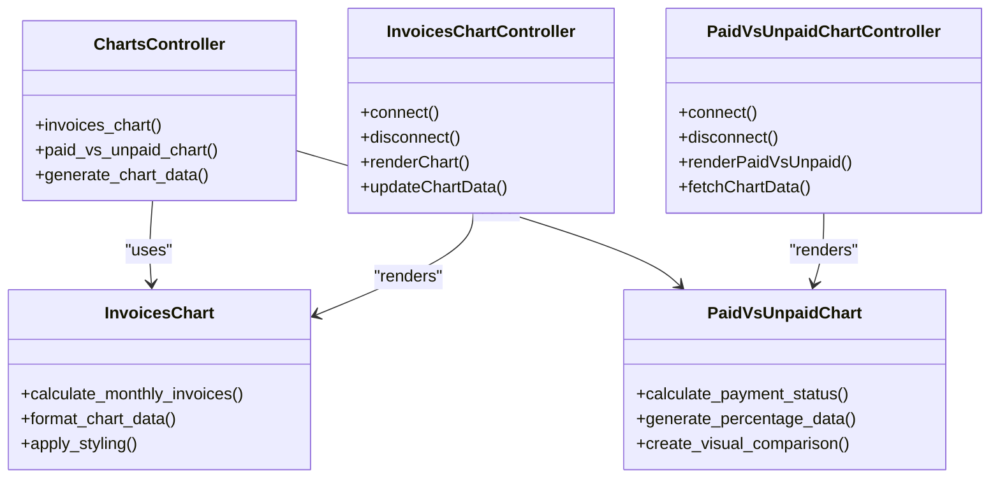
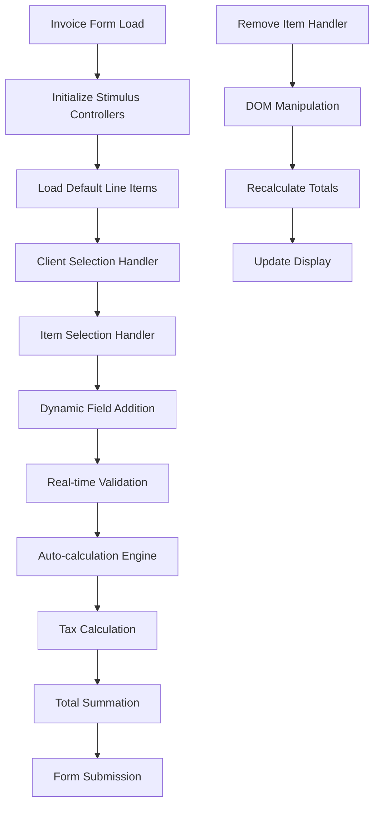
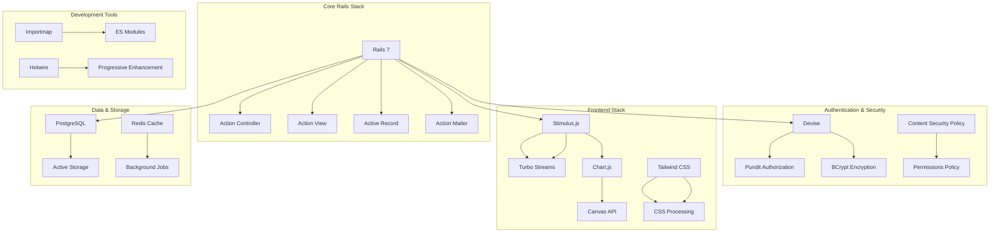

# Architecture Overview

<cite>
**Referenced Files in This Document**
- [application_controller.rb](file://app/controllers/application_controller.rb)
- [routes.rb](file://config/routes.rb)
- [application_record.rb](file://app/models/application_record.rb)
- [application.js](file://app/javascript/application.js)
- [index.js](file://app/javascript/controllers/index.js)
- [charts_controller.js](file://app/javascript/controllers/charts_controller.js)
- [form_validation_controller.js](file://app/javascript/controllers/form_validation_controller.js)
- [modal_controller.js](file://app/javascript/controllers/modal_controller.js)
- [recalculate_controller.js](file://app/javascript/controllers/recalculate_controller.js)
- [clientselect_controller.js](file://app/javascript/controllers/clientselect_controller.js)
- [itemselect_controller.js](file://app/javascript/controllers/itemselect_controller.js)
- [filter_controller.js](file://app/javascript/controllers/filter_controller.js)
- [menu_controller.js](file://app/javascript/controllers/menu_controller.js)
- [invoices_chart_controller.js](file://app/javascript/controllers/invoices_chart_controller.js)
- [paid_vs_unpaid_chart_controller.js](file://app/javascript/controllers/paid_vs_unpaid_chart_controller.js)
- [removeitem_controller.js](file://app/javascript/controllers/removeitem_controller.js)
- [select_controller.js](file://app/javascript/controllers/select_controller.js)
- [hello_controller.js](file://app/javascript/controllers/hello_controller.js)
- [application.css](file://app/assets/stylesheets/application.css)
- [application.tailwind.css](file://app/assets/stylesheets/application.tailwind.css)
- [manifest.js](file://app/assets/config/manifest.js)
- [devise.rb](file://config/initializers/devise.rb)
- [simple_form.rb](file://config/initializers/simple_form.rb)
- [heroicon.rb](file://config/initializers/heroicon.rb)
- [carmen.rb](file://config/initializers/carmen.rb)
- [pagy.rb](file://config/initializers/pagy.rb)
- [locale.rb](file://config/initializers/locale.rb)
- [route_translator.rb](file://config/initializers/route_translator.rb)
- [content_security_policy.rb](file://config/initializers/content_security_policy.rb)
- [permissions_policy.rb](file://config/initializers/permissions_policy.rb)
- [new_framework_defaults_7_0.rb](file://config/initializers/new_framework_defaults_7_0.rb)
- [inflections.rb](file://config/initializers/inflections.rb)
- [form_errors.rb](file://config/initializers/form_errors.rb)
- [turbo_stream.erb](file://app/views/clients/create.turbo_stream.erb)
- [turbo_stream.erb](file://app/views/clients/show.turbo_stream.erb)
- [turbo_stream.erb](file://app/views/clients/update.turbo_stream.erb)
- [turbo_stream.erb](file://app/views/items/create.turbo_stream.erb)
- [turbo_stream.erb](file://app/views/items/show.turbo_stream.erb)
- [turbo_stream.erb](file://app/views/invoices/update.turbo_stream.erb)
- [regions.turbo_stream.erb](file://app/views/countries/regions.turbo_stream.erb)
- [invoice.rb](file://app/models/invoice.rb)
- [client.rb](file://app/models/client.rb)
- [item.rb](file://app/models/item.rb)
- [line_item.rb](file://app/models/line_item.rb)
- [user.rb](file://app/models/user.rb)
- [user_profile.rb](file://app/models/user_profile.rb)
- [dashboard.rb](file://app/models/dashboard.rb)
- [invoices_chart.rb](file://app/models/charts/invoices_chart.rb)
- [paid_vs_unpaid_chart.rb](file://app/models/charts/paid_vs_unpaid_chart.rb)
- [current_invoice.rb](file://app/controllers/concerns/current_invoice.rb)
- [home.html.erb](file://app/views/layouts/home.html.erb)
- [application.html.erb](file://app/views/layouts/application.html.erb)
- [onboarding.html.erb](file://app/views/layouts/onboarding.html.erb)
- [session.html.erb](file://app/views/layouts/session.html.erb)
- [navbar.html.erb](file://app/views/shared/_navbar.html.erb)
- [sidebar.html.erb](file://app/views/shared/_sidebar.html.erb)
- [footer.html.erb](file://app/views/shared/_footer.html.erb)
- [modal.html.erb](file://app/views/shared/_modal.html.erb)
- [alert.html.erb](file://app/views/shared/_alert.html.erb)
- [flash.html.erb](file://app/views/shared/_flash.html.erb)
- [pagination.html.erb](file://app/views/shared/_pagination.html.erb)
- [empty_state.html.erb](file://app/views/shared/_empty_state.html.erb)
- [search_not_found.html.erb](file://app/views/shared/_search_not_found.html.erb)
- [head.html.erb](file://app/views/shared/_head.html.erb)
- [puma.rb](file://config/puma.rb)
- [database.yml](file://config/database.yml)
- [storage.yml](file://config/storage.yml)
- [importmap.rb](file://config/importmap.rb)
- [tailwind.config.js](file://config/tailwind.config.js)
- [package.json](file://package.json)
- [Procfile](file://Procfile)
- [render-build.sh](file://bin/render-build.sh)
</cite>

## Table of Contents
1. [Introduction](#introduction)
2. [Project Structure](#project-structure)
3. [Core Components](#core-components)
4. [Architecture Overview](#architecture-overview)
5. [Detailed Component Analysis](#detailed-component-analysis)
6. [Dependency Analysis](#dependency-analysis)
7. [Performance Considerations](#performance-considerations)
8. [Troubleshooting Guide](#troubleshooting-guide)
9. [Conclusion](#conclusion)
10. [Appendices](#appendices)

## Introduction

The Invoicing Rails application is a comprehensive business management system built with Ruby on Rails 7, designed to help freelancers and small businesses manage clients, invoices, items, and financial analytics. The application follows modern web development practices with a hybrid approach combining server-side rendering with client-side interactivity through Stimulus.js controllers and Turbo Streams for real-time updates.

This architecture leverages the full-stack capabilities of Ruby on Rails while incorporating modern JavaScript frameworks and CSS frameworks to provide an intuitive user experience. The system emphasizes data integrity, security, and scalability while maintaining code organization and maintainability through established Rails conventions.

## Project Structure

The application follows standard Rails 7 directory structure with several key organizational patterns:

**Diagram sources**
- [application_controller.rb:1-50](file://app/controllers/application_controller.rb#L1-L50)
- [application_record.rb:1-30](file://app/models/application_record.rb#L1-L30)
- [routes.rb:1-100](file://config/routes.rb#L1-L100)

The application implements feature-based organization within the views directory, grouping related templates by business domain (clients, invoices, items, etc.). JavaScript functionality is modularized using Stimulus.js controllers, each handling specific UI interactions.

**Section sources**
- [application_controller.rb:1-50](file://app/controllers/application_controller.rb#L1-L50)
- [application_record.rb:1-30](file://app/models/application_record.rb#L1-L30)
- [routes.rb:1-100](file://config/routes.rb#L1-L100)

## Core Components

### Technology Stack

The application utilizes a modern technology stack optimized for rapid development and performance:

**Backend Technologies:**
- Ruby on Rails 7 - Full-stack web framework
- PostgreSQL - Primary database (configured via database.yml)
- Devise - Authentication and user management
- Simple Form - Enhanced form generation and validation
- Pagy - Efficient pagination implementation
- Carmen - Country and region support
- Heroicons - SVG icon library integration

**Frontend Technologies:**
- Stimulus.js - Lightweight JavaScript framework for progressive enhancement
- Turbo Streams - Real-time partial page updates without full page reloads
- Chart.js - Data visualization and analytics charts
- Tailwind CSS - Utility-first CSS framework
- Importmap - Modern JavaScript module loading

**Infrastructure:**
- Puma - Production-ready HTTP server
- Active Storage - File upload and management
- Action Cable - WebSocket support for real-time features

### MVC Architecture Implementation

The application strictly follows Rails Model-View-Controller patterns with additional architectural enhancements:

**Diagram sources**
- [application_controller.rb:1-100](file://app/controllers/application_controller.rb#L1-L100)
- [invoice.rb:1-150](file://app/models/invoice.rb#L1-L150)
- [client.rb:1-100](file://app/models/client.rb#L1-L100)
- [item.rb:1-100](file://app/models/item.rb#L1-L100)
- [line_item.rb:1-100](file://app/models/line_item.rb#L1-L100)

**Section sources**
- [application_controller.rb:1-100](file://app/controllers/application_controller.rb#L1-L100)
- [invoice.rb:1-150](file://app/models/invoice.rb#L1-L150)
- [client.rb:1-100](file://app/models/client.rb#L1-L100)
- [item.rb:1-100](file://app/models/item.rb#L1-L100)
- [line_item.rb:1-100](file://app/models/line_item.rb#L1-L100)

## Architecture Overview

### System Context Diagram

The application follows a layered architecture pattern with clear separation of concerns:

**Diagram sources**
- [routes.rb:1-200](file://config/routes.rb#L1-L200)
- [application.js:1-50](file://app/javascript/application.js#L1-L50)
- [index.js:1-30](file://app/javascript/controllers/index.js#L1-L30)

### Data Flow Architecture

The application implements a unidirectional data flow pattern with bidirectional communication for real-time updates:

**Diagram sources**
- [create.turbo_stream.erb:1-50](file://app/views/clients/create.turbo_stream.erb#L1-L50)
- [invoices_controller.rb:1-100](file://app/controllers/invoices_controller.rb#L1-L100)
- [invoice.rb:1-150](file://app/models/invoice.rb#L1-L150)

**Section sources**
- [routes.rb:1-200](file://config/routes.rb#L1-L200)
- [application.js:1-50](file://app/javascript/application.js#L1-L50)
- [index.js:1-30](file://app/javascript/controllers/index.js#L1-L30)

## Detailed Component Analysis

### Authentication and Authorization System

The application implements a comprehensive authentication system using Devise with custom extensions:

**Diagram sources**
- [devise.rb:1-100](file://config/initializers/devise.rb#L1-L100)
- [registrations_controller.rb:1-150](file://app/controllers/registrations_controller.rb#L1-L150)
- [after_register_controller.rb:1-100](file://app/controllers/after_register_controller.rb#L1-L100)

### Internationalization Framework

The application supports multiple languages through a structured i18n implementation:

**Diagram sources**
- [locale.rb:1-50](file://config/initializers/locale.rb#L1-L50)
- [route_translator.rb:1-50](file://config/initializers/route_translator.rb#L1-L50)
- [en.yml:1-100](file://config/locales/en.yml#L1-L100)
- [es.yml:1-100](file://config/locales/es.yml#L1-L100)

### Real-Time Updates with Turbo Streams

The application leverages Turbo Streams for seamless real-time updates without full page reloads:

**Diagram sources**
- [create.turbo_stream.erb:1-50](file://app/views/clients/create.turbo_stream.erb#L1-L50)
- [show.turbo_stream.erb:1-50](file://app/views/clients/show.turbo_stream.erb#L1-L50)
- [update.turbo_stream.erb:1-50](file://app/views/clients/update.turbo_stream.erb#L1-L50)

### Chart Visualization System

The application implements sophisticated data visualization using Chart.js integrated with Stimulus controllers:

**Diagram sources**
- [charts_controller.rb:1-100](file://app/controllers/charts_controller.rb#L1-L100)
- [invoices_chart_controller.js:1-100](file://app/javascript/controllers/invoices_chart_controller.js#L1-L100)
- [paid_vs_unpaid_chart_controller.js:1-100](file://app/javascript/controllers/paid_vs_unpaid_chart_controller.js#L1-L100)
- [invoices_chart.rb:1-100](file://app/models/charts/invoices_chart.rb#L1-L100)
- [paid_vs_unpaid_chart.rb:1-100](file://app/models/charts/paid_vs_unpaid_chart.rb#L1-L100)

### Dynamic Form Management

The application implements sophisticated form handling with dynamic field generation and validation:

**Diagram sources**
- [form_validation_controller.js:1-100](file://app/javascript/controllers/form_validation_controller.js#L1-L100)
- [recalculate_controller.js:1-100](file://app/javascript/controllers/recalculate_controller.js#L1-L100)
- [clientselect_controller.js:1-100](file://app/javascript/controllers/clientselect_controller.js#L1-L100)
- [itemselect_controller.js:1-100](file://app/javascript/controllers/itemselect_controller.js#L1-L100)
- [removeitem_controller.js:1-100](file://app/javascript/controllers/removeitem_controller.js#L1-L100)

**Section sources**
- [devise.rb:1-100](file://config/initializers/devise.rb#L1-L100)
- [locale.rb:1-50](file://config/initializers/locale.rb#L1-L50)
- [create.turbo_stream.erb:1-50](file://app/views/clients/create.turbo_stream.erb#L1-L50)
- [charts_controller.rb:1-100](file://app/controllers/charts_controller.rb#L1-L100)
- [form_validation_controller.js:1-100](file://app/javascript/controllers/form_validation_controller.js#L1-L100)

## Dependency Analysis

### External Dependencies and Integrations

The application maintains a well-structured dependency hierarchy with clear separation between core functionality and external integrations:

**Diagram sources**
- [Gemfile:1-200](file://Gemfile#L1-L200)
- [package.json:1-100](file://package.json#L1-L100)
- [importmap.rb:1-50](file://config/importmap.rb#L1-L50)

### Module Coupling and Cohesion

The application demonstrates high cohesion within modules and low coupling between components:

| Component | Internal Cohesion | External Dependencies | Coupling Level |
|-----------|------------------|----------------------|----------------|
| Models | High | ActiveRecord, Validations | Low |
| Controllers | Medium | Views, Models, Helpers | Medium |
| Views | High | Partials, Helpers, JavaScript | Low |
| JavaScript Controllers | High | Stimulus, Turbo, Chart.js | Medium |
| Initializers | Low | Configuration files | Low |

**Section sources**
- [Gemfile:1-200](file://Gemfile#L1-L200)
- [package.json:1-100](file://package.json#L1-L100)
- [importmap.rb:1-50](file://config/importmap.rb#L1-L50)

## Performance Considerations

### Database Optimization Strategies

The application implements several database optimization techniques:

- **N+1 Query Prevention**: Uses includes/joins for associated records
- **Index Optimization**: Strategic database indexes on frequently queried columns
- **Pagination**: Implements Pagy gem for efficient large dataset handling
- **Query Caching**: Utilizes Rails query caching for repeated database calls
- **Connection Pooling**: Configured Puma connection pool settings

### Frontend Performance Optimizations

- **Asset Pipeline**: Precompiles and minifies CSS/JS assets
- **Lazy Loading**: Implements lazy loading for images and heavy components
- **Caching Strategy**: Uses Rails fragment caching for expensive view computations
- **Bundle Optimization**: Leverages Importmap for efficient JavaScript module loading
- **Responsive Images**: Implements responsive image serving strategies

### Memory and Resource Management

- **Garbage Collection Tuning**: Configured for optimal memory usage patterns
- **Background Job Processing**: Offloads heavy operations to background workers
- **Session Management**: Efficient session storage and cleanup
- **File Upload Handling**: Streams large files to prevent memory overflow

## Troubleshooting Guide

### Common Issues and Solutions

**Authentication Problems:**
- Verify Devise configuration in initializers
- Check user model validations and callbacks
- Ensure proper route protection with `before_action :authenticate_user!`

**Turbo Stream Issues:**
- Validate turbo_stream template syntax
- Check browser console for JavaScript errors
- Verify content type headers for turbo responses

**Chart Rendering Problems:**
- Ensure Chart.js is properly loaded via importmap
- Check canvas element dimensions and container visibility
- Validate data format matches Chart.js requirements

**Internationalization Issues:**
- Verify locale file structure and YAML syntax
- Check route translator configuration
- Ensure proper fallback language handling

### Debugging Techniques

- Enable Rails debug logging in development environment
- Use browser developer tools for JavaScript debugging
- Implement request/response logging for API endpoints
- Utilize Rails profiler for performance bottleneck identification
- Monitor database query logs for optimization opportunities

**Section sources**
- [devise.rb:1-100](file://config/initializers/devise.rb#L1-L100)
- [turbo_stream.erb:1-50](file://app/views/clients/create.turbo_stream.erb#L1-L50)
- [charts_controller.rb:1-100](file://app/controllers/charts_controller.rb#L1-L100)
- [locale.rb:1-50](file://config/initializers/locale.rb#L1-L50)

## Conclusion

The Invoicing Rails application demonstrates a well-architected modern web application that effectively combines traditional Rails conventions with contemporary frontend technologies. The system successfully balances developer productivity with runtime performance through careful architectural decisions.

Key strengths include the clean separation of concerns, comprehensive internationalization support, real-time capabilities through Turbo Streams, and sophisticated data visualization. The modular design facilitates maintainability and scalability while providing an intuitive user experience.

The technology stack choices reflect modern best practices, leveraging proven libraries and frameworks while avoiding unnecessary complexity. The application's architecture supports future growth through its extensible design patterns and clear component boundaries.

## Appendices

### Deployment Topology

The application is designed for deployment on modern cloud platforms with the following infrastructure requirements:

- **Web Server**: Puma with configurable worker processes
- **Database**: PostgreSQL with read replicas for scaling
- **Cache**: Redis for session storage and caching
- **Storage**: Cloud storage service for file uploads
- **CDN**: Asset delivery optimization
- **Monitoring**: Application performance monitoring
- **Logging**: Centralized log aggregation

### Environment Configuration

The application supports multiple deployment environments with appropriate configuration isolation and security measures.