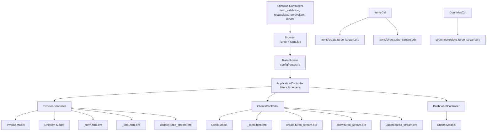
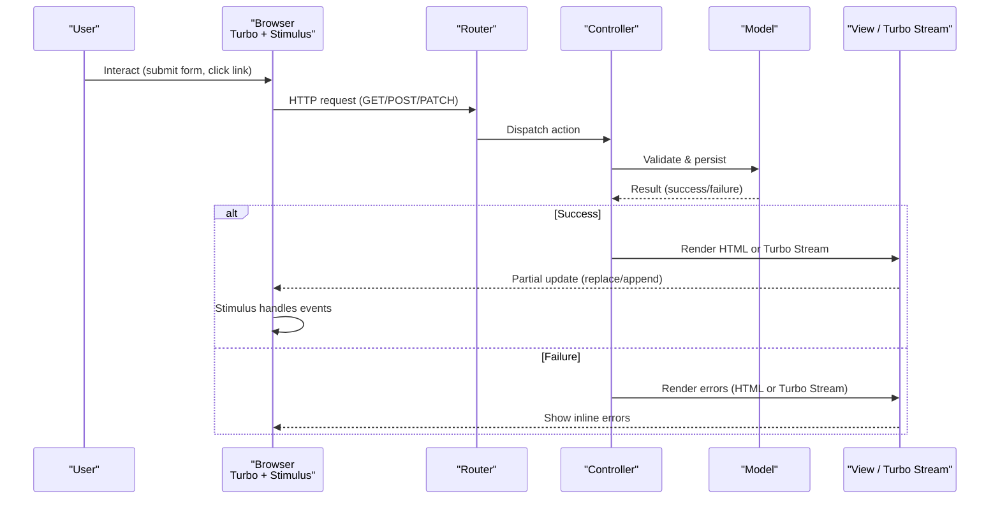
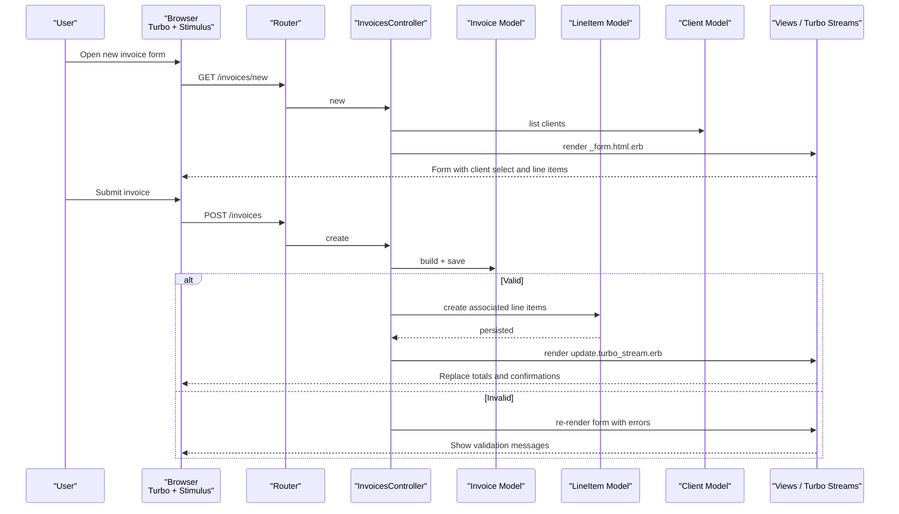
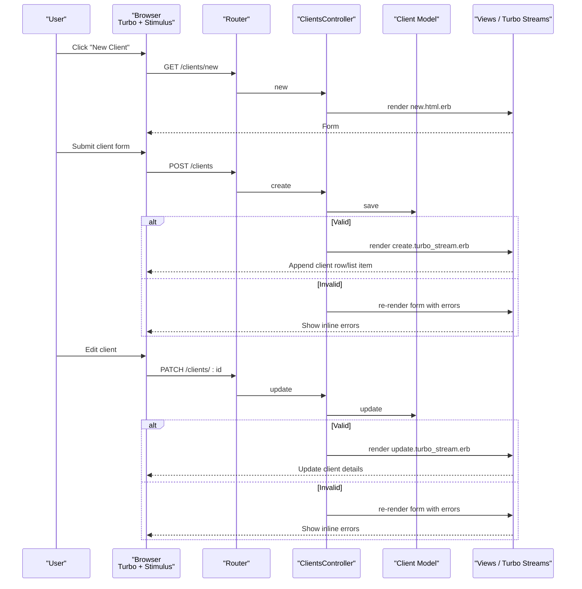
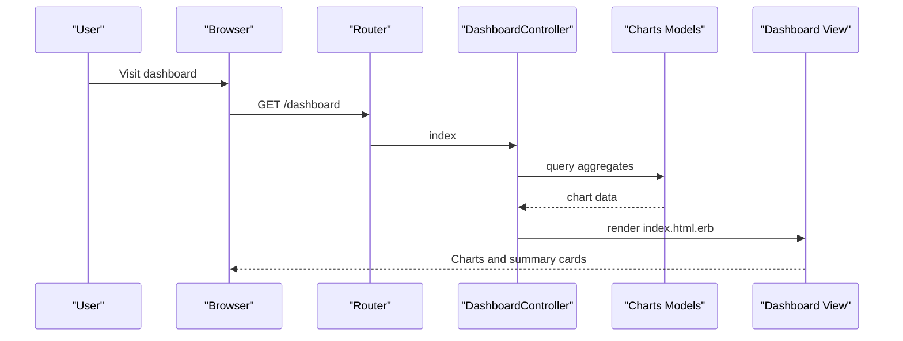
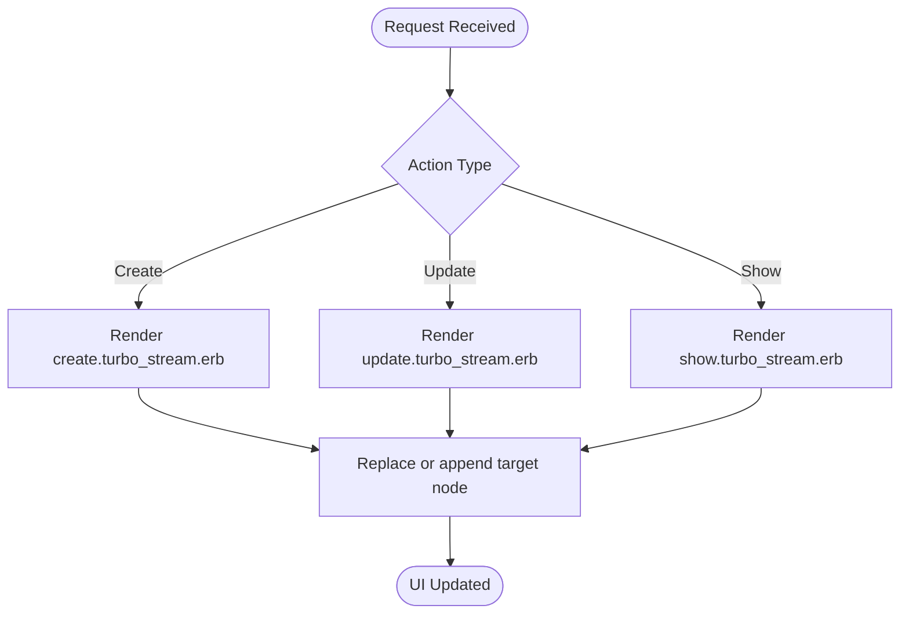
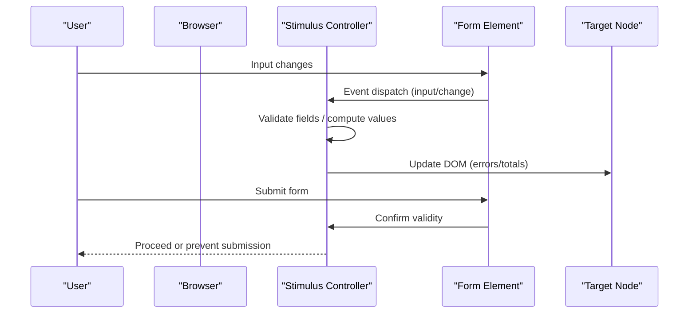
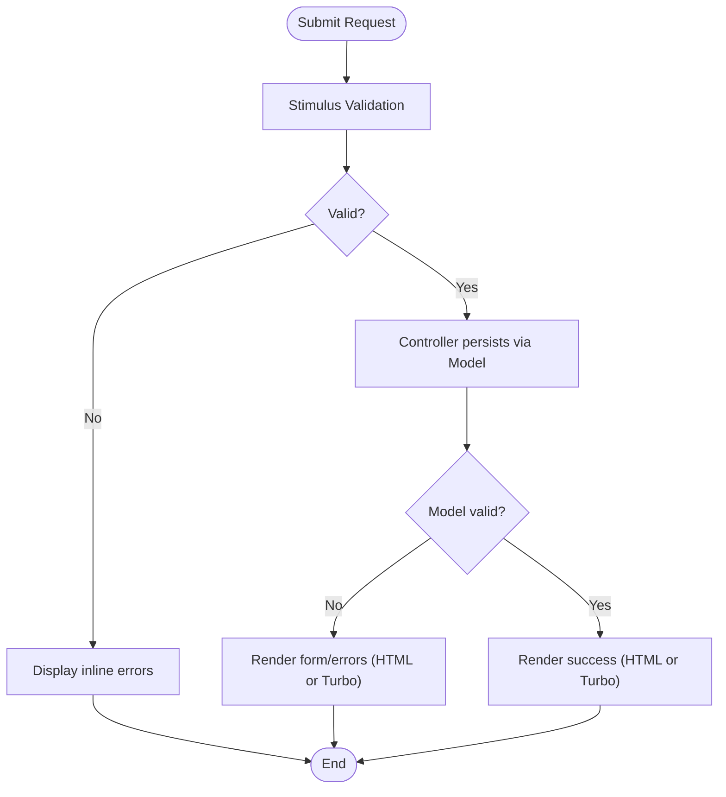
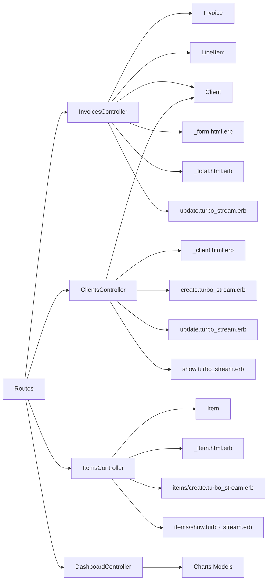

# Data Flow & Request Processing

<cite>
**Referenced Files in This Document**
- [routes.rb](file://config/routes.rb)
- [application_controller.rb](file://app/controllers/application_controller.rb)
- [invoices_controller.rb](file://app/controllers/invoices_controller.rb)
- [clients_controller.rb](file://app/controllers/clients_controller.rb)
- [dashboard_controller.rb](file://app/controllers/dashboard_controller.rb)
- [line_items_controller.rb](file://app/controllers/line_items_controller.rb)
- [items_controller.rb](file://app/controllers/items_controller.rb)
- [invoice.rb](file://app/models/invoice.rb)
- [client.rb](file://app/models/client.rb)
- [item.rb](file://app/models/item.rb)
- [line_item.rb](file://app/models/line_item.rb)
- [current_invoice.rb](file://app/controllers/concerns/current_invoice.rb)
- [form_validation_controller.js](file://app/javascript/controllers/form_validation_controller.js)
- [recalculate_controller.js](file://app/javascript/controllers/recalculate_controller.js)
- [removeitem_controller.js](file://app/javascript/controllers/removeitem_controller.js)
- [modal_controller.js](file://app/javascript/controllers/modal_controller.js)
- [index.js](file://app/javascript/controllers/index.js)
- [application.js](file://app/javascript/application.js)
- [create.turbo_stream.erb](file://app/views/clients/create.turbo_stream.erb)
- [update.turbo_stream.erb](file://app/views/clients/update.turbo_stream.erb)
- [show.turbo_stream.erb](file://app/views/clients/show.turbo_stream.erb)
- [create.turbo_stream.erb](file://app/views/items/create.turbo_stream.erb)
- [show.turbo_stream.erb](file://app/views/items/show.turbo_stream.erb)
- [update.turbo_stream.erb](file://app/views/invoices/update.turbo_stream.erb)
- [regions.turbo_stream.erb](file://app/views/countries/regions.turbo_stream.erb)
- [_form.html.erb](file://app/views/invoices/_form.html.erb)
- [_total.html.erb](file://app/views/invoices/_total.html.erb)
- [_client.html.erb](file://app/views/clients/_client.html.erb)
- [_item.html.erb](file://app/views/items/_item.html.erb)
- [schema.rb](file://db/schema.rb)
</cite>

## Table of Contents
1. [Introduction](#introduction)
2. [Project Structure](#project-structure)
3. [Core Components](#core-components)
4. [Architecture Overview](#architecture-overview)
5. [Detailed Component Analysis](#detailed-component-analysis)
6. [Dependency Analysis](#dependency-analysis)
7. [Performance Considerations](#performance-considerations)
8. [Troubleshooting Guide](#troubleshooting-guide)
9. [Conclusion](#conclusion)

## Introduction
This document explains the end-to-end data flow and request processing architecture of the Invoicing Rails application. It covers the full HTTP lifecycle from route dispatch through controller actions, model validations, database operations, and view rendering. It also documents Turbo Streams for real-time partial updates and Stimulus.js controllers that enhance client-side interactions. Typical user workflows such as invoice creation, client management, and dashboard updates are illustrated with sequence diagrams. Error handling, validation flows, and asynchronous patterns are addressed to help developers understand both server-side and client-side behavior.

## Project Structure
The application follows a conventional Rails layout:
- Controllers under app/controllers handle HTTP requests and coordinate business logic.
- Models under app/models encapsulate domain entities and validations.
- Views under app/views render HTML or Turbo Stream fragments.
- JavaScript controllers under app/javascript/controllers implement client-side behaviors using Stimulus.js.
- Routes under config/routes.rb define URL mappings to controller actions.
- Database schema is defined in db/schema.rb.

**Diagram sources**
- [routes.rb](file://config/routes.rb)
- [application_controller.rb](file://app/controllers/application_controller.rb)
- [invoices_controller.rb](file://app/controllers/invoices_controller.rb)
- [clients_controller.rb](file://app/controllers/clients_controller.rb)
- [dashboard_controller.rb](file://app/controllers/dashboard_controller.rb)
- [invoice.rb](file://app/models/invoice.rb)
- [client.rb](file://app/models/client.rb)
- [line_item.rb](file://app/models/line_item.rb)
- [items_controller.rb](file://app/controllers/items_controller.rb)
- [create.turbo_stream.erb](file://app/views/clients/create.turbo_stream.erb)
- [update.turbo_stream.erb](file://app/views/clients/update.turbo_stream.erb)
- [show.turbo_stream.erb](file://app/views/clients/show.turbo_stream.erb)
- [create.turbo_stream.erb](file://app/views/items/create.turbo_stream.erb)
- [show.turbo_stream.erb](file://app/views/items/show.turbo_stream.erb)
- [update.turbo_stream.erb](file://app/views/invoices/update.turbo_stream.erb)
- [regions.turbo_stream.erb](file://app/views/countries/regions.turbo_stream.erb)
- [_form.html.erb](file://app/views/invoices/_form.html.erb)
- [_total.html.erb](file://app/views/invoices/_total.html.erb)
- [_client.html.erb](file://app/views/clients/_client.html.erb)
- [form_validation_controller.js](file://app/javascript/controllers/form_validation_controller.js)
- [recalculate_controller.js](file://app/javascript/controllers/recalculate_controller.js)
- [removeitem_controller.js](file://app/javascript/controllers/removeitem_controller.js)
- [modal_controller.js](file://app/javascript/controllers/modal_controller.js)

**Section sources**
- [routes.rb](file://config/routes.rb)
- [application_controller.rb](file://app/controllers/application_controller.rb)
- [invoices_controller.rb](file://app/controllers/invoices_controller.rb)
- [clients_controller.rb](file://app/controllers/clients_controller.rb)
- [dashboard_controller.rb](file://app/controllers/dashboard_controller.rb)
- [invoice.rb](file://app/models/invoice.rb)
- [client.rb](file://app/models/client.rb)
- [line_item.rb](file://app/models/line_item.rb)
- [items_controller.rb](file://app/controllers/items_controller.rb)
- [create.turbo_stream.erb](file://app/views/clients/create.turbo_stream.erb)
- [update.turbo_stream.erb](file://app/views/clients/update.turbo_stream.erb)
- [show.turbo_stream.erb](file://app/views/clients/show.turbo_stream.erb)
- [create.turbo_stream.erb](file://app/views/items/create.turbo_stream.erb)
- [show.turbo_stream.erb](file://app/views/items/show.turbo_stream.erb)
- [update.turbo_stream.erb](file://app/views/invoices/update.turbo_stream.erb)
- [regions.turbo_stream.erb](file://app/views/countries/regions.turbo_stream.erb)
- [_form.html.erb](file://app/views/invoices/_form.html.erb)
- [_total.html.erb](file://app/views/invoices/_total.html.erb)
- [_client.html.erb](file://app/views/clients/_client.html.erb)
- [form_validation_controller.js](file://app/javascript/controllers/form_validation_controller.js)
- [recalculate_controller.js](file://app/javascript/controllers/recalculate_controller.js)
- [removeitem_controller.js](file://app/javascript/controllers/removeitem_controller.js)
- [modal_controller.js](file://app/javascript/controllers/modal_controller.js)

## Core Components
- Routing layer maps URLs to controller actions and supports Turbo Stream responses.
- Application controller provides shared filters and helper methods used by feature controllers.
- Feature controllers (invoices, clients, items, line items, dashboard) orchestrate request handling, model interactions, and view/Turbo Stream rendering.
- Models enforce domain rules via validations and associations.
- Views include standard ERB templates and Turbo Stream templates for partial updates.
- Stimulus controllers manage client-side form validation, dynamic recalculation, item removal, and modals.

Key responsibilities:
- InvoicesController: create, update, show; uses Turbo Stream for live totals and partial updates.
- ClientsController: index, new, create, edit, update, show; integrates Turbo Streams for instant feedback.
- ItemsController: CRUD with Turbo Stream responses for seamless UX.
- LineItemsController: manages invoice line items and participates in total calculations.
- DashboardController: renders charts and aggregates data.

**Section sources**
- [invoices_controller.rb](file://app/controllers/invoices_controller.rb)
- [clients_controller.rb](file://app/controllers/clients_controller.rb)
- [items_controller.rb](file://app/controllers/items_controller.rb)
- [line_items_controller.rb](file://app/controllers/line_items_controller.rb)
- [dashboard_controller.rb](file://app/controllers/dashboard_controller.rb)
- [invoice.rb](file://app/models/invoice.rb)
- [client.rb](file://app/models/client.rb)
- [item.rb](file://app/models/item.rb)
- [line_item.rb](file://app/models/line_item.rb)
- [form_validation_controller.js](file://app/javascript/controllers/form_validation_controller.js)
- [recalculate_controller.js](file://app/javascript/controllers/recalculate_controller.js)
- [removeitem_controller.js](file://app/javascript/controllers/removeitem_controller.js)
- [modal_controller.js](file://app/javascript/controllers/modal_controller.js)

## Architecture Overview
The application leverages Rails MVC plus Turbo and Stimulus for a modern, interactive experience:
- Requests enter via routes and are dispatched to controllers.
- Controllers validate inputs, persist data, and respond with either HTML or Turbo Stream fragments.
- Models encapsulate validations and relationships.
- Views render UI; Turbo replaces targeted DOM nodes without full page reloads.
- Stimulus controllers enhance forms, perform client-side recalculations, and manage modals.

**Diagram sources**
- [routes.rb](file://config/routes.rb)
- [application_controller.rb](file://app/controllers/application_controller.rb)
- [invoices_controller.rb](file://app/controllers/invoices_controller.rb)
- [clients_controller.rb](file://app/controllers/clients_controller.rb)
- [items_controller.rb](file://app/controllers/items_controller.rb)
- [invoice.rb](file://app/models/invoice.rb)
- [client.rb](file://app/models/client.rb)
- [item.rb](file://app/models/item.rb)
- [create.turbo_stream.erb](file://app/views/clients/create.turbo_stream.erb)
- [update.turbo_stream.erb](file://app/views/clients/update.turbo_stream.erb)
- [show.turbo_stream.erb](file://app/views/clients/show.turbo_stream.erb)
- [create.turbo_stream.erb](file://app/views/items/create.turbo_stream.erb)
- [show.turbo_stream.erb](file://app/views/items/show.turbo_stream.erb)
- [update.turbo_stream.erb](file://app/views/invoices/update.turbo_stream.erb)

## Detailed Component Analysis

### Invoice Creation Workflow
This workflow demonstrates how a user creates an invoice, including client selection, line item addition, and total calculation. Turbo Streams provide immediate feedback on updates.

**Diagram sources**
- [routes.rb](file://config/routes.rb)
- [invoices_controller.rb](file://app/controllers/invoices_controller.rb)
- [invoice.rb](file://app/models/invoice.rb)
- [line_item.rb](file://app/models/line_item.rb)
- [client.rb](file://app/models/client.rb)
- [_form.html.erb](file://app/views/invoices/_form.html.erb)
- [_total.html.erb](file://app/views/invoices/_total.html.erb)
- [update.turbo_stream.erb](file://app/views/invoices/update.turbo_stream.erb)

**Section sources**
- [invoices_controller.rb](file://app/controllers/invoices_controller.rb)
- [invoice.rb](file://app/models/invoice.rb)
- [line_item.rb](file://app/models/line_item.rb)
- [client.rb](file://app/models/client.rb)
- [_form.html.erb](file://app/views/invoices/_form.html.erb)
- [_total.html.erb](file://app/views/invoices/_total.html.erb)
- [update.turbo_stream.erb](file://app/views/invoices/update.turbo_stream.erb)

### Client Management Workflow
This workflow covers creating and updating clients with Turbo Streams for instant UI updates.

**Diagram sources**
- [routes.rb](file://config/routes.rb)
- [clients_controller.rb](file://app/controllers/clients_controller.rb)
- [client.rb](file://app/models/client.rb)
- [create.turbo_stream.erb](file://app/views/clients/create.turbo_stream.erb)
- [update.turbo_stream.erb](file://app/views/clients/update.turbo_stream.erb)
- [show.turbo_stream.erb](file://app/views/clients/show.turbo_stream.erb)

**Section sources**
- [clients_controller.rb](file://app/controllers/clients_controller.rb)
- [client.rb](file://app/models/client.rb)
- [create.turbo_stream.erb](file://app/views/clients/create.turbo_stream.erb)
- [update.turbo_stream.erb](file://app/views/clients/update.turbo_stream.erb)
- [show.turbo_stream.erb](file://app/views/clients/show.turbo_stream.erb)

### Dashboard Updates
The dashboard controller renders aggregated data and charts. Turbo can be used to refresh chart sections without reloading the entire page.

**Diagram sources**
- [routes.rb](file://config/routes.rb)
- [dashboard_controller.rb](file://app/controllers/dashboard_controller.rb)

**Section sources**
- [dashboard_controller.rb](file://app/controllers/dashboard_controller.rb)

### Turbo Streams Integration
Turbo Streams enable real-time partial updates by sending stream actions that replace or append DOM elements. The application uses Turbo Stream templates for key features:
- Clients: create, update, show streams.
- Items: create and show streams.
- Invoices: update stream for totals and status.
- Countries: regions stream for dependent selects.

**Diagram sources**
- [create.turbo_stream.erb](file://app/views/clients/create.turbo_stream.erb)
- [update.turbo_stream.erb](file://app/views/clients/update.turbo_stream.erb)
- [show.turbo_stream.erb](file://app/views/clients/show.turbo_stream.erb)
- [create.turbo_stream.erb](file://app/views/items/create.turbo_stream.erb)
- [show.turbo_stream.erb](file://app/views/items/show.turbo_stream.erb)
- [update.turbo_stream.erb](file://app/views/invoices/update.turbo_stream.erb)
- [regions.turbo_stream.erb](file://app/views/countries/regions.turbo_stream.erb)

**Section sources**
- [create.turbo_stream.erb](file://app/views/clients/create.turbo_stream.erb)
- [update.turbo_stream.erb](file://app/views/clients/update.turbo_stream.erb)
- [show.turbo_stream.erb](file://app/views/clients/show.turbo_stream.erb)
- [create.turbo_stream.erb](file://app/views/items/create.turbo_stream.erb)
- [show.turbo_stream.erb](file://app/views/items/show.turbo_stream.erb)
- [update.turbo_stream.erb](file://app/views/invoices/update.turbo_stream.erb)
- [regions.turbo_stream.erb](file://app/views/countries/regions.turbo_stream.erb)

### Stimulus.js Controller Interactions
Stimulus controllers enhance interactivity:
- form_validation_controller.js: performs client-side validation and shows inline errors.
- recalculate_controller.js: recalculates totals when quantities or prices change.
- removeitem_controller.js: removes line items dynamically.
- modal_controller.js: toggles modal visibility.
- index.js and application.js: bootstraps Stimulus and registers controllers.

**Diagram sources**
- [form_validation_controller.js](file://app/javascript/controllers/form_validation_controller.js)
- [recalculate_controller.js](file://app/javascript/controllers/recalculate_controller.js)
- [removeitem_controller.js](file://app/javascript/controllers/removeitem_controller.js)
- [modal_controller.js](file://app/javascript/controllers/modal_controller.js)
- [index.js](file://app/javascript/controllers/index.js)
- [application.js](file://app/javascript/application.js)

**Section sources**
- [form_validation_controller.js](file://app/javascript/controllers/form_validation_controller.js)
- [recalculate_controller.js](file://app/javascript/controllers/recalculate_controller.js)
- [removeitem_controller.js](file://app/javascript/controllers/removeitem_controller.js)
- [modal_controller.js](file://app/javascript/controllers/modal_controller.js)
- [index.js](file://app/javascript/controllers/index.js)
- [application.js](file://app/javascript/application.js)

### Validation and Error Handling
Validation occurs at multiple layers:
- Client-side: Stimulus controllers check required fields and formats before submission.
- Server-side: Models enforce presence, uniqueness, numericality, and custom rules.
- Controller actions respond with Turbo Stream or HTML containing error messages.

**Diagram sources**
- [form_validation_controller.js](file://app/javascript/controllers/form_validation_controller.js)
- [invoice.rb](file://app/models/invoice.rb)
- [client.rb](file://app/models/client.rb)
- [item.rb](file://app/models/item.rb)
- [line_item.rb](file://app/models/line_item.rb)
- [update.turbo_stream.erb](file://app/views/invoices/update.turbo_stream.erb)
- [create.turbo_stream.erb](file://app/views/clients/create.turbo_stream.erb)
- [update.turbo_stream.erb](file://app/views/clients/update.turbo_stream.erb)

**Section sources**
- [form_validation_controller.js](file://app/javascript/controllers/form_validation_controller.js)
- [invoice.rb](file://app/models/invoice.rb)
- [client.rb](file://app/models/client.rb)
- [item.rb](file://app/models/item.rb)
- [line_item.rb](file://app/models/line_item.rb)
- [update.turbo_stream.erb](file://app/views/invoices/update.turbo_stream.erb)
- [create.turbo_stream.erb](file://app/views/clients/create.turbo_stream.erb)
- [update.turbo_stream.erb](file://app/views/clients/update.turbo_stream.erb)

### Asynchronous Operations
Asynchronous updates are primarily handled via Turbo Streams:
- Turbo frames and streams allow partial updates without full page reloads.
- Stimulus controllers trigger local updates (e.g., recalculations) while background server operations complete.
- For long-running tasks, consider Active Job integration (not shown here), which would complement Turbo Streams for progress updates.

[No sources needed since this section provides general guidance]

## Dependency Analysis
The following diagram highlights core dependencies between controllers, models, views, and Turbo Stream templates.

**Diagram sources**
- [routes.rb](file://config/routes.rb)
- [invoices_controller.rb](file://app/controllers/invoices_controller.rb)
- [clients_controller.rb](file://app/controllers/clients_controller.rb)
- [items_controller.rb](file://app/controllers/items_controller.rb)
- [dashboard_controller.rb](file://app/controllers/dashboard_controller.rb)
- [invoice.rb](file://app/models/invoice.rb)
- [client.rb](file://app/models/client.rb)
- [item.rb](file://app/models/item.rb)
- [line_item.rb](file://app/models/line_item.rb)
- [_form.html.erb](file://app/views/invoices/_form.html.erb)
- [_total.html.erb](file://app/views/invoices/_total.html.erb)
- [_client.html.erb](file://app/views/clients/_client.html.erb)
- [_item.html.erb](file://app/views/items/_item.html.erb)
- [create.turbo_stream.erb](file://app/views/clients/create.turbo_stream.erb)
- [update.turbo_stream.erb](file://app/views/clients/update.turbo_stream.erb)
- [show.turbo_stream.erb](file://app/views/clients/show.turbo_stream.erb)
- [create.turbo_stream.erb](file://app/views/items/create.turbo_stream.erb)
- [show.turbo_stream.erb](file://app/views/items/show.turbo_stream.erb)
- [update.turbo_stream.erb](file://app/views/invoices/update.turbo_stream.erb)

**Section sources**
- [routes.rb](file://config/routes.rb)
- [invoices_controller.rb](file://app/controllers/invoices_controller.rb)
- [clients_controller.rb](file://app/controllers/clients_controller.rb)
- [items_controller.rb](file://app/controllers/items_controller.rb)
- [dashboard_controller.rb](file://app/controllers/dashboard_controller.rb)
- [invoice.rb](file://app/models/invoice.rb)
- [client.rb](file://app/models/client.rb)
- [item.rb](file://app/models/item.rb)
- [line_item.rb](file://app/models/line_item.rb)
- [_form.html.erb](file://app/views/invoices/_form.html.erb)
- [_total.html.erb](file://app/views/invoices/_total.html.erb)
- [_client.html.erb](file://app/views/clients/_client.html.erb)
- [_item.html.erb](file://app/views/items/_item.html.erb)
- [create.turbo_stream.erb](file://app/views/clients/create.turbo_stream.erb)
- [update.turbo_stream.erb](file://app/views/clients/update.turbo_stream.erb)
- [show.turbo_stream.erb](file://app/views/clients/show.turbo_stream.erb)
- [create.turbo_stream.erb](file://app/views/items/create.turbo_stream.erb)
- [show.turbo_stream.erb](file://app/views/items/show.turbo_stream.erb)
- [update.turbo_stream.erb](file://app/views/invoices/update.turbo_stream.erb)

## Performance Considerations
- Prefer Turbo Streams for frequent small updates to avoid full page reloads.
- Keep model validations minimal and focused to reduce server overhead.
- Use efficient queries in dashboard charts; consider caching frequently accessed aggregates.
- Debounce client-side recalculations to minimize unnecessary DOM updates.
- Ensure Turbo targets are specific to reduce reflows and repaints.

[No sources needed since this section provides general guidance]

## Troubleshooting Guide
Common issues and resolutions:
- Turbo Stream not applied: verify the response content type is text/vnd.turbo-stream.html and that the target element exists in the DOM.
- Inline errors not showing: ensure Stimulus validation triggers on input/change and that error containers match expected selectors.
- Totals not updating: confirm recalculate controller listens to relevant events and that Turbo streams replace the correct totals container.
- Modal not closing: check modal controller event bindings and ensure data attributes are correctly set.

**Section sources**
- [form_validation_controller.js](file://app/javascript/controllers/form_validation_controller.js)
- [recalculate_controller.js](file://app/javascript/controllers/recalculate_controller.js)
- [removeitem_controller.js](file://app/javascript/controllers/removeitem_controller.js)
- [modal_controller.js](file://app/javascript/controllers/modal_controller.js)
- [update.turbo_stream.erb](file://app/views/invoices/update.turbo_stream.erb)
- [create.turbo_stream.erb](file://app/views/clients/create.turbo_stream.erb)
- [update.turbo_stream.erb](file://app/views/clients/update.turbo_stream.erb)
- [show.turbo_stream.erb](file://app/views/clients/show.turbo_stream.erb)

## Conclusion
The Invoicing Rails application combines Rails MVC with Turbo Streams and Stimulus.js to deliver a responsive, real-time user experience. Requests flow through routing to controllers, which coordinate model validations and persistence, then render either HTML or Turbo Stream fragments. Client-side Stimulus controllers enhance forms, perform recalculations, and manage modals. By leveraging Turbo Streams for partial updates and maintaining clear separation of concerns, the system achieves both performance and maintainability.