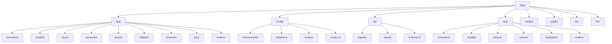
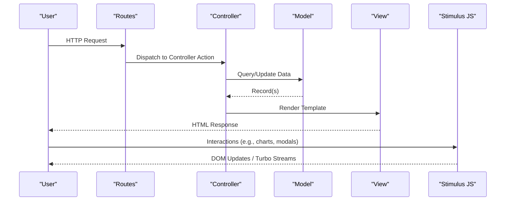
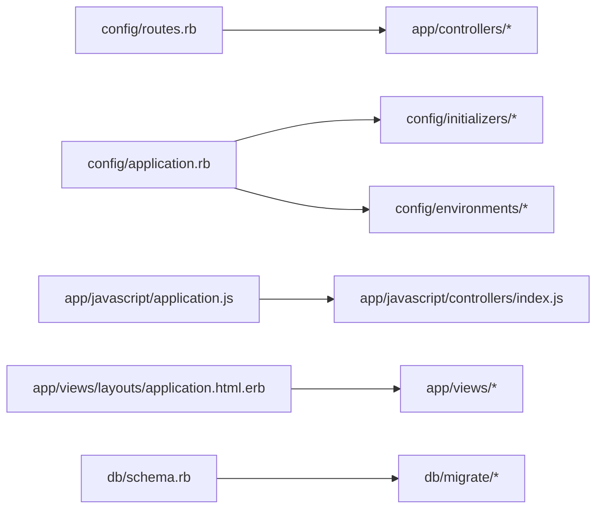

# Directory Structure & Organization

<cite>
**Referenced Files in This Document**
- [README.md](file://README.md)
- [config/routes.rb](file://config/routes.rb)
- [config/application.rb](file://config/application.rb)
- [config/importmap.rb](file://config/importmap.rb)
- [app/controllers/application_controller.rb](file://app/controllers/application_controller.rb)
- [app/models/application_record.rb](file://app/models/application_record.rb)
- [app/javascript/application.js](file://app/javascript/application.js)
- [app/javascript/controllers/index.js](file://app/javascript/controllers/index.js)
- [app/views/layouts/application.html.erb](file://app/views/layouts/application.html.erb)
- [db/schema.rb](file://db/schema.rb)
- [test/test_helper.rb](file://test/test_helper.rb)
</cite>

## Table of Contents
1. [Introduction](#introduction)
2. [Project Structure](#project-structure)
3. [Core Components](#core-components)
4. [Architecture Overview](#architecture-overview)
5. [Detailed Component Analysis](#detailed-component-analysis)
6. [Dependency Analysis](#dependency-analysis)
7. [Performance Considerations](#performance-considerations)
8. [Troubleshooting Guide](#troubleshooting-guide)
9. [Conclusion](#conclusion)

## Introduction
This document explains the directory structure and file organization of the Invoicing Rails application. It focuses on how major directories are organized, naming conventions, and best practices for adding new features while maintaining consistency across models, controllers, views, JavaScript controllers, and initializers.

## Project Structure
The application follows a standard Rails layout with feature-oriented subdirectories under app/ and clear separation of configuration, database migrations, tests, and assets.

**Diagram sources**
- [config/routes.rb](file://config/routes.rb)
- [config/application.rb](file://config/application.rb)
- [app/javascript/application.js](file://app/javascript/application.js)
- [app/javascript/controllers/index.js](file://app/javascript/controllers/index.js)
- [app/views/layouts/application.html.erb](file://app/views/layouts/application.html.erb)
- [db/schema.rb](file://db/schema.rb)

**Section sources**
- [README.md](file://README.md)
- [config/routes.rb](file://config/routes.rb)
- [config/application.rb](file://config/application.rb)
- [app/javascript/application.js](file://app/javascript/application.js)
- [app/javascript/controllers/index.js](file://app/javascript/controllers/index.js)
- [app/views/layouts/application.html.erb](file://app/views/layouts/application.html.erb)
- [db/schema.rb](file://db/schema.rb)

## Core Components
- Controllers: Feature-based controllers live under app/controllers/. Each controller typically pairs with a view folder and helpers.
- Models: Domain entities and concerns under app/models/. Base class is ApplicationRecord.
- Views: ERB templates grouped by resource under app/views/<resource>/, plus shared layouts and partials.
- JavaScript: Importmaps and Stimulus controllers under app/javascript/.
- Initializers: Application-wide configuration under config/initializers/.
- Database: Migrations and seeds under db/migrate/ and db/seeds/, with schema.rb reflecting current state.
- Tests: Mirrored structure under test/ for controllers, models, fixtures, system/integration, and mailers.

Naming conventions:
- Ruby files use snake_case (e.g., line_items_controller.rb).
- Model classes use CamelCase singular (e.g., LineItem).
- Controller classes use CamelCase plural with _Controller suffix.
- View folders match controller names (e.g., invoices/).
- Stimulus controllers use kebab-case filenames and camelCase class names.

Best practices:
- Keep related files together per feature (controller + model + views + helpers + JS controllers).
- Use concerns for cross-cutting logic shared among models or controllers.
- Store reusable UI fragments as partials under shared/ or within feature folders.
- Configure third-party gems via initializers rather than inline in application code.

**Section sources**
- [app/controllers/application_controller.rb](file://app/controllers/application_controller.rb)
- [app/models/application_record.rb](file://app/models/application_record.rb)
- [app/javascript/application.js](file://app/javascript/application.js)
- [app/javascript/controllers/index.js](file://app/javascript/controllers/index.js)
- [app/views/layouts/application.html.erb](file://app/views/layouts/application.html.erb)

## Architecture Overview
High-level flow from request to response, including asset pipeline and Stimulus integration.

**Diagram sources**
- [config/routes.rb](file://config/routes.rb)
- [app/controllers/application_controller.rb](file://app/controllers/application_controller.rb)
- [app/models/application_record.rb](file://app/models/application_record.rb)
- [app/javascript/application.js](file://app/javascript/application.js)
- [app/javascript/controllers/index.js](file://app/javascript/controllers/index.js)
- [app/views/layouts/application.html.erb](file://app/views/layouts/application.html.erb)

## Detailed Component Analysis

### app/ directory
Purpose: Contains all application code and presentation layers.

- controllers/: Feature-based controllers. Each controller corresponds to a domain area (e.g., clients, invoices, items). Shared behavior can be extracted into concerns.
- models/: Domain models inheriting from ApplicationRecord. Business logic and validations belong here; concerns can be added for shared behaviors.
- views/: ERB templates organized by resource. Use partials for reusable fragments. Layouts under layouts/, shared components under shared/.
- javascript/: Frontend logic using Importmaps and Stimulus. Entry point imports controllers index which auto-registers controllers.
- assets/: Static assets and build configs (Tailwind, images).
- helpers/: View helpers scoped to resources.
- channels/: Action Cable channel base classes.
- jobs/: Background job base class.
- mailers/: Mailer classes and templates.

Guidelines:
- Add a new feature by creating a controller, model, views, helpers, and corresponding Stimulus controllers if needed.
- Place shared logic in concerns under app/models/concerns/ or app/controllers/concerns/.
- Keep view partials close to their usage; move common UI to shared/.

**Section sources**
- [app/controllers/application_controller.rb](file://app/controllers/application_controller.rb)
- [app/models/application_record.rb](file://app/models/application_record.rb)
- [app/javascript/application.js](file://app/javascript/application.js)
- [app/javascript/controllers/index.js](file://app/javascript/controllers/index.js)
- [app/views/layouts/application.html.erb](file://app/views/layouts/application.html.erb)

### config/ directory
Purpose: Centralized configuration for environments, routes, initializers, locales, and asset pipelines.

Key areas:
- environments/: Per-environment settings (development, production, test).
- initializers/: Third-party gem configurations and app-wide setup.
- locales/: i18n translations grouped by feature and defaults.
- routes.rb: Declarative routing mapping URLs to controllers/actions.
- importmap.rb: Frontend dependency management for vanilla JS modules.
- tailwind.config.js: Tailwind CSS configuration.

Guidelines:
- Add new routes declaratively in routes.rb following RESTful conventions where appropriate.
- Configure new gems via dedicated initializers under config/initializers/.
- Organize locales by feature folders to keep translations maintainable.

**Section sources**
- [config/routes.rb](file://config/routes.rb)
- [config/application.rb](file://config/application.rb)
- [config/importmap.rb](file://config/importmap.rb)

### db/ directory
Purpose: Database schema evolution and seed data.

- migrate/: Versioned migrations that modify schema.
- seeds/: Seed data for development/testing.
- schema.rb: Current database schema snapshot.

Guidelines:
- Create migrations for every schema change; avoid editing existing migrations once committed.
- Use seeds for non-sensitive sample data; keep secrets out of seeds.
- After running migrations, verify schema.rb reflects expected state.

**Section sources**
- [db/schema.rb](file://db/schema.rb)

### test/ directory
Purpose: Automated tests mirroring app structure.

- controllers/: Controller specs focusing on actions and responses.
- models/: Model specs for validations and associations.
- fixtures/: Sample records used by tests.
- system/: End-to-end browser tests.
- integration/: Cross-controller flows.
- mailers/: Mailer delivery tests.
- test_helper.rb: Test environment setup.

Guidelines:
- Mirror feature structure: each controller/model should have corresponding tests.
- Use fixtures or factories consistently; prefer fixtures for simple cases.
- Keep system tests focused on user journeys.

**Section sources**
- [test/test_helper.rb](file://test/test_helper.rb)

### vendor/ directory
Purpose: Third-party code not managed by bundler/gemfiles (if any). Typically empty in modern Rails apps.

Guidelines:
- Prefer gems over vendored code when possible.
- If vendoring is necessary, document provenance and update procedures.

[No sources needed since this section provides general guidance]

## Dependency Analysis
Relationships between key configuration and runtime entry points.

**Diagram sources**
- [config/routes.rb](file://config/routes.rb)
- [config/application.rb](file://config/application.rb)
- [app/javascript/application.js](file://app/javascript/application.js)
- [app/javascript/controllers/index.js](file://app/javascript/controllers/index.js)
- [app/views/layouts/application.html.erb](file://app/views/layouts/application.html.erb)
- [db/schema.rb](file://db/schema.rb)

**Section sources**
- [config/routes.rb](file://config/routes.rb)
- [config/application.rb](file://config/application.rb)
- [app/javascript/application.js](file://app/javascript/application.js)
- [app/javascript/controllers/index.js](file://app/javascript/controllers/index.js)
- [app/views/layouts/application.html.erb](file://app/views/layouts/application.html.erb)
- [db/schema.rb](file://db/schema.rb)

## Performance Considerations
- Keep controllers thin; delegate business logic to models or service objects.
- Use partials and caching strategies in views for heavy rendering paths.
- Leverage background jobs for long-running tasks.
- Optimize database queries with includes/selects to avoid N+1.
- Minimize frontend payload size; tree-shake unused JS and CSS.

[No sources needed since this section provides general guidance]

## Troubleshooting Guide
Common issues and checks:
- Routing errors: Verify routes.rb entries and controller/action names.
- Missing views: Ensure view templates exist under app/views/<controller_name>/ matching action names.
- Stimulus not loading: Confirm importmap configuration and controllers/index.js registration.
- Migration conflicts: Re-run migrations and inspect schema.rb for inconsistencies.
- Test failures: Check fixtures and test_helper setup; ensure environment variables are configured.

**Section sources**
- [config/routes.rb](file://config/routes.rb)
- [app/javascript/application.js](file://app/javascript/application.js)
- [app/javascript/controllers/index.js](file://app/javascript/controllers/index.js)
- [db/schema.rb](file://db/schema.rb)
- [test/test_helper.rb](file://test/test_helper.rb)

## Conclusion
Following the patterns outlined above ensures consistent, maintainable growth of the Invoicing Rails application. Keep features cohesive, adhere to naming conventions, and organize configuration and tests alongside their corresponding features. This approach reduces cognitive load and accelerates onboarding for new contributors.