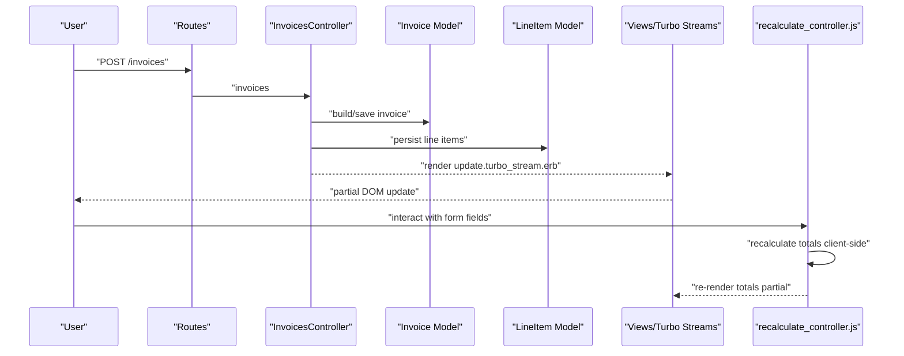
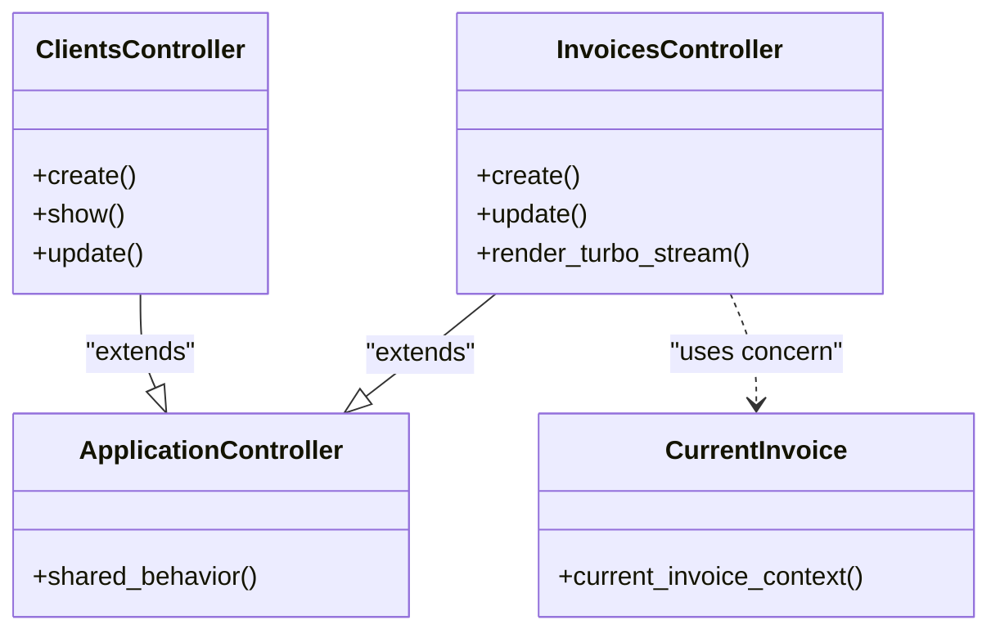
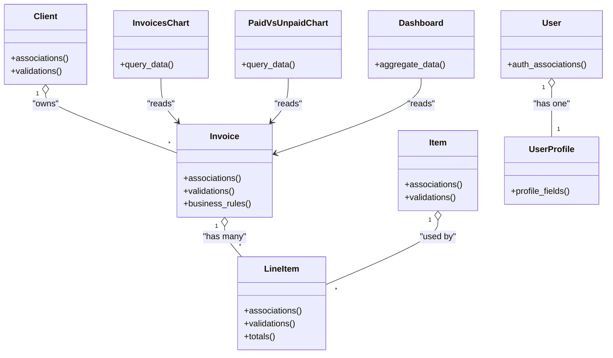
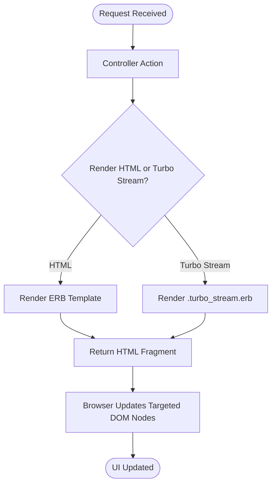
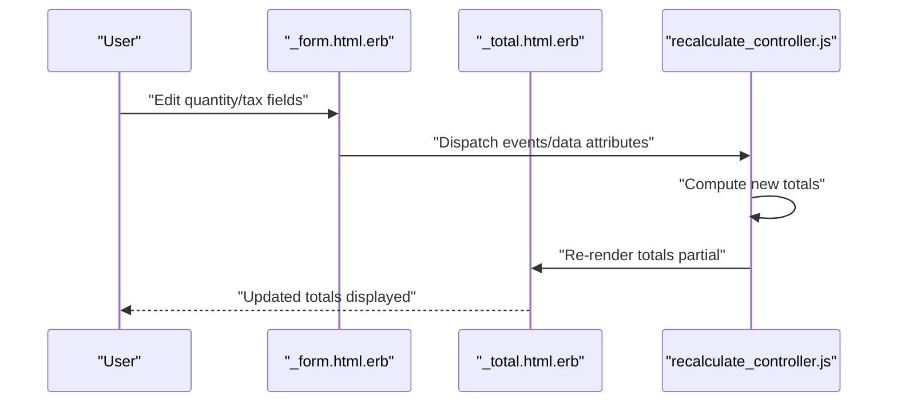
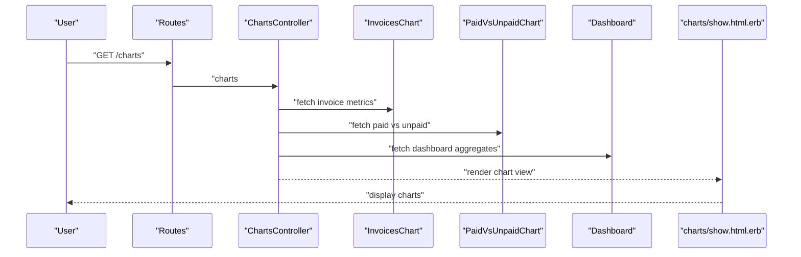
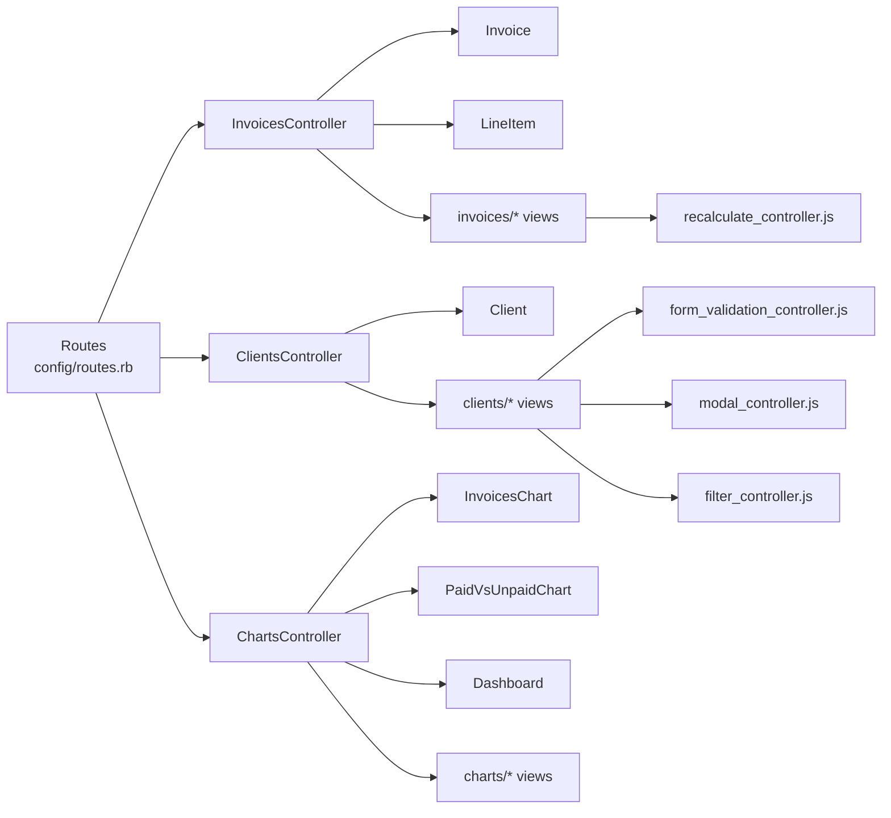

# System Design & Architecture Patterns

<cite>
**Referenced Files in This Document**
- [application_controller.rb](file://app/controllers/application_controller.rb)
- [invoices_controller.rb](file://app/controllers/invoices_controller.rb)
- [clients_controller.rb](file://app/controllers/clients_controller.rb)
- [items_controller.rb](file://app/controllers/items_controller.rb)
- [line_items_controller.rb](file://app/controllers/line_items_controller.rb)
- [current_invoice.rb](file://app/controllers/concerns/current_invoice.rb)
- [invoice.rb](file://app/models/invoice.rb)
- [client.rb](file://app/models/client.rb)
- [item.rb](file://app/models/item.rb)
- [line_item.rb](file://app/models/line_item.rb)
- [user.rb](file://app/models/user.rb)
- [user_profile.rb](file://app/models/user_profile.rb)
- [charts/invoices_chart.rb](file://app/models/charts/invoices_chart.rb)
- [charts/paid_vs_unpaid_chart.rb](file://app/models/charts/paid_vs_unpaid_chart.rb)
- [dashboard.rb](file://app/models/dashboard.rb)
- [charts_controller.rb](file://app/controllers/charts_controller.rb)
- [charts/show.html.erb](file://app/views/charts/show.html.erb)
- [invoices/_form.html.erb](file://app/views/invoices/_form.html.erb)
- [invoices/_total.html.erb](file://app/views/invoices/_total.html.erb)
- [invoices/update.turbo_stream.erb](file://app/views/invoices/update.turbo_stream.erb)
- [clients/create.turbo_stream.erb](file://app/views/clients/create.turbo_stream.erb)
- [clients/show.turbo_stream.erb](file://app/views/clients/show.turbo_stream.erb)
- [clients/update.turbo_stream.erb](file://app/views/clients/update.turbo_stream.erb)
- [items/create.turbo_stream.erb](file://app/views/items/create.turbo_stream.erb)
- [items/show.turbo_stream.erb](file://app/views/items/show.turbo_stream.erb)
- [countries/regions.turbo_stream.erb](file://app/views/countries/regions.turbo_stream.erb)
- [javascript/controllers/recalculate_controller.js](file://app/javascript/controllers/recalculate_controller.js)
- [javascript/controllers/form_validation_controller.js](file://app/javascript/controllers/form_validation_controller.js)
- [javascript/controllers/modal_controller.js](file://app/javascript/controllers/modal_controller.js)
- [javascript/controllers/filter_controller.js](file://app/javascript/controllers/filter_controller.js)
- [routes.rb](file://config/routes.rb)
- [application_record.rb](file://app/models/application_record.rb)
</cite>

## Table of Contents
1. [Introduction](#introduction)
2. [Project Structure](#project-structure)
3. [Core Components](#core-components)
4. [Architecture Overview](#architecture-overview)
5. [Detailed Component Analysis](#detailed-component-analysis)
6. [Dependency Analysis](#dependency-analysis)
7. [Performance Considerations](#performance-considerations)
8. [Troubleshooting Guide](#troubleshooting-guide)
9. [Conclusion](#conclusion)

## Introduction
This document describes the system design and architecture patterns of the Invoicing Rails application. It explains how the MVC layers are organized, how controllers, models, views, and JavaScript controllers collaborate, and where shared logic is extracted into concerns and service-like model objects. It also highlights architectural decisions such as using Turbo Streams for partial updates, client-side recalculations, and chart query objects to keep controllers thin and models focused on domain behavior.

## Project Structure
The application follows a conventional Rails layout with clear separation of responsibilities:
- Controllers handle HTTP requests, orchestrate actions, and render responses (HTML or Turbo Stream).
- Models encapsulate domain entities and business rules; chart-related queries are implemented as lightweight query objects under app/models/charts.
- Views render HTML and partials; Turbo Stream templates enable targeted DOM updates without full page reloads.
- JavaScript controllers manage UI interactions like recalculation, validation, modals, and filtering.

```mermaid
graph TB
subgraph "HTTP Layer"
R["Routes<br/>config/routes.rb"]
CApp["ApplicationController<br/>app/controllers/application_controller.rb"]
CI["InvoicesController<br/>app/controllers/invoices_controller.rb"]
CC["ClientsController<br/>app/controllers/clients_controller.rb"]
CT["ChartsController<br/>app/controllers/charts_controller.rb"]
end
subgraph "Domain Layer"
MInv["Invoice<br/>app/models/invoice.rb"]
MCli["Client<br/>app/models/client.rb"]
MI["Item<br/>app/models/item.rb"]
ML["LineItem<br/>app/models/line_item.rb"]
MU["User / UserProfile<br/>app/models/user.rb<br/>app/models/user_profile.rb"]
QI["InvoicesChart Query<br/>app/models/charts/invoices_chart.rb"]
QPU["PaidVsUnpaidChart Query<br/>app/models/charts/paid_vs_unpaid_chart.rb"]
MDash["Dashboard Query<br/>app/models/dashboard.rb"]
end
subgraph "Presentation Layer"
VInvForm["_form.html.erb<br/>app/views/invoices/_form.html.erb"]
VInvTotal["_total.html.erb<br/>app/views/invoices/_total.html.erb"]
VInvUpdate["update.turbo_stream.erb<br/>app/views/invoices/update.turbo_stream.erb"]
VCliCreate["create.turbo_stream.erb<br/>app/views/clients/create.turbo_stream.erb"]
VCliShow["show.turbo_stream.erb<br/>app/views/clients/show.turbo_stream.erb"]
VCliUpdate["update.turbo_stream.erb<br/>app/views/clients/update.turbo_stream.erb"]
VItemsCreate["create.turbo_stream.erb<br/>app/views/items/create.turbo_stream.erb"]
VItemsShow["show.turbo_stream.erb<br/>app/views/items/show.turbo_stream.erb"]
VCountriesRegions["regions.turbo_stream.erb<br/>app/views/countries/regions.turbo_stream.erb"]
VChartsShow["show.html.erb<br/>app/views/charts/show.html.erb"]
end
subgraph "Frontend JS"
JRecalc["recalculate_controller.js"]
JVal["form_validation_controller.js"]
JModal["modal_controller.js"]
JFilter["filter_controller.js"]
end
R --> CI
R --> CC
R --> CT
CI --> MInv
CC --> MCli
CT --> QI
CT --> QPU
CT --> MDash
CI --> VInvForm
CI --> VInvTotal
CI --> VInvUpdate
CC --> VCliCreate
CC --> VCliShow
CC --> VCliUpdate
CI --> JRecalc
CC --> JVal
CC --> JModal
CC --> JFilter
VInvForm --> JRecalc
VInvTotal --> JRecalc
```

**Diagram sources**
- [routes.rb](file://config/routes.rb)
- [application_controller.rb](file://app/controllers/application_controller.rb)
- [invoices_controller.rb](file://app/controllers/invoices_controller.rb)
- [clients_controller.rb](file://app/controllers/clients_controller.rb)
- [charts_controller.rb](file://app/controllers/charts_controller.rb)
- [invoice.rb](file://app/models/invoice.rb)
- [client.rb](file://app/models/client.rb)
- [item.rb](file://app/models/item.rb)
- [line_item.rb](file://app/models/line_item.rb)
- [user.rb](file://app/models/user.rb)
- [user_profile.rb](file://app/models/user_profile.rb)
- [charts/invoices_chart.rb](file://app/models/charts/invoices_chart.rb)
- [charts/paid_vs_unpaid_chart.rb](file://app/models/charts/paid_vs_unpaid_chart.rb)
- [dashboard.rb](file://app/models/dashboard.rb)
- [invoices/_form.html.erb](file://app/views/invoices/_form.html.erb)
- [invoices/_total.html.erb](file://app/views/invoices/_total.html.erb)
- [invoices/update.turbo_stream.erb](file://app/views/invoices/update.turbo_stream.erb)
- [clients/create.turbo_stream.erb](file://app/views/clients/create.turbo_stream.erb)
- [clients/show.turbo_stream.erb](file://app/views/clients/show.turbo_stream.erb)
- [clients/update.turbo_stream.erb](file://app/views/clients/update.turbo_stream.erb)
- [items/create.turbo_stream.erb](file://app/views/items/create.turbo_stream.erb)
- [items/show.turbo_stream.erb](file://app/views/items/show.turbo_stream.erb)
- [countries/regions.turbo_stream.erb](file://app/views/countries/regions.turbo_stream.erb)
- [charts/show.html.erb](file://app/views/charts/show.html.erb)
- [javascript/controllers/recalculate_controller.js](file://app/javascript/controllers/recalculate_controller.js)
- [javascript/controllers/form_validation_controller.js](file://app/javascript/controllers/form_validation_controller.js)
- [javascript/controllers/modal_controller.js](file://app/javascript/controllers/modal_controller.js)
- [javascript/controllers/filter_controller.js](file://app/javascript/controllers/filter_controller.js)

**Section sources**
- [routes.rb](file://config/routes.rb)
- [application_controller.rb](file://app/controllers/application_controller.rb)
- [invoices_controller.rb](file://app/controllers/invoices_controller.rb)
- [clients_controller.rb](file://app/controllers/clients_controller.rb)
- [charts_controller.rb](file://app/controllers/charts_controller.rb)
- [invoice.rb](file://app/models/invoice.rb)
- [client.rb](file://app/models/client.rb)
- [item.rb](file://app/models/item.rb)
- [line_item.rb](file://app/models/line_item.rb)
- [user.rb](file://app/models/user.rb)
- [user_profile.rb](file://app/models/user_profile.rb)
- [charts/invoices_chart.rb](file://app/models/charts/invoices_chart.rb)
- [charts/paid_vs_unpaid_chart.rb](file://app/models/charts/paid_vs_unpaid_chart.rb)
- [dashboard.rb](file://app/models/dashboard.rb)
- [invoices/_form.html.erb](file://app/views/invoices/_form.html.erb)
- [invoices/_total.html.erb](file://app/views/invoices/_total.html.erb)
- [invoices/update.turbo_stream.erb](file://app/views/invoices/update.turbo_stream.erb)
- [clients/create.turbo_stream.erb](file://app/views/clients/create.turbo_stream.erb)
- [clients/show.turbo_stream.erb](file://app/views/clients/show.turbo_stream.erb)
- [clients/update.turbo_stream.erb](file://app/views/clients/update.turbo_stream.erb)
- [items/create.turbo_stream.erb](file://app/views/items/create.turbo_stream.erb)
- [items/show.turbo_stream.erb](file://app/views/items/show.turbo_stream.erb)
- [countries/regions.turbo_stream.erb](file://app/views/countries/regions.turbo_stream.erb)
- [charts/show.html.erb](file://app/views/charts/show.html.erb)
- [javascript/controllers/recalculate_controller.js](file://app/javascript/controllers/recalculate_controller.js)
- [javascript/controllers/form_validation_controller.js](file://app/javascript/controllers/form_validation_controller.js)
- [javascript/controllers/modal_controller.js](file://app/javascript/controllers/modal_controller.js)
- [javascript/controllers/filter_controller.js](file://app/javascript/controllers/filter_controller.js)

## Core Components
- Controllers: Thin request handlers that delegate to models and query objects. They render standard HTML or Turbo Stream fragments for fast UX.
- Models: Domain entities with associations and validations. Chart data access is delegated to query objects under app/models/charts to avoid bloating models.
- Views: ERB templates and partials; Turbo Stream templates provide incremental updates for create, show, update, and region selection flows.
- JavaScript Controllers: Stimulus-based controllers for recalculation, form validation, modal toggling, and filtering.

Key architectural decisions:
- Use of Turbo Streams to minimize payload and improve interactivity.
- Query objects for complex read paths (charts) to keep controllers and models focused.
- Client-side recalculation for line items totals to reduce server round-trips.

**Section sources**
- [invoices_controller.rb](file://app/controllers/invoices_controller.rb)
- [clients_controller.rb](file://app/controllers/clients_controller.rb)
- [charts_controller.rb](file://app/controllers/charts_controller.rb)
- [invoice.rb](file://app/models/invoice.rb)
- [client.rb](file://app/models/client.rb)
- [item.rb](file://app/models/item.rb)
- [line_item.rb](file://app/models/line_item.rb)
- [charts/invoices_chart.rb](file://app/models/charts/invoices_chart.rb)
- [charts/paid_vs_unpaid_chart.rb](file://app/models/charts/paid_vs_unpaid_chart.rb)
- [dashboard.rb](file://app/models/dashboard.rb)
- [invoices/_form.html.erb](file://app/views/invoices/_form.html.erb)
- [invoices/_total.html.erb](file://app/views/invoices/_total.html.erb)
- [invoices/update.turbo_stream.erb](file://app/views/invoices/update.turbo_stream.erb)
- [clients/create.turbo_stream.erb](file://app/views/clients/create.turbo_stream.erb)
- [clients/show.turbo_stream.erb](file://app/views/clients/show.turbo_stream.erb)
- [clients/update.turbo_stream.erb](file://app/views/clients/update.turbo_stream.erb)
- [items/create.turbo_stream.erb](file://app/views/items/create.turbo_stream.erb)
- [items/show.turbo_stream.erb](file://app/views/items/show.turbo_stream.erb)
- [javascript/controllers/recalculate_controller.js](file://app/javascript/controllers/recalculate_controller.js)
- [javascript/controllers/form_validation_controller.js](file://app/javascript/controllers/form_validation_controller.js)

## Architecture Overview
The application uses a layered approach:
- HTTP layer: Routes dispatch to controllers.
- Application layer: Controllers coordinate with models and query objects.
- Domain layer: Models implement business rules and relationships.
- Presentation layer: Views render HTML/Turbo Streams; JavaScript controllers enhance UX.

**Diagram sources**
- [routes.rb](file://config/routes.rb)
- [invoices_controller.rb](file://app/controllers/invoices_controller.rb)
- [invoice.rb](file://app/models/invoice.rb)
- [line_item.rb](file://app/models/line_item.rb)
- [invoices/update.turbo_stream.erb](file://app/views/invoices/update.turbo_stream.erb)
- [invoices/_total.html.erb](file://app/views/invoices/_total.html.erb)
- [javascript/controllers/recalculate_controller.js](file://app/javascript/controllers/recalculate_controller.js)

## Detailed Component Analysis

### Controller Layer and Concerns
- ApplicationController provides shared behavior for all controllers.
- InvoicesController orchestrates invoice CRUD and renders Turbo Stream responses for seamless updates.
- ClientsController manages client records and uses Turbo Streams for create/show/update flows.
- CurrentInvoice concern centralizes current invoice context across controllers.

**Diagram sources**
- [application_controller.rb](file://app/controllers/application_controller.rb)
- [invoices_controller.rb](file://app/controllers/invoices_controller.rb)
- [clients_controller.rb](file://app/controllers/clients_controller.rb)
- [current_invoice.rb](file://app/controllers/concerns/current_invoice.rb)

**Section sources**
- [application_controller.rb](file://app/controllers/application_controller.rb)
- [invoices_controller.rb](file://app/controllers/invoices_controller.rb)
- [clients_controller.rb](file://app/controllers/clients_controller.rb)
- [current_invoice.rb](file://app/controllers/concerns/current_invoice.rb)

### Model Layer and Query Objects
- Invoice, Client, Item, LineItem define domain entities and associations.
- User and UserProfile capture account and profile details.
- Query objects under charts encapsulate read-heavy analytics:
  - InvoicesChart aggregates invoice metrics.
  - PaidVsUnpaidChart computes paid vs unpaid distributions.
  - Dashboard provides dashboard-specific aggregations.

**Diagram sources**
- [invoice.rb](file://app/models/invoice.rb)
- [line_item.rb](file://app/models/line_item.rb)
- [client.rb](file://app/models/client.rb)
- [item.rb](file://app/models/item.rb)
- [user.rb](file://app/models/user.rb)
- [user_profile.rb](file://app/models/user_profile.rb)
- [charts/invoices_chart.rb](file://app/models/charts/invoices_chart.rb)
- [charts/paid_vs_unpaid_chart.rb](file://app/models/charts/paid_vs_unpaid_chart.rb)
- [dashboard.rb](file://app/models/dashboard.rb)

**Section sources**
- [invoice.rb](file://app/models/invoice.rb)
- [line_item.rb](file://app/models/line_item.rb)
- [client.rb](file://app/models/client.rb)
- [item.rb](file://app/models/item.rb)
- [user.rb](file://app/models/user.rb)
- [user_profile.rb](file://app/models/user_profile.rb)
- [charts/invoices_chart.rb](file://app/models/charts/invoices_chart.rb)
- [charts/paid_vs_unpaid_chart.rb](file://app/models/charts/paid_vs_unpaid_chart.rb)
- [dashboard.rb](file://app/models/dashboard.rb)

### View Layer and Turbo Streams
- Partial forms and totals are rendered via ERB templates.
- Turbo Stream templates respond to create, show, and update actions to update specific DOM nodes without full reloads.
- Region selection uses a Turbo Stream response to dynamically populate dependent fields.

**Diagram sources**
- [invoices/update.turbo_stream.erb](file://app/views/invoices/update.turbo_stream.erb)
- [clients/create.turbo_stream.erb](file://app/views/clients/create.turbo_stream.erb)
- [clients/show.turbo_stream.erb](file://app/views/clients/show.turbo_stream.erb)
- [clients/update.turbo_stream.erb](file://app/views/clients/update.turbo_stream.erb)
- [items/create.turbo_stream.erb](file://app/views/items/create.turbo_stream.erb)
- [items/show.turbo_stream.erb](file://app/views/items/show.turbo_stream.erb)
- [countries/regions.turbo_stream.erb](file://app/views/countries/regions.turbo_stream.erb)

**Section sources**
- [invoices/_form.html.erb](file://app/views/invoices/_form.html.erb)
- [invoices/_total.html.erb](file://app/views/invoices/_total.html.erb)
- [invoices/update.turbo_stream.erb](file://app/views/invoices/update.turbo_stream.erb)
- [clients/create.turbo_stream.erb](file://app/views/clients/create.turbo_stream.erb)
- [clients/show.turbo_stream.erb](file://app/views/clients/show.turbo_stream.erb)
- [clients/update.turbo_stream.erb](file://app/views/clients/update.turbo_stream.erb)
- [items/create.turbo_stream.erb](file://app/views/items/create.turbo_stream.erb)
- [items/show.turbo_stream.erb](file://app/views/items/show.turbo_stream.erb)
- [countries/regions.turbo_stream.erb](file://app/views/countries/regions.turbo_stream.erb)

### JavaScript Controllers and Client-Side Logic
- Recalculate controller updates totals based on form inputs.
- Form validation controller enforces client-side constraints before submission.
- Modal controller handles open/close state for dialogs.
- Filter controller manages list filtering behaviors.

**Diagram sources**
- [invoices/_form.html.erb](file://app/views/invoices/_form.html.erb)
- [invoices/_total.html.erb](file://app/views/invoices/_total.html.erb)
- [javascript/controllers/recalculate_controller.js](file://app/javascript/controllers/recalculate_controller.js)
- [javascript/controllers/form_validation_controller.js](file://app/javascript/controllers/form_validation_controller.js)
- [javascript/controllers/modal_controller.js](file://app/javascript/controllers/modal_controller.js)
- [javascript/controllers/filter_controller.js](file://app/javascript/controllers/filter_controller.js)

**Section sources**
- [javascript/controllers/recalculate_controller.js](file://app/javascript/controllers/recalculate_controller.js)
- [javascript/controllers/form_validation_controller.js](file://app/javascript/controllers/form_validation_controller.js)
- [javascript/controllers/modal_controller.js](file://app/javascript/controllers/modal_controller.js)
- [javascript/controllers/filter_controller.js](file://app/javascript/controllers/filter_controller.js)

### Charts and Read Paths
ChartsController delegates heavy aggregation to query objects, keeping controllers thin and testable.

**Diagram sources**
- [charts_controller.rb](file://app/controllers/charts_controller.rb)
- [charts/invoices_chart.rb](file://app/models/charts/invoices_chart.rb)
- [charts/paid_vs_unpaid_chart.rb](file://app/models/charts/paid_vs_unpaid_chart.rb)
- [dashboard.rb](file://app/models/dashboard.rb)
- [charts/show.html.erb](file://app/views/charts/show.html.erb)

**Section sources**
- [charts_controller.rb](file://app/controllers/charts_controller.rb)
- [charts/invoices_chart.rb](file://app/models/charts/invoices_chart.rb)
- [charts/paid_vs_unpaid_chart.rb](file://app/models/charts/paid_vs_unpaid_chart.rb)
- [dashboard.rb](file://app/models/dashboard.rb)
- [charts/show.html.erb](file://app/views/charts/show.html.erb)

## Dependency Analysis
High-level dependencies between layers:
- Controllers depend on models and query objects.
- Views depend on partials and Turbo Stream templates.
- JavaScript controllers interact with DOM elements exposed by views.

**Diagram sources**
- [routes.rb](file://config/routes.rb)
- [invoices_controller.rb](file://app/controllers/invoices_controller.rb)
- [clients_controller.rb](file://app/controllers/clients_controller.rb)
- [charts_controller.rb](file://app/controllers/charts_controller.rb)
- [invoice.rb](file://app/models/invoice.rb)
- [line_item.rb](file://app/models/line_item.rb)
- [client.rb](file://app/models/client.rb)
- [charts/invoices_chart.rb](file://app/models/charts/invoices_chart.rb)
- [charts/paid_vs_unpaid_chart.rb](file://app/models/charts/paid_vs_unpaid_chart.rb)
- [dashboard.rb](file://app/models/dashboard.rb)
- [invoices/_form.html.erb](file://app/views/invoices/_form.html.erb)
- [clients/create.turbo_stream.erb](file://app/views/clients/create.turbo_stream.erb)
- [clients/show.turbo_stream.erb](file://app/views/clients/show.turbo_stream.erb)
- [clients/update.turbo_stream.erb](file://app/views/clients/update.turbo_stream.erb)
- [javascript/controllers/recalculate_controller.js](file://app/javascript/controllers/recalculate_controller.js)
- [javascript/controllers/form_validation_controller.js](file://app/javascript/controllers/form_validation_controller.js)
- [javascript/controllers/modal_controller.js](file://app/javascript/controllers/modal_controller.js)
- [javascript/controllers/filter_controller.js](file://app/javascript/controllers/filter_controller.js)

**Section sources**
- [routes.rb](file://config/routes.rb)
- [invoices_controller.rb](file://app/controllers/invoices_controller.rb)
- [clients_controller.rb](file://app/controllers/clients_controller.rb)
- [charts_controller.rb](file://app/controllers/charts_controller.rb)
- [invoice.rb](file://app/models/invoice.rb)
- [line_item.rb](file://app/models/line_item.rb)
- [client.rb](file://app/models/client.rb)
- [charts/invoices_chart.rb](file://app/models/charts/invoices_chart.rb)
- [charts/paid_vs_unpaid_chart.rb](file://app/models/charts/paid_vs_unpaid_chart.rb)
- [dashboard.rb](file://app/models/dashboard.rb)
- [invoices/_form.html.erb](file://app/views/invoices/_form.html.erb)
- [clients/create.turbo_stream.erb](file://app/views/clients/create.turbo_stream.erb)
- [clients/show.turbo_stream.erb](file://app/views/clients/show.turbo_stream.erb)
- [clients/update.turbo_stream.erb](file://app/views/clients/update.turbo_stream.erb)
- [javascript/controllers/recalculate_controller.js](file://app/javascript/controllers/recalculate_controller.js)
- [javascript/controllers/form_validation_controller.js](file://app/javascript/controllers/form_validation_controller.js)
- [javascript/controllers/modal_controller.js](file://app/javascript/controllers/modal_controller.js)
- [javascript/controllers/filter_controller.js](file://app/javascript/controllers/filter_controller.js)

## Performance Considerations
- Prefer Turbo Streams for frequent updates (e.g., invoice totals, client creation) to reduce bandwidth and latency.
- Offload complex reads to query objects to avoid N+1 queries and keep controllers responsive.
- Use client-side recalculation for simple arithmetic to minimize server load.
- Keep models focused on domain logic; move presentation concerns to views and helpers.

[No sources needed since this section provides general guidance]

## Troubleshooting Guide
Common issues and strategies:
- Turbo Stream mismatches: Ensure target IDs in views match those expected by Turbo Stream responses.
- Client-side recalculation errors: Validate input types and handle edge cases (zero quantities, negative taxes).
- Chart performance: Verify query objects use efficient aggregations and indexes; consider caching results if appropriate.
- Validation feedback: Combine client-side validation with server-side checks; ensure error messages are surfaced consistently.

[No sources needed since this section provides general guidance]

## Conclusion
The Invoicing Rails application adopts a clean MVC structure enhanced by concerns and query objects to maintain separation of concerns. Turbo Streams deliver a responsive user experience while keeping server payloads small. Client-side JavaScript controllers complement server logic for real-time interactions. The architecture balances simplicity and scalability, making it straightforward to extend features and maintain code quality.

[No sources needed since this section summarizes without analyzing specific files]