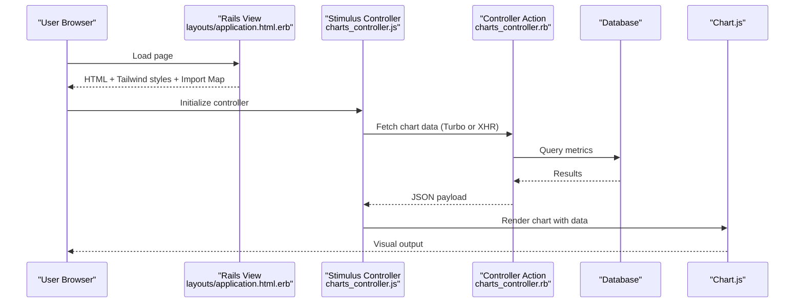
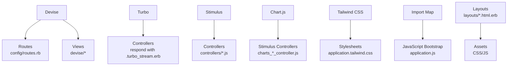

# Technology Stack & Dependencies

<cite>
**Referenced Files in This Document**
- [Gemfile](file://Gemfile)
- [Gemfile.lock](file://Gemfile.lock)
- [package.json](file://package.json)
- [pnpm-lock.yaml](file://pnpm-lock.yaml)
- [config/importmap.rb](file://config/importmap.rb)
- [config/tailwind.config.js](file://config/tailwind.config.js)
- [app/assets/stylesheets/application.tailwind.css](file://app/assets/stylesheets/application.tailwind.css)
- [app/javascript/application.js](file://app/javascript/application.js)
- [app/javascript/controllers/index.js](file://app/javascript/controllers/index.js)
- [app/javascript/controllers/hello_controller.js](file://app/javascript/controllers/hello_controller.js)
- [app/javascript/controllers/charts_controller.js](file://app/javascript/controllers/charts_controller.js)
- [app/javascript/controllers/invoices_chart_controller.js](file://app/javascript/controllers/invoices_chart_controller.js)
- [app/javascript/controllers/paid_vs_unpaid_chart_controller.js](file://app/javascript/controllers/paid_vs_unpaid_chart_controller.js)
- [app/views/layouts/application.html.erb](file://app/views/layouts/application.html.erb)
- [app/views/layouts/home.html.erb](file://app/views/layouts/home.html.erb)
- [app/views/layouts/session.html.erb](file://app/views/layouts/session.html.erb)
- [app/views/layouts/onboarding.html.erb](file://app/views/layouts/onboarding.html.erb)
- [app/views/devise/registrations/new.html.erb](file://app/views/devise/registrations/new.html.erb)
- [app/views/devise/sessions/new.html.erb](file://app/views/devise/sessions/new.html.erb)
- [app/views/clients/create.turbo_stream.erb](file://app/views/clients/create.turbo_stream.erb)
- [app/views/clients/show.turbo_stream.erb](file://app/views/clients/show.turbo_stream.erb)
- [app/views/clients/update.turbo_stream.erb](file://app/views/clients/update.turbo_stream.erb)
- [app/views/invoices/update.turbo_stream.erb](file://app/views/invoices/update.turbo_stream.erb)
- [app/views/countries/regions.turbo_stream.erb](file://app/views/countries/regions.turbo_stream.erb)
- [config/routes.rb](file://config/routes.rb)
- [config/initializers/devise.rb](file://config/initializers/devise.rb)
- [config/initializers/simple_form.rb](file://config/initializers/simple_form.rb)
- [config/initializers/carman.rb](file://config/initializers/carman.rb)
- [config/initializers/route_translator.rb](file://config/initializers/route_translator.rb)
- [config/initializers/pagy.rb](file://config/initializers/pagy.rb)
- [config/initializers/heroicon.rb](file://config/initializers/heroicon.rb)
- [config/environments/development.rb](file://config/environments/development.rb)
- [config/environments/production.rb](file://config/environments/production.rb)
- [config/environments/test.rb](file://config/environments/test.rb)
- [config/locales/devise.en.yml](file://config/locales/devise.en.yml)
- [config/locales/devise.es.yml](file://config/locales/devise.es.yml)
- [config/locales/simple_form.en.yml](file://config/locales/simple_form.en.yml)
- [bin/render-build.sh](file://bin/render-build.sh)
- [Procfile](file://Procfile)
- [Procfile.dev](file://Procfile.dev)
</cite>

## Table of Contents
1. [Introduction](#introduction)
2. [Project Structure](#project-structure)
3. [Core Components](#core-components)
4. [Architecture Overview](#architecture-overview)
5. [Detailed Component Analysis](#detailed-component-analysis)
6. [Dependency Analysis](#dependency-analysis)
7. [Performance Considerations](#performance-considerations)
8. [Troubleshooting Guide](#troubleshooting-guide)
9. [Conclusion](#conclusion)
10. [Appendices](#appendices)

## Introduction
This document describes the technology stack and dependencies used by the Invoicing Rails application. It focuses on major gems and libraries including Devise for authentication, Turbo for real-time updates, Stimulus.js for frontend interactivity, Chart.js for data visualization, and Tailwind CSS for styling. It also covers build tools, asset pipeline configuration, deployment dependencies, version compatibility considerations, integration points, and alternative technologies or migration paths where relevant.

## Project Structure
The project follows a standard Rails layout with additional JavaScript and CSS assets:
- Ruby dependencies are declared in Gemfile and locked in Gemfile.lock.
- Frontend packages are managed via pnpm (package.json and pnpm-lock.yaml).
- Import maps configure browser-side module loading for Stimulus and other JS modules.
- Tailwind is configured via config/tailwind.config.js and stylesheets/application.tailwind.css.
- Views include layouts and Devise templates, plus Turbo Stream responses for partial updates.

```mermaid
graph TB
subgraph "Ruby/Rails"
G["Gemfile"]
GL["Gemfile.lock"]
R["config/routes.rb"]
D["config/initializers/devise.rb"]
SF["config/initializers/simple_form.rb"]
CT["config/tailwind.config.js"]
STY["app/assets/stylesheets/application.tailwind.css"]
end
subgraph "Frontend Assets"
PJ["package.json"]
PL["pnpm-lock.yaml"]
IM["config/importmap.rb"]
JA["app/javascript/application.js"]
CI["app/javascript/controllers/index.js"]
HC["app/javascript/controllers/hello_controller.js"]
CC["app/javascript/controllers/charts_controller.js"]
IC["app/javascript/controllers/invoices_chart_controller.js"]
PC["app/javascript/controllers/paid_vs_unpaid_chart_controller.js"]
end
subgraph "Views"
LA["app/views/layouts/application.html.erb"]
LH["app/views/layouts/home.html.erb"]
LS["app/views/layouts/session.html.erb"]
LO["app/views/layouts/onboarding.html.erb"]
DR["app/views/devise/registrations/new.html.erb"]
DS["app/views/devise/sessions/new.html.erb"]
TSC["app/views/clients/create.turbo_stream.erb"]
TSS["app/views/clients/show.turbo_stream.erb"]
TSU["app/views/clients/update.turbo_stream.erb"]
TSI["app/views/invoices/update.turbo_stream.erb"]
TSCR["app/views/countries/regions.turbo_stream.erb"]
end
G --> GL
PJ --> PL
IM --> JA
JA --> CI
CI --> HC
CI --> CC
CI --> IC
CI --> PC
LA --> D
LA --> IM
LA --> CT
LA --> STY
DR --> D
DS --> D
TSC --> R
TSS --> R
TSU --> R
TSI --> R
TSCR --> R
```

**Diagram sources**
- [Gemfile](file://Gemfile)
- [Gemfile.lock](file://Gemfile.lock)
- [package.json](file://package.json)
- [pnpm-lock.yaml](file://pnpm-lock.yaml)
- [config/importmap.rb](file://config/importmap.rb)
- [app/javascript/application.js](file://app/javascript/application.js)
- [app/javascript/controllers/index.js](file://app/javascript/controllers/index.js)
- [app/javascript/controllers/hello_controller.js](file://app/javascript/controllers/hello_controller.js)
- [app/javascript/controllers/charts_controller.js](file://app/javascript/controllers/charts_controller.js)
- [app/javascript/controllers/invoices_chart_controller.js](file://app/javascript/controllers/invoices_chart_controller.js)
- [app/javascript/controllers/paid_vs_unpaid_chart_controller.js](file://app/javascript/controllers/paid_vs_unpaid_chart_controller.js)
- [config/tailwind.config.js](file://config/tailwind.config.js)
- [app/assets/stylesheets/application.tailwind.css](file://app/assets/stylesheets/application.tailwind.css)
- [app/views/layouts/application.html.erb](file://app/views/layouts/application.html.erb)
- [app/views/layouts/home.html.erb](file://app/views/layouts/home.html.erb)
- [app/views/layouts/session.html.erb](file://app/views/layouts/session.html.erb)
- [app/views/layouts/onboarding.html.erb](file://app/views/layouts/onboarding.html.erb)
- [app/views/devise/registrations/new.html.erb](file://app/views/devise/registrations/new.html.erb)
- [app/views/devise/sessions/new.html.erb](file://app/views/devise/sessions/new.html.erb)
- [app/views/clients/create.turbo_stream.erb](file://app/views/clients/create.turbo_stream.erb)
- [app/views/clients/show.turbo_stream.erb](file://app/views/clients/show.turbo_stream.erb)
- [app/views/clients/update.turbo_stream.erb](file://app/views/clients/update.turbo_stream.erb)
- [app/views/invoices/update.turbo_stream.erb](file://app/views/invoices/update.turbo_stream.erb)
- [app/views/countries/regions.turbo_stream.erb](file://app/views/countries/regions.turbo_stream.erb)
- [config/routes.rb](file://config/routes.rb)
- [config/initializers/devise.rb](file://config/initializers/devise.rb)

**Section sources**
- [Gemfile](file://Gemfile)
- [Gemfile.lock](file://Gemfile.lock)
- [package.json](file://package.json)
- [pnpm-lock.yaml](file://pnpm-lock.yaml)
- [config/importmap.rb](file://config/importmap.rb)
- [config/tailwind.config.js](file://config/tailwind.config.js)
- [app/assets/stylesheets/application.tailwind.css](file://app/assets/stylesheets/application.tailwind.css)
- [app/javascript/application.js](file://app/javascript/application.js)
- [app/javascript/controllers/index.js](file://app/javascript/controllers/index.js)
- [app/javascript/controllers/hello_controller.js](file://app/javascript/controllers/hello_controller.js)
- [app/javascript/controllers/charts_controller.js](file://app/javascript/controllers/charts_controller.js)
- [app/javascript/controllers/invoices_chart_controller.js](file://app/javascript/controllers/invoices_chart_controller.js)
- [app/javascript/controllers/paid_vs_unpaid_chart_controller.js](file://app/javascript/controllers/paid_vs_unpaid_chart_controller.js)
- [app/views/layouts/application.html.erb](file://app/views/layouts/application.html.erb)
- [app/views/layouts/home.html.erb](file://app/views/layouts/home.html.erb)
- [app/views/layouts/session.html.erb](file://app/views/layouts/session.html.erb)
- [app/views/layouts/onboarding.html.erb](file://app/views/layouts/onboarding.html.erb)
- [app/views/devise/registrations/new.html.erb](file://app/views/devise/registrations/new.html.erb)
- [app/views/devise/sessions/new.html.erb](file://app/views/devise/sessions/new.html.erb)
- [app/views/clients/create.turbo_stream.erb](file://app/views/clients/create.turbo_stream.erb)
- [app/views/clients/show.turbo_stream.erb](file://app/views/clients/show.turbo_stream.erb)
- [app/views/clients/update.turbo_stream.erb](file://app/views/clients/update.turbo_stream.erb)
- [app/views/invoices/update.turbo_stream.erb](file://app/views/invoices/update.turbo_stream.erb)
- [app/views/countries/regions.turbo_stream.erb](file://app/views/countries/regions.turbo_stream.erb)
- [config/routes.rb](file://config/routes.rb)
- [config/initializers/devise.rb](file://config/initializers/devise.rb)

## Core Components
- Authentication and authorization: Devise provides user sessions, registration, password reset, and confirmation flows. Integration includes routes, controllers, views, and initializers.
- Real-time updates: Turbo handles form submissions and navigation without full page reloads; Turbo Streams deliver targeted DOM updates via .turbo_stream.erb responses.
- Frontend interactivity: Stimulus.js controllers manage UI behaviors such as modals, menus, dynamic forms, and chart rendering. Controllers are auto-discovered via index.js.
- Data visualization: Chart.js is used to render charts within Stimulus controllers and view partials.
- Styling: Tailwind CSS is configured and compiled into the asset pipeline; utility-first classes style views.

Key integration points:
- Layouts import JavaScript modules and Tailwind styles.
- Devise views extend base layouts and use Simple Form helpers.
- Turbo Stream responses are rendered from controller actions responding to Turbo requests.
- Stimulus controllers are registered and imported through the application bootstrap.

**Section sources**
- [config/initializers/devise.rb](file://config/initializers/devise.rb)
- [config/routes.rb](file://config/routes.rb)
- [app/views/layouts/application.html.erb](file://app/views/layouts/application.html.erb)
- [app/javascript/application.js](file://app/javascript/application.js)
- [app/javascript/controllers/index.js](file://app/javascript/controllers/index.js)
- [app/javascript/controllers/hello_controller.js](file://app/javascript/controllers/hello_controller.js)
- [app/javascript/controllers/charts_controller.js](file://app/javascript/controllers/charts_controller.js)
- [app/javascript/controllers/invoices_chart_controller.js](file://app/javascript/controllers/invoices_chart_controller.js)
- [app/javascript/controllers/paid_vs_unpaid_chart_controller.js](file://app/javascript/controllers/paid_vs_unpaid_chart_controller.js)
- [app/views/clients/create.turbo_stream.erb](file://app/views/clients/create.turbo_stream.erb)
- [app/views/clients/show.turbo_stream.erb](file://app/views/clients/show.turbo_stream.erb)
- [app/views/clients/update.turbo_stream.erb](file://app/views/clients/update.turbo_stream.erb)
- [app/views/invoices/update.turbo_stream.erb](file://app/views/invoices/update.turbo_stream.erb)
- [app/views/countries/regions.turbo_stream.erb](file://app/views/countries/regions.turbo_stream.erb)
- [config/tailwind.config.js](file://config/tailwind.config.js)
- [app/assets/stylesheets/application.tailwind.css](file://app/assets/stylesheets/application.tailwind.css)

## Architecture Overview
The application uses a modern Rails stack with an import map-based JavaScript setup, Stimulus controllers for interactivity, Turbo for seamless updates, and Tailwind for styling. Charts are rendered client-side using Chart.js.

**Diagram sources**
- [app/views/layouts/application.html.erb](file://app/views/layouts/application.html.erb)
- [app/javascript/controllers/charts_controller.js](file://app/javascript/controllers/charts_controller.js)
- [app/javascript/controllers/invoices_chart_controller.js](file://app/javascript/controllers/invoices_chart_controller.js)
- [app/javascript/controllers/paid_vs_unpaid_chart_controller.js](file://app/javascript/controllers/paid_vs_unpaid_chart_controller.js)
- [config/importmap.rb](file://config/importmap.rb)
- [config/tailwind.config.js](file://config/tailwind.config.js)
- [app/assets/stylesheets/application.tailwind.css](file://app/assets/stylesheets/application.tailwind.css)

## Detailed Component Analysis

### Devise (Authentication)
Role:
- Provides authentication features: sign-in/sign-out, registration, password recovery, email confirmation, and account management.
- Integrates with Rails routing, controllers, and views.

Integration points:
- Initializer sets up strategies and defaults.
- Routes mount Devise endpoints.
- Views extend application layouts and use form helpers.
- Locales provide translations for messages.

Version compatibility:
- Ensure Devise version aligns with the Rails version and Active Record adapter.
- Check Gemfile.lock for exact versions and confirm compatibility with Ruby and Rails versions.

Migration path:
- If migrating away from Devise, consider building custom auth or adopting alternatives like Sorcery or OmniAuth-based solutions.

**Section sources**
- [config/initializers/devise.rb](file://config/initializers/devise.rb)
- [config/routes.rb](file://config/routes.rb)
- [app/views/devise/registrations/new.html.erb](file://app/views/devise/registrations/new.html.erb)
- [app/views/devise/sessions/new.html.erb](file://app/views/devise/sessions/new.html.erb)
- [config/locales/devise.en.yml](file://config/locales/devise.en.yml)
- [config/locales/devise.es.yml](file://config/locales/devise.es.yml)

### Turbo (Real-time Updates)
Role:
- Enhances navigation and form submissions without full page reloads.
- Turbo Streams deliver targeted DOM updates via .turbo_stream.erb responses.

Integration points:
- Controllers respond to Turbo requests with Turbo Stream templates.
- Views include Turbo links and forms.

Version compatibility:
- Confirm Turbo gem version matches Rails and Hotwire expectations.
- Validate that Turbo Stream responses are served with correct content types.

Migration path:
- For more complex real-time needs, consider Action Cable channels or WebSockets alongside Turbo.

**Section sources**
- [app/views/clients/create.turbo_stream.erb](file://app/views/clients/create.turbo_stream.erb)
- [app/views/clients/show.turbo_stream.erb](file://app/views/clients/show.turbo_stream.erb)
- [app/views/clients/update.turbo_stream.erb](file://app/views/clients/update.turbo_stream.erb)
- [app/views/invoices/update.turbo_stream.erb](file://app/views/invoices/update.turbo_stream.erb)
- [app/views/countries/regions.turbo_stream.erb](file://app/views/countries/regions.turbo_stream.erb)
- [config/routes.rb](file://config/routes.rb)

### Stimulus.js (Frontend Interactivity)
Role:
- Lightweight framework for adding behavior to HTML via controllers.
- Auto-discovery of controllers simplifies organization.

Integration points:
- Application bootstrap imports controllers index.
- Individual controllers handle specific UI tasks (e.g., hello, charts).

Version compatibility:
- Ensure Stimulus version works with the import map setup and browser targets.

Migration path:
- For heavier frameworks, consider React/Vue/Svelte via Sprockets or ESBuild/Vite, but this increases complexity.

**Section sources**
- [app/javascript/application.js](file://app/javascript/application.js)
- [app/javascript/controllers/index.js](file://app/javascript/controllers/index.js)
- [app/javascript/controllers/hello_controller.js](file://app/javascript/controllers/hello_controller.js)
- [app/javascript/controllers/charts_controller.js](file://app/javascript/controllers/charts_controller.js)
- [app/javascript/controllers/invoices_chart_controller.js](file://app/javascript/controllers/invoices_chart_controller.js)
- [app/javascript/controllers/paid_vs_unpaid_chart_controller.js](file://app/javascript/controllers/paid_vs_unpaid_chart_controller.js)
- [config/importmap.rb](file://config/importmap.rb)

### Chart.js (Data Visualization)
Role:
- Renders interactive charts based on data fetched from Rails controllers.
- Used within Stimulus controllers to update visuals dynamically.

Integration points:
- Controllers fetch data and pass it to Chart.js instances.
- Partial views may contain canvas elements and data attributes.

Version compatibility:
- Verify Chart.js version compatibility with browser environments and any polyfills.

Migration path:
- Alternatives include D3.js for low-level control or lightweight charting libraries if bundle size is a concern.

**Section sources**
- [app/javascript/controllers/charts_controller.js](file://app/javascript/controllers/charts_controller.js)
- [app/javascript/controllers/invoices_chart_controller.js](file://app/javascript/controllers/invoices_chart_controller.js)
- [app/javascript/controllers/paid_vs_unpaid_chart_controller.js](file://app/javascript/controllers/paid_vs_unpaid_chart_controller.js)

### Tailwind CSS (Styling)
Role:
- Utility-first CSS framework for rapid UI development.
- Configured via tailwind.config.js and included in the stylesheet pipeline.

Integration points:
- Stylesheet entry file imports Tailwind directives.
- Layouts include compiled CSS assets.

Version compatibility:
- Ensure Tailwind version aligns with PostCSS and asset pipeline tooling.

Migration path:
- For component-driven styling, consider CSS Modules or moving to a build system like Vite with Tailwind.

**Section sources**
- [config/tailwind.config.js](file://config/tailwind.config.js)
- [app/assets/stylesheets/application.tailwind.css](file://app/assets/stylesheets/application.tailwind.css)
- [app/views/layouts/application.html.erb](file://app/views/layouts/application.html.erb)

### Additional Gems and Integrations
- Simple Form: Improves form generation and validation UX across Devise and app forms.
- Carmen: Country/region selection utilities.
- Route Translator: Localized routes.
- Pagy: Pagination helper.
- Heroicons: Icon set integration.

**Section sources**
- [config/initializers/simple_form.rb](file://config/initializers/simple_form.rb)
- [config/initializers/carman.rb](file://config/initializers/carman.rb)
- [config/initializers/route_translator.rb](file://config/initializers/route_translator.rb)
- [config/initializers/pagy.rb](file://config/initializers/pagy.rb)
- [config/initializers/heroicon.rb](file://config/initializers/heroicon.rb)

## Dependency Analysis
This section outlines how core dependencies interact and their roles in the stack.

**Diagram sources**
- [config/routes.rb](file://config/routes.rb)
- [app/views/devise/registrations/new.html.erb](file://app/views/devise/registrations/new.html.erb)
- [app/views/devise/sessions/new.html.erb](file://app/views/devise/sessions/new.html.erb)
- [app/views/clients/create.turbo_stream.erb](file://app/views/clients/create.turbo_stream.erb)
- [app/views/clients/show.turbo_stream.erb](file://app/views/clients/show.turbo_stream.erb)
- [app/views/clients/update.turbo_stream.erb](file://app/views/clients/update.turbo_stream.erb)
- [app/views/invoices/update.turbo_stream.erb](file://app/views/invoices/update.turbo_stream.erb)
- [app/views/countries/regions.turbo_stream.erb](file://app/views/countries/regions.turbo_stream.erb)
- [app/javascript/controllers/index.js](file://app/javascript/controllers/index.js)
- [app/javascript/controllers/charts_controller.js](file://app/javascript/controllers/charts_controller.js)
- [app/javascript/controllers/invoices_chart_controller.js](file://app/javascript/controllers/invoices_chart_controller.js)
- [app/javascript/controllers/paid_vs_unpaid_chart_controller.js](file://app/javascript/controllers/paid_vs_unpaid_chart_controller.js)
- [app/assets/stylesheets/application.tailwind.css](file://app/assets/stylesheets/application.tailwind.css)
- [config/importmap.rb](file://config/importmap.rb)
- [app/javascript/application.js](file://app/javascript/application.js)
- [app/views/layouts/application.html.erb](file://app/views/layouts/application.html.erb)

**Section sources**
- [Gemfile](file://Gemfile)
- [Gemfile.lock](file://Gemfile.lock)
- [package.json](file://package.json)
- [pnpm-lock.yaml](file://pnpm-lock.yaml)
- [config/importmap.rb](file://config/importmap.rb)
- [config/tailwind.config.js](file://config/tailwind.config.js)
- [app/assets/stylesheets/application.tailwind.css](file://app/assets/stylesheets/application.tailwind.css)
- [app/javascript/application.js](file://app/javascript/application.js)
- [app/javascript/controllers/index.js](file://app/javascript/controllers/index.js)
- [app/javascript/controllers/charts_controller.js](file://app/javascript/controllers/charts_controller.js)
- [app/javascript/controllers/invoices_chart_controller.js](file://app/javascript/controllers/invoices_chart_controller.js)
- [app/javascript/controllers/paid_vs_unpaid_chart_controller.js](file://app/javascript/controllers/paid_vs_unpaid_chart_controller.js)
- [app/views/layouts/application.html.erb](file://app/views/layouts/application.html.erb)
- [config/routes.rb](file://config/routes.rb)
- [config/initializers/devise.rb](file://config/initializers/devise.rb)

## Performance Considerations
- Asset bundling: Keep Tailwind purging unused styles and ensure only necessary controllers are imported.
- Chart rendering: Debounce or throttle data refreshes; reuse chart instances when possible.
- Turbo usage: Prefer Turbo Streams for partial updates to minimize payload sizes.
- Gem versions: Pin compatible versions in Gemfile.lock to avoid runtime overhead or regressions.
- Build caching: Use efficient build scripts and cache layers during deployment.

[No sources needed since this section provides general guidance]

## Troubleshooting Guide
Common issues and checks:
- Devise not redirecting or missing routes: Verify routes and initializer settings.
- Turbo Stream not updating DOM: Ensure response type and template names match Turbo expectations.
- Stimulus controllers not found: Confirm index.js registers controllers and import map resolves modules.
- Chart.js errors: Validate data shape and canvas availability before rendering.
- Tailwind styles missing: Check compilation steps and asset pipeline inclusion in layouts.

**Section sources**
- [config/initializers/devise.rb](file://config/initializers/devise.rb)
- [config/routes.rb](file://config/routes.rb)
- [app/javascript/controllers/index.js](file://app/javascript/controllers/index.js)
- [app/javascript/application.js](file://app/javascript/application.js)
- [app/javascript/controllers/charts_controller.js](file://app/javascript/controllers/charts_controller.js)
- [config/tailwind.config.js](file://config/tailwind.config.js)
- [app/assets/stylesheets/application.tailwind.css](file://app/assets/stylesheets/application.tailwind.css)

## Conclusion
The Invoicing Rails application leverages a cohesive stack: Devise for authentication, Turbo for seamless updates, Stimulus for lightweight interactivity, Chart.js for visualizations, and Tailwind for styling. The import map approach simplifies JavaScript delivery, while Turbo Streams enable efficient partial updates. Proper version alignment and careful integration across layouts, controllers, and views ensure a responsive and maintainable user experience.

[No sources needed since this section summarizes without analyzing specific files]

## Appendices

### Build Tools and Asset Pipeline Configuration
- Import maps define module resolution for Stimulus and other JS modules.
- Tailwind configuration controls theme extensions and purge rules.
- Layouts include compiled assets and initialize Stimulus.

**Section sources**
- [config/importmap.rb](file://config/importmap.rb)
- [config/tailwind.config.js](file://config/tailwind.config.js)
- [app/javascript/application.js](file://app/javascript/application.js)
- [app/views/layouts/application.html.erb](file://app/views/layouts/application.html.erb)

### Deployment Dependencies
- Procfile defines process types for production.
- Render build script prepares assets and dependencies.

**Section sources**
- [Procfile](file://Procfile)
- [bin/render-build.sh](file://bin/render-build.sh)

### Alternative Technologies and Migration Paths
- Authentication: Consider Sorcery or custom implementations if Devise becomes too heavy.
- Real-time: Action Cable or WebSockets for advanced scenarios beyond Turbo Streams.
- Frontend: Move to a full SPA framework (React/Vue/Svelte) with a dedicated build toolchain if interactivity grows significantly.
- Styling: Transition to CSS-in-JS or component libraries if design systems evolve.

[No sources needed since this section provides general guidance]