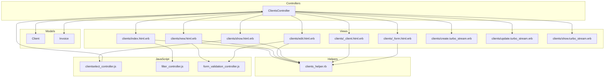
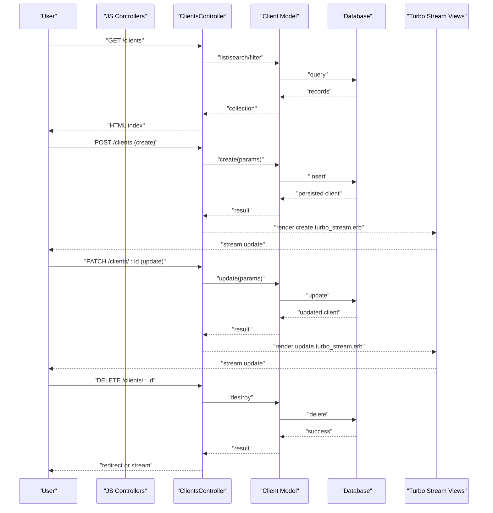
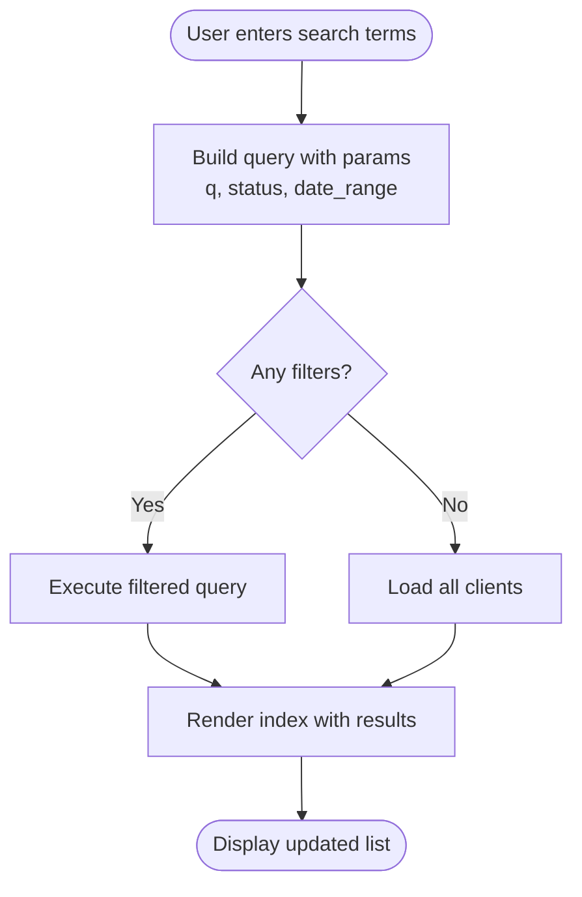
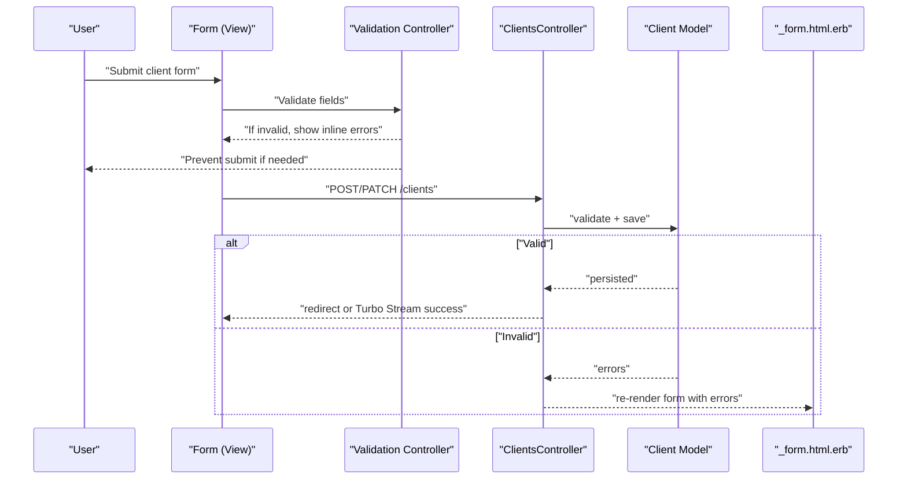
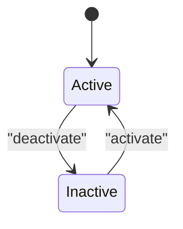
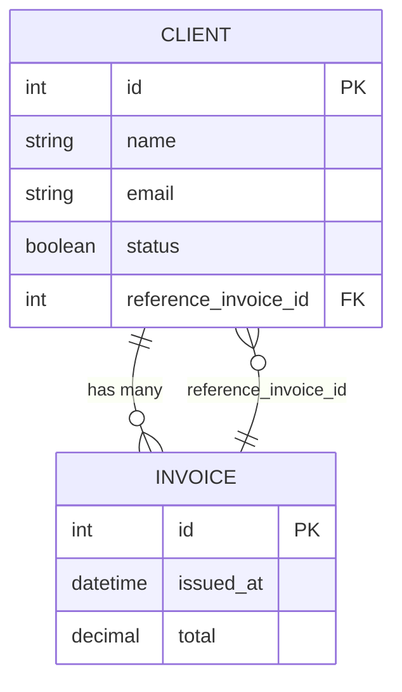
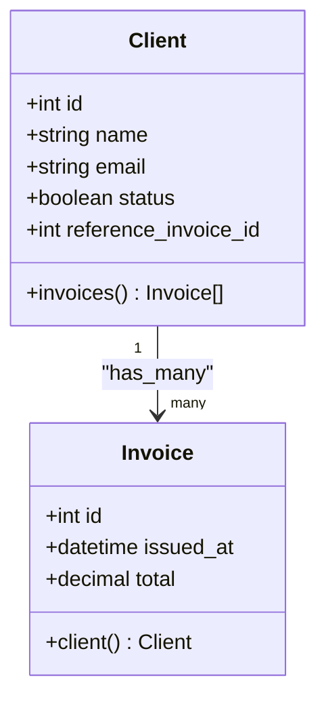
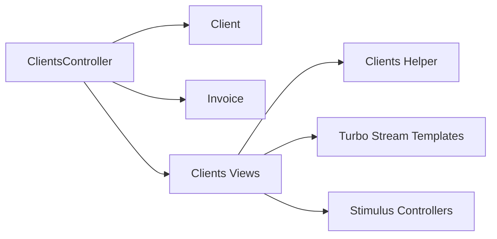

# Client Management

<cite>
**Referenced Files in This Document**
- [client.rb](file://app/models/client.rb)
- [clients_controller.rb](file://app/controllers/clients_controller.rb)
- [clients_helper.rb](file://app/helpers/clients_helper.rb)
- [index.html.erb](file://app/views/clients/index.html.erb)
- [_form.html.erb](file://app/views/clients/_form.html.erb)
- [new.html.erb](file://app/views/clients/new.html.erb)
- [edit.html.erb](file://app/views/clients/edit.html.erb)
- [show.html.erb](file://app/views/clients/show.html.erb)
- [_client.html.erb](file://app/views/clients/_client.html.erb)
- [create.turbo_stream.erb](file://app/views/clients/create.turbo_stream.erb)
- [update.turbo_stream.erb](file://app/views/clients/update.turbo_stream.erb)
- [show.turbo_stream.erb](file://app/views/clients/show.turbo_stream.erb)
- [clientselect_controller.js](file://app/javascript/controllers/clientselect_controller.js)
- [filter_controller.js](file://app/javascript/controllers/filter_controller.js)
- [form_validation_controller.js](file://app/javascript/controllers/form_validation_controller.js)
- [routes.rb](file://config/routes.rb)
- [20220924214542_create_clients.rb](file://db/migrate/20220924214542_create_clients.rb)
- [20220930125142_add_reference_invoice_to_client.rb](file://db/migrate/20220930125142_add_reference_invoice_to_client.rb)
- [20221002090253_set_boolean_status_to_client_and_invoice.rb](file://db/migrate/20221002090253_set_boolean_status_to_client_and_invoice.rb)
</cite>

## Table of Contents
1. [Introduction](#introduction)
2. [Project Structure](#project-structure)
3. [Core Components](#core-components)
4. [Architecture Overview](#architecture-overview)
5. [Detailed Component Analysis](#detailed-component-analysis)
6. [Dependency Analysis](#dependency-analysis)
7. [Performance Considerations](#performance-considerations)
8. [Troubleshooting Guide](#troubleshooting-guide)
9. [Conclusion](#conclusion)

## Introduction
This document explains the client management system implemented in the Rails application. It covers the Client model, controller actions, views, helpers, Turbo Stream integration, search and filtering, validation, error handling, status management, history tracking, and integration with invoices. The goal is to provide a clear understanding of how clients are created, edited, deleted, searched, and related to other entities such as invoices.

## Project Structure
The client feature follows Rails conventions:
- Model: app/models/client.rb
- Controller: app/controllers/clients_controller.rb
- Views: app/views/clients/* (index, new, edit, show, partials, turbo streams)
- Helper: app/helpers/clients_helper.rb
- JavaScript controllers: app/javascript/controllers/clientselect_controller.js, filter_controller.js, form_validation_controller.js
- Routes: config/routes.rb
- Migrations: db/migrate/*_create_clients.rb and related columns

**Diagram sources**
- [clients_controller.rb](file://app/controllers/clients_controller.rb)
- [client.rb](file://app/models/client.rb)
- [index.html.erb](file://app/views/clients/index.html.erb)
- [_form.html.erb](file://app/views/clients/_form.html.erb)
- [new.html.erb](file://app/views/clients/new.html.erb)
- [edit.html.erb](file://app/views/clients/edit.html.erb)
- [show.html.erb](file://app/views/clients/show.html.erb)
- [_client.html.erb](file://app/views/clients/_client.html.erb)
- [create.turbo_stream.erb](file://app/views/clients/create.turbo_stream.erb)
- [update.turbo_stream.erb](file://app/views/clients/update.turbo_stream.erb)
- [show.turbo_stream.erb](file://app/views/clients/show.turbo_stream.erb)
- [clients_helper.rb](file://app/helpers/clients_helper.rb)
- [clientselect_controller.js](file://app/javascript/controllers/clientselect_controller.js)
- [filter_controller.js](file://app/javascript/controllers/filter_controller.js)
- [form_validation_controller.js](file://app/javascript/controllers/form_validation_controller.js)

**Section sources**
- [clients_controller.rb](file://app/controllers/clients_controller.rb)
- [client.rb](file://app/models/client.rb)
- [index.html.erb](file://app/views/clients/index.html.erb)
- [_form.html.erb](file://app/views/clients/_form.html.erb)
- [new.html.erb](file://app/views/clients/new.html.erb)
- [edit.html.erb](file://app/views/clients/edit.html.erb)
- [show.html.erb](file://app/views/clients/show.html.erb)
- [_client.html.erb](file://app/views/clients/_client.html.erb)
- [create.turbo_stream.erb](file://app/views/clients/create.turbo_stream.erb)
- [update.turbo_stream.erb](file://app/views/clients/update.turbo_stream.erb)
- [show.turbo_stream.erb](file://app/views/clients/show.turbo_stream.erb)
- [clients_helper.rb](file://app/helpers/clients_helper.rb)
- [clientselect_controller.js](file://app/javascript/controllers/clientselect_controller.js)
- [filter_controller.js](file://app/javascript/controllers/filter_controller.js)
- [form_validation_controller.js](file://app/javascript/controllers/form_validation_controller.js)

## Core Components
- Client model encapsulates attributes, validations, associations, and business logic for clients.
- ClientsController implements RESTful actions for listing, creating, editing, updating, and deleting clients.
- Views render forms, lists, and detail pages; Turbo Stream templates enable real-time updates without full page reloads.
- Helpers provide reusable view logic for formatting and display.
- JavaScript controllers enhance UX with client selection, filtering, and form validation.

Key responsibilities:
- Data persistence and integrity via model validations and callbacks.
- HTTP request handling and response rendering via controller actions.
- Presentation and user interactions via views and helpers.
- Real-time UI updates via Turbo Stream responses.
- Search and filtering via query parameters and JavaScript enhancements.

**Section sources**
- [client.rb](file://app/models/client.rb)
- [clients_controller.rb](file://app/controllers/clients_controller.rb)
- [clients_helper.rb](file://app/helpers/clients_helper.rb)
- [index.html.erb](file://app/views/clients/index.html.erb)
- [_form.html.erb](file://app/views/clients/_form.html.erb)
- [new.html.erb](file://app/views/clients/new.html.erb)
- [edit.html.erb](file://app/views/clients/edit.html.erb)
- [show.html.erb](file://app/views/clients/show.html.erb)
- [_client.html.erb](file://app/views/clients/_client.html.erb)
- [create.turbo_stream.erb](file://app/views/clients/create.turbo_stream.erb)
- [update.turbo_stream.erb](file://app/views/clients/update.turbo_stream.erb)
- [show.turbo_stream.erb](file://app/views/clients/show.turbo_stream.erb)

## Architecture Overview
The client management flow uses standard Rails MVC plus Turbo Streams for real-time updates.

**Diagram sources**
- [clients_controller.rb](file://app/controllers/clients_controller.rb)
- [client.rb](file://app/models/client.rb)
- [create.turbo_stream.erb](file://app/views/clients/create.turbo_stream.erb)
- [update.turbo_stream.erb](file://app/views/clients/update.turbo_stream.erb)
- [show.turbo_stream.erb](file://app/views/clients/show.turbo_stream.erb)

## Detailed Component Analysis

### Client Model
Responsibilities:
- Define attributes and types.
- Enforce presence, uniqueness, and format validations.
- Provide associations to related entities (e.g., invoices).
- Implement scopes or class methods for search and filtering.
- Manage status and optional history tracking fields.

Common patterns:
- Validations for required fields.
- Associations like has_many :invoices.
- Scopes for active/inactive states.
- Optional reference field linking to an invoice.

Complexity considerations:
- Filtering by multiple criteria should use efficient database queries.
- Avoid N+1 queries when rendering client lists or details.

**Section sources**
- [client.rb](file://app/models/client.rb)
- [20220924214542_create_clients.rb](file://db/migrate/20220924214542_create_clients.rb)
- [20220930125142_add_reference_invoice_to_client.rb](file://db/migrate/20220930125142_add_reference_invoice_to_client.rb)
- [20221002090253_set_boolean_status_to_client_and_invoice.rb](file://db/migrate/20221002090253_set_boolean_status_to_client_and_invoice.rb)

### ClientsController
Actions:
- index: list clients with optional search and filters.
- new: build a new client instance for the form.
- create: persist a new client; respond with HTML or Turbo Stream.
- edit: load an existing client for editing.
- update: apply changes; respond with HTML or Turbo Stream.
- destroy: remove a client; redirect or stream updates.

Behavior highlights:
- Strong parameters restrict permitted attributes.
- Flash messages for success/failure feedback.
- Turbo Stream responses for seamless updates.
- Error handling re-renders forms with validation errors.

**Section sources**
- [clients_controller.rb](file://app/controllers/clients_controller.rb)
- [create.turbo_stream.erb](file://app/views/clients/create.turbo_stream.erb)
- [update.turbo_stream.erb](file://app/views/clients/update.turbo_stream.erb)
- [show.turbo_stream.erb](file://app/views/clients/show.turbo_stream.erb)

### Views and Partials
- index.html.erb: renders the client list, search bar, and filters.
- _form.html.erb: shared form used by new and edit actions.
- new.html.erb and edit.html.erb: wrap the form with appropriate titles and buttons.
- show.html.erb: displays client details and related data.
- _client.html.erb: partial for rendering a single client row or card.
- Turbo Stream templates:
  - create.turbo_stream.erb: inserts or replaces the client list item after creation.
  - update.turbo_stream.erb: updates the client entry inline after saving.
  - show.turbo_stream.erb: refreshes client detail view without reloading.

Best practices:
- Use partials to avoid duplication.
- Keep Turbo Stream templates minimal and focused on DOM patches.
- Ensure IDs are stable for Turbo to target elements correctly.

**Section sources**
- [index.html.erb](file://app/views/clients/index.html.erb)
- [_form.html.erb](file://app/views/clients/_form.html.erb)
- [new.html.erb](file://app/views/clients/new.html.erb)
- [edit.html.erb](file://app/views/clients/edit.html.erb)
- [show.html.erb](file://app/views/clients/show.html.erb)
- [_client.html.erb](file://app/views/clients/_client.html.erb)
- [create.turbo_stream.erb](file://app/views/clients/create.turbo_stream.erb)
- [update.turbo_stream.erb](file://app/views/clients/update.turbo_stream.erb)
- [show.turbo_stream.erb](file://app/views/clients/show.turbo_stream.erb)

### Helpers
- clients_helper.rb provides helper methods for formatting client data, generating labels, and building common UI fragments.
- Helpers keep views clean and promote reuse across index, show, and form contexts.

Usage examples:
- Formatting names, addresses, or statuses consistently.
- Building dropdown options or badges for client state.

**Section sources**
- [clients_helper.rb](file://app/helpers/clients_helper.rb)

### JavaScript Enhancements
- clientselect_controller.js: manages client selection behavior in forms or modals.
- filter_controller.js: handles client list filtering via input events and URL params.
- form_validation_controller.js: performs client-side validation and shows inline errors.

Integration points:
- Stimulus controllers wired to data-controller attributes in views.
- Filter controller listens to inputs and triggers requests or DOM updates.
- Validation controller intercepts form submissions to prevent invalid saves.

**Section sources**
- [clientselect_controller.js](file://app/javascript/controllers/clientselect_controller.js)
- [filter_controller.js](file://app/javascript/controllers/filter_controller.js)
- [form_validation_controller.js](file://app/javascript/controllers/form_validation_controller.js)

### Search and Filtering
Typical implementation:
- Query parameters such as q (search term), status, and date range.
- Controller builds a dynamic ActiveRecord query using these params.
- Index view includes a search form that submits via GET to preserve shareable URLs.
- Turbo may be used to update results without full reloads.

Flowchart:

**Diagram sources**
- [clients_controller.rb](file://app/controllers/clients_controller.rb)
- [index.html.erb](file://app/views/clients/index.html.erb)
- [filter_controller.js](file://app/javascript/controllers/filter_controller.js)

**Section sources**
- [clients_controller.rb](file://app/controllers/clients_controller.rb)
- [index.html.erb](file://app/views/clients/index.html.erb)
- [filter_controller.js](file://app/javascript/controllers/filter_controller.js)

### Form Validation and Error Handling
- Server-side validations defined in the model ensure data integrity.
- On validation failure, the controller re-renders the form with error messages.
- Client-side validation improves UX by catching errors before submission.
- Turbo Stream can replace form content to reflect server errors without full reloads.

Sequence diagram:

**Diagram sources**
- [clients_controller.rb](file://app/controllers/clients_controller.rb)
- [client.rb](file://app/models/client.rb)
- [_form.html.erb](file://app/views/clients/_form.html.erb)
- [form_validation_controller.js](file://app/javascript/controllers/form_validation_controller.js)

**Section sources**
- [clients_controller.rb](file://app/controllers/clients_controller.rb)
- [client.rb](file://app/models/client.rb)
- [_form.html.erb](file://app/views/clients/_form.html.erb)
- [form_validation_controller.js](file://app/javascript/controllers/form_validation_controller.js)

### Status Management
- A boolean status column controls whether a client is active or inactive.
- The model may expose a scope or method to check active status.
- The UI can display status badges and allow toggling via update action.

State transitions:

**Diagram sources**
- [client.rb](file://app/models/client.rb)
- [20221002090253_set_boolean_status_to_client_and_invoice.rb](file://db/migrate/20221002090253_set_boolean_status_to_client_and_invoice.rb)

**Section sources**
- [client.rb](file://app/models/client.rb)
- [20221002090253_set_boolean_status_to_client_and_invoice.rb](file://db/migrate/20221002090253_set_boolean_status_to_client_and_invoice.rb)

### History Tracking
- If a reference field links a client to an invoice, it can serve as a simple audit trail indicating which invoice last referenced the client.
- Additional history could be implemented with a separate history table or audit logs depending on requirements.

Relationship overview:

**Diagram sources**
- [client.rb](file://app/models/client.rb)
- [20220930125142_add_reference_invoice_to_client.rb](file://db/migrate/20220930125142_add_reference_invoice_to_client.rb)

**Section sources**
- [client.rb](file://app/models/client.rb)
- [20220930125142_add_reference_invoice_to_client.rb](file://db/migrate/20220930125142_add_reference_invoice_to_client.rb)

### Integration with Invoices
- Clients typically have a has_many association with invoices.
- The show view can list a client’s invoices and link to their details.
- Creating or editing an invoice may include selecting a client via the client select controller.

**Diagram sources**
- [client.rb](file://app/models/client.rb)
- [invoice.rb](file://app/models/invoice.rb)

**Section sources**
- [client.rb](file://app/models/client.rb)
- [invoice.rb](file://app/models/invoice.rb)

### Examples

- Create a client:
  - Navigate to new client form, fill required fields, and submit.
  - On success, Turbo Stream inserts the new client into the list.
  - On failure, the form re-renders with validation errors.

- Edit a client:
  - Open the edit page, modify fields, and save.
  - Turbo Stream updates the client entry inline.

- Delete a client:
  - Trigger delete action; the client is removed from the list.
  - Redirect or stream confirms deletion.

- Advanced search:
  - Enter search terms and filters in the index page.
  - Submit to get filtered results; URL reflects current filters.

[No sources needed since this section provides usage examples without analyzing specific files]

## Dependency Analysis
High-level dependencies:
- ClientsController depends on Client model and associated Invoice model.
- Views depend on helpers and partials for consistent rendering.
- Turbo Stream templates depend on controller actions to return targeted DOM updates.
- JavaScript controllers depend on DOM attributes and network requests.

**Diagram sources**
- [clients_controller.rb](file://app/controllers/clients_controller.rb)
- [client.rb](file://app/models/client.rb)
- [invoice.rb](file://app/models/invoice.rb)
- [clients_helper.rb](file://app/helpers/clients_helper.rb)
- [create.turbo_stream.erb](file://app/views/clients/create.turbo_stream.erb)
- [update.turbo_stream.erb](file://app/views/clients/update.turbo_stream.erb)
- [show.turbo_stream.erb](file://app/views/clients/show.turbo_stream.erb)
- [clientselect_controller.js](file://app/javascript/controllers/clientselect_controller.js)
- [filter_controller.js](file://app/javascript/controllers/filter_controller.js)
- [form_validation_controller.js](file://app/javascript/controllers/form_validation_controller.js)

**Section sources**
- [clients_controller.rb](file://app/controllers/clients_controller.rb)
- [client.rb](file://app/models/client.rb)
- [invoice.rb](file://app/models/invoice.rb)
- [clients_helper.rb](file://app/helpers/clients_helper.rb)
- [create.turbo_stream.erb](file://app/views/clients/create.turbo_stream.erb)
- [update.turbo_stream.erb](file://app/views/clients/update.turbo_stream.erb)
- [show.turbo_stream.erb](file://app/views/clients/show.turbo_stream.erb)
- [clientselect_controller.js](file://app/javascript/controllers/clientselect_controller.js)
- [filter_controller.js](file://app/javascript/controllers/filter_controller.js)
- [form_validation_controller.js](file://app/javascript/controllers/form_validation_controller.js)

## Performance Considerations
- Use efficient queries with where clauses and joins to avoid N+1 problems when rendering client lists and details.
- Paginate large client lists to reduce payload size.
- Cache frequently accessed client data if appropriate.
- Keep Turbo Stream payloads small by targeting only necessary DOM nodes.
- Debounce search inputs to limit excessive requests during typing.

[No sources needed since this section provides general guidance]

## Troubleshooting Guide
Common issues and resolutions:
- Validation errors not showing:
  - Ensure the form partial re-renders on failure and that error messages are displayed near fields.
- Turbo Stream not updating:
  - Verify that the correct element IDs are targeted in Turbo Stream templates.
  - Confirm that the controller responds with the expected Turbo Stream template.
- Search filters not applied:
  - Check that query parameters are passed and handled in the controller.
  - Validate that the filter controller updates the URL and triggers requests.
- Status toggle not reflecting:
  - Confirm the update action persists the status change and re-renders the UI.

**Section sources**
- [clients_controller.rb](file://app/controllers/clients_controller.rb)
- [create.turbo_stream.erb](file://app/views/clients/create.turbo_stream.erb)
- [update.turbo_stream.erb](file://app/views/clients/update.turbo_stream.erb)
- [show.turbo_stream.erb](file://app/views/clients/show.turbo_stream.erb)
- [index.html.erb](file://app/views/clients/index.html.erb)
- [filter_controller.js](file://app/javascript/controllers/filter_controller.js)

## Conclusion
The client management system leverages Rails MVC patterns, Turbo Stream for real-time updates, and Stimulus controllers for enhanced interactivity. The Client model enforces data integrity and supports relationships with invoices. The controller actions handle CRUD operations and respond with HTML or Turbo Stream templates. Views and helpers provide consistent presentation, while JavaScript controllers improve usability through filtering and validation. Together, these components deliver a robust, responsive client management experience.

[No sources needed since this section summarizes without analyzing specific files]