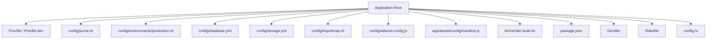
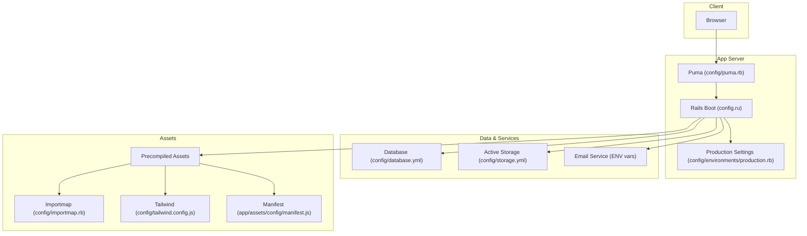
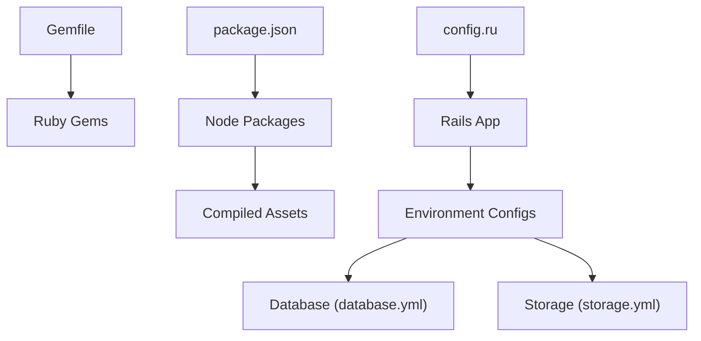
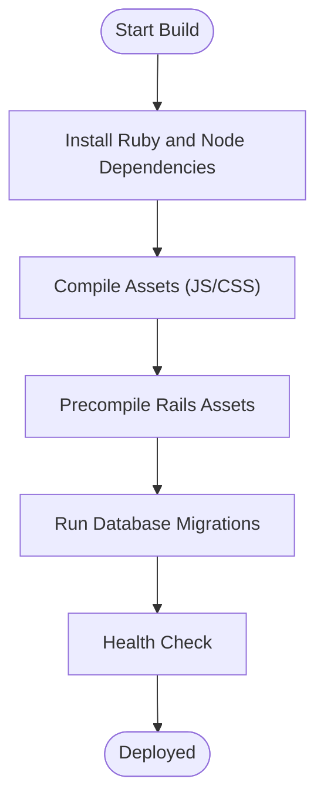

# Deployment & DevOps

<cite>
**Referenced Files in This Document**
- [Procfile](file://Procfile)
- [Procfile.dev](file://Procfile.dev)
- [bin/render-build.sh](file://bin/render-build.sh)
- [config/puma.rb](file://config/puma.rb)
- [config/environments/production.rb](file://config/environments/production.rb)
- [config/database.yml](file://config/database.yml)
- [config/storage.yml](file://config/storage.yml)
- [config/importmap.rb](file://config/importmap.rb)
- [config/tailwind.config.js](file://config/tailwind.config.js)
- [app/assets/config/manifest.js](file://app/assets/config/manifest.js)
- [package.json](file://package.json)
- [Gemfile](file://Gemfile)
- [Rakefile](file://Rakefile)
- [config.ru](file://config.ru)
</cite>

## Table of Contents
1. [Introduction](#introduction)
2. [Project Structure](#project-structure)
3. [Core Components](#core-components)
4. [Architecture Overview](#architecture-overview)
5. [Detailed Component Analysis](#detailed-component-analysis)
6. [Dependency Analysis](#dependency-analysis)
7. [Performance Considerations](#performance-considerations)
8. [Troubleshooting Guide](#troubleshooting-guide)
9. [Conclusion](#conclusion)
10. [Appendices](#appendices)

## Introduction
This document provides comprehensive deployment and DevOps guidance for the Rails application, focusing on production configuration, process management with Puma, asset compilation, environment variables, database migrations, cloud storage and email setup, monitoring, scaling, performance optimization, backups, security hardening, logging, disaster recovery, and Render.com deployment specifics including custom build processes.

## Project Structure
The repository follows a standard Rails layout with key deployment-related files at the root and under config/. The most relevant areas for DevOps are:
- Process definitions: Procfile and Procfile.dev
- Server configuration: config/puma.rb
- Environment-specific settings: config/environments/production.rb
- Database configuration: config/database.yml
- Active Storage configuration: config/storage.yml
- Asset pipeline: app/assets/config/manifest.js, config/importmap.rb, config/tailwind.config.js, package.json
- Build entrypoints: bin/render-build.sh
- Application boot: config.ru, Rakefile, Gemfile

[No sources needed since this diagram shows conceptual structure]

## Core Components
- Process manager (Puma): Configured via config/puma.rb to define workers, threads, preload_app, and environment-aware behavior.
- Runtime entrypoint: config.ru boots the Rails application using the configured server.
- Procfiles: Procfile defines production processes; Procfile.dev is used locally or development-oriented environments.
- Production environment: config/environments/production.rb sets caching, logging, assets, and other runtime behaviors.
- Database: config/database.yml defines connection parameters and pool sizing per environment.
- Assets: manifest.js, importmap.rb, tailwind.config.js, and package.json coordinate JS/CSS builds and precompilation.
- Storage: config/storage.yml selects Active Storage service (e.g., local vs cloud).
- Build script: bin/render-build.sh orchestrates asset compilation and any custom steps before serving.

**Section sources**
- [config/puma.rb](file://config/puma.rb)
- [config.ru](file://config.ru)
- [Procfile](file://Procfile)
- [Procfile.dev](file://Procfile.dev)
- [config/environments/production.rb](file://config/environments/production.rb)
- [config/database.yml](file://config/database.yml)
- [config/storage.yml](file://config/storage.yml)
- [app/assets/config/manifest.js](file://app/assets/config/manifest.js)
- [config/importmap.rb](file://config/importmap.rb)
- [config/tailwind.config.js](file://config/tailwind.config.js)
- [package.json](file://package.json)
- [bin/render-build.sh](file://bin/render-build.sh)

## Architecture Overview
High-level production architecture:
- Client browsers request pages and assets.
- Puma serves HTTP requests as defined by config.ru and Rails routes.
- Rails reads environment variables from the platform (e.g., Render) and uses config/database.yml and config/storage.yml to connect to external services.
- Assets are precompiled during build and served statically or through the app depending on configuration.
- Background jobs (if any) can be added to Procfile for sidekiq or similar.

**Diagram sources**
- [config/puma.rb](file://config/puma.rb)
- [config.ru](file://config.ru)
- [config/environments/production.rb](file://config/environments/production.rb)
- [config/database.yml](file://config/database.yml)
- [config/storage.yml](file://config/storage.yml)
- [config/importmap.rb](file://config/importmap.rb)
- [config/tailwind.config.js](file://config/tailwind.config.js)
- [app/assets/config/manifest.js](file://app/assets/config/manifest.js)

## Detailed Component Analysis

### Production Environment Configuration
- Logging: Configure log level and output destination suitable for production.
- Caching: Enable fragment, page, and query caching where appropriate.
- Assets: Decide between serving precompiled assets directly or via the app.
- Security: Ensure force_ssl, secure cookies, and content security policies are enabled.
- Performance: Tune eager loading, cache classes, and disable debug mode.

Key file references:
- [config/environments/production.rb](file://config/environments/production.rb)

**Section sources**
- [config/environments/production.rb](file://config/environments/production.rb)

### Process Management with Puma
- Workers and threads: Set worker count based on CPU cores and thread count per worker for concurrency.
- Preload app: Enable to reduce memory usage across workers.
- Environment awareness: Use ENV variables to adjust behavior per environment.
- Graceful restarts and zero-downtime deployments: Ensure proper signal handling and health checks.

Key file references:
- [config/puma.rb](file://config/puma.rb)
- [config.ru](file://config.ru)

**Section sources**
- [config/puma.rb](file://config/puma.rb)
- [config.ru](file://config.ru)

### Asset Compilation
- JavaScript: Importmap manages module resolution; ensure all dependencies are listed and compatible with the target browser set.
- CSS: Tailwind configuration drives styles generation; ensure purge/content paths include templates and components.
- Manifest: app/assets/config/manifest.js maps logical names to compiled assets.
- Build tooling: package.json may contain scripts for building assets; integrate with the build step.

Recommended flow:
- Install dependencies
- Compile Tailwind and JS
- Precompile Rails assets
- Serve precompiled assets in production

Key file references:
- [config/importmap.rb](file://config/importmap.rb)
- [config/tailwind.config.js](file://config/tailwind.config.js)
- [app/assets/config/manifest.js](file://app/assets/config/manifest.js)
- [package.json](file://package.json)

**Section sources**
- [config/importmap.rb](file://config/importmap.rb)
- [config/tailwind.config.js](file://config/tailwind.config.js)
- [app/assets/config/manifest.js](file://app/assets/config/manifest.js)
- [package.json](file://package.json)

### Database Migration Strategies
- Connection pooling: Adjust pool size in config/database.yml according to expected concurrency.
- Migration execution: Run migrations during deploy or via a separate job; ensure idempotency and safe rollbacks.
- Schema versioning: Keep schema.rb updated; avoid destructive changes without backward-compatible migrations.
- Read replicas: If applicable, configure read/write splitting in database.yml.

Key file references:
- [config/database.yml](file://config/database.yml)
- [Rakefile](file://Rakefile)

**Section sources**
- [config/database.yml](file://config/database.yml)
- [Rakefile](file://Rakefile)

### Cloud Storage Configuration
- Select an Active Storage service (e.g., S3-compatible) via config/storage.yml.
- Provide credentials through environment variables rather than committing secrets.
- Validate uploads and CDN integration if needed.

Key file references:
- [config/storage.yml](file://config/storage.yml)

**Section sources**
- [config/storage.yml](file://config/storage.yml)

### Email Services
- Configure Action Mailer delivery method (e.g., SMTP or API-based provider).
- Supply host, port, username, password, and TLS/SSL options via environment variables.
- Test delivery in staging before promoting to production.

Environment variables typically include:
- MAILER_* settings (host, port, user, password, encryption)
- Default sender addresses

[No sources needed since this section provides general guidance]

### Monitoring Tools
- Application metrics: Integrate a metrics library and export to your monitoring backend.
- Error tracking: Configure error reporting to capture exceptions and stack traces.
- Health checks: Expose a lightweight endpoint for load balancer health probes.

[No sources needed since this section provides general guidance]

### Scaling Considerations
- Horizontal scaling: Add more Puma instances behind a load balancer; tune workers and threads accordingly.
- Stateless design: Avoid storing session state in-process; use Redis-backed sessions if needed.
- Database capacity: Scale up or add read replicas; monitor slow queries and indexes.
- Asset serving: Offload static assets to a CDN for better performance.

[No sources needed since this section provides general guidance]

### Backup Procedures
- Database backups: Schedule regular snapshots and offsite replication.
- File storage backups: Ensure object storage buckets have versioning and lifecycle policies.
- Restore drills: Periodically test restore procedures to validate RTO/RPO targets.

[No sources needed since this section provides general guidance]

### Security Hardening
- Enforce HTTPS and secure cookies.
- Rotate secrets regularly and store them securely.
- Apply Content Security Policy headers.
- Limit exposed ports and restrict inbound traffic.

[No sources needed since this section provides general guidance]

### Logging Strategies
- Centralize logs and ship to a log aggregation service.
- Redact sensitive data in logs.
- Set appropriate log levels per environment.

[No sources needed since this section provides general guidance]

### Disaster Recovery Planning
- Define RTO and RPO targets.
- Maintain runbooks for failover and restoration.
- Automate backup verification and alerting on failures.

[No sources needed since this section provides general guidance]

### Render.com Deployment Configuration and Custom Build Processes
Render expects:
- A Procfile defining web and optional background processes.
- Environment variables configured in the dashboard or via .env files for non-production.
- A build script if you need custom asset compilation steps.

Custom build process:
- bin/render-build.sh should install dependencies, compile assets, and perform any pre-deploy tasks.
- Ensure the build runs before the web process starts.

Procfile entries:
- web process pointing to the Rails server startup command.
- Optional worker process for background jobs.

Key file references:
- [Procfile](file://Procfile)
- [Procfile.dev](file://Procfile.dev)
- [bin/render-build.sh](file://bin/render-build.sh)

**Section sources**
- [Procfile](file://Procfile)
- [Procfile.dev](file://Procfile.dev)
- [bin/render-build.sh](file://bin/render-build.sh)

## Dependency Analysis
Runtime and build-time dependencies:
- Ruby gems specified in Gemfile determine server-side functionality.
- Node packages referenced in package.json drive asset compilation.
- Rails bootstraps via config.ru and loads environment-specific configurations.

**Diagram sources**
- [Gemfile](file://Gemfile)
- [package.json](file://package.json)
- [config.ru](file://config.ru)
- [config/database.yml](file://config/database.yml)
- [config/storage.yml](file://config/storage.yml)

**Section sources**
- [Gemfile](file://Gemfile)
- [package.json](file://package.json)
- [config.ru](file://config.ru)
- [config/database.yml](file://config/database.yml)
- [config/storage.yml](file://config/storage.yml)

## Performance Considerations
- Puma tuning: Align workers and threads with available CPU and memory; enable preload_app to reduce memory footprint.
- Database pool sizing: Match pool size to concurrent requests; consider connection limits.
- Asset optimization: Precompile and serve static assets; leverage CDN caching.
- Caching: Enable Rails caches and consider Redis-backed stores for fragments and queries.
- Garbage collection: Monitor GC behavior and adjust JVM/GC flags if necessary.

[No sources needed since this section provides general guidance]

## Troubleshooting Guide
Common issues and resolutions:
- Missing environment variables: Verify all required variables are present in the deployment environment.
- Asset compilation failures: Check node/npm versions and dependency locks; review build logs.
- Database connectivity errors: Confirm database.yml settings and network access rules.
- Puma startup problems: Inspect logs for binding/port conflicts and permission issues.
- Storage upload errors: Validate credentials and bucket permissions.

Operational tips:
- Use health check endpoints to detect unhealthy instances.
- Centralize logs and set up alerts for critical errors.
- Perform blue/green or rolling deployments to minimize downtime.

[No sources needed since this section provides general guidance]

## Conclusion
By aligning Puma configuration, production environment settings, asset compilation, and infrastructure choices with best practices, the application can achieve reliable, scalable, and secure deployments. Properly managing environment variables, database migrations, backups, and monitoring ensures operational resilience and rapid recovery in case of incidents.

[No sources needed since this section summarizes without analyzing specific files]

## Appendices

### Environment Variables Checklist
- Database: host, port, username, password, database name, pool size
- Storage: provider, bucket, access key, secret key, region
- Email: SMTP host, port, username, password, encryption settings
- Secrets: application keys, JWT signing keys, third-party API tokens
- Feature flags and toggles for gradual rollout

[No sources needed since this section provides general guidance]

### Example Build Flow (Conceptual)

[No sources needed since this diagram shows conceptual workflow, not actual code structure]