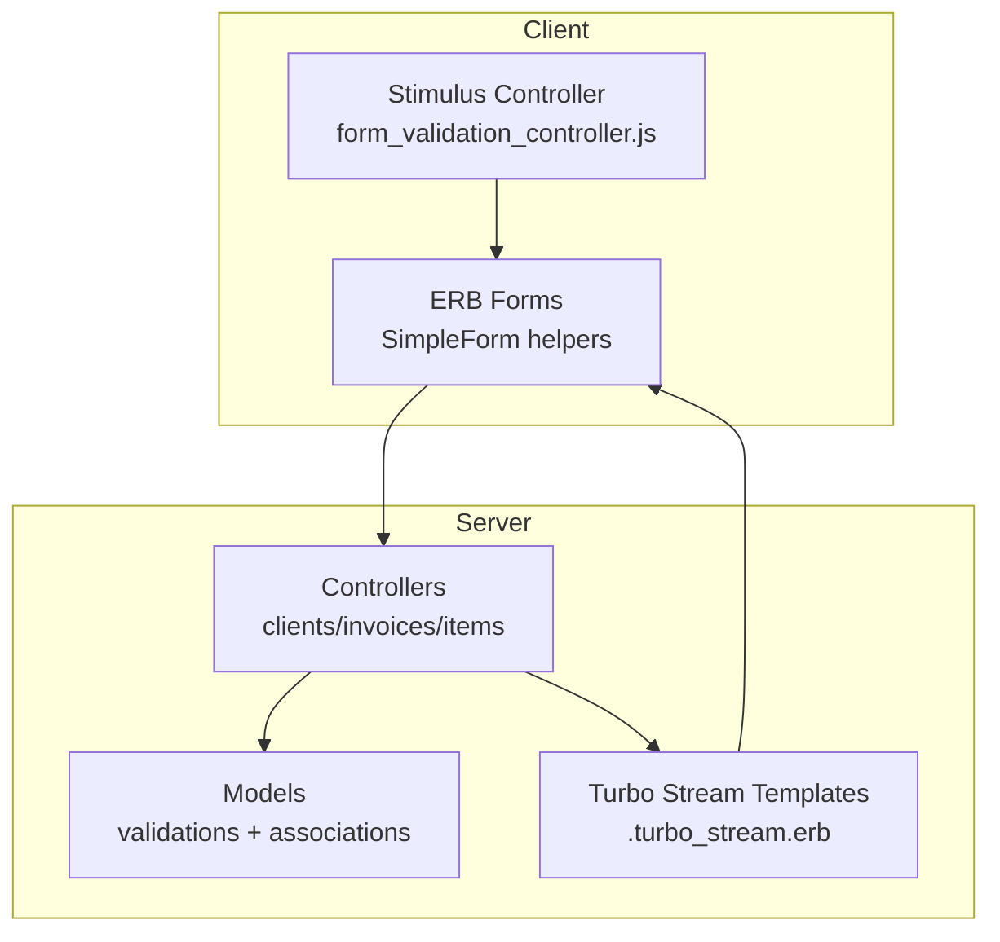
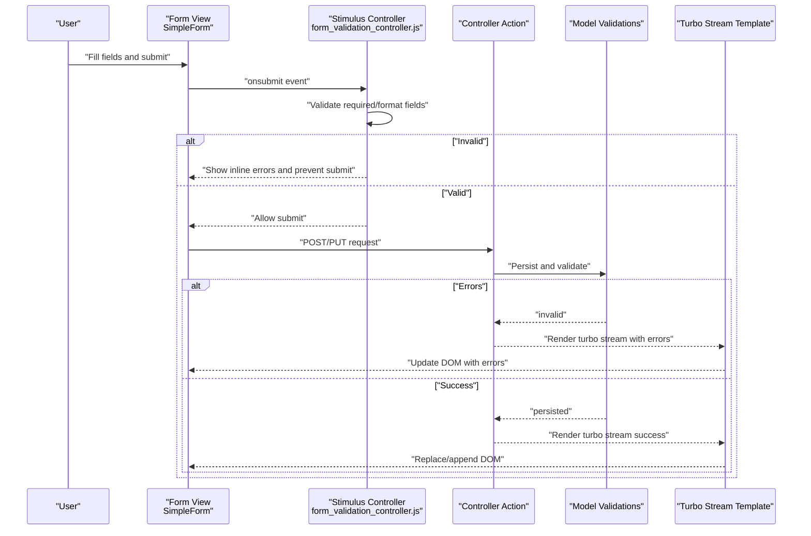
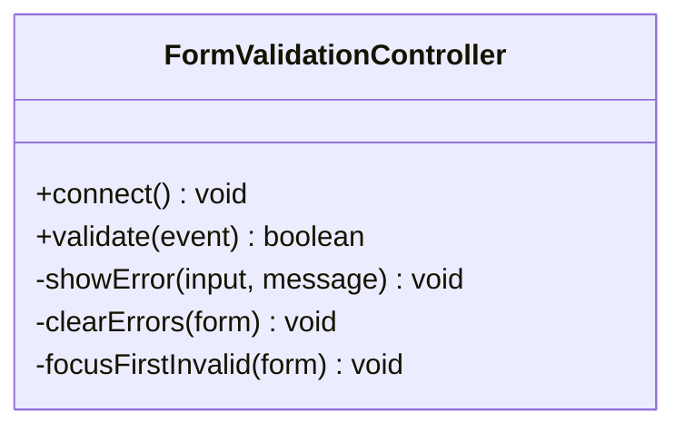
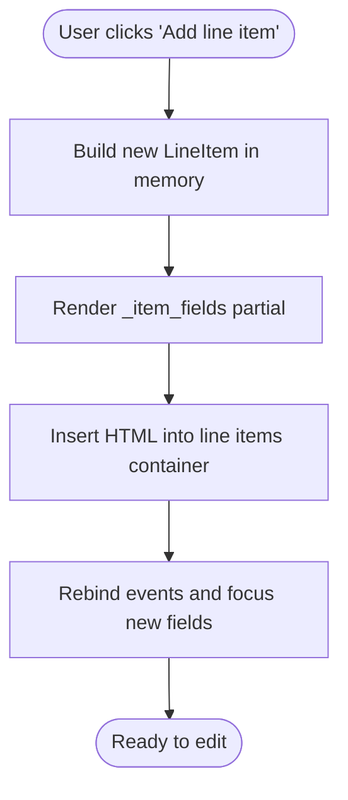
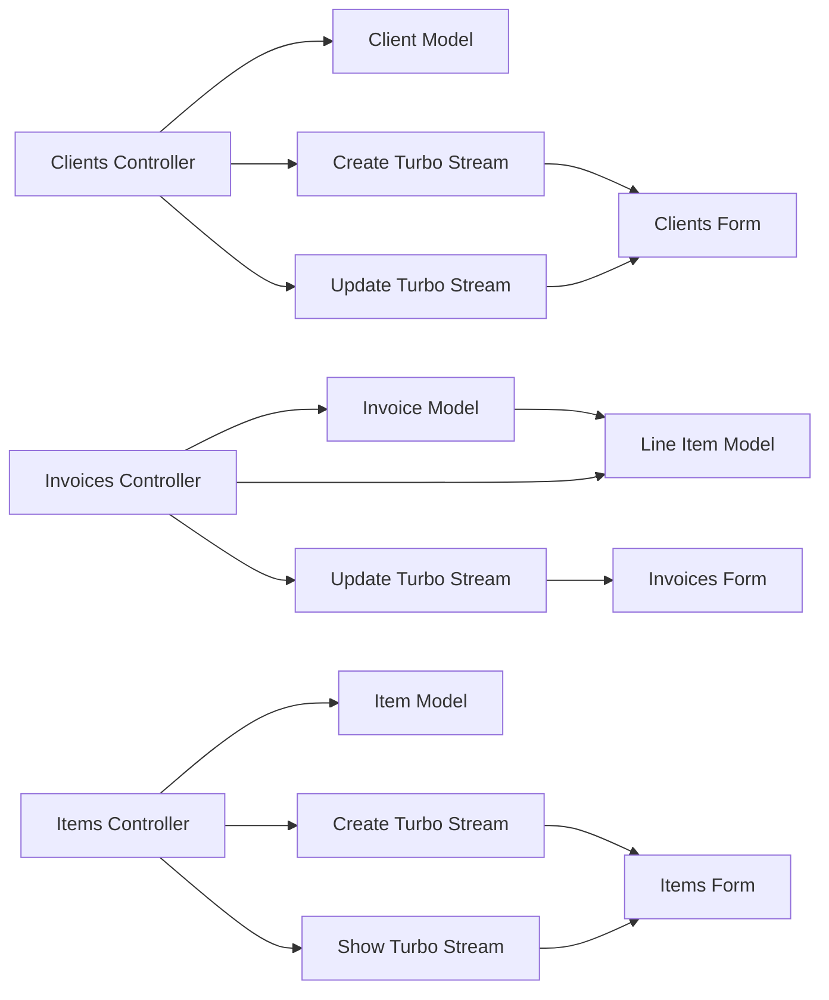

# Form Handling & Validation

<cite>
**Referenced Files in This Document**
- [form_validation_controller.js](file://app/javascript/controllers/form_validation_controller.js)
- [simple_form.rb](file://config/initializers/simple_form.rb)
- [clients/_form.html.erb](file://app/views/clients/_form.html.erb)
- [invoices/_form.html.erb](file://app/views/invoices/_form.html.erb)
- [items/_form.html.erb](file://app/views/items/_form.html.erb)
- [invoices/_item_fields.html.erb](file://app/views/invoices/_item_fields.html.erb)
- [clients/create.turbo_stream.erb](file://app/views/clients/create.turbo_stream.erb)
- [clients/update.turbo_stream.erb](file://app/views/clients/update.turbo_stream.erb)
- [invoices/update.turbo_stream.erb](file://app/views/invoices/update.turbo_stream.erb)
- [clients/show.turbo_stream.erb](file://app/views/clients/show.turbo_stream.erb)
- [items/create.turbo_stream.erb](file://app/views/items/create.turbo_stream.erb)
- [items/show.turbo_stream.erb](file://app/views/items/show.turbo_stream.erb)
- [countries/regions.turbo_stream.erb](file://app/views/countries/regions.turbo_stream.erb)
- [clients_controller.rb](file://app/controllers/clients_controller.rb)
- [invoices_controller.rb](file://app/controllers/invoices_controller.rb)
- [items_controller.rb](file://app/controllers/items_controller.rb)
- [client.rb](file://app/models/client.rb)
- [invoice.rb](file://app/models/invoice.rb)
- [item.rb](file://app/models/item.rb)
- [line_item.rb](file://app/models/line_item.rb)
- [application_helper.rb](file://app/helpers/application_helper.rb)
- [shared/_flash.html.erb](file://app/views/shared/_flash.html.erb)
</cite>

## Table of Contents
1. [Introduction](#introduction)
2. [Project Structure](#project-structure)
3. [Core Components](#core-components)
4. [Architecture Overview](#architecture-overview)
5. [Detailed Component Analysis](#detailed-component-analysis)
6. [Dependency Analysis](#dependency-analysis)
7. [Performance Considerations](#performance-considerations)
8. [Troubleshooting Guide](#troubleshooting-guide)
9. [Conclusion](#conclusion)
10. [Appendices](#appendices)

## Introduction
This document explains the form handling and validation strategies used across clients, invoices, and items forms. It covers:
- Client-side validation via a Stimulus controller
- Server-side validation integrated with Rails models and controllers
- Enhanced form rendering using SimpleForm
- Patterns for nested attributes, file uploads, and dynamic field generation
- Custom validators and error display patterns
- Submission handling with Turbo Streams
- Accessibility considerations, mobile optimization, and cross-browser compatibility

## Project Structure
Forms are implemented consistently across features:
- Controllers handle persistence and respond with HTML or Turbo Stream fragments
- Views use SimpleForm to render inputs and errors
- A Stimulus controller provides client-side validation before submission
- Nested forms (e.g., invoice line items) are rendered via partials and built dynamically on the client

**Diagram sources**
- [form_validation_controller.js](file://app/javascript/controllers/form_validation_controller.js)
- [clients/_form.html.erb](file://app/views/clients/_form.html.erb)
- [invoices/_form.html.erb](file://app/views/invoices/_form.html.erb)
- [items/_form.html.erb](file://app/views/items/_form.html.erb)
- [clients_controller.rb](file://app/controllers/clients_controller.rb)
- [invoices_controller.rb](file://app/controllers/invoices_controller.rb)
- [items_controller.rb](file://app/controllers/items_controller.rb)
- [clients/create.turbo_stream.erb](file://app/views/clients/create.turbo_stream.erb)
- [clients/update.turbo_stream.erb](file://app/views/clients/update.turbo_stream.erb)
- [invoices/update.turbo_stream.erb](file://app/views/invoices/update.turbo_stream.erb)
- [clients/show.turbo_stream.erb](file://app/views/clients/show.turbo_stream.erb)
- [items/create.turbo_stream.erb](file://app/views/items/create.turbo_stream.erb)
- [items/show.turbo_stream.erb](file://app/views/items/show.turbo_stream.erb)

**Section sources**
- [clients/_form.html.erb](file://app/views/clients/_form.html.erb)
- [invoices/_form.html.erb](file://app/views/invoices/_form.html.erb)
- [items/_form.html.erb](file://app/views/items/_form.html.erb)
- [clients_controller.rb](file://app/controllers/clients/invoices/items)
- [invoices_controller.rb](file://app/controllers/invoices_controller.rb)
- [items_controller.rb](file://app/controllers/items_controller.rb)

## Core Components
- Client-side validation controller: A Stimulus controller that validates fields before submission and prevents invalid submissions.
- SimpleForm configuration: Global defaults and wrappers to standardize input rendering and error presentation.
- Controllers: Standard Rails CRUD actions that persist data and respond with Turbo Streams when appropriate.
- Models: Active Record validations enforce business rules server-side.
- Turbo Streams templates: Partial responses that update DOM regions without full page reloads.

Key responsibilities:
- Prevent unnecessary network requests by validating early
- Provide immediate feedback to users
- Ensure consistent error messages and accessible markup
- Keep server state consistent with model validations

**Section sources**
- [form_validation_controller.js](file://app/javascript/controllers/form_validation_controller.js)
- [simple_form.rb](file://config/initializers/simple_form.rb)
- [clients_controller.rb](file://app/controllers/clients_controller.rb)
- [invoices_controller.rb](file://app/controllers/invoices_controller.rb)
- [items_controller.rb](file://app/controllers/items_controller.rb)
- [client.rb](file://app/models/client.rb)
- [invoice.rb](file://app/models/invoice.rb)
- [item.rb](file://app/models/item.rb)
- [line_item.rb](file://app/models/line_item.rb)

## Architecture Overview
The form lifecycle integrates client-side checks, server-side validation, and Turbo Streams updates.

**Diagram sources**
- [form_validation_controller.js](file://app/javascript/controllers/form_validation_controller.js)
- [clients/_form.html.erb](file://app/views/clients/_form.html.erb)
- [invoices/_form.html.erb](file://app/views/invoices/_form.html.erb)
- [items/_form.html.erb](file://app/views/items/_form.html.erb)
- [clients_controller.rb](file://app/controllers/clients_controller.rb)
- [invoices_controller.rb](file://app/controllers/invoices_controller.rb)
- [items_controller.rb](file://app/controllers/items_controller.rb)
- [clients/create.turbo_stream.erb](file://app/views/clients/create.turbo_stream.erb)
- [clients/update.turbo_stream.erb](file://app/views/clients/update.turbo_stream.erb)
- [invoices/update.turbo_stream.erb](file://app/views/invoices/update.turbo_stream.erb)
- [clients/show.turbo_stream.erb](file://app/views/clients/show.turbo_stream.erb)
- [items/create.turbo_stream.erb](file://app/views/items/create.turbo_stream.erb)
- [items/show.turbo_stream.erb](file://app/views/items/show.turbo_stream.erb)

## Detailed Component Analysis

### Client-Side Validation Controller
Responsibilities:
- Intercept form submission
- Validate presence and format of key fields
- Display inline errors near inputs
- Prevent submission when invalid

Implementation highlights:
- Uses data attributes to mark required fields and validation rules
- Adds/removes CSS classes to highlight invalid inputs
- Focuses the first invalid field for accessibility
- Works seamlessly with Turbo Streams by allowing valid submissions and blocking invalid ones

Accessibility notes:
- Associates error messages with inputs using aria-describedby
- Announces errors to assistive technologies via live regions where applicable

**Section sources**
- [form_validation_controller.js](file://app/javascript/controllers/form_validation_controller.js)

#### Class Diagram

**Diagram sources**
- [form_validation_controller.js](file://app/javascript/controllers/form_validation_controller.js)

### SimpleForm Configuration
Purpose:
- Standardize input rendering across the app
- Provide consistent error presentation
- Enable convenient options like placeholders, hints, and labels

Configuration aspects:
- Default wrapper elements and error classes
- Label and hint behavior
- Integration with Tailwind classes for styling
- Global overrides for specific input types

Best practices:
- Use simple_form’s built-in error display helpers to ensure consistent messaging
- Keep custom wrappers minimal to maintain accessibility semantics

**Section sources**
- [simple_form.rb](file://config/initializers/simple_form.rb)
- [clients/_form.html.erb](file://app/views/clients/_form.html.erb)
- [invoices/_form.html.erb](file://app/views/invoices/_form.html.erb)
- [items/_form.html.erb](file://app/views/items/_form.html.erb)

### Clients Form Pattern
Features:
- Basic fields validated both client-side and server-side
- Inline error display via SimpleForm
- Turbo Stream responses for create/update to update lists or show details

Patterns:
- Submitting creates or updates a client record
- On success, Turbo Stream replaces or inserts content
- On failure, Turbo Stream injects error messages into the form region

**Section sources**
- [clients/_form.html.erb](file://app/views/clients/_form.html.erb)
- [clients/create.turbo_stream.erb](file://app/views/clients/create.turbo_stream.erb)
- [clients/update.turbo_stream.erb](file://app/views/clients/update.turbo_stream.erb)
- [clients/show.turbo_stream.erb](file://app/views/clients/show.turbo_stream.erb)
- [clients_controller.rb](file://app/controllers/clients_controller.rb)
- [client.rb](file://app/models/client.rb)

### Invoices Form Pattern (Nested Attributes)
Features:
- Nested line items using accepts_nested_attributes_for
- Dynamic addition/removal of line item rows
- Real-time recalculation of totals (via other controllers/helpers)
- File upload support for attachments if present

Patterns:
- The main form includes a container for line items
- A partial renders each line item row
- JavaScript adds new rows by inserting the partial template with incremented IDs
- Server-side strong parameters permit nested attributes

**Section sources**
- [invoices/_form.html.erb](file://app/views/invoices/_form.html.erb)
- [invoices/_item_fields.html.erb](file://app/views/invoices/_item_fields.html.erb)
- [invoices/update.turbo_stream.erb](file://app/views/invoices/update.turbo_stream.erb)
- [invoices_controller.rb](file://app/controllers/invoices_controller.rb)
- [invoice.rb](file://app/models/invoice.rb)
- [line_item.rb](file://app/models/line_item.rb)

#### Flowchart: Adding a Line Item Row

**Diagram sources**
- [invoices/_form.html.erb](file://app/views/invoices/_form.html.erb)
- [invoices/_item_fields.html.erb](file://app/views/invoices/_item_fields.html.erb)

### Items Form Pattern
Features:
- Create/edit items with basic validations
- Turbo Stream responses to update index or show views
- Optional file uploads handled by Active Storage

Patterns:
- Submit triggers create or update action
- Success returns a Turbo Stream fragment to refresh related UI
- Errors return a Turbo Stream fragment with inline errors

**Section sources**
- [items/_form.html.erb](file://app/views/items/_form.html.erb)
- [items/create.turbo_stream.erb](file://app/views/items/create.turbo_stream.erb)
- [items/show.turbo_stream.erb](file://app/views/items/show.turbo_stream.erb)
- [items_controller.rb](file://app/controllers/items_controller.rb)
- [item.rb](file://app/models/item.rb)

### Dynamic Field Generation and Region Updates
Examples:
- Country/region cascading selects updated via Turbo Streams
- Invoice line items added/removed dynamically

Patterns:
- Client triggers an action (e.g., select country)
- Server responds with a Turbo Stream that replaces the dependent region
- No full page reload is needed

**Section sources**
- [countries/regions.turbo_stream.erb](file://app/views/countries/regions.turbo_stream.erb)

### Error Display Patterns
Strategies:
- Inline errors next to inputs using SimpleForm helpers
- Summary error list at the top of the form
- Flash notices for high-level status messages

Integration points:
- Turbo Stream templates can re-render the form with errors
- Shared flash partial displays global messages

**Section sources**
- [clients/_form.html.erb](file://app/views/clients/_form.html.erb)
- [invoices/_form.html.erb](file://app/views/invoices/_form.html.erb)
- [items/_form.html.erb](file://app/views/items/_form.html.erb)
- [shared/_flash.html.erb](file://app/views/shared/_flash.html.erb)

### Custom Validators
Approach:
- Define custom validators in dedicated files and reference them in models
- Use ActiveModel::EachValidator for reusable logic
- Return clear error messages keyed by attribute

Common scenarios:
- Format checks beyond built-ins
- Cross-field validation
- Conditional validations based on other attributes

**Section sources**
- [client.rb](file://app/models/client.rb)
- [invoice.rb](file://app/models/invoice.rb)
- [item.rb](file://app/models/item.rb)
- [line_item.rb](file://app/models/line_item.rb)

### File Uploads
Approach:
- Use Active Storage for file attachments
- Configure Strong Parameters to permit file params
- Ensure multipart forms are enabled in SimpleForm

Considerations:
- Validate file type and size server-side
- Provide user feedback on upload progress and errors

**Section sources**
- [items/_form.html.erb](file://app/views/items/_form.html.erb)
- [items_controller.rb](file://app/controllers/items_controller.rb)
- [item.rb](file://app/models/item.rb)

### Turbo Streams Submission Handling
Flow:
- Successful submissions return Turbo Stream fragments to update the DOM
- Failed submissions return fragments that re-render the form with errors
- Keeps interactions fast and reduces bandwidth

**Section sources**
- [clients/create.turbo_stream.erb](file://app/views/clients/create.turbo_stream.erb)
- [clients/update.turbo_stream.erb](file://app/views/clients/update.turbo_stream.erb)
- [clients/show.turbo_stream.erb](file://app/views/clients/show.turbo_stream.erb)
- [invoices/update.turbo_stream.erb](file://app/views/invoices/update.turbo_stream.erb)
- [items/create.turbo_stream.erb](file://app/views/items/create.turbo_stream.erb)
- [items/show.turbo_stream.erb](file://app/views/items/show.turbo_stream.erb)

### Accessibility Considerations
- Associate error messages with inputs using aria-describedby
- Ensure labels are visible and correctly associated
- Maintain logical tab order and focus management
- Announce changes via live regions when updating forms via Turbo Streams
- Avoid color-only indicators for errors; include text and icons

**Section sources**
- [form_validation_controller.js](file://app/javascript/controllers/form_validation_controller.js)
- [clients/_form.html.erb](file://app/views/clients/_form.html.erb)
- [invoices/_form.html.erb](file://app/views/invoices/_form.html.erb)
- [items/_form.html.erb](file://app/views/items/_form.html.erb)

### Mobile Form Optimization
- Use appropriate input types (email, tel, number) to trigger correct keyboards
- Minimize layout shifts after Turbo Stream updates
- Ensure touch targets are large enough
- Debounce rapid submissions to avoid duplicate requests

**Section sources**
- [clients/_form.html.erb](file://app/views/clients/_form.html.erb)
- [invoices/_form.html.erb](file://app/views/invoices/_form.html.erb)
- [items/_form.html.erb](file://app/views/items/_form.html.erb)

### Cross-Browser Compatibility
- Test Turbo Streams behavior across browsers
- Ensure polyfills are not required for modern browsers targeted
- Verify file upload behavior and previews work consistently
- Confirm CSS classes applied by the validation controller render correctly

[No sources needed since this section provides general guidance]

## Dependency Analysis
Relationships between components involved in form handling:

**Diagram sources**
- [clients_controller.rb](file://app/controllers/clients_controller.rb)
- [invoices_controller.rb](file://app/controllers/invoices_controller.rb)
- [items_controller.rb](file://app/controllers/items_controller.rb)
- [client.rb](file://app/models/client.rb)
- [invoice.rb](file://app/models/invoice.rb)
- [line_item.rb](file://app/models/line_item.rb)
- [item.rb](file://app/models/item.rb)
- [clients/create.turbo_stream.erb](file://app/views/clients/create.turbo_stream.erb)
- [clients/update.turbo_stream.erb](file://app/views/clients/update.turbo_stream.erb)
- [invoices/update.turbo_stream.erb](file://app/views/invoices/update.turbo_stream.erb)
- [items/create.turbo_stream.erb](file://app/views/items/create.turbo_stream.erb)
- [items/show.turbo_stream.erb](file://app/views/items/show.turbo_stream.erb)
- [clients/_form.html.erb](file://app/views/clients/_form.html.erb)
- [invoices/_form.html.erb](file://app/views/invoices/_form.html.erb)
- [items/_form.html.erb](file://app/views/items/_form.html.erb)

**Section sources**
- [clients_controller.rb](file://app/controllers/clients_controller.rb)
- [invoices_controller.rb](file://app/controllers/invoices_controller.rb)
- [items_controller.rb](file://app/controllers/items_controller.rb)
- [client.rb](file://app/models/client.rb)
- [invoice.rb](file://app/models/invoice.rb)
- [line_item.rb](file://app/models/line_item.rb)
- [item.rb](file://app/models/item.rb)

## Performance Considerations
- Prefer Turbo Streams over full page reloads to reduce payload size
- Keep client-side validation lightweight to avoid blocking user input
- Defer heavy computations until after initial render
- Use partials to minimize duplicated HTML in Turbo Stream responses
- Cache static assets and leverage browser caching for stylesheets and scripts

[No sources needed since this section provides general guidance]

## Troubleshooting Guide
Common issues and resolutions:
- Inline errors not showing:
  - Ensure SimpleForm error helpers are used and error containers exist
  - Verify Turbo Stream templates re-render the form region on failures
- Turbo Stream not updating:
  - Check target IDs match between stimulus/controller and view
  - Confirm response content-type is text/vnd.turbo-stream.html
- Nested attributes rejected:
  - Permit nested params in controller strong parameters
  - Validate association presence and uniqueness
- File uploads failing:
  - Ensure multipart forms are enabled
  - Validate permitted file params and storage configuration
- Accessibility regressions:
  - Confirm aria-describedby links and label associations
  - Test keyboard navigation and screen reader announcements

**Section sources**
- [clients/_form.html.erb](file://app/views/clients/_form.html.erb)
- [invoices/_form.html.erb](file://app/views/invoices/_form.html.erb)
- [items/_form.html.erb](file://app/views/items/_form.html.erb)
- [clients/create.turbo_stream.erb](file://app/views/clients/create.turbo_stream.erb)
- [clients/update.turbo_stream.erb](file://app/views/clients/update.turbo_stream.erb)
- [invoices/update.turbo_stream.erb](file://app/views/invoices/update.turbo_stream.erb)
- [items/create.turbo_stream.erb](file://app/views/items/create.turbo_stream.erb)
- [items/show.turbo_stream.erb](file://app/views/items/show.turbo_stream.erb)

## Conclusion
The application uses a layered approach to form handling:
- Immediate feedback through client-side validation
- Robust enforcement via server-side validations
- Consistent rendering and UX with SimpleForm
- Fast, incremental updates with Turbo Streams
These patterns scale well across clients, invoices, and items, while supporting advanced features like nested attributes and file uploads.

[No sources needed since this section summarizes without analyzing specific files]

## Appendices

### Quick Reference: Where to Look
- Client-side validation logic: [form_validation_controller.js](file://app/javascript/controllers/form_validation_controller.js)
- SimpleForm setup: [simple_form.rb](file://config/initializers/simple_form.rb)
- Clients form and streams: [clients/_form.html.erb](file://app/views/clients/_form.html.erb), [clients/create.turbo_stream.erb](file://app/views/clients/create.turbo_stream.erb), [clients/update.turbo_stream.erb](file://app/views/clients/update.turbo_stream.erb)
- Invoices form and nested items: [invoices/_form.html.erb](file://app/views/invoices/_form.html.erb), [invoices/_item_fields.html.erb](file://app/views/invoices/_item_fields.html.erb), [invoices/update.turbo_stream.erb](file://app/views/invoices/update.turbo_stream.erb)
- Items form and streams: [items/_form.html.erb](file://app/views/items/_form.html.erb), [items/create.turbo_stream.erb](file://app/views/items/create.turbo_stream.erb), [items/show.turbo_stream.erb](file://app/views/items/show.turbo_stream.erb)
- Controllers and models: [clients_controller.rb](file://app/controllers/clients_controller.rb), [invoices_controller.rb](file://app/controllers/invoices_controller.rb), [items_controller.rb](file://app/controllers/items_controller.rb), [client.rb](file://app/models/client.rb), [invoice.rb](file://app/models/invoice.rb), [line_item.rb](file://app/models/line_item.rb), [item.rb](file://app/models/item.rb)