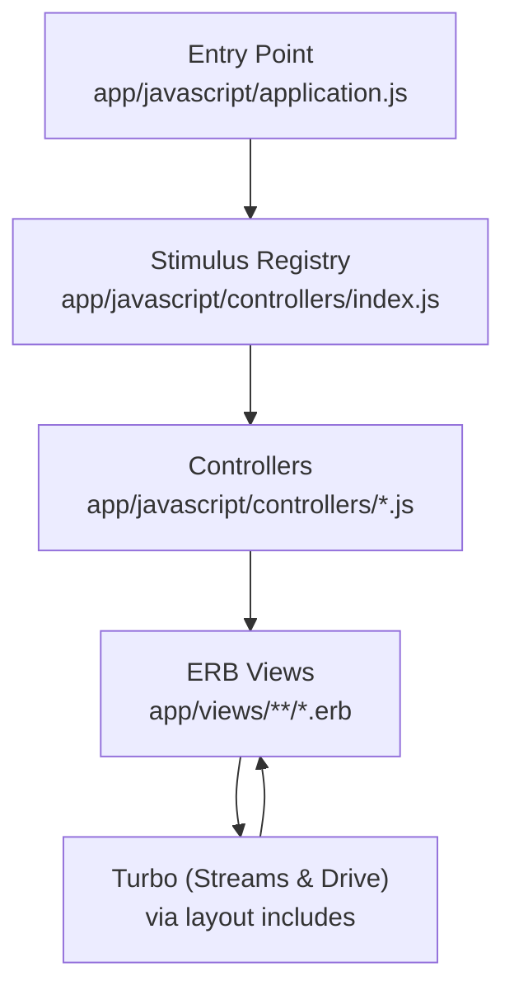
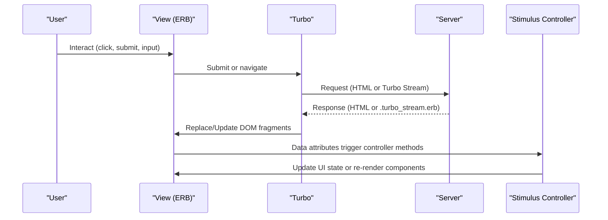
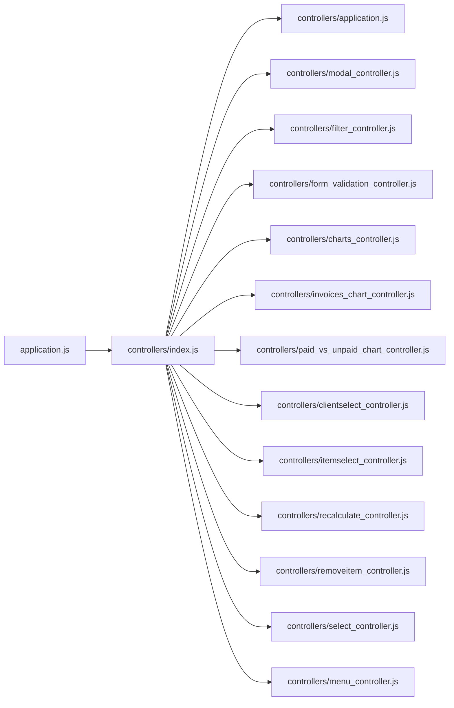

# Frontend Architecture

<cite>
**Referenced Files in This Document**
- [application.js](file://app/javascript/application.js)
- [controllers/index.js](file://app/javascript/controllers/index.js)
- [controllers/application.js](file://app/javascript/controllers/application.js)
- [controllers/modal_controller.js](file://app/javascript/controllers/modal_controller.js)
- [controllers/filter_controller.js](file://app/javascript/controllers/filter_controller.js)
- [controllers/form_validation_controller.js](file://app/javascript/controllers/form_validation_controller.js)
- [controllers/charts_controller.js](file://app/javascript/controllers/charts_controller.js)
- [controllers/invoices_chart_controller.js](file://app/javascript/controllers/invoices_chart_controller.js)
- [controllers/paid_vs_unpaid_chart_controller.js](file://app/javascript/controllers/paid_vs_unpaid_chart_controller.js)
- [controllers/clientselect_controller.js](file://app/javascript/controllers/clientselect_controller.js)
- [controllers/itemselect_controller.js](file://app/javascript/controllers/itemselect_controller.js)
- [controllers/recalculate_controller.js](file://app/javascript/controllers/recalculate_controller.js)
- [controllers/removeitem_controller.js](file://app/javascript/controllers/removeitem_controller.js)
- [controllers/select_controller.js](file://app/javascript/controllers/select_controller.js)
- [controllers/menu_controller.js](file://app/javascript/controllers/menu_controller.js)
- [charts/_invoices_chart.html.erb](file://app/views/charts/_invoices_chart.html.erb)
- [charts/_paid_vs_unpaid_chart.html.erb](file://app/views/charts/_paid_vs_unpaid_chart.html.erb)
- [clients/create.turbo_stream.erb](file://app/views/clients/create.turbo_stream.erb)
- [clients/show.turbo_stream.erb](file://app/views/clients/show.turbo_stream.erb)
- [clients/update.turbo_stream.erb](file://app/views/clients/update.turbo_stream.erb)
- [countries/regions.turbo_stream.erb](file://app/views/countries/regions.turbo_stream.erb)
- [invoices/update.turbo_stream.erb](file://app/views/invoices/update.turbo_stream.erb)
- [items/create.turbo_stream.erb](file://app/views/items/create.turbo_stream.erb)
- [items/show.turbo_stream.erb](file://app/views/items/show.turbo_stream.erb)
- [shared/_modal.html.erb](file://app/views/shared/_modal.html.erb)
- [layouts/application.html.erb](file://app/layouts/application.html.erb)
</cite>

## Table of Contents
1. [Introduction](#introduction)
2. [Project Structure](#project-structure)
3. [Core Components](#core-components)
4. [Architecture Overview](#architecture-overview)
5. [Detailed Component Analysis](#detailed-component-analysis)
6. [Dependency Analysis](#dependency-analysis)
7. [Performance Considerations](#performance-considerations)
8. [Troubleshooting Guide](#troubleshooting-guide)
9. [Conclusion](#conclusion)
10. [Appendices](#appendices)

## Introduction
This document explains the frontend architecture of the application with a focus on:
- Stimulus.js controller organization and lifecycle
- Turbo Streams usage for partial page updates
- Progressive enhancement patterns that keep the app functional without JavaScript while enabling rich interactions when available
- Practical guidance for creating new controllers, handling user interactions, integrating server responses, responsive design, accessibility, and performance optimization

The goal is to make the system understandable for both developers and non-technical stakeholders by combining high-level overviews with code-level details and diagrams.

## Project Structure
The frontend is organized around:
- A single entry point that boots the framework stack
- A centralized Stimulus registry
- Feature-oriented controllers under a dedicated directory
- Server-rendered views enhanced by Turbo and Stimulus
- Turbo Stream templates for targeted DOM updates

**Diagram sources**
- [application.js](file://app/javascript/application.js)
- [controllers/index.js](file://app/javascript/controllers/index.js)
- [layouts/application.html.erb](file://app/layouts/application.html.erb)

**Section sources**
- [application.js](file://app/javascript/application.js)
- [controllers/index.js](file://app/javascript/controllers/index.js)
- [layouts/application.html.erb](file://app/layouts/application.html.erb)

## Core Components
- Application bootstrapper initializes the framework stack and registers controllers.
- The Stimulus registry auto-discovers controllers and wires data-controller attributes to classes.
- Controllers encapsulate UI behavior such as modals, filters, form validation, chart rendering, and selection helpers.
- Turbo Streams enable seamless partial updates without full page reloads.

Key responsibilities:
- Bootstrapping and configuration
- Controller discovery and wiring
- Event-driven UI logic
- Integration with server-side Turbo Streams

**Section sources**
- [application.js](file://app/javascript/application.js)
- [controllers/index.js](file://app/javascript/controllers/index.js)
- [controllers/application.js](file://app/javascript/controllers/application.js)

## Architecture Overview
The frontend follows a progressive enhancement model:
- HTML-first server rendering ensures baseline functionality and SEO.
- Turbo enhances navigation and form submissions with fast, partial updates.
- Stimulus adds interactivity only where needed, attached via data attributes.
- Charts and complex widgets are initialized within their own controllers.

**Diagram sources**
- [layouts/application.html.erb](file://app/layouts/application.html.erb)
- [clients/create.turbo_stream.erb](file://app/views/clients/create.turbo_stream.erb)
- [clients/show.turbo_stream.erb](file://app/views/clients/show.turbo_stream.erb)
- [clients/update.turbo_stream.erb](file://app/views/clients/update.turbo_stream.erb)
- [countries/regions.turbo_stream.erb](file://app/views/countries/regions.turbo_stream.erb)
- [invoices/update.turbo_stream.erb](file://app/views/invoices/update.turbo_stream.erb)
- [items/create.turbo_stream.erb](file://app/views/items/create.turbo_stream.erb)
- [items/show.turbo_stream.erb](file://app/views/items/show.turbo_stream.erb)

## Detailed Component Analysis

### Stimulus Controller Organization
- Centralized registry auto-imports all controllers in the controllers directory.
- Each controller targets a specific DOM element using data-controller and exposes actions via data-action.
- Shared base controller provides common utilities and conventions.

Best practices:
- Keep controllers small and focused on one responsibility.
- Use data-* attributes to declare inputs and actions declaratively.
- Avoid global state; prefer passing values through data attributes or events.

**Section sources**
- [controllers/index.js](file://app/javascript/controllers/index.js)
- [controllers/application.js](file://app/javascript/controllers/application.js)

### Modal Management
Purpose:
- Open/close modal dialogs, manage focus, and handle backdrop clicks.

Typical data attributes:
- data-controller="modal"
- data-action="click->modal#open|close"
- data-modal-target="dialog|backdrop|closeButton"

Behavior highlights:
- Opens modal on trigger click
- Closes on backdrop click or close button
- Manages focus for accessibility

**Section sources**
- [controllers/modal_controller.js](file://app/javascript/controllers/modal_controller.js)
- [shared/_modal.html.erb](file://app/views/shared/_modal.html.erb)

### Filter Functionality
Purpose:
- Apply client-side filters to lists or tables based on search inputs.

Typical data attributes:
- data-controller="filter"
- data-filter-target="input|results"
- data-action="input->filter#apply"

Behavior highlights:
- Debounced input handling
- Case-insensitive matching
- Hides non-matching rows or items

**Section sources**
- [controllers/filter_controller.js](file://app/javascript/controllers/filter_controller.js)

### Form Validation Strategy
Purpose:
- Provide immediate feedback and prevent invalid submissions.

Typical data attributes:
- data-controller="form-validation"
- data-form-validation-target="field|error"
- data-action="blur->form-validation#validate|submit->form-validation#onSubmit"

Behavior highlights:
- Validates fields on blur and before submit
- Shows inline error messages
- Prevents submission if invalid

**Section sources**
- [controllers/form_validation_controller.js](file://app/javascript/controllers/form_validation_controller.js)

### Chart Initialization
Purpose:
- Initialize and render charts within scoped containers.

Controllers:
- Generic chart controller for shared initialization logic
- Invoices chart controller for invoice-specific datasets
- Paid vs unpaid chart controller for financial breakdowns

Typical data attributes:
- data-controller="charts|invoices-chart|paid-vs-unpaid-chart"
- data-charts-target="canvas"
- data-invoices-chart-target="canvas"
- data-paid-vs-unpaid-chart-target="canvas"

Behavior highlights:
- Waits for container to be ready
- Reads dataset from data attributes or DOM
- Renders chart once per target

**Section sources**
- [controllers/charts_controller.js](file://app/javascript/controllers/charts_controller.js)
- [controllers/invoices_chart_controller.js](file://app/javascript/controllers/invoices_chart_controller.js)
- [controllers/paid_vs_unpaid_chart_controller.js](file://app/javascript/controllers/paid_vs_unpaid_chart_controller.js)
- [charts/_invoices_chart.html.erb](file://app/views/charts/_invoices_chart.html.erb)
- [charts/_paid_vs_unpaid_chart.html.erb](file://app/views/charts/_paid_vs_unpaid_chart.html.erb)

### Selection Helpers (Client and Item Select)
Purpose:
- Populate select dropdowns dynamically or pre-select options based on context.

Typical data attributes:
- data-controller="clientselect|itemselect"
- data-clientselect-target="select"
- data-itemselect-target="select"

Behavior highlights:
- Loads options via AJAX or local data
- Updates select value programmatically

**Section sources**
- [controllers/clientselect_controller.js](file://app/javascript/controllers/clientselect_controller.js)
- [controllers/itemselect_controller.js](file://app/javascript/controllers/itemselect_controller.js)

### Recalculation and Line Item Management
Purpose:
- Recalculate totals when quantities or prices change.
- Remove line items from forms dynamically.

Typical data attributes:
- data-controller="recalculate|removeitem"
- data-recalculate-target="totals|inputs"
- data-removeitem-target="container|button"

Behavior highlights:
- Listens to input changes and recalculates sums
- Removes DOM nodes and updates totals

**Section sources**
- [controllers/recalculate_controller.js](file://app/javascript/controllers/recalculate_controller.js)
- [controllers/removeitem_controller.js](file://app/javascript/controllers/removeitem_controller.js)

### Select Enhancement
Purpose:
- Enhance native selects with custom behaviors like clearing or multi-select toggles.

Typical data attributes:
- data-controller="select"
- data-action="change->select#handle"

Behavior highlights:
- Adds custom UI states
- Emits events for other controllers to consume

**Section sources**
- [controllers/select_controller.js](file://app/javascript/controllers/select_controller.js)

### Menu and Mobile Navigation
Purpose:
- Toggle mobile menu visibility and manage active states.

Typical data attributes:
- data-controller="menu"
- data-menu-target="toggle|panel"
- data-action="click->menu#toggle"

Behavior highlights:
- Toggles panel open/close
- Manages aria-expanded for accessibility

**Section sources**
- [controllers/menu_controller.js](file://app/javascript/controllers/menu_controller.js)

### Turbo Streams Implementation
Purpose:
- Perform targeted DOM updates without full page reloads.

Common patterns:
- Create/Update records return Turbo Stream responses that replace or append elements
- Cascading updates (e.g., selecting a country updates regions)
- Real-time-like UX for list operations

Examples:
- Client creation shows success and inserts the new client row
- Client update replaces the detail section
- Country selection triggers region dropdown update
- Invoice update refreshes totals or status badges
- Item creation/appends item to list

**Section sources**
- [clients/create.turbo_stream.erb](file://app/views/clients/create.turbo_stream.erb)
- [clients/show.turbo_stream.erb](file://app/views/clients/show.turbo_stream.erb)
- [clients/update.turbo_stream.erb](file://app/views/clients/update.turbo_stream.erb)
- [countries/regions.turbo_stream.erb](file://app/views/countries/regions.turbo_stream.erb)
- [invoices/update.turbo_stream.erb](file://app/views/invoices/update.turbo_stream.erb)
- [items/create.turbo_stream.erb](file://app/views/items/create.turbo_stream.erb)
- [items/show.turbo_stream.erb](file://app/views/items/show.turbo_stream.erb)

### Progressive Enhancement Patterns
- Forms work without JavaScript; Turbo enhances them for faster UX.
- Stimulus controllers attach to existing markup via data attributes.
- If JavaScript fails to load, core features remain usable.

Guidelines:
- Ensure semantic HTML and accessible attributes by default
- Use data attributes to opt-in to enhancements
- Keep server responses valid even without JS

[No sources needed since this section doesn't analyze specific files]

## Dependency Analysis
High-level dependencies between frontend modules:

**Diagram sources**
- [application.js](file://app/javascript/application.js)
- [controllers/index.js](file://app/javascript/controllers/index.js)
- [controllers/application.js](file://app/javascript/controllers/application.js)
- [controllers/modal_controller.js](file://app/javascript/controllers/modal_controller.js)
- [controllers/filter_controller.js](file://app/javascript/controllers/filter_controller.js)
- [controllers/form_validation_controller.js](file://app/javascript/controllers/form_validation_controller.js)
- [controllers/charts_controller.js](file://app/javascript/controllers/charts_controller.js)
- [controllers/invoices_chart_controller.js](file://app/javascript/controllers/invoices_chart_controller.js)
- [controllers/paid_vs_unpaid_chart_controller.js](file://app/javascript/controllers/paid_vs_unpaid_chart_controller.js)
- [controllers/clientselect_controller.js](file://app/javascript/controllers/clientselect_controller.js)
- [controllers/itemselect_controller.js](file://app/javascript/controllers/itemselect_controller.js)
- [controllers/recalculate_controller.js](file://app/javascript/controllers/recalculate_controller.js)
- [controllers/removeitem_controller.js](file://app/javascript/controllers/removeitem_controller.js)
- [controllers/select_controller.js](file://app/javascript/controllers/select_controller.js)
- [controllers/menu_controller.js](file://app/javascript/controllers/menu_controller.js)

**Section sources**
- [controllers/index.js](file://app/javascript/controllers/index.js)

## Performance Considerations
- Prefer Turbo Streams for partial updates to avoid full page reloads.
- Debounce heavy computations (e.g., filtering large lists).
- Lazy-initialize charts only when visible (IntersectionObserver).
- Minimize DOM mutations; batch updates where possible.
- Use data attributes to pass lightweight configuration instead of heavy payloads.
- Keep controllers small and cohesive to reduce memory footprint.

[No sources needed since this section provides general guidance]

## Troubleshooting Guide
Common issues and resolutions:
- Controller not firing:
  - Verify data-controller attribute exists on the target element.
  - Ensure the controller file is imported in the registry.
- Turbo Stream not updating:
  - Confirm the response content type is turbo_stream.
  - Check that the target ID matches the element being replaced.
- Form validation not triggering:
  - Ensure data-action bindings include blur and submit handlers.
  - Validate that target selectors match actual DOM nodes.
- Charts not rendering:
  - Confirm canvas elements exist and have correct targets.
  - Check that dataset attributes are present and well-formed.

**Section sources**
- [controllers/modal_controller.js](file://app/javascript/controllers/modal_controller.js)
- [controllers/filter_controller.js](file://app/javascript/controllers/filter_controller.js)
- [controllers/form_validation_controller.js](file://app/javascript/controllers/form_validation_controller.js)
- [controllers/charts_controller.js](file://app/javascript/controllers/charts_controller.js)
- [clients/create.turbo_stream.erb](file://app/views/clients/create.turbo_stream.erb)
- [clients/update.turbo_stream.erb](file://app/views/clients/update.turbo_stream.erb)
- [countries/regions.turbo_stream.erb](file://app/views/countries/regions.turbo_stream.erb)

## Conclusion
The frontend leverages a clean separation of concerns:
- Turbo handles navigation and partial updates efficiently
- Stimulus encapsulates UI logic in small, testable controllers
- Progressive enhancement ensures robustness and accessibility
Following the patterns outlined here will help maintain consistency, improve performance, and simplify future development.

[No sources needed since this section summarizes without analyzing specific files]

## Appendices

### Creating a New Stimulus Controller
Steps:
- Create a new file under app/javascript/controllers with a descriptive name.
- Implement the controller class extending the base controller if needed.
- Register automatically via the central registry import.
- Attach to DOM using data-controller and wire actions with data-action.
- Use data-* attributes to pass configuration and reference targets.

Example pattern references:
- See how modal, filter, and form validation controllers structure their targets and actions.

**Section sources**
- [controllers/modal_controller.js](file://app/javascript/controllers/modal_controller.js)
- [controllers/filter_controller.js](file://app/javascript/controllers/filter_controller.js)
- [controllers/form_validation_controller.js](file://app/javascript/controllers/form_validation_controller.js)

### Handling User Interactions
Patterns:
- Click handlers toggle state or open modals
- Input handlers apply filters or recalculate totals
- Submit handlers validate and submit via Turbo

References:
- Menu toggle flow
- Filter apply flow
- Recalculate totals flow

**Section sources**
- [controllers/menu_controller.js](file://app/javascript/controllers/menu_controller.js)
- [controllers/filter_controller.js](file://app/javascript/controllers/filter_controller.js)
- [controllers/recalculate_controller.js](file://app/javascript/controllers/recalculate_controller.js)

### Integrating with Server-Side Responses
Patterns:
- Submit forms to create/update resources
- Receive Turbo Stream responses to update parts of the page
- Handle cascading updates (e.g., country -> regions)

References:
- Client create/update flows
- Country regions update
- Invoice update flow

**Section sources**
- [clients/create.turbo_stream.erb](file://app/views/clients/create.turbo_stream.erb)
- [clients/update.turbo_stream.erb](file://app/views/clients/update.turbo_stream.erb)
- [countries/regions.turbo_stream.erb](file://app/views/countries/regions.turbo_stream.erb)
- [invoices/update.turbo_stream.erb](file://app/views/invoices/update.turbo_stream.erb)

### Responsive Design Patterns
- Use utility-first CSS frameworks to adapt layouts across breakpoints
- Toggle mobile menus with a dedicated controller
- Ensure touch-friendly targets and spacing

References:
- Mobile menu controller and view includes

**Section sources**
- [controllers/menu_controller.js](file://app/javascript/controllers/menu_controller.js)

### Accessibility Considerations
- Manage focus when opening/closing modals
- Use aria-expanded and aria-controls for toggles
- Provide keyboard support for interactive controls
- Ensure labels and error messages are associated with inputs

References:
- Modal dialog management
- Form validation error display

**Section sources**
- [controllers/modal_controller.js](file://app/javascript/controllers/modal_controller.js)
- [controllers/form_validation_controller.js](file://app/javascript/controllers/form_validation_controller.js)

### Performance Optimization Techniques
- Debounce input-heavy operations
- Lazy-load charts when they enter the viewport
- Batch DOM updates and minimize reflows
- Prefer Turbo Streams over full page reloads

[No sources needed since this section provides general guidance]