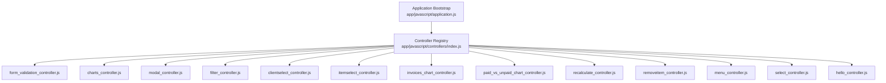
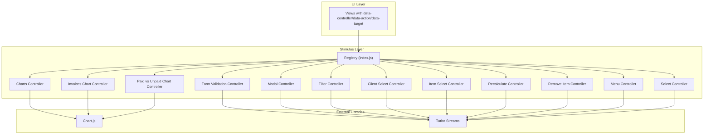
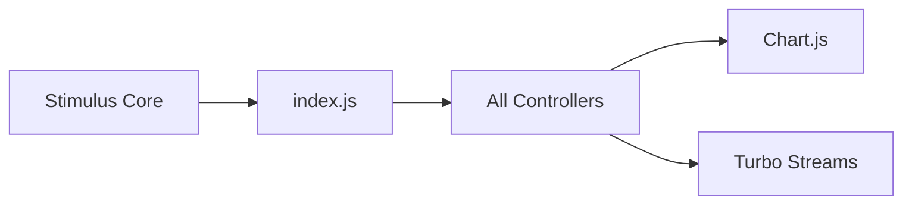

# Stimulus Controllers

<cite>
**Referenced Files in This Document**
- [index.js](file://app/javascript/controllers/index.js)
- [application.js](file://app/javascript/application.js)
- [form_validation_controller.js](file://app/javascript/controllers/form_validation_controller.js)
- [charts_controller.js](file://app/javascript/controllers/charts_controller.js)
- [modal_controller.js](file://app/javascript/controllers/modal_controller.js)
- [filter_controller.js](file://app/javascript/controllers/filter_controller.js)
- [clientselect_controller.js](file://app/javascript/controllers/clientselect_controller.js)
- [itemselect_controller.js](file://app/javascript/controllers/itemselect_controller.js)
- [invoices_chart_controller.js](file://app/javascript/controllers/invoices_chart_controller.js)
- [paid_vs_unpaid_chart_controller.js](file://app/javascript/controllers/paid_vs_unpaid_chart_controller.js)
- [recalculate_controller.js](file://app/javascript/controllers/recalculate_controller.js)
- [removeitem_controller.js](file://app/javascript/controllers/removeitem_controller.js)
- [menu_controller.js](file://app/javascript/controllers/menu_controller.js)
- [select_controller.js](file://app/javascript/controllers/select_controller.js)
- [hello_controller.js](file://app/javascript/controllers/hello_controller.js)
</cite>

## Table of Contents
1. [Introduction](#introduction)
2. [Project Structure](#project-structure)
3. [Core Components](#core-components)
4. [Architecture Overview](#architecture-overview)
5. [Detailed Component Analysis](#detailed-component-analysis)
6. [Dependency Analysis](#dependency-analysis)
7. [Performance Considerations](#performance-considerations)
8. [Troubleshooting Guide](#troubleshooting-guide)
9. [Conclusion](#conclusion)
10. [Appendices](#appendices)

## Introduction
This document explains the Stimulus.js controllers architecture used in the application, focusing on controller registration, data attribute patterns, and lifecycle methods. It documents each controller’s purpose and shows how to create new controllers, handle DOM events, manage state, and communicate with Turbo Streams. It also covers composition patterns, performance optimization, and debugging techniques.

## Project Structure
Stimulus controllers live under app/javascript/controllers. The application bootstraps Stimulus via app/javascript/application.js, which registers controllers using a convention-based loader defined in app/javascript/controllers/index.js. Each controller is a small class that targets DOM elements through data-controller and interacts with them via data-action and data-target attributes.

**Diagram sources**
- [application.js](file://app/javascript/application.js)
- [index.js](file://app/javascript/controllers/index.js)

**Section sources**
- [application.js](file://app/javascript/application.js)
- [index.js](file://app/javascript/controllers/index.js)

## Core Components
- Controller registration system: index.js scans the controllers directory and auto-registers classes following Stimulus conventions.
- Data attribute patterns:
  - data-controller: attaches a controller instance to an element.
  - data-action: binds DOM events to controller methods (e.g., click->controller#method).
  - data-target: references specific child elements for targeted updates.
- Lifecycle methods:
  - connect(): called when the controller’s element is connected to the DOM; initialize resources or listeners here.
  - disconnect(): called when the element is removed; clean up listeners and timers.
  - Optional: initialize() for constructor-time setup before connect().

These patterns are consistently used across all controllers in this project.

**Section sources**
- [index.js](file://app/javascript/controllers/index.js)
- [form_validation_controller.js](file://app/javascript/controllers/form_validation_controller.js)
- [charts_controller.js](file://app/javascript/controllers/charts_controller.js)
- [modal_controller.js](file://app/javascript/controllers/modal_controller.js)
- [filter_controller.js](file://app/javascript/controllers/filter_controller.js)
- [clientselect_controller.js](file://app/javascript/controllers/clientselect_controller.js)
- [itemselect_controller.js](file://app/javascript/controllers/itemselect_controller.js)
- [invoices_chart_controller.js](file://app/javascript/controllers/invoices_chart_controller.js)
- [paid_vs_unpaid_chart_controller.js](file://app/javascript/controllers/paid_vs_unpaid_chart_controller.js)
- [recalculate_controller.js](file://app/javascript/controllers/recalculate_controller.js)
- [removeitem_controller.js](file://app/javascript/controllers/removeitem_controller.js)
- [menu_controller.js](file://app/javascript/controllers/menu_controller.js)
- [select_controller.js](file://app/javascript/controllers/select_controller.js)
- [hello_controller.js](file://app/javascript/controllers/hello_controller.js)

## Architecture Overview
The application uses a modular Stimulus architecture where each feature is encapsulated in its own controller. Controllers interact with the DOM via data-* attributes and coordinate with Rails views and Turbo Streams for partial updates. Chart-related controllers integrate with Chart.js, while form and selection controllers manage user interactions and state.

**Diagram sources**
- [index.js](file://app/javascript/controllers/index.js)
- [form_validation_controller.js](file://app/javascript/controllers/form_validation_controller.js)
- [charts_controller.js](file://app/javascript/controllers/charts_controller.js)
- [modal_controller.js](file://app/javascript/controllers/modal_controller.js)
- [filter_controller.js](file://app/javascript/controllers/filter_controller.js)
- [clientselect_controller.js](file://app/javascript/controllers/clientselect_controller.js)
- [itemselect_controller.js](file://app/javascript/controllers/itemselect_controller.js)
- [invoices_chart_controller.js](file://app/javascript/controllers/invoices_chart_controller.js)
- [paid_vs_unpaid_chart_controller.js](file://app/javascript/controllers/paid_vs_unpaid_chart_controller.js)
- [recalculate_controller.js](file://app/javascript/controllers/recalculate_controller.js)
- [removeitem_controller.js](file://app/javascript/controllers/removeitem_controller.js)
- [menu_controller.js](file://app/javascript/controllers/menu_controller.js)
- [select_controller.js](file://app/javascript/controllers/select_controller.js)

## Detailed Component Analysis

### Registration System (index.js)
- Purpose: Auto-discover and register all Stimulus controllers in the controllers directory.
- Behavior: Uses a convention-based approach to map filenames to controller classes and attach them to the Stimulus application instance.
- Impact: Simplifies adding new controllers by placing files in the correct folder without manual registration.

**Section sources**
- [index.js](file://app/javascript/controllers/index.js)

### Form Validation Controller
- Purpose: Provides client-side validation for forms, including field checks, error display, and submission gating.
- Key behaviors:
  - Listens to input/blur events via data-action.
  - Validates fields against rules and toggles error states.
  - Prevents invalid submissions.
- Typical attributes:
  - data-controller="form-validation"
  - data-action="input->formValidation#validate blur->formValidation#validate"
  - data-target="formValidation.field"
- Lifecycle:
  - connect(): set up initial validation state.
  - disconnect(): remove event listeners if needed.

**Section sources**
- [form_validation_controller.js](file://app/javascript/controllers/form_validation_controller.js)

### Charts Controller
- Purpose: Base controller for Chart.js integration, handling chart initialization, configuration, and disposal.
- Responsibilities:
  - Create and destroy chart instances.
  - Update datasets and options dynamically.
  - Ensure cleanup in disconnect() to prevent memory leaks.
- Composition:
  - Specialized chart controllers extend or reuse logic from this base controller.

**Section sources**
- [charts_controller.js](file://app/javascript/controllers/charts_controller.js)

### Modal Controller
- Purpose: Manages dialog visibility and focus behavior.
- Behaviors:
  - Toggle modal open/close via actions.
  - Manage backdrop clicks and escape key handling.
  - Coordinate with Turbo Streams for remote content updates.
- Attributes:
  - data-controller="modal"
  - data-action="click->modal#open keydown.window->modal#handleKey"
  - data-target="modal.content"

**Section sources**
- [modal_controller.js](file://app/javascript/controllers/modal_controller.js)

### Filter Controller
- Purpose: Implements search and filtering UI, often updating results via Turbo Streams.
- Behaviors:
  - Debounced input handling to reduce network requests.
  - Updates filtered lists based on query parameters.
  - Integrates with server responses to refresh parts of the page.
- Attributes:
  - data-controller="filter"
  - data-action="input->filter#search"
  - data-target="filter.query"

**Section sources**
- [filter_controller.js](file://app/javascript/controllers/filter_controller.js)

### Client Select Controller
- Purpose: Enhances client dropdown interactions, such as dynamic loading or selection feedback.
- Behaviors:
  - Handles selection changes and updates related fields.
  - May trigger Turbo Stream updates for dependent sections.
- Attributes:
  - data-controller="clientselect"
  - data-action="change->clientselect#update"
  - data-target="clientselect.target"

**Section sources**
- [clientselect_controller.js](file://app/javascript/controllers/clientselect_controller.js)

### Item Select Controller
- Purpose: Similar to client select but tailored for item selection workflows.
- Behaviors:
  - Manages item selection state and UI feedback.
  - Coordinates with recalculation flows.
- Attributes:
  - data-controller="itemselect"
  - data-action="change->itemselect#update"
  - data-target="itemselect.target"

**Section sources**
- [itemselect_controller.js](file://app/javascript/controllers/itemselect_controller.js)

### Invoices Chart Controller
- Purpose: Renders invoice-specific charts using Chart.js.
- Responsibilities:
  - Initializes chart with invoice data.
  - Responds to data changes and re-renders efficiently.
- Composition:
  - Reuses charting utilities from the base charts controller.

**Section sources**
- [invoices_chart_controller.js](file://app/javascript/controllers/invoices_chart_controller.js)

### Paid vs Unpaid Chart Controller
- Purpose: Displays paid versus unpaid metrics via Chart.js.
- Responsibilities:
  - Configures chart type and dataset mapping.
  - Updates on data refreshes.

**Section sources**
- [paid_vs_unpaid_chart_controller.js](file://app/javascript/controllers/paid_vs_unpaid_chart_controller.js)

### Recalculate Controller
- Purpose: Triggers recalculations of totals or summaries after user interactions.
- Behaviors:
  - Listens to changes in inputs or selections.
  - Invokes recalculation logic and updates DOM accordingly.
- Integration:
  - Often works alongside item and client select controllers.

**Section sources**
- [recalculate_controller.js](file://app/javascript/controllers/recalculate_controller.js)

### Remove Item Controller
- Purpose: Handles removal of items from lists or forms.
- Behaviors:
  - Confirms removal action.
  - Removes DOM nodes and triggers Turbo Stream updates if needed.

**Section sources**
- [removeitem_controller.js](file://app/javascript/controllers/removeitem_controller.js)

### Menu Controller
- Purpose: Controls navigation menus, toggling visibility and managing active states.
- Behaviors:
  - Toggles menu open/close.
  - Handles keyboard navigation and focus management.

**Section sources**
- [menu_controller.js](file://app/javascript/controllers/menu_controller.js)

### Select Controller
- Purpose: Generic select enhancement for dropdowns and choice controls.
- Behaviors:
  - Normalizes selection behavior across different select types.
  - Emits events or updates targets upon change.

**Section sources**
- [select_controller.js](file://app/javascript/controllers/select_controller.js)

### Hello Controller
- Purpose: Minimal example controller demonstrating basic Stimulus usage.
- Use case:
  - Good starting point for learning data attributes and method binding.

**Section sources**
- [hello_controller.js](file://app/javascript/controllers/hello_controller.js)

## Dependency Analysis
- Internal dependencies:
  - All controllers depend on the Stimulus core and are registered via index.js.
  - Chart-related controllers depend on Chart.js.
  - Controllers that update page fragments rely on Turbo Streams.
- External libraries:
  - Chart.js for visualizations.
  - Turbo Streams for seamless partial updates.

**Diagram sources**
- [index.js](file://app/javascript/controllers/index.js)
- [charts_controller.js](file://app/javascript/controllers/charts_controller.js)
- [invoices_chart_controller.js](file://app/javascript/controllers/invoices_chart_controller.js)
- [paid_vs_unpaid_chart_controller.js](file://app/javascript/controllers/paid_vs_unpaid_chart_controller.js)

**Section sources**
- [index.js](file://app/javascript/controllers/index.js)
- [charts_controller.js](file://app/javascript/controllers/charts_controller.js)
- [invoices_chart_controller.js](file://app/javascript/controllers/invoices_chart_controller.js)
- [paid_vs_unpaid_chart_controller.js](file://app/javascript/controllers/paid_vs_unpaid_chart_controller.js)

## Performance Considerations
- Debounce heavy operations:
  - Use debouncing for filter input handlers to avoid excessive network calls.
- Efficient chart updates:
  - Update only changed datasets and avoid full reinitialization.
- Cleanup in disconnect():
  - Remove event listeners, cancel timers, and destroy chart instances to prevent memory leaks.
- Minimize DOM queries:
  - Cache target references during connect() instead of querying repeatedly.
- Prefer Turbo Streams:
  - Let the server render updated fragments to keep client logic lightweight.

[No sources needed since this section provides general guidance]

## Troubleshooting Guide
Common issues and resolutions:
- Controller not found:
  - Ensure the file exists in app/javascript/controllers and follows naming conventions.
  - Verify it is exported and registered by index.js.
- Action not firing:
  - Check data-action syntax and method names match exactly.
  - Confirm the element has the correct data-controller attribute.
- Target not found:
  - Validate data-target names and ensure they exist within the controller’s scope.
- Memory leaks:
  - Implement disconnect() to remove listeners and destroy external resources like charts.
- Turbo Streams not updating:
  - Verify server responds with .turbo_stream.erb templates and correct content-type headers.

**Section sources**
- [index.js](file://app/javascript/controllers/index.js)
- [form_validation_controller.js](file://app/javascript/controllers/form_validation_controller.js)
- [modal_controller.js](file://app/javascript/controllers/modal_controller.js)
- [filter_controller.js](file://app/javascript/controllers/filter_controller.js)
- [charts_controller.js](file://app/javascript/controllers/charts_controller.js)

## Conclusion
The Stimulus architecture in this application emphasizes small, focused controllers bound to DOM elements via data attributes. The registration system simplifies onboarding new features, while lifecycle methods ensure proper resource management. Chart controllers integrate cleanly with Chart.js, and many controllers leverage Turbo Streams for efficient partial updates. Following the patterns outlined here will help maintain clarity, performance, and scalability as the application grows.

[No sources needed since this section summarizes without analyzing specific files]

## Appendices

### Creating a New Controller
Steps:
- Create a new file in app/javascript/controllers named feature_controller.js.
- Export a class extending Stimulus.Controller.
- Define methods you want to bind to actions.
- Add data-controller="feature" to your HTML element.
- Bind events using data-action="event->feature#methodName".
- Reference children using data-target="feature.name".

Example pattern paths:
- [hello_controller.js](file://app/javascript/controllers/hello_controller.js)
- [menu_controller.js](file://app/javascript/controllers/menu_controller.js)

**Section sources**
- [hello_controller.js](file://app/javascript/controllers/hello_controller.js)
- [menu_controller.js](file://app/javascript/controllers/menu_controller.js)

### Handling DOM Events
Patterns:
- Use data-action to bind events to controller methods.
- Access event details via the method parameter.
- Prevent default behavior when necessary.

Example pattern paths:
- [modal_controller.js](file://app/javascript/controllers/modal_controller.js)
- [filter_controller.js](file://app/javascript/controllers/filter_controller.js)

**Section sources**
- [modal_controller.js](file://app/javascript/controllers/modal_controller.js)
- [filter_controller.js](file://app/javascript/controllers/filter_controller.js)

### Managing State
Guidelines:
- Keep state in controller properties.
- Update the DOM based on state changes.
- Reset or clear state in disconnect().

Example pattern paths:
- [clientselect_controller.js](file://app/javascript/controllers/clientselect_controller.js)
- [itemselect_controller.js](file://app/javascript/controllers/itemselect_controller.js)

**Section sources**
- [clientselect_controller.js](file://app/javascript/controllers/clientselect_controller.js)
- [itemselect_controller.js](file://app/javascript/controllers/itemselect_controller.js)

### Communicating with Turbo Streams
Approach:
- Trigger Turbo Frame or Stream requests from actions.
- Handle server-rendered .turbo_stream.erb responses to update DOM fragments.
- Combine with local state updates for immediate feedback.

Example pattern paths:
- [modal_controller.js](file://app/javascript/controllers/modal_controller.js)
- [filter_controller.js](file://app/javascript/controllers/filter_controller.js)
- [recalculate_controller.js](file://app/javascript/controllers/recalculate_controller.js)

**Section sources**
- [modal_controller.js](file://app/javascript/controllers/modal_controller.js)
- [filter_controller.js](file://app/javascript/controllers/filter_controller.js)
- [recalculate_controller.js](file://app/javascript/controllers/recalculate_controller.js)

### Controller Composition Patterns
Strategies:
- Extract shared logic into a base controller and extend it.
- Compose multiple controllers on nested elements to separate concerns.
- Use data-target to coordinate between sibling controllers.

Example pattern paths:
- [charts_controller.js](file://app/javascript/controllers/charts_controller.js)
- [invoices_chart_controller.js](file://app/javascript/controllers/invoices_chart_controller.js)
- [paid_vs_unpaid_chart_controller.js](file://app/javascript/controllers/paid_vs_unpaid_chart_controller.js)

**Section sources**
- [charts_controller.js](file://app/javascript/controllers/charts_controller.js)
- [invoices_chart_controller.js](file://app/javascript/controllers/invoices_chart_controller.js)
- [paid_vs_unpaid_chart_controller.js](file://app/javascript/controllers/paid_vs_unpaid_chart_controller.js)

### Debugging Techniques
Tips:
- Inspect the Stimulus application instance to list registered controllers.
- Log lifecycle hooks (connect/disconnect) to verify mounting/unmounting.
- Use browser DevTools to inspect data-controller, data-action, and data-target attributes.
- For chart issues, check Chart.js instance existence and disposal.

Example pattern paths:
- [index.js](file://app/javascript/controllers/index.js)
- [charts_controller.js](file://app/javascript/controllers/charts_controller.js)

**Section sources**
- [index.js](file://app/javascript/controllers/index.js)
- [charts_controller.js](file://app/javascript/controllers/charts_controller.js)