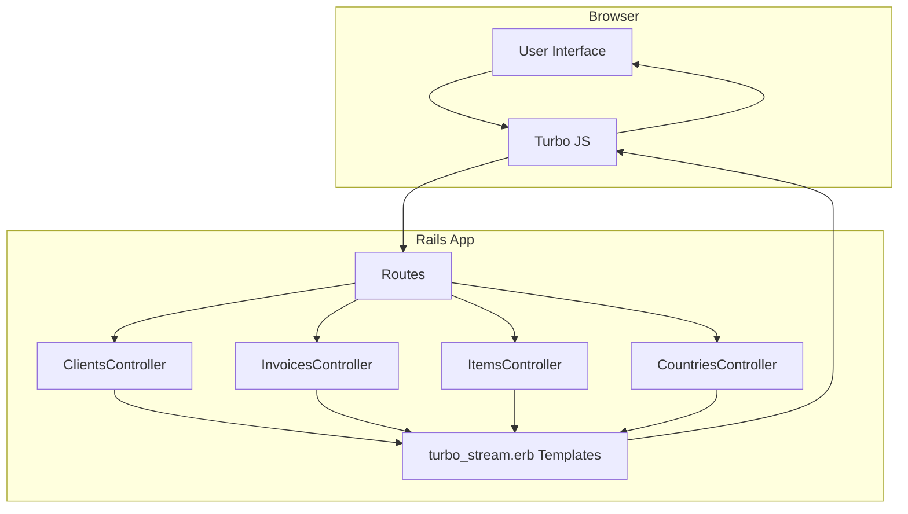
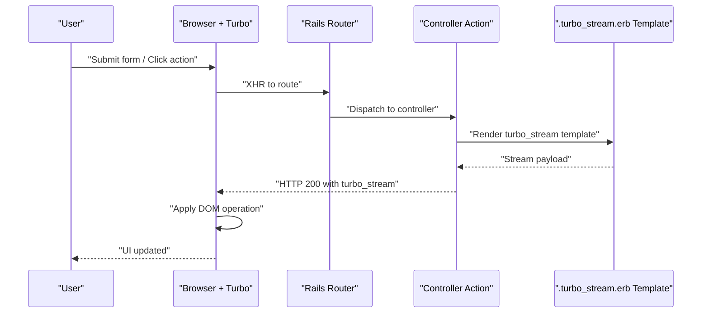
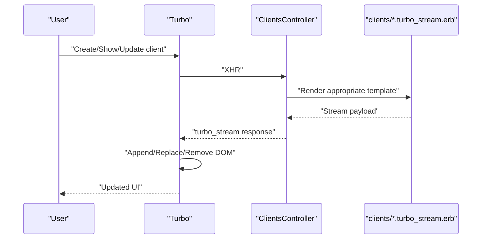
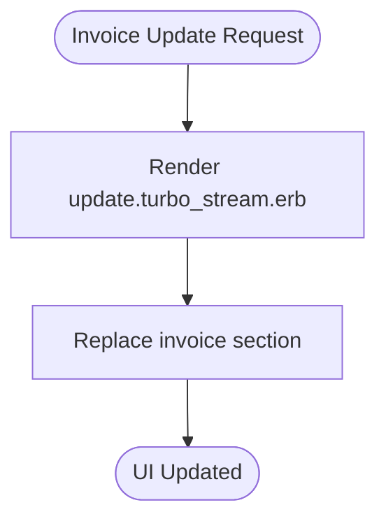
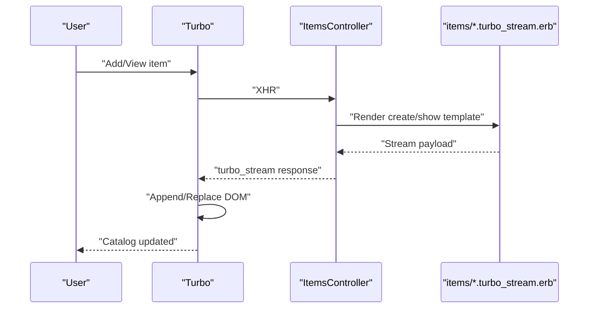
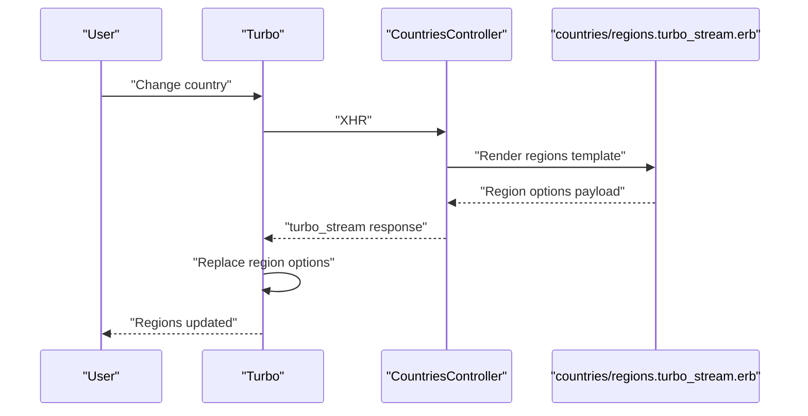
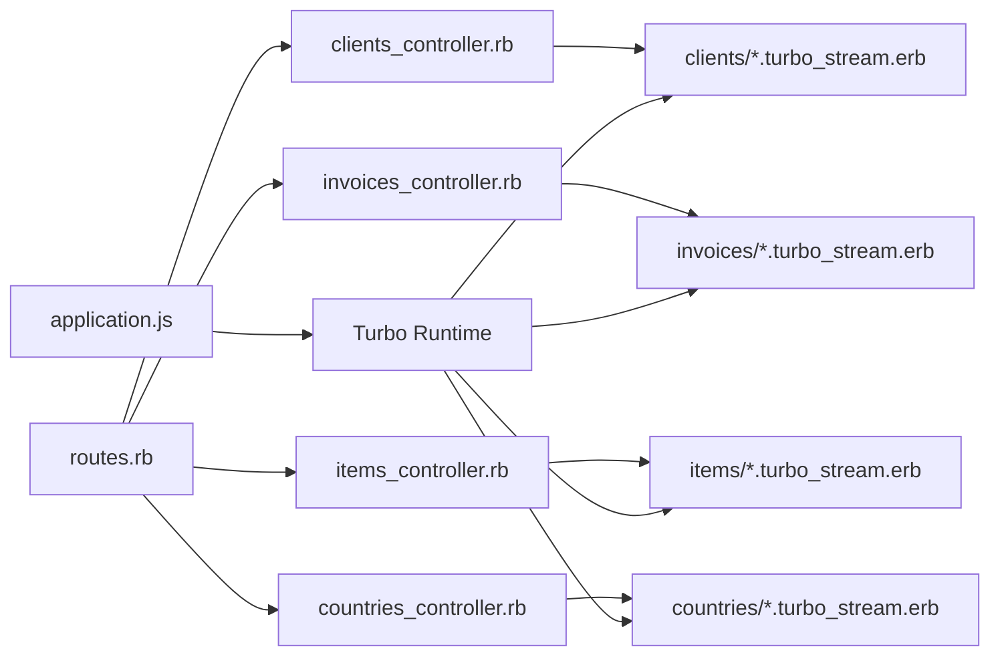

# Turbo Streams Implementation

<cite>
**Referenced Files in This Document**
- [clients_controller.rb](file://app/controllers/clients_controller.rb)
- [create.turbo_stream.erb](file://app/views/clients/create.turbo_stream.erb)
- [show.turbo_stream.erb](file://app/views/clients/show.turbo_stream.erb)
- [update.turbo_stream.erb](file://app/views/clients/update.turbo_stream.erb)
- [invoices_controller.rb](file://app/controllers/invoices_controller.rb)
- [update.turbo_stream.erb](file://app/views/invoices/update.turbo_stream.erb)
- [items_controller.rb](file://app/controllers/items_controller.rb)
- [create.turbo_stream.erb](file://app/views/items/create.turbo_stream.erb)
- [show.turbo_stream.erb](file://app/views/items/show.turbo_stream.erb)
- [countries_controller.rb](file://app/controllers/countries_controller.rb)
- [regions.turbo_stream.erb](file://app/views/countries/regions.turbo_stream.erb)
- [application.js](file://app/javascript/application.js)
- [routes.rb](file://config/routes.rb)
</cite>

## Table of Contents
1. [Introduction](#introduction)
2. [Project Structure](#project-structure)
3. [Core Components](#core-components)
4. [Architecture Overview](#architecture-overview)
5. [Detailed Component Analysis](#detailed-component-analysis)
6. [Dependency Analysis](#dependency-analysis)
7. [Performance Considerations](#performance-considerations)
8. [Troubleshooting Guide](#troubleshooting-guide)
9. [Conclusion](#conclusion)

## Introduction
This document explains how Turbo Streams is implemented in the application to deliver partial page updates without full reloads. It covers stream actions (append, prepend, replace, remove), target element selection, and the specific templates used for clients, invoices, items, and countries regions. It also includes guidance on creating custom responses, handling errors, optimizing performance, browser compatibility, fallback strategies, and debugging techniques.

## Project Structure
Turbo Streams are enabled via the JavaScript pipeline and applied through controller actions that respond with .turbo_stream.erb templates. The relevant parts of the codebase include:
- Controllers that render turbo stream responses
- View templates ending with .turbo_stream.erb that define DOM operations
- JavaScript entrypoint that loads Turbo
- Routes that wire requests to controllers

**Diagram sources**
- [application.js](file://app/javascript/application.js)
- [routes.rb](file://config/routes.rb)
- [clients_controller.rb](file://app/controllers/clients_controller.rb)
- [invoices_controller.rb](file://app/controllers/invoices_controller.rb)
- [items_controller.rb](file://app/controllers/items_controller.rb)
- [countries_controller.rb](file://app/controllers/countries_controller.rb)

**Section sources**
- [application.js](file://app/javascript/application.js)
- [routes.rb](file://config/routes.rb)

## Core Components
- Turbo Streams client-side runtime: Loaded by the application’s JavaScript entrypoint to intercept requests and apply server-provided stream instructions to the DOM.
- Server-side stream templates: .turbo_stream.erb files that declare DOM operations (append, prepend, replace, remove) targeting elements by id or other selectors.
- Controller actions: Respond with turbo_stream format when requested, returning only the minimal HTML needed to update the page.

Key responsibilities:
- Controllers decide which template to render based on request parameters and business logic.
- Templates specify the action and target element selector.
- The Turbo client applies changes instantly without reloading the page.

**Section sources**
- [application.js](file://app/javascript/application.js)
- [clients_controller.rb](file://app/controllers/clients_controller.rb)
- [invoices_controller.rb](file://app/controllers/invoices_controller.rb)
- [items_controller.rb](file://app/controllers/items_controller.rb)
- [countries_controller.rb](file://app/controllers/countries_controller.rb)

## Architecture Overview
The typical flow for a real-time update:
1. A user interaction triggers a form submission or click.
2. Turbo sends an XHR to the Rails route.
3. The controller renders a .turbo_stream.erb response.
4. Turbo parses the response and executes the specified DOM operation.
5. The UI updates immediately.

[No sources needed since this diagram shows conceptual workflow, not actual code structure]

## Detailed Component Analysis

### Clients: Create, Show, Update Streams
Purpose:
- Dynamically manage clients with instant feedback after create, show, and update operations.

How it works:
- Client creation: On successful create, the controller responds with a turbo stream that appends the new client card into the list container.
- Client show: When viewing a client detail, the controller can return a stream that replaces the main content area with the client show fragment.
- Client update: After updating a client, the controller returns a stream that replaces the affected list item or detail section.

Targeting strategy:
- Use stable element ids for containers (e.g., a list wrapper) and individual items so append/replace operations are deterministic.

Error handling:
- For validation failures, respond with a stream that replaces the form with error messages, keeping the user context intact.

**Diagram sources**
- [clients_controller.rb](file://app/controllers/clients_controller.rb)
- [create.turbo_stream.erb](file://app/views/clients/create.turbo_stream.erb)
- [show.turbo_stream.erb](file://app/views/clients/show.turbo_stream.erb)
- [update.turbo_stream.erb](file://app/views/clients/update.turbo_stream.erb)

**Section sources**
- [clients_controller.rb](file://app/controllers/clients_controller.rb)
- [create.turbo_stream.erb](file://app/views/clients/create.turbo_stream.erb)
- [show.turbo_stream.erb](file://app/views/clients/show.turbo_stream.erb)
- [update.turbo_stream.erb](file://app/views/clients/update.turbo_stream.erb)

### Invoices: Real-Time Updates Stream
Purpose:
- Provide live updates to invoice details or lists without reloading the page.

How it works:
- On invoice update, the controller returns a stream that replaces the invoice summary or line items section.
- Targeted replacement ensures only changed parts are refreshed.

Best practices:
- Keep the invoice container id stable across renders.
- Use small fragments to minimize payload size.

**Diagram sources**
- [invoices_controller.rb](file://app/controllers/invoices_controller.rb)
- [update.turbo_stream.erb](file://app/views/invoices/update.turbo_stream.erb)

**Section sources**
- [invoices_controller.rb](file://app/controllers/invoices_controller.rb)
- [update.turbo_stream.erb](file://app/views/invoices/update.turbo_stream.erb)

### Items: Catalog Updates Stream
Purpose:
- Maintain a responsive catalog view where adding or viewing items updates the UI instantly.

How it works:
- Create: Append the new item row/card to the catalog list.
- Show: Replace the main content with the item detail fragment.

Targeting strategy:
- Ensure each item has a unique id to support precise replace/remove operations.

**Diagram sources**
- [items_controller.rb](file://app/controllers/items_controller.rb)
- [create.turbo_stream.erb](file://app/views/items/create.turbo_stream.erb)
- [show.turbo_stream.erb](file://app/views/items/show.turbo_stream.erb)

**Section sources**
- [items_controller.rb](file://app/controllers/items_controller.rb)
- [create.turbo_stream.erb](file://app/views/items/create.turbo_stream.erb)
- [show.turbo_stream.erb](file://app/views/items/show.turbo_stream.erb)

### Countries Regions: Cascading Dropdowns Stream
Purpose:
- Dynamically populate region dropdowns based on selected country without reloading the page.

How it works:
- When the country selection changes, Turbo sends a request to the countries controller.
- The controller renders a regions stream that replaces the region select options.

**Diagram sources**
- [countries_controller.rb](file://app/controllers/countries_controller.rb)
- [regions.turbo_stream.erb](file://app/views/countries/regions.turbo_stream.erb)

**Section sources**
- [countries_controller.rb](file://app/controllers/countries_controller.rb)
- [regions.turbo_stream.erb](file://app/views/countries/regions.turbo_stream.erb)

## Dependency Analysis
- Turbo JS is loaded in the application JavaScript entrypoint and handles all stream processing in the browser.
- Controllers depend on routes to dispatch requests and on views (.turbo_stream.erb) to produce payloads.
- Templates depend on consistent DOM ids and selectors to ensure reliable targeting.

**Diagram sources**
- [application.js](file://app/javascript/application.js)
- [routes.rb](file://config/routes.rb)
- [clients_controller.rb](file://app/controllers/clients_controller.rb)
- [invoices_controller.rb](file://app/controllers/invoices_controller.rb)
- [items_controller.rb](file://app/controllers/items_controller.rb)
- [countries_controller.rb](file://app/controllers/countries_controller.rb)

**Section sources**
- [application.js](file://app/javascript/application.js)
- [routes.rb](file://config/routes.rb)

## Performance Considerations
- Minimize payload size: Return only the necessary fragments; avoid large nested structures.
- Stable selectors: Use predictable ids for targets to reduce reflows and improve reliability.
- Avoid redundant updates: Coalesce multiple rapid changes into a single stream when possible.
- Prefer replace over remove+append: Fewer DOM mutations lead to better performance.
- Debounce cascading updates: For dependent dropdowns like countries/regions, debounce input to prevent excessive requests.
- Cache static fragments: If certain sections rarely change, consider caching their rendered output.

[No sources needed since this section provides general guidance]

## Troubleshooting Guide
Common issues and resolutions:
- No update occurs:
  - Verify the target element id exists in the current DOM before the stream is applied.
  - Confirm the request is being sent as turbo_stream and the controller responds with the correct template.
- Wrong element updated:
  - Check selector specificity and ensure no duplicate ids exist.
- Validation errors not shown:
  - Ensure the form is replaced with a version that includes error messages.
- Network errors:
  - Inspect network tab for failed requests and status codes.
  - Implement client-side error handling to fall back to full page navigation if needed.

Debugging tips:
- Use browser DevTools to inspect XHR requests/responses and confirm stream payloads.
- Log controller rendering paths to verify the intended template is chosen.
- Temporarily render HTML responses instead of turbo_stream to validate fragment correctness.

**Section sources**
- [application.js](file://app/javascript/application.js)
- [clients_controller.rb](file://app/controllers/clients_controller.rb)
- [invoices_controller.rb](file://app/controllers/invoices_controller.rb)
- [items_controller.rb](file://app/controllers/items_controller.rb)
- [countries_controller.rb](file://app/controllers/countries_controller.rb)

## Conclusion
Turbo Streams in this application provide efficient, incremental UI updates by exchanging small HTML fragments between the server and the browser. By using targeted DOM operations and well-structured templates, the system achieves near-real-time interactions for clients, invoices, items, and cascading dropdowns. Following best practices around payload size, stable selectors, and robust error handling ensures a smooth user experience across browsers and devices.

[No sources needed since this section summarizes without analyzing specific files]