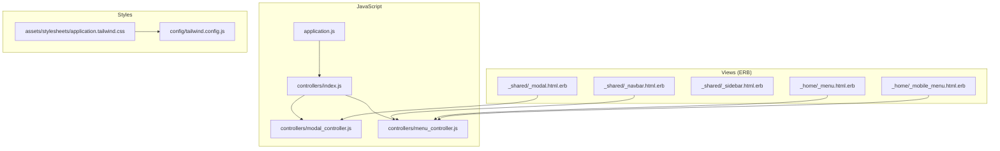
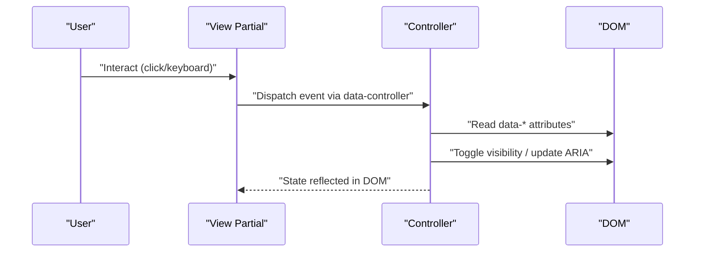
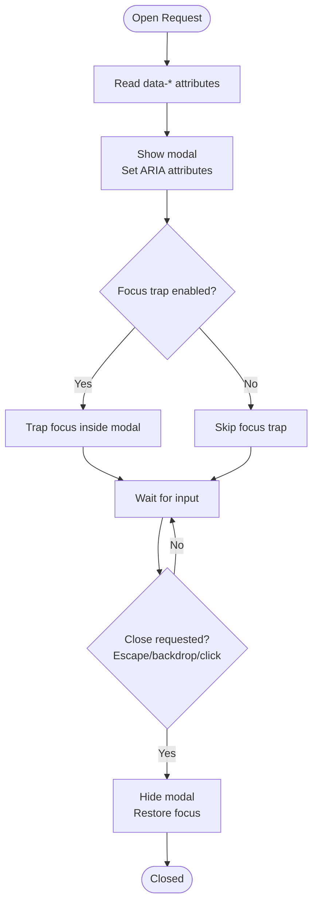
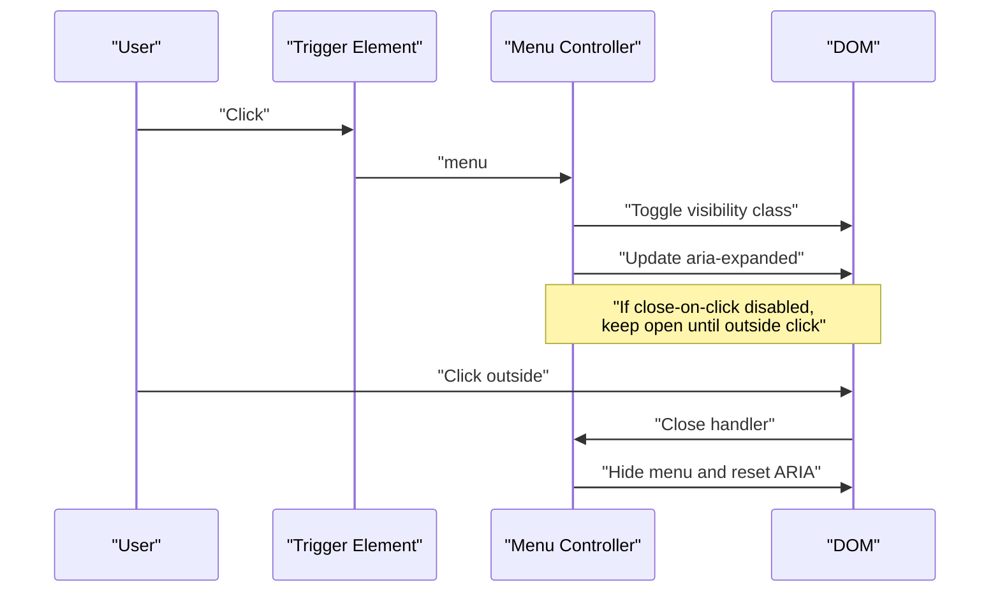
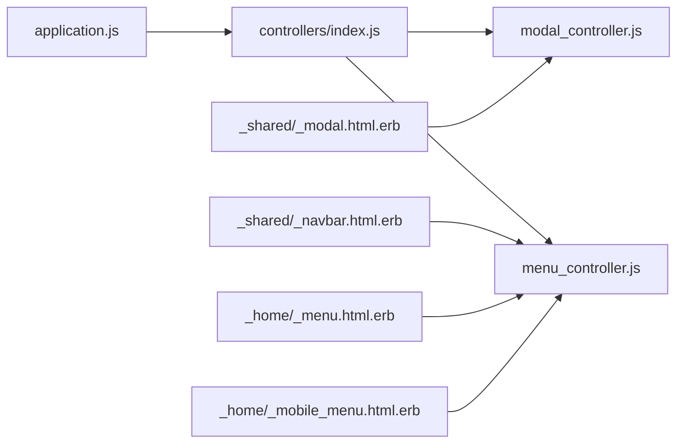

# UI Components & Interactions

<cite>
**Referenced Files in This Document**
- [modal_controller.js](file://app/javascript/controllers/modal_controller.js)
- [menu_controller.js](file://app/javascript/controllers/menu_controller.js)
- [_modal.html.erb](file://app/views/shared/_modal.html.erb)
- [_navbar.html.erb](file://app/views/shared/_navbar.html.erb)
- [_sidebar.html.erb](file://app/views/shared/_sidebar.html.erb)
- [_menu.html.erb](file://app/views/home/_menu.html.erb)
- [_mobile_menu.html.erb](file://app/views/home/_mobile_menu.html.erb)
- [application.tailwind.css](file://app/assets/stylesheets/application.tailwind.css)
- [tailwind.config.js](file://config/tailwind.config.js)
- [index.js](file://app/javascript/controllers/index.js)
- [application.js](file://app/javascript/application.js)
</cite>

## Table of Contents
1. [Introduction](#introduction)
2. [Project Structure](#project-structure)
3. [Core Components](#core-components)
4. [Architecture Overview](#architecture-overview)
5. [Detailed Component Analysis](#detailed-component-analysis)
6. [Dependency Analysis](#dependency-analysis)
7. [Performance Considerations](#performance-considerations)
8. [Troubleshooting Guide](#troubleshooting-guide)
9. [Conclusion](#conclusion)
10. [Appendices](#appendices)

## Introduction
This document explains the reusable UI components and interaction patterns used across the application, focusing on dialog management via a modal controller, navigation via a menu controller, and shared layout components such as modals, menus, sidebars, and navigation bars. It covers responsive design patterns (mobile-first), accessibility considerations, component composition, event delegation, state management, Tailwind CSS integration, animation patterns, performance optimization, APIs, customization options, and integration guidelines.

## Project Structure
The UI layer is organized into:
- JavaScript controllers for interactions (e.g., modal and menu controllers)
- Shared view partials for reusable UI elements (modals, navbar, sidebar, menus)
- Styles built with Tailwind CSS
- Import configuration for controllers and application bootstrap

**Diagram sources**
- [application.js](file://app/javascript/application.js)
- [index.js](file://app/javascript/controllers/index.js)
- [modal_controller.js](file://app/javascript/controllers/modal_controller.js)
- [menu_controller.js](file://app/javascript/controllers/menu_controller.js)
- [_modal.html.erb](file://app/views/shared/_modal.html.erb)
- [_navbar.html.erb](file://app/views/shared/_navbar.html.erb)
- [_sidebar.html.erb](file://app/views/shared/_sidebar.html.erb)
- [_menu.html.erb](file://app/views/home/_menu.html.erb)
- [_mobile_menu.html.erb](file://app/views/home/_mobile_menu.html.erb)
- [application.tailwind.css](file://app/assets/stylesheets/application.tailwind.css)
- [tailwind.config.js](file://config/tailwind.config.js)

**Section sources**
- [application.js](file://app/javascript/application.js)
- [index.js](file://app/javascript/controllers/index.js)
- [modal_controller.js](file://app/javascript/controllers/modal_controller.js)
- [menu_controller.js](file://app/javascript/controllers/menu_controller.js)
- [_modal.html.erb](file://app/views/shared/_modal.html.erb)
- [_navbar.html.erb](file://app/views/shared/_navbar.html.erb)
- [_sidebar.html.erb](file://app/views/shared/_sidebar.html.erb)
- [_menu.html.erb](file://app/views/home/_menu.html.erb)
- [_mobile_menu.html.erb](file://app/views/home/_mobile_menu.html.erb)
- [application.tailwind.css](file://app/assets/stylesheets/application.tailwind.css)
- [tailwind.config.js](file://config/tailwind.config.js)

## Core Components
- Modal Controller: Manages opening, closing, focus trapping, and keyboard handling for dialogs.
- Menu Controller: Manages dropdown and mobile menu visibility, toggling, and click-outside behavior.
- Shared Partials: Reusable markup for modals, navigation bar, sidebar, and desktop/mobile menus.
- Styling: Tailwind CSS classes for layout, spacing, typography, colors, and responsive breakpoints.

Key responsibilities:
- Encapsulate DOM manipulation within small, focused controllers.
- Use data attributes to configure behavior declaratively from templates.
- Provide consistent ARIA attributes and keyboard interactions for accessibility.
- Compose complex screens by combining small parts (partials + controllers).

**Section sources**
- [modal_controller.js](file://app/javascript/controllers/modal_controller.js)
- [menu_controller.js](file://app/javascript/controllers/menu_controller.js)
- [_modal.html.erb](file://app/views/shared/_modal.html.erb)
- [_navbar.html.erb](file://app/views/shared/_navbar.html.erb)
- [_sidebar.html.erb](file://app/views/shared/_sidebar.html.erb)
- [_menu.html.erb](file://app/views/home/_menu.html.erb)
- [_mobile_menu.html.erb](file://app/views/home/_mobile_menu.html.erb)

## Architecture Overview
The UI architecture follows a lightweight controller-driven pattern:
- Controllers are registered and auto-imported.
- View partials declare behavior through data attributes.
- Controllers listen for events (click, keydown, focus) and toggle visibility or perform actions.
- Tailwind CSS provides utility-first styling with responsive utilities.

[No sources needed since this diagram shows conceptual workflow, not actual code structure]

## Detailed Component Analysis

### Modal Controller
Responsibilities:
- Open/close modals based on triggers.
- Manage focus trap when open.
- Handle Escape key to close.
- Update ARIA attributes for screen readers.
- Coordinate with backdrop clicks to dismiss.

API surface (data attributes):
- Trigger element:
  - data-action="modal#open"
  - data-modal-target="dialog"
- Dialog element:
  - data-controller="modal"
  - data-modal-target="dialog"
  - data-modal-close-on-backdrop="true|false"
  - data-modal-focus-trap="true|false"

Event delegation:
- Listens for clicks on trigger elements and backdrop.
- Listens for keydown on document for Escape.

State management:
- Tracks whether the modal is open.
- Stores previously focused element to restore focus after close.

Accessibility:
- Sets aria-hidden and aria-modal appropriately.
- Ensures focus moves into the modal when opened and returns on close.

Responsive behavior:
- Uses Tailwind responsive utilities to adjust size and positioning.

Animation patterns:
- Toggles classes to animate entrance/exit (e.g., opacity/transform transitions).

**Diagram sources**
- [modal_controller.js](file://app/javascript/controllers/modal_controller.js)
- [_modal.html.erb](file://app/views/shared/_modal.html.erb)

**Section sources**
- [modal_controller.js](file://app/javascript/controllers/modal_controller.js)
- [_modal.html.erb](file://app/views/shared/_modal.html.erb)

### Menu Controller
Responsibilities:
- Toggle dropdown menus and mobile menus.
- Close menus when clicking outside.
- Manage active states and nested items.
- Support keyboard navigation (arrow keys, Enter, Escape).

API surface (data attributes):
- Trigger element:
  - data-action="menu#toggle"
  - data-menu-target="dropdown"
- Menu container:
  - data-controller="menu"
  - data-menu-target="dropdown"
  - data-menu-close-on-click="true|false"
  - data-menu-position="auto|top|bottom|left|right"

Event delegation:
- Click on trigger toggles visibility.
- Click outside closes open menus.
- Keyboard events navigate and activate items.

State management:
- Tracks open/closed state per menu instance.
- Optionally tracks active item index for keyboard navigation.

Accessibility:
- Uses aria-expanded, aria-haspopup, role="menu", and role="menuitem".
- Moves focus to first item when opened; returns to trigger on close.

Responsive behavior:
- Desktop: inline dropdowns.
- Mobile: full-screen overlay or slide-in panel.

Animation patterns:
- Transition classes for fade/slide effects.

**Diagram sources**
- [menu_controller.js](file://app/javascript/controllers/menu_controller.js)
- [_navbar.html.erb](file://app/views/shared/_navbar.html.erb)
- [_menu.html.erb](file://app/views/home/_menu.html.erb)
- [_mobile_menu.html.erb](file://app/views/home/_mobile_menu.html.erb)

**Section sources**
- [menu_controller.js](file://app/javascript/controllers/menu_controller.js)
- [_navbar.html.erb](file://app/views/shared/_navbar.html.erb)
- [_menu.html.erb](file://app/views/home/_menu.html.erb)
- [_mobile_menu.html.erb](file://app/views/home/_mobile_menu.html.erb)

### Shared Components

#### Modal Partial
- Provides a consistent modal shell with backdrop and content area.
- Declares data attributes consumed by the modal controller.
- Integrates with Tailwind for spacing, z-index, and responsive sizing.

Integration points:
- Include via render partial in views.
- Reference target IDs from triggers.

**Section sources**
- [_modal.html.erb](file://app/views/shared/_modal.html.erb)
- [modal_controller.js](file://app/javascript/controllers/modal_controller.js)

#### Navigation Bar Partial
- Contains brand, primary links, and user controls.
- Uses menu controller for dropdowns and mobile menu toggle.
- Responsive layout switches between horizontal nav and hamburger menu.

**Section sources**
- [_navbar.html.erb](file://app/views/shared/_navbar.html.erb)
- [menu_controller.js](file://app/javascript/controllers/menu_controller.js)

#### Sidebar Partial
- Persistent navigation for dashboards or admin areas.
- Collapsible on smaller screens using menu controller logic.
- Highlights active routes and supports nested sections.

**Section sources**
- [_sidebar.html.erb](file://app/views/shared/_sidebar.html.erb)

#### Home Menus
- Desktop menu (_menu.html.erb) and mobile menu (_mobile_menu.html.erb) share menu controller behaviors.
- Mobile menu may use an overlay pattern for better touch targets.

**Section sources**
- [_menu.html.erb](file://app/views/home/_menu.html.erb)
- [_mobile_menu.html.erb](file://app/views/home/_mobile_menu.html.erb)
- [menu_controller.js](file://app/javascript/controllers/menu_controller.js)

### Responsive Design Patterns and Mobile-First Approach
- Use Tailwind’s responsive prefixes to progressively enhance layouts from mobile to desktop.
- Prefer stacking layouts and larger touch targets on small screens.
- Switch from inline dropdowns to overlay panels on mobile.
- Ensure critical actions remain accessible without hover-only interactions.

Tailwind integration:
- Global styles imported from application.tailwind.css.
- Custom theme extensions configured in tailwind.config.js.

**Section sources**
- [application.tailwind.css](file://app/assets/stylesheets/application.tailwind.css)
- [tailwind.config.js](file://config/tailwind.config.js)

### Accessibility Compliance
- Semantic HTML roles and attributes (aria-expanded, aria-hidden, aria-modal, role="menu", role="menuitem").
- Keyboard support: Escape to close, Tab/Shift+Tab for focus movement, arrow keys for menu traversal.
- Focus management: move focus into modal on open, return to trigger on close; ensure visible focus indicators.
- Color contrast and scalable text: rely on Tailwind defaults and avoid low-contrast combinations.

**Section sources**
- [modal_controller.js](file://app/javascript/controllers/modal_controller.js)
- [menu_controller.js](file://app/javascript/controllers/menu_controller.js)
- [_modal.html.erb](file://app/views/shared/_modal.html.erb)

### Event Delegation and State Management
- Event delegation: attach handlers at controller scope to minimize listeners and handle dynamic content.
- State management: keep minimal state in controllers (open/closed, active index); reflect state in DOM via classes and ARIA attributes.
- Composition: combine controllers with partials to build complex interfaces (e.g., navbar with dropdowns and mobile menu).

**Section sources**
- [modal_controller.js](file://app/javascript/controllers/modal_controller.js)
- [menu_controller.js](file://app/javascript/controllers/menu_controller.js)

### Animation Patterns
- Use CSS transitions for smooth open/close animations.
- Apply transition classes conditionally based on state.
- Keep animations short and respect prefers-reduced-motion where possible.

**Section sources**
- [modal_controller.js](file://app/javascript/controllers/modal_controller.js)
- [menu_controller.js](file://app/javascript/controllers/menu_controller.js)
- [application.tailwind.css](file://app/assets/stylesheets/application.tailwind.css)

## Dependency Analysis
Controllers are bootstrapped and auto-imported, ensuring they are available to any view that declares them.

**Diagram sources**
- [application.js](file://app/javascript/application.js)
- [index.js](file://app/javascript/controllers/index.js)
- [modal_controller.js](file://app/javascript/controllers/modal_controller.js)
- [menu_controller.js](file://app/javascript/controllers/menu_controller.js)
- [_modal.html.erb](file://app/views/shared/_modal.html.erb)
- [_navbar.html.erb](file://app/views/shared/_navbar.html.erb)
- [_menu.html.erb](file://app/views/home/_menu.html.erb)
- [_mobile_menu.html.erb](file://app/views/home/_mobile_menu.html.erb)

**Section sources**
- [application.js](file://app/javascript/application.js)
- [index.js](file://app/javascript/controllers/index.js)
- [modal_controller.js](file://app/javascript/controllers/modal_controller.js)
- [menu_controller.js](file://app/javascript/controllers/menu_controller.js)

## Performance Considerations
- Minimize DOM queries by caching references within controllers.
- Use event delegation to reduce listener count.
- Debounce heavy operations (e.g., search/filter) if added to menus/modals.
- Avoid layout thrashing by batching DOM reads/writes.
- Prefer CSS transitions over JS-based animations.
- Lazy-load non-critical content inside modals when appropriate.

[No sources needed since this section provides general guidance]

## Troubleshooting Guide
Common issues and resolutions:
- Modal does not close on Escape:
  - Verify keydown listener is attached and data attributes are correct.
  - Ensure no other script prevents default behavior.
- Focus not trapped in modal:
  - Confirm focus trap is enabled and tabbable elements exist inside the modal.
- Dropdown closes unexpectedly:
  - Check close-on-click and click-outside handlers; ensure trigger and menu containers have correct targets.
- Mobile menu not appearing:
  - Validate responsive classes and that the toggle button has the correct action binding.
- Animations not playing:
  - Ensure transition classes are applied and not overridden by custom styles.

**Section sources**
- [modal_controller.js](file://app/javascript/controllers/modal_controller.js)
- [menu_controller.js](file://app/javascript/controllers/menu_controller.js)

## Conclusion
The UI layer leverages small, composable controllers and shared partials to deliver consistent, accessible, and responsive interactions. The modal and menu controllers encapsulate common patterns like focus management, keyboard support, and event delegation. Tailwind CSS enables rapid, maintainable styling with responsive utilities. By following the APIs and guidelines outlined here, teams can extend and reuse these components effectively while maintaining performance and accessibility.

[No sources needed since this section summarizes without analyzing specific files]

## Appendices

### Integration Guidelines
- Register controllers via the central index file to enable automatic discovery.
- Declare behavior in templates using data attributes on triggers and containers.
- Keep markup semantic and include ARIA attributes for assistive technologies.
- Use Tailwind classes consistently; extend the theme only when necessary.

**Section sources**
- [index.js](file://app/javascript/controllers/index.js)
- [application.js](file://app/javascript/application.js)
- [tailwind.config.js](file://config/tailwind.config.js)

### Component API Summary

- Modal Controller
  - Data attributes:
    - data-controller="modal"
    - data-modal-target="dialog"
    - data-modal-close-on-backdrop="true|false"
    - data-modal-focus-trap="true|false"
  - Actions:
    - data-action="modal#open"
  - Responsibilities:
    - Open/close, focus trap, Escape handling, ARIA updates, backdrop dismissal.

- Menu Controller
  - Data attributes:
    - data-controller="menu"
    - data-menu-target="dropdown"
    - data-menu-close-on-click="true|false"
    - data-menu-position="auto|top|bottom|left|right"
  - Actions:
    - data-action="menu#toggle"
  - Responsibilities:
    - Toggle visibility, click-outside close, keyboard navigation, ARIA updates.

**Section sources**
- [modal_controller.js](file://app/javascript/controllers/modal_controller.js)
- [menu_controller.js](file://app/javascript/controllers/menu_controller.js)