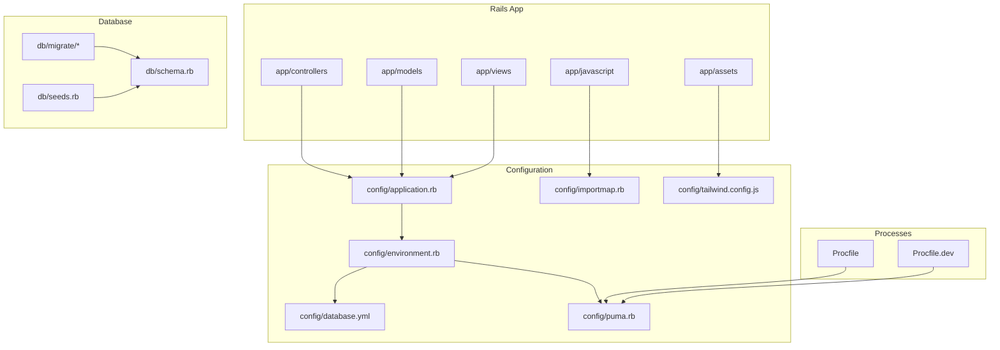
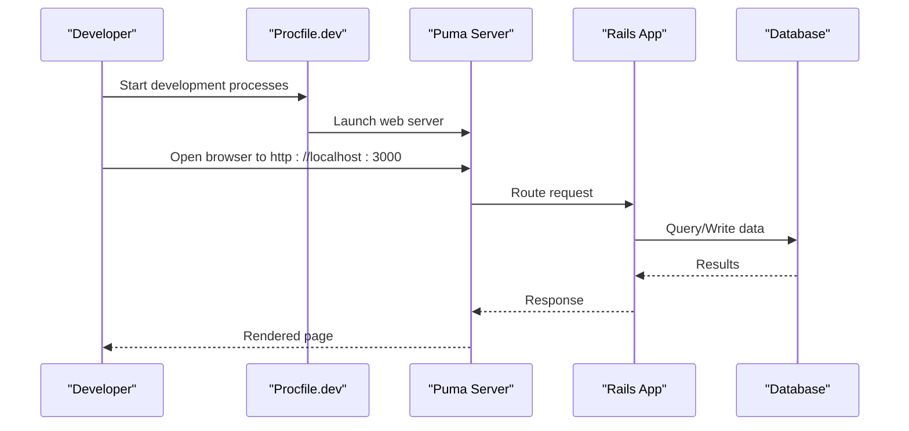
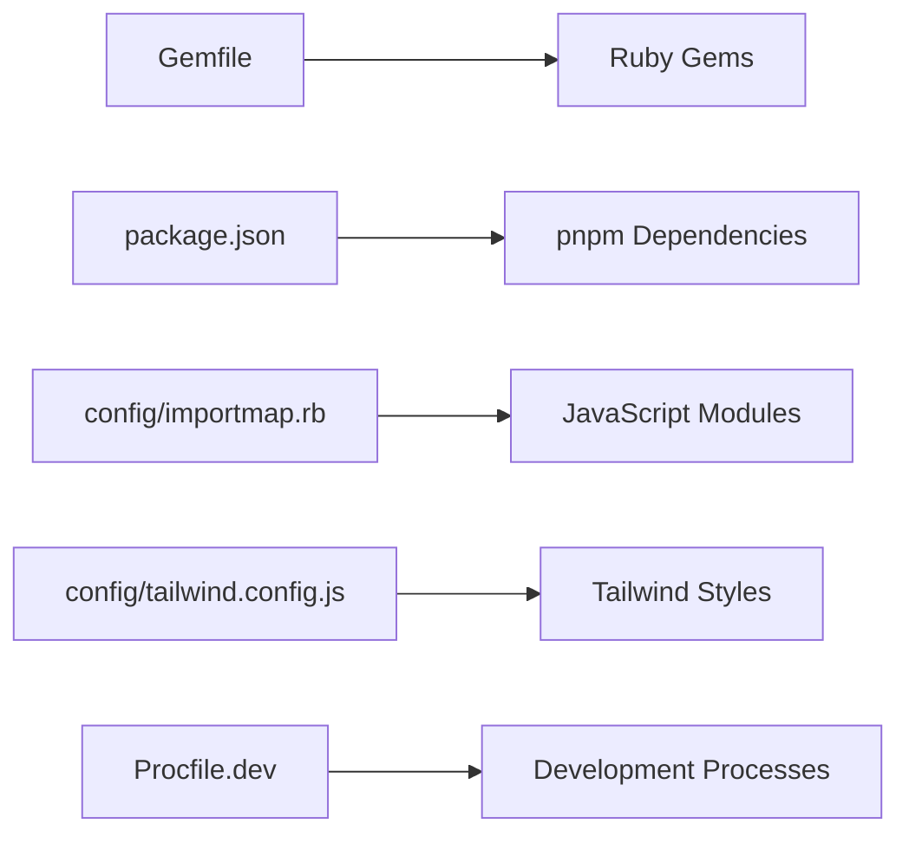

# Getting Started

<cite>
**Referenced Files in This Document**
- [README.md](file://README.md)
- [Gemfile](file://Gemfile)
- [Procfile](file://Procfile)
- [Procfile.dev](file://Procfile.dev)
- [config/database.yml](file://config/database.yml)
- [config/application.rb](file://config/application.rb)
- [config/environment.rb](file://config/environment.rb)
- [config/puma.rb](file://config/puma.rb)
- [config/importmap.rb](file://config/importmap.rb)
- [config/tailwind.config.js](file://config/tailwind.config.js)
- [package.json](file://package.json)
- [bin/render-build.sh](file://bin/render-build.sh)
- [db/schema.rb](file://db/schema.rb)
- [db/seeds.rb](file://db/seeds.rb)
- [Rakefile](file://Rakefile)
</cite>

## Table of Contents
1. Introduction
2. Project Structure
3. Core Components
4. Architecture Overview
5. Detailed Component Analysis
6. Dependency Analysis
7. Performance Considerations
8. Troubleshooting Guide
9. Conclusion

## Introduction
This guide helps you set up and run the Invoicing Rails application locally for development. It covers prerequisites, environment setup, database configuration, dependency installation, initial project setup, common commands, and verification steps to ensure everything is working correctly.

## Project Structure
The repository follows a standard Rails layout with additional frontend tooling (Importmap, Tailwind CSS) and Procfiles for process management. Key areas include:
- Application code under app/
- Configuration files under config/
- Database migrations and seeds under db/
- Frontend assets and JavaScript under app/assets and app/javascript
- Process definitions for development and production under Procfile and Procfile.dev

[No sources needed since this diagram shows conceptual structure]

## Core Components
- Ruby and Rails runtime: The application uses a Gemfile to declare dependencies and a Rakefile for tasks.
- Web server: Puma is configured via config/puma.rb.
- Database: PostgreSQL or SQLite can be used; settings are defined in config/database.yml.
- Frontend pipeline: Importmap manages JavaScript modules; Tailwind CSS is configured via config/tailwind.config.js.
- Process manager: Procfile and Procfile.dev define processes for production and development.

Key configuration points:
- Environment defaults and boot sequence: config/application.rb and config/environment.rb
- Database connections: config/database.yml
- Asset pipeline: config/importmap.rb and config/tailwind.config.js
- Processes: Procfile and Procfile.dev

**Section sources**
- [Gemfile](file://Gemfile)
- [Rakefile](file://Rakefile)
- [config/application.rb](file://config/application.rb)
- [config/environment.rb](file://config/environment.rb)
- [config/database.yml](file://config/database.yml)
- [config/puma.rb](file://config/puma.rb)
- [config/importmap.rb](file://config/importmap.rb)
- [config/tailwind.config.js](file://config/tailwind.config.js)
- [Procfile](file://Procfile)
- [Procfile.dev](file://Procfile.dev)

## Architecture Overview
At a high level, requests flow through Puma into Rails controllers, which interact with models backed by the database. Frontend assets are served using Importmap and Tailwind CSS. Development and production environments use different process configurations.

**Diagram sources**
- [Procfile.dev](file://Procfile.dev)
- [config/puma.rb](file://config/puma.rb)
- [config/database.yml](file://config/database.yml)

## Detailed Component Analysis

### Prerequisites
- Ruby version compatible with the project’s Gemfile
- Node.js and pnpm (for asset building if required)
- A supported database engine (PostgreSQL or SQLite) installed and accessible
- Git for cloning the repository

Verification tips:
- Confirm Ruby version matches the project specification.
- Ensure Node.js and pnpm are available on PATH.
- Verify database client tools are installed and reachable.

**Section sources**
- [Gemfile](file://Gemfile)
- [package.json](file://package.json)

### Installation Steps
1. Clone the repository and navigate into the project directory.
2. Install Ruby gems:
   - Run bundle install to install all dependencies declared in the Gemfile.
3. Install JavaScript packages:
   - If the project uses pnpm, run pnpm install to fetch frontend dependencies.
4. Configure the database:
   - Edit config/database.yml to match your local database credentials and adapter.
5. Prepare the database:
   - Create databases and run migrations: rails db:create && rails db:migrate
   - Optionally seed sample data: rails db:seed
6. Build assets (if required):
   - Use the appropriate command from package.json scripts to build assets.
7. Start the application:
   - For development, use the provided Procfile.dev or start Puma directly.

Common commands:
- rails s or rails server: Start the Rails server
- rails console: Open an interactive Rails console
- rails db:create / rails db:migrate / rails db:seed: Manage the database
- bin/dev: Start development processes defined in Procfile.dev
- pnpm build: Build frontend assets if configured

**Section sources**
- [Gemfile](file://Gemfile)
- [package.json](file://package.json)
- [config/database.yml](file://config/database.yml)
- [Rakefile](file://Rakefile)
- [Procfile.dev](file://Procfile.dev)

### Environment Setup
- Local development environment variables:
  - Set any required environment variables before starting the app. Typical variables include database URLs or feature flags.
- Credentials:
  - If encrypted credentials are used, configure them according to the project’s conventions.
- Mailer and storage:
  - Ensure mail delivery and Active Storage backends are configured for local development if needed.

**Section sources**
- [config/application.rb](file://config/application.rb)
- [config/environment.rb](file://config/environment.rb)
- [config/database.yml](file://config/database.yml)

### Database Configuration
- Adapter selection:
  - Choose the correct adapter (e.g., PostgreSQL or SQLite) in config/database.yml.
- Connection details:
  - Provide host, port, username, password, and database names per environment.
- Extensions and locales:
  - Some migrations may require extensions (e.g., unaccent). Ensure they are enabled for your database.

Verification:
- After running migrations, check db/schema.rb to confirm tables exist.
- Seed data should populate essential records for initial exploration.

**Section sources**
- [config/database.yml](file://config/database.yml)
- [db/schema.rb](file://db/schema.rb)
- [db/seeds.rb](file://db/seeds.rb)

### Initial Project Setup
- Create and migrate the database:
  - rails db:create && rails db:migrate
- Seed data:
  - rails db:seed
- Build assets:
  - Use the build script from package.json if required by the project.
- Start the server:
  - rails s or bin/dev

First steps after setup:
- Visit http://localhost:3000 in your browser.
- Explore core features such as clients, invoices, and items.
- Use rails console to inspect models and relationships.

**Section sources**
- [Rakefile](file://Rakefile)
- [package.json](file://package.json)
- [Procfile.dev](file://Procfile.dev)

### Development Workflow
- Running processes:
  - Use Procfile.dev to start multiple processes (web server, asset watchers, etc.).
- Asset pipeline:
  - Importmap manages JavaScript imports; Tailwind CSS is configured via its config file.
- Hot reload and live updates:
  - Depending on your setup, changes to views and styles may reflect automatically.

**Section sources**
- [Procfile.dev](file://Procfile.dev)
- [config/importmap.rb](file://config/importmap.rb)
- [config/tailwind.config.js](file://config/tailwind.config.js)

### Production Build Notes
- The repository includes a build script for deployment platforms like Render.
- Ensure environment variables and secrets are configured appropriately for production.

**Section sources**
- [bin/render-build.sh](file://bin/render-build.sh)
- [Procfile](file://Procfile)

## Dependency Analysis
- Ruby dependencies are managed via the Gemfile.
- JavaScript dependencies are managed via package.json and pnpm lockfile.
- Asset pipeline integrates Importmap and Tailwind CSS.

**Diagram sources**
- [Gemfile](file://Gemfile)
- [package.json](file://package.json)
- [config/importmap.rb](file://config/importmap.rb)
- [config/tailwind.config.js](file://config/tailwind.config.js)
- [Procfile.dev](file://Procfile.dev)

**Section sources**
- [Gemfile](file://Gemfile)
- [package.json](file://package.json)
- [config/importmap.rb](file://config/importmap.rb)
- [config/tailwind.config.js](file://config/tailwind.config.js)
- [Procfile.dev](file://Procfile.dev)

## Performance Considerations
- Use the development server with hot reloading for faster iteration.
- Keep database indexes optimized; review migrations for performance-critical queries.
- Precompile assets in production to reduce request latency.
- Monitor memory usage and connection pools when scaling processes.

[No sources needed since this section provides general guidance]

## Troubleshooting Guide
- Ruby version mismatch:
  - Ensure your Ruby version matches the project’s specification.
- Missing Node.js or pnpm:
  - Install Node.js and pnpm, then reinstall frontend dependencies.
- Database connection errors:
  - Verify config/database.yml settings and that the database service is running.
  - Check permissions and network access for remote databases.
- Migration failures:
  - Review migration logs and ensure required extensions are enabled.
- Asset build issues:
  - Clear tmp/cache and rebuild assets; verify importmap and Tailwind configuration.
- Port conflicts:
  - Change the default port in Puma configuration if 3000 is already in use.

Verification steps:
- Run rails db:setup to create, migrate, and seed the database in one step.
- Start the server and visit http://localhost:3000 to confirm the app loads.
- Use rails console to load models and perform basic queries.

**Section sources**
- [config/database.yml](file://config/database.yml)
- [config/puma.rb](file://config/puma.rb)
- [config/importmap.rb](file://config/importmap.rb)
- [config/tailwind.config.js](file://config/tailwind.config.js)
- [Rakefile](file://Rakefile)

## Conclusion
You now have the essentials to set up, configure, and run the Invoicing Rails application locally. Follow the installation and verification steps, adjust database and environment settings as needed, and use the development workflow to iterate quickly. Refer to the troubleshooting guide for common issues and consult the referenced configuration files for deeper customization.