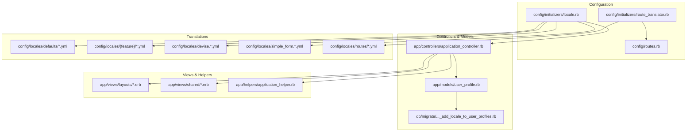
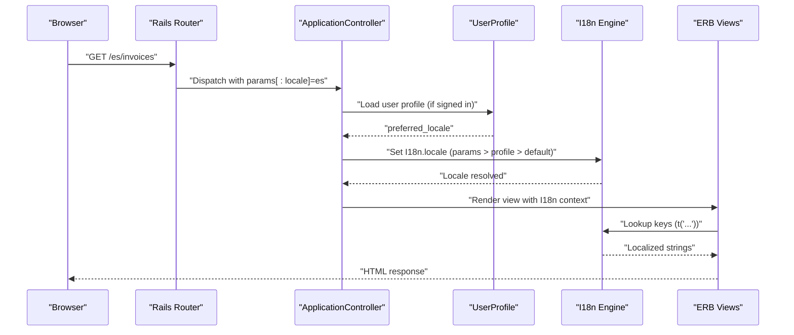
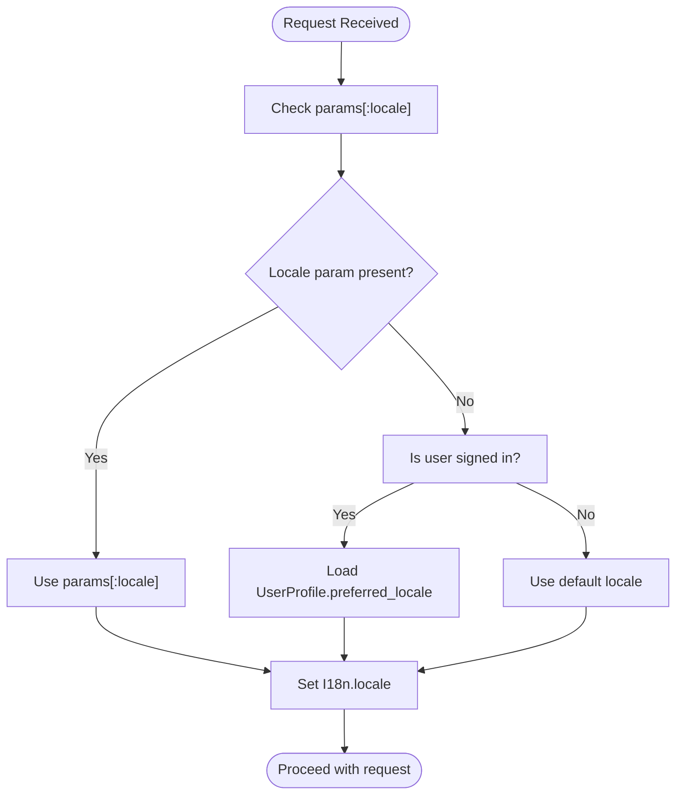
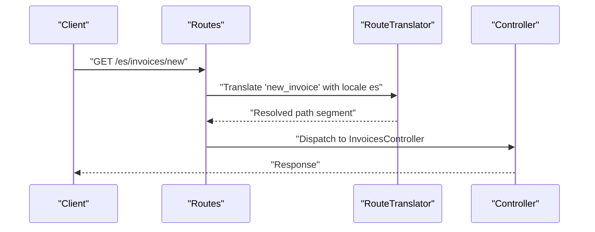
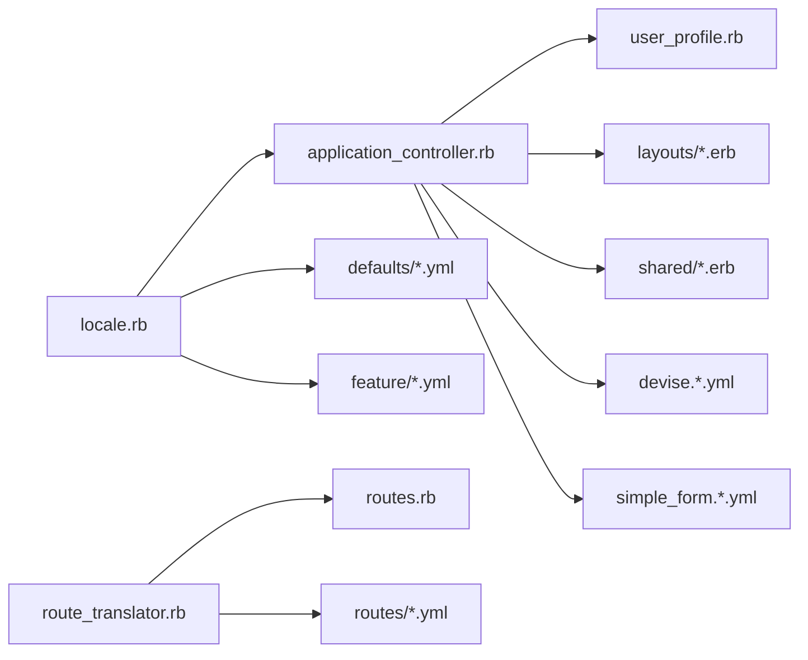

# Internationalization (i18n)

<cite>
**Referenced Files in This Document**
- [config/initializers/locale.rb](file://config/initializers/locale.rb)
- [config/initializers/route_translator.rb](file://config/initializers/route_translator.rb)
- [config/routes.rb](file://config/routes.rb)
- [app/controllers/application_controller.rb](file://app/controllers/application_controller.rb)
- [app/models/user_profile.rb](file://app/models/user_profile.rb)
- [db/migrate/20231224164322_add_locale_to_user_profiles.rb](file://db/migrate/20231224164322_add_locale_to_user_profiles.rb)
- [config/locales/devise.en.yml](file://config/locales/devise.en.yml)
- [config/locales/devise.es.yml](file://config/locales/devise.es.yml)
- [config/locales/simple_form.en.yml](file://config/locales/simple_form.en.yml)
- [config/locales/defaults/en.yml](file://config/locales/defaults/en.yml)
- [config/locales/defaults/es.yml](file://config/locales/defaults/es.yml)
- [config/locales/home/en.yml](file://config/locales/home/en.yml)
- [config/locales/home/es.yml](file://config/locales/home/es.yml)
- [config/locales/invoices/en.yml](file://config/locales/invoices/en.yml)
- [config/locales/invoices/es.yml](file://config/locales/invoices/es.yml)
- [config/locales/items/en.yml](file://config/locales/items/en.yml)
- [config/locales/items/es.yml](file://config/locales/items/es.yml)
- [config/locales/clients/en.yml](file://config/locales/clients/en.yml)
- [config/locales/clients/es.yml](file://config/locales/clients/es.yml)
- [config/locales/dashboard/en.yml](file://config/locales/dashboard/en.yml)
- [config/locales/dashboard/es.yml](file://config/locales/dashboard/es.yml)
- [config/locales/mailers/en.yml](file://config/locales/mailers/en.yml)
- [config/locales/mailers/es.yml](file://config/locales/mailers/es.yml)
- [config/locales/registration/en.yml](file://config/locales/registration/en.yml)
- [config/locales/registration/es.yml](file://config/locales/registration/es.yml)
- [config/locales/routes/en.yml](file://config/locales/routes/en.yml)
- [config/locales/routes/es.yml](file://config/locales/routes/es.yml)
- [config/locales/shared/navbar/en.yml](file://config/locales/shared/navbar/en.yml)
- [config/locales/shared/navbar/es.yml](file://config/locales/shared/navbar/es.yml)
- [config/locales/shared/sidebar/en.yml](file://config/locales/shared/sidebar/en.yml)
- [config/locales/shared/sidebar/es.yml](file://config/locales/shared/sidebar/es.yml)
- [app/views/layouts/application.html.erb](file://app/views/layouts/application.html.erb)
- [app/views/layouts/home.html.erb](file://app/views/layouts/home.html.erb)
- [app/views/layouts/session.html.erb](file://app/views/layouts/session.html.erb)
- [app/views/layouts/onboarding.html.erb](file://app/views/layouts/_alert.html.erb)
- [app/views/shared/_navbar.html.erb](file://app/views/shared/_navbar.html.erb)
- [app/views/shared/_sidebar.html.erb](file://app/views/shared/_sidebar.html.erb)
- [app/views/devise/registrations/_preferencias.html.erb](file://app/views/devise/registrations/_preferencias.html.erb)
- [app/helpers/application_helper.rb](file://app/helpers/application_helper.rb)
- [test/test_helper.rb](file://test/test_helper.rb)
</cite>

## Table of Contents
1. [Introduction](#introduction)
2. [Project Structure](#project-structure)
3. [Core Components](#core-components)
4. [Architecture Overview](#architecture-overview)
5. [Detailed Component Analysis](#detailed-component-analysis)
6. [Dependency Analysis](#dependency-analysis)
7. [Performance Considerations](#performance-considerations)
8. [Troubleshooting Guide](#troubleshooting-guide)
9. [Conclusion](#conclusion)
10. [Appendices](#appendices)

## Introduction
This document explains the internationalization (i18n) system used by the application, including locale management, translation key organization, dynamic language switching, route translation with locale-specific paths, and fallback mechanisms. It also covers integration points such as Devise translations, form error messages, and user preferences for language selection. Practical guidance is provided for adding new languages, organizing translation files, handling pluralization, and testing multi-language functionality.

## Project Structure
The i18n implementation follows Rails conventions:
- Locale configuration and initialization are centralized under config/initializers.
- Route translation is configured via a dedicated initializer and applied to routes.
- Translations are organized by feature area under config/locales, with shared defaults and domain-specific namespaces.
- Views and helpers use I18n keys to render localized content.
- User language preference is persisted in the user profile model and database.

**Diagram sources**
- [config/initializers/locale.rb](file://config/initializers/locale.rb)
- [config/initializers/route_translator.rb](file://config/initializers/route_translator.rb)
- [config/routes.rb](file://config/routes.rb)
- [app/controllers/application_controller.rb](file://app/controllers/application_controller.rb)
- [app/models/user_profile.rb](file://app/models/user_profile.rb)
- [db/migrate/20231224164322_add_locale_to_user_profiles.rb](file://db/migrate/20231224164322_add_locale_to_user_profiles.rb)
- [config/locales/defaults/en.yml](file://config/locales/defaults/en.yml)
- [config/locales/defaults/es.yml](file://config/locales/defaults/es.yml)
- [config/locales/home/en.yml](file://config/locales/home/en.yml)
- [config/locales/home/es.yml](file://config/locales/home/es.yml)
- [config/locales/invoices/en.yml](file://config/locales/invoices/en.yml)
- [config/locales/invoices/es.yml](file://config/locales/invoices/es.yml)
- [config/locales/items/en.yml](file://config/locales/items/en.yml)
- [config/locales/items/es.yml](file://config/locales/items/es.yml)
- [config/locales/clients/en.yml](file://config/locales/clients/en.yml)
- [config/locales/clients/es.yml](file://config/locales/clients/es.yml)
- [config/locales/dashboard/en.yml](file://config/locales/dashboard/en.yml)
- [config/locales/dashboard/es.yml](file://config/locales/dashboard/es.yml)
- [config/locales/mailers/en.yml](file://config/locales/mailers/en.yml)
- [config/locales/mailers/es.yml](file://config/locales/mailers/es.yml)
- [config/locales/registration/en.yml](file://config/locales/registration/en.yml)
- [config/locales/registration/es.yml](file://config/locales/registration/es.yml)
- [config/locales/routes/en.yml](file://config/locales/routes/en.yml)
- [config/locales/routes/es.yml](file://config/locales/routes/es.yml)
- [config/locales/devise.en.yml](file://config/locales/devise.en.yml)
- [config/locales/devise.es.yml](file://config/locales/devise.es.yml)
- [config/locales/simple_form.en.yml](file://config/locales/simple_form.en.yml)
- [app/views/layouts/application.html.erb](file://app/views/layouts/application.html.erb)
- [app/views/layouts/home.html.erb](file://app/views/layouts/home.html.erb)
- [app/views/layouts/session.html.erb](file://app/views/layouts/session.html.erb)
- [app/views/layouts/_alert.html.erb](file://app/views/layouts/_alert.html.erb)
- [app/views/shared/_navbar.html.erb](file://app/views/shared/_navbar.html.erb)
- [app/views/shared/_sidebar.html.erb](file://app/views/shared/_sidebar.html.erb)
- [app/views/devise/registrations/_preferencias.html.erb](file://app/views/devise/registrations/_preferencias.html.erb)
- [app/helpers/application_helper.rb](file://app/helpers/application_helper.rb)

**Section sources**
- [config/initializers/locale.rb](file://config/initializers/locale.rb)
- [config/initializers/route_translator.rb](file://config/initializers/route_translator.rb)
- [config/routes.rb](file://config/routes.rb)
- [app/controllers/application_controller.rb](file://app/controllers/application_controller.rb)
- [app/models/user_profile.rb](file://app/models/user_profile.rb)
- [db/migrate/20231224164322_add_locale_to_user_profiles.rb](file://db/migrate/20231224164322_add_locale_to_user_profiles.rb)

## Core Components
- Locale resolution and persistence:
  - The application determines the current locale per request and persists it when available (e.g., from user preferences).
  - Controllers typically set the I18n.locale based on session, parameters, or user profile.
- Route translation:
  - Routes are translated using a route translator initializer and locale-scoped path segments.
  - Translation files define localized route names and scopes.
- Translation organization:
  - Shared defaults live under config/locales/defaults.
  - Feature-specific translations are grouped under feature folders (home, invoices, items, clients, dashboard, mailers, registration, routes, shared components).
- Devise and Simple Form integration:
  - Devise message translations are provided per locale.
  - Simple Form error messages are localized through dedicated files.
- User preferences:
  - User profiles store a preferred locale, enabling persistent language selection across sessions.

**Section sources**
- [config/initializers/locale.rb](file://config/initializers/locale.rb)
- [config/initializers/route_translator.rb](file://config/initializers/route_translator.rb)
- [config/locales/defaults/en.yml](file://config/locales/defaults/en.yml)
- [config/locales/defaults/es.yml](file://config/locales/defaults/es.yml)
- [config/locales/home/en.yml](file://config/locales/home/en.yml)
- [config/locales/home/es.yml](file://config/locales/home/es.yml)
- [config/locales/invoices/en.yml](file://config/locales/invoices/en.yml)
- [config/locales/invoices/es.yml](file://config/locales/invoices/es.yml)
- [config/locales/items/en.yml](file://config/locales/items/en.yml)
- [config/locales/items/es.yml](file://config/locales/items/es.yml)
- [config/locales/clients/en.yml](file://config/locales/clients/en.yml)
- [config/locales/clients/es.yml](file://config/locales/clients/es.yml)
- [config/locales/dashboard/en.yml](file://config/locales/dashboard/en.yml)
- [config/locales/dashboard/es.yml](file://config/locales/dashboard/es.yml)
- [config/locales/mailers/en.yml](file://config/locales/mailers/en.yml)
- [config/locales/mailers/es.yml](file://config/locales/mailers/es.yml)
- [config/locales/registration/en.yml](file://config/locales/registration/en.yml)
- [config/locales/registration/es.yml](file://config/locales/registration/es.yml)
- [config/locales/routes/en.yml](file://config/locales/routes/en.yml)
- [config/locales/routes/es.yml](file://config/locales/routes/es.yml)
- [config/locales/devise.en.yml](file://config/locales/devise.en.yml)
- [config/locales/devise.es.yml](file://config/locales/devise.es.yml)
- [config/locales/simple_form.en.yml](file://config/locales/simple_form.en.yml)
- [app/models/user_profile.rb](file://app/models/user_profile.rb)
- [db/migrate/20231224164322_add_locale_to_user_profiles.rb](file://db/migrate/20231224164322_add_locale_to_user_profiles.rb)

## Architecture Overview
The i18n architecture integrates configuration, controllers, models, views, and route translation into a cohesive flow:

**Diagram sources**
- [config/initializers/locale.rb](file://config/initializers/locale.rb)
- [config/initializers/route_translator.rb](file://config/initializers/route_translator.rb)
- [config/routes.rb](file://config/routes.rb)
- [app/controllers/application_controller.rb](file://app/controllers/application_controller.rb)
- [app/models/user_profile.rb](file://app/models/user_profile.rb)

## Detailed Component Analysis

### Locale Resolution and Persistence
- Locale determination order:
  - Request parameter (e.g., ?locale=xx)
  - Signed-in user’s preferred locale
  - Default application locale
- Persistence:
  - When a user updates their language preference, the controller saves the selected locale to the user profile.
  - Subsequent requests load the stored locale automatically.

**Diagram sources**
- [config/initializers/locale.rb](file://config/initializers/locale.rb)
- [app/controllers/application_controller.rb](file://app/controllers/application_controller.rb)
- [app/models/user_profile.rb](file://app/models/user_profile.rb)
- [db/migrate/20231224164322_add_locale_to_user_profiles.rb](file://db/migrate/20231224164322_add_locale_to_user_profiles.rb)

**Section sources**
- [config/initializers/locale.rb](file://config/initializers/locale.rb)
- [app/controllers/application_controller.rb](file://app/controllers/application_controller.rb)
- [app/models/user_profile.rb](file://app/models/user_profile.rb)
- [db/migrate/20231224164322_add_locale_to_user_profiles.rb](file://db/migrate/20231224164322_add_locale_to_user_profiles.rb)

### Route Translator Implementation and Locale-Specific Routes
- Route translation is enabled via an initializer that registers route name translations and supports locale prefixes.
- Routes are defined with scope and locale constraints so that URLs include the active language segment (e.g., /en/..., /es/...).
- Route translation files map English and Spanish route names to localized path segments.

**Diagram sources**
- [config/initializers/route_translator.rb](file://config/initializers/route_translator.rb)
- [config/routes.rb](file://config/routes.rb)
- [config/locales/routes/en.yml](file://config/locales/routes/en.yml)
- [config/locales/routes/es.yml](file://config/locales/routes/es.yml)

**Section sources**
- [config/initializers/route_translator.rb](file://config/initializers/route_translator.rb)
- [config/routes.rb](file://config/routes.rb)
- [config/locales/routes/en.yml](file://config/locales/routes/en.yml)
- [config/locales/routes/es.yml](file://config/locales/routes/es.yml)

### Translation Key Organization
- Defaults:
  - Shared keys under config/locales/defaults provide base translations for common UI elements.
- Feature-based grouping:
  - Each major feature has its own folder (home, invoices, items, clients, dashboard, mailers, registration).
- Shared components:
  - Navigation and sidebar labels are localized under config/locales/shared.
- Devise and forms:
  - Devise messages are localized via devise.*.yml files.
  - Simple Form errors are localized via simple_form.*.yml.

Best practices:
- Keep keys hierarchical and consistent across locales.
- Prefer feature-scoped keys to avoid collisions.
- Maintain parity between locales; missing keys fall back to defaults or English.

**Section sources**
- [config/locales/defaults/en.yml](file://config/locales/defaults/en.yml)
- [config/locales/defaults/es.yml](file://config/locales/defaults/es.yml)
- [config/locales/home/en.yml](file://config/locales/home/en.yml)
- [config/locales/home/es.yml](file://config/locales/home/es.yml)
- [config/locales/invoices/en.yml](file://config/locales/invoices/en.yml)
- [config/locales/invoices/es.yml](file://config/locales/invoices/es.yml)
- [config/locales/items/en.yml](file://config/locales/items/en.yml)
- [config/locales/items/es.yml](file://config/locales/items/es.yml)
- [config/locales/clients/en.yml](file://config/locales/clients/en.yml)
- [config/locales/clients/es.yml](file://config/locales/clients/es.yml)
- [config/locales/dashboard/en.yml](file://config/locales/dashboard/en.yml)
- [config/locales/dashboard/es.yml](file://config/locales/dashboard/es.yml)
- [config/locales/mailers/en.yml](file://config/locales/mailers/en.yml)
- [config/locales/mailers/es.yml](file://config/locales/mailers/es.yml)
- [config/locales/registration/en.yml](file://config/locales/registration/en.yml)
- [config/locales/registration/es.yml](file://config/locales/registration/es.yml)
- [config/locales/devise.en.yml](file://config/locales/devise.en.yml)
- [config/locales/devise.es.yml](file://config/locales/devise.es.yml)
- [config/locales/simple_form.en.yml](file://config/locales/simple_form.en.yml)

### Dynamic Language Switching in Views
- Layouts and shared partials expose language switchers that link to the same page with a different locale parameter.
- The switcher respects the current route and preserves query parameters where applicable.
- After changing locale, subsequent requests apply the new language until overridden by user preference or explicit parameter.

Examples of integration points:
- Global layout includes language links.
- Sidebar and navbar display localized labels and navigation.

**Section sources**
- [app/views/layouts/application.html.erb](file://app/views/layouts/application.html.erb)
- [app/views/layouts/home.html.erb](file://app/views/layouts/home.html.erb)
- [app/views/layouts/session.html.erb](file://app/views/layouts/session.html.erb)
- [app/views/layouts/_alert.html.erb](file://app/views/layouts/_alert.html.erb)
- [app/views/shared/_navbar.html.erb](file://app/views/shared/_navbar.html.erb)
- [app/views/shared/_sidebar.html.erb](file://app/views/shared/_sidebar.html.erb)

### Devise Integration and Form Errors
- Devise messages:
  - Provide translations for authentication flows, confirmations, password resets, and unlocks.
- Simple Form errors:
  - Localize attribute names and validation messages for forms.
- Registration preferences:
  - Users can select their preferred language during registration or later in account settings.

**Section sources**
- [config/locales/devise.en.yml](file://config/locales/devise.en.yml)
- [config/locales/devise.es.yml](file://config/locales/devise.es.yml)
- [config/locales/simple_form.en.yml](file://config/locales/simple_form.en.yml)
- [app/views/devise/registrations/_preferencias.html.erb](file://app/views/devise/registrations/_preferencias.html.erb)

### Handling Pluralization
- Use I18n pluralization rules within translation files to support singular/plural forms.
- Keys should be structured to accept count arguments and return appropriate forms.
- Ensure all supported locales implement pluralization variants required by the language.

[No sources needed since this section provides general guidance]

### Adding a New Language
Steps:
- Add translation files:
  - Create feature folders with new locale files (e.g., fr.yml) mirroring existing structure.
  - Include defaults, feature-specific keys, Devise, Simple Form, and routes translations.
- Update route translations:
  - Map route names to localized path segments for the new language.
- Persist user preference:
  - Ensure the user profile accepts and stores the new locale code.
- Test:
  - Verify route generation, view rendering, and Devise/Simple Form messages.

**Section sources**
- [config/locales/defaults/en.yml](file://config/locales/defaults/en.yml)
- [config/locales/defaults/es.yml](file://config/locales/defaults/es.yml)
- [config/locales/routes/en.yml](file://config/locales/routes/en.yml)
- [config/locales/routes/es.yml](file://config/locales/routes/es.yml)
- [config/locales/devise.en.yml](file://config/locales/devise.en.yml)
- [config/locales/devise.es.yml](file://config/locales/devise.es.yml)
- [config/locales/simple_form.en.yml](file://config/locales/simple_form.en.yml)
- [app/models/user_profile.rb](file://app/models/user_profile.rb)
- [db/migrate/20231224164322_add_locale_to_user_profiles.rb](file://db/migrate/20231224164322_add_locale_to_user_profiles.rb)

### Fallback Mechanisms
- If a key is missing in the active locale, I18n falls back to:
  - Region-specific variants (e.g., en-GB before en).
  - Default locale files under config/locales/defaults.
  - Application default locale if configured.
- Ensure critical keys exist in defaults to prevent blank UI.

**Section sources**
- [config/locales/defaults/en.yml](file://config/locales/defaults/en.yml)
- [config/locales/defaults/es.yml](file://config/locales/defaults/es.yml)

## Dependency Analysis
The i18n system depends on configuration initializers, controllers, models, and view layers. Route translation relies on route definitions and locale mapping files.

**Diagram sources**
- [config/initializers/locale.rb](file://config/initializers/locale.rb)
- [config/initializers/route_translator.rb](file://config/initializers/route_translator.rb)
- [config/routes.rb](file://config/routes.rb)
- [app/controllers/application_controller.rb](file://app/controllers/application_controller.rb)
- [app/models/user_profile.rb](file://app/models/user_profile.rb)
- [config/locales/defaults/en.yml](file://config/locales/defaults/en.yml)
- [config/locales/defaults/es.yml](file://config/locales/defaults/es.yml)
- [config/locales/routes/en.yml](file://config/locales/routes/en.yml)
- [config/locales/routes/es.yml](file://config/locales/routes/es.yml)
- [config/locales/devise.en.yml](file://config/locales/devise.en.yml)
- [config/locales/devise.es.yml](file://config/locales/devise.es.yml)
- [config/locales/simple_form.en.yml](file://config/locales/simple_form.en.yml)

**Section sources**
- [config/initializers/locale.rb](file://config/initializers/locale.rb)
- [config/initializers/route_translator.rb](file://config/initializers/route_translator.rb)
- [config/routes.rb](file://config/routes.rb)
- [app/controllers/application_controller.rb](file://app/controllers/application_controller.rb)
- [app/models/user_profile.rb](file://app/models/user_profile.rb)

## Performance Considerations
- Minimize redundant lookups by caching frequently used keys at the view level when appropriate.
- Avoid heavy computations inside translation files; keep them declarative.
- Preload only necessary locales in production to reduce memory footprint.
- Use region-specific locales sparingly; prefer broad locales unless regional differences are significant.

[No sources needed since this section provides general guidance]

## Troubleshooting Guide
Common issues and resolutions:
- Missing translation keys:
  - Verify presence in both target and default locales.
  - Confirm correct namespace and key hierarchy.
- Route not found after adding locale:
  - Ensure route translation file includes the new locale mappings.
  - Check that routes are scoped with the locale constraint.
- Devise messages not localized:
  - Confirm Devise locale files exist and keys match expected structure.
- Simple Form errors not localized:
  - Validate simple_form.*.yml entries and attribute names.
- User preference not persisting:
  - Check migrations and model attributes for locale storage.
  - Ensure controller updates the user profile upon language change.

**Section sources**
- [config/locales/defaults/en.yml](file://config/locales/defaults/en.yml)
- [config/locales/defaults/es.yml](file://config/locales/defaults/es.yml)
- [config/locales/routes/en.yml](file://config/locales/routes/en.yml)
- [config/locales/routes/es.yml](file://config/locales/routes/es.yml)
- [config/locales/devise.en.yml](file://config/locales/devise.en.yml)
- [config/locales/devise.es.yml](file://config/locales/devise.es.yml)
- [config/locales/simple_form.en.yml](file://config/locales/simple_form.en.yml)
- [app/models/user_profile.rb](file://app/models/user_profile.rb)
- [db/migrate/20231224164322_add_locale_to_user_profiles.rb](file://db/migrate/20231224164322_add_locale_to_user_profiles.rb)

## Conclusion
The application’s i18n system is built around clear separation of concerns: configuration in initializers, feature-scoped translation files, route translation with locale prefixes, and user-driven language persistence. By following the outlined best practices—consistent key organization, robust fallbacks, and thorough testing—you can maintain a scalable and user-friendly multilingual experience.

## Appendices

### Testing Multi-Language Functionality
- Unit tests:
  - Assert translation keys resolve correctly for each locale.
  - Verify pluralization outputs for various counts.
- Controller tests:
  - Simulate requests with different locale parameters.
  - Confirm locale persistence in user profile.
- System/integration tests:
  - Navigate language switchers and assert localized content.
  - Validate Devise and Simple Form messages in multiple locales.

**Section sources**
- [test/test_helper.rb](file://test/test_helper.rb)