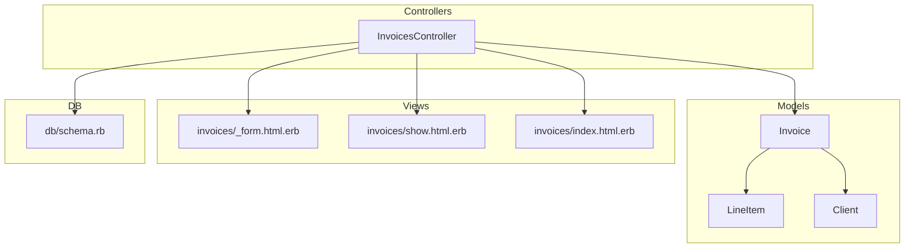
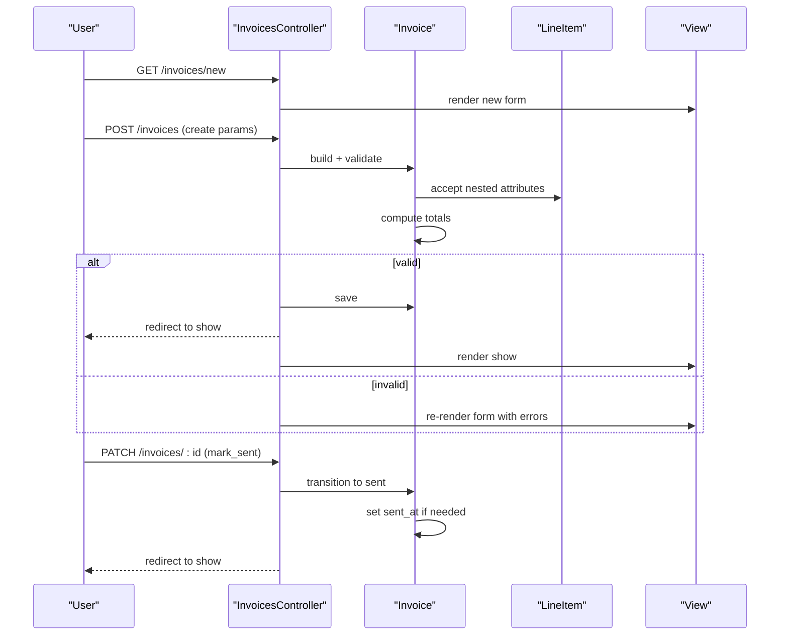
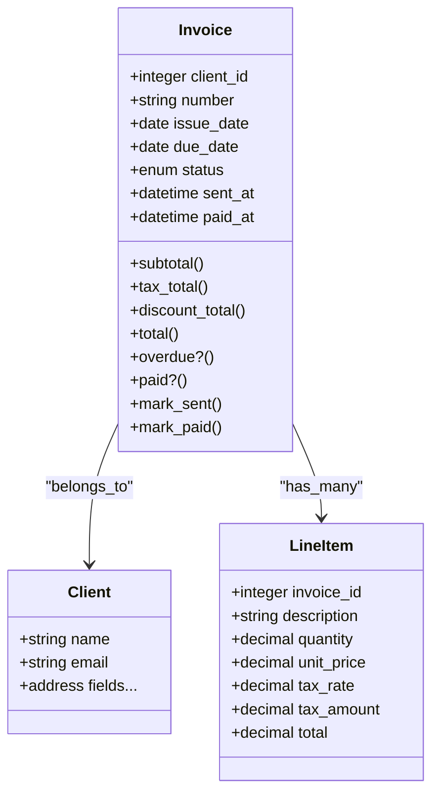
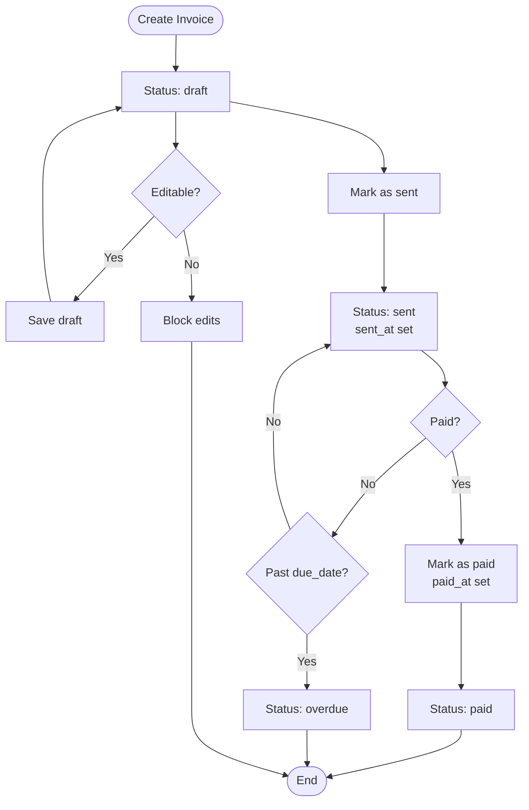
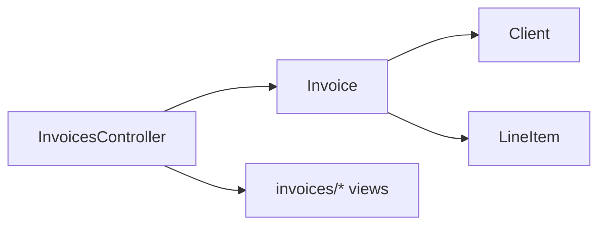

# Invoice Lifecycle Management

<cite>
**Referenced Files in This Document**
- [invoice.rb](file://app/models/invoice.rb)
- [invoices_controller.rb](file://app/controllers/invoices_controller.rb)
- [client.rb](file://app/models/client.rb)
- [line_item.rb](file://app/models/line_item.rb)
- [schema.rb](file://db/schema.rb)
- [_form.html.erb](file://app/views/invoices/_form.html.erb)
- [show.html.erb](file://app/views/invoices/show.html.erb)
- [index.html.erb](file://app/views/invoices/index.html.erb)
- [routes.rb](file://config/routes.rb)
</cite>

## Table of Contents
1. [Introduction](#introduction)
2. [Project Structure](#project-structure)
3. [Core Components](#core-components)
4. [Architecture Overview](#architecture-overview)
5. [Detailed Component Analysis](#detailed-component-analysis)
6. [Dependency Analysis](#dependency-analysis)
7. [Performance Considerations](#performance-considerations)
8. [Troubleshooting Guide](#troubleshooting-guide)
9. [Conclusion](#conclusion)

## Introduction
This document explains the end-to-end lifecycle of invoices in the application: creation, editing, sending, payment tracking, status transitions (draft, sent, paid, overdue), archival strategies, numbering, date handling, currency formatting, and integration with clients. It also provides practical examples for common operations such as creating new invoices, updating existing ones, and managing statuses.

## Project Structure
The invoice feature follows typical Rails conventions:
- Model layer: business logic, validations, associations, and state helpers live in app/models.
- Controller layer: HTTP actions for CRUD and workflow steps live in app/controllers.
- Views: forms, lists, and detail pages live in app/views/invoices.
- Database schema: columns, constraints, and indexes are defined in db/schema.rb and migrations.
- Routes: resourceful routes for invoices are declared in config/routes.rb.

**Diagram sources**
- [invoices_controller.rb](file://app/controllers/invoices_controller.rb)
- [invoice.rb](file://app/models/invoice.rb)
- [line_item.rb](file://app/models/line_item.rb)
- [client.rb](file://app/models/client.rb)
- [_form.html.erb](file://app/views/invoices/_form.html.erb)
- [show.html.erb](file://app/views/invoices/show.html.erb)
- [index.html.erb](file://app/views/invoices/index.html.erb)
- [schema.rb](file://db/schema.rb)

**Section sources**
- [invoices_controller.rb](file://app/controllers/invoices_controller.rb)
- [invoice.rb](file://app/models/invoice.rb)
- [line_item.rb](file://app/models/line_item.rb)
- [client.rb](file://app/models/client.rb)
- [_form.html.erb](file://app/views/invoices/_form.html.erb)
- [show.html.erb](file://app/views/invoices/show.html.erb)
- [index.html.erb](file://app/views/invoices/index.html.erb)
- [schema.rb](file://db/schema.rb)

## Core Components
- Invoice model: encapsulates invoice data, validations, totals, numbering, dates, currency formatting, and state helpers.
- LineItem model: represents individual line items on an invoice with quantity, unit price, taxes, and computed totals.
- Client model: stores client details; invoices link to a single client.
- InvoicesController: orchestrates HTTP requests for listing, showing, creating, updating, deleting, and transitioning invoice states.
- Views: provide user interfaces for form entry, listing, and detailed views including totals and status display.

Key responsibilities:
- Enforce validation rules at the model level.
- Compute totals and tax amounts from line items.
- Manage status transitions and derived fields (e.g., due date).
- Provide helper methods for human-friendly presentation (numbering, currency).
- Integrate with clients for billing context.

**Section sources**
- [invoice.rb](file://app/models/invoice.rb)
- [line_item.rb](file://app/models/line_item.rb)
- [client.rb](file://app/models/client.rb)
- [invoices_controller.rb](file://app/controllers/invoices_controller.rb)
- [_form.html.erb](file://app/views/invoices/_form.html.erb)
- [show.html.erb](file://app/views/invoices/show.html.erb)
- [index.html.erb](file://app/views/invoices/index.html.erb)

## Architecture Overview
The invoice lifecycle spans controller actions, model validations, and view rendering. The following sequence shows a typical flow for creating and sending an invoice.

**Diagram sources**
- [invoices_controller.rb](file://app/controllers/invoices_controller.rb)
- [invoice.rb](file://app/models/invoice.rb)
- [line_item.rb](file://app/models/line_item.rb)
- [_form.html.erb](file://app/views/invoices/_form.html.erb)
- [show.html.erb](file://app/views/invoices/show.html.erb)

## Detailed Component Analysis

### Invoice Model: Business Logic, Validations, and State Management
Responsibilities:
- Associations: belongs_to Client; has_many LineItems; accepts_nested_attributes_for LineItems.
- Validations: presence of client, issue date, due date, and required line items when not draft.
- Totals: computes subtotal, tax, discount, and total from line items.
- Numbering: generates or persists a unique invoice number per tenant/user scope.
- Dates: manages issue_date and due_date; may derive due_date from terms.
- Currency: formats monetary values using configured locale/currency.
- Status: tracks current status and exposes helpers for transitions and derived flags (e.g., overdue).

Statuses and transitions:
- States: draft, sent, paid, overdue.
- Transitions:
  - draft -> sent: mark as sent; record sent_at if applicable.
  - sent -> paid: record paid_at and update status.
  - sent -> overdue: automatic or scheduled job marks overdue after due_date passes.
  - paid -> paid: idempotent.
  - draft -> draft: no-op.
- Derived flags:
  - overdue? true when status is sent and past due_date.
  - paid? true when status is paid.

Numbering strategy:
- Unique per user/tenant.
- Incremental or prefix-based scheme.
- Ensures uniqueness via database constraint or application-level checks.

Date handling:
- Issue date defaults to today on creation unless specified.
- Due date defaults to issue_date plus terms (e.g., net 30) if not provided.

Currency formatting:
- Uses locale-aware formatting for money values.
- Consistent symbol and decimal precision across views.

Integration with clients:
- Billing address and contact info come from associated client.
- Client selection is enforced during creation/update.

Example usage paths:
- Create: use nested attributes to add line items and compute totals automatically.
- Update: allow edits while draft; restrict changes once sent/paid depending on policy.
- Delete: soft-delete or prevent deletion when sent/paid; archive instead.

**Section sources**
- [invoice.rb](file://app/models/invoice.rb)
- [schema.rb](file://db/schema.rb)

#### Class Diagram: Invoice and Related Models

**Diagram sources**
- [invoice.rb](file://app/models/invoice.rb)
- [line_item.rb](file://app/models/line_item.rb)
- [client.rb](file://app/models/client.rb)

### InvoicesController: Workflow Actions
Primary actions:
- index: list invoices with filters and pagination.
- show: display invoice details, status, totals, and actions.
- new: present creation form.
- create: persist invoice and nested line items; handle success/failure.
- edit: present edit form with prepopulated data.
- update: apply permitted parameters; enforce editability rules.
- destroy: delete or archive depending on status.
- mark_sent: transition to sent; set sent_at.
- mark_paid: transition to paid; set paid_at.

Permitted parameters:
- Strong parameters include client_id, number, issue_date, due_date, status, and nested line_items attributes.

Validation feedback:
- Returns to form with errors when invalid.
- Displays flash messages on success.

Archival strategy:
- If hard delete is not allowed for sent/paid, implement soft delete or archive flag.
- Archive hides from default listings but retains history.

**Section sources**
- [invoices_controller.rb](file://app/controllers/invoices_controller.rb)
- [routes.rb](file://config/routes.rb)

### Views: Forms, Listing, and Detail
- _form.html.erb: inputs for client, number, dates, and dynamic line items; includes recalculation hooks.
- show.html.erb: displays status badges, totals, client info, and action buttons (send, mark paid).
- index.html.erb: lists invoices with filters (status, date range), sorting, and pagination.

Currency and number formatting:
- Use helpers to format money and numbers consistently.
- Respect locale settings for symbols and decimals.

**Section sources**
- [_form.html.erb](file://app/views/invoices/_form.html.erb)
- [show.html.erb](file://app/views/invoices/show.html.erb)
- [index.html.erb](file://app/views/invoices/index.html.erb)

### Status Transition Flowchart

**Diagram sources**
- [invoice.rb](file://app/models/invoice.rb)
- [invoices_controller.rb](file://app/controllers/invoices_controller.rb)

## Dependency Analysis
- InvoicesController depends on Invoice model for persistence and business logic.
- Invoice depends on Client and LineItem models for data relationships.
- LineItem depends on Invoice for ownership and total computation.
- Views depend on controllers for data and on helpers for formatting.

**Diagram sources**
- [invoices_controller.rb](file://app/controllers/invoices_controller.rb)
- [invoice.rb](file://app/models/invoice.rb)
- [line_item.rb](file://app/models/line_item.rb)
- [client.rb](file://app/models/client.rb)

**Section sources**
- [invoices_controller.rb](file://app/controllers/invoices_controller.rb)
- [invoice.rb](file://app/models/invoice.rb)
- [line_item.rb](file://app/models/line_item.rb)
- [client.rb](file://app/models/client.rb)

## Performance Considerations
- N+1 queries: eager-load client and line_items when listing or showing invoices.
- Indexes: ensure indexes on foreign keys (client_id) and frequently filtered columns (status, due_date).
- Computed totals: cache or memoize totals where appropriate; avoid recomputation on every render.
- Pagination: paginate invoice listings to reduce payload size.
- Background jobs: consider offloading heavy tasks like marking overdue or generating PDFs.

[No sources needed since this section provides general guidance]

## Troubleshooting Guide
Common issues and resolutions:
- Validation failures: check presence of client, dates, and line items; review error messages in the form.
- Duplicate invoice numbers: verify uniqueness constraints and scoping by user/tenant.
- Totals mismatch: ensure line item quantities and prices are correct; confirm tax calculations.
- Status stuck: inspect transition methods and callbacks; verify sent_at/paid_at updates.
- Overdue not updating: confirm scheduled job runs and due_date comparisons are timezone-aware.

Operational tips:
- Use strong parameters to prevent mass assignment errors.
- Log state transitions for auditability.
- Provide clear user feedback via flash messages.

**Section sources**
- [invoices_controller.rb](file://app/controllers/invoices_controller.rb)
- [invoice.rb](file://app/models/invoice.rb)

## Conclusion
The invoice lifecycle is implemented with clear separation of concerns: the controller handles HTTP flows, the model enforces business rules and state transitions, and the views present consistent, localized UI. Robust validations, numbering, date handling, and currency formatting ensure reliability and usability. Archival strategies protect historical integrity while keeping active workflows streamlined.

[No sources needed since this section summarizes without analyzing specific files]

## Appendices

### Example Workflows

- Create a new invoice:
  - Navigate to new invoice form, select a client, set issue and due dates, add line items, and submit.
  - On success, redirected to show page with totals and status “draft”.

- Update an existing invoice:
  - Open edit form, modify fields and line items, and save.
  - Edits may be restricted once status is sent or paid.

- Mark invoice as sent:
  - From show page, trigger “mark sent” action; status becomes “sent” and sent_at is recorded.

- Mark invoice as paid:
  - Trigger “mark paid”; status becomes “paid” and paid_at is recorded.

- Handle overdue:
  - System marks invoices as “overdue” when past due_date and still unpaid.

- Delete or archive:
  - Deleting draft invoices is allowed; sent/paid invoices should be archived rather than deleted.

[No sources needed since this section provides conceptual examples]