# Invoice Management System

<cite>
**Referenced Files in This Document**
- [invoice.rb](file://app/models/invoice.rb)
- [line_item.rb](file://app/models/line_item.rb)
- [item.rb](file://app/models/item.rb)
- [client.rb](file://app/models/client.rb)
- [invoices_controller.rb](file://app/controllers/invoices_controller.rb)
- [line_items_controller.rb](file://app/controllers/line_items_controller.rb)
- [items_controller.rb](file://app/controllers/items_controller.rb)
- [_form.html.erb](file://app/views/invoices/_form.html.erb)
- [_item_fields.html.erb](file://app/views/invoices/_item_fields.html.erb)
- [_total.html.erb](file://app/views/invoices/_total.html.erb)
- [show.html.erb](file://app/views/invoices/show.html.erb)
- [recalculate_controller.js](file://app/javascript/controllers/recalculate_controller.js)
- [removeitem_controller.js](file://app/javascript/controllers/removeitem_controller.js)
- [itemselect_controller.js](file://app/javascript/controllers/itemselect_controller.js)
- [routes.rb](file://config/routes.rb)
- [20220926152532_add_user_ref_to_invoice.rb](file://db/migrate/20220926152532_add_user_ref_to_invoice.rb)
- [20220926154117_add_user_ref_to_client.rb](file://db/migrate/20220926154117_add_user_ref_to_client.rb)
- [20220926151310_create_line_items.rb](file://db/migrate/20220926151310_create_line_items.rb)
- [20220923194042_create_items.rb](file://db/migrate/20220923194042_create_items.rb)
- [20220924214542_create_clients.rb](file://db/migrate/20220924214542_create_clients.rb)
- [20221005170101_remove_not_false_to_reference.rb](file://db/migrate/20221005170101_remove_not_false_to_reference.rb)
- [20221006171614_add_first_and_last_name_user_profile.rb](file://db/migrate/20221006171614_add_first_and_last_name_user_profile.rb)
- [20231221084432_add_price_iva_total_to_line_items.rb](file://db/migrate/20231221084432_add_price_iva_total_to_line_items.rb)
- [schema.rb](file://db/schema.rb)
</cite>

## Table of Contents
1. [Introduction](#introduction)
2. [Project Structure](#project-structure)
3. [Core Components](#core-components)
4. [Architecture Overview](#architecture-overview)
5. [Detailed Component Analysis](#detailed-component-analysis)
6. [Dependency Analysis](#dependency-analysis)
7. [Performance Considerations](#performance-considerations)
8. [Troubleshooting Guide](#troubleshooting-guide)
9. [Conclusion](#conclusion)
10. [Appendices](#appendices)

## Introduction
This document provides comprehensive documentation for the invoice management system, focusing on the Invoice and LineItem models, their associations, and business logic for calculations. It explains the complete invoice lifecycle from creation to payment tracking, line item management, tax calculations, total computations, and status workflows. It also covers nested form implementation, real-time calculations, and invoice printing/exporting capabilities.

## Project Structure
The invoice feature spans models, controllers, views, JavaScript controllers, and database migrations:
- Models: Invoice, LineItem, Item, Client
- Controllers: InvoicesController, LineItemsController, ItemsController
- Views: Nested form partials, totals, show view
- JavaScript: Real-time recalculation, dynamic item selection, removal
- Migrations: Schema definitions for invoices, line items, items, clients, and references

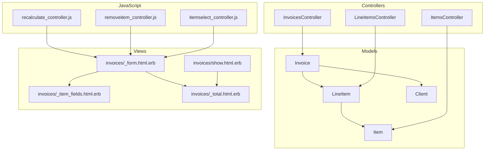

**Diagram sources**
- [invoice.rb](file://app/models/invoice.rb)
- [line_item.rb](file://app/models/line_item.rb)
- [item.rb](file://app/models/item.rb)
- [client.rb](file://app/models/client.rb)
- [invoices_controller.rb](file://app/controllers/invoices_controller.rb)
- [line_items_controller.rb](file://app/controllers/line_items_controller.rb)
- [items_controller.rb](file://app/controllers/items_controller.rb)
- [_form.html.erb](file://app/views/invoices/_form.html.erb)
- [_item_fields.html.erb](file://app/views/invoices/_item_fields.html.erb)
- [_total.html.erb](file://app/views/invoices/_total.html.erb)
- [show.html.erb](file://app/views/invoices/show.html.erb)
- [recalculate_controller.js](file://app/javascript/controllers/recalculate_controller.js)
- [removeitem_controller.js](file://app/javascript/controllers/removeitem_controller.js)
- [itemselect_controller.js](file://app/javascript/controllers/itemselect_controller.js)

**Section sources**
- [invoice.rb](file://app/models/invoice.rb)
- [line_item.rb](file://app/models/line_item.rb)
- [item.rb](file://app/models/item.rb)
- [client.rb](file://app/models/client.rb)
- [invoices_controller.rb](file://app/controllers/invoices_controller.rb)
- [line_items_controller.rb](file://app/controllers/line_items_controller.rb)
- [items_controller.rb](file://app/controllers/items_controller.rb)
- [_form.html.erb](file://app/views/invoices/_form.html.erb)
- [_item_fields.html.erb](file://app/views/invoices/_item_fields.html.erb)
- [_total.html.erb](file://app/views/invoices/_total.html.erb)
- [show.html.erb](file://app/views/invoices/show.html.erb)
- [recalculate_controller.js](file://app/javascript/controllers/recalculate_controller.js)
- [removeitem_controller.js](file://app/javascript/controllers/removeitem_controller.js)
- [itemselect_controller.js](file://app/javascript/controllers/itemselect_controller.js)

## Core Components
- Invoice model encapsulates invoice-level attributes, associations with Client and LineItem, and aggregate calculations (subtotal, taxes, totals).
- LineItem model represents individual invoice lines with quantity, unit price, tax rate, and computed amounts.
- Item model defines reusable catalog entries that can be selected into LineItems.
- Client model stores customer information linked to an Invoice.

Key responsibilities:
- Invoice: manages client association, line items collection, and computes totals including tax.
- LineItem: calculates per-line totals based on quantity, unit price, and tax; exposes IVA-related fields.
- Item: provides base pricing and tax configuration used when creating LineItems.
- Client: holds billing details referenced by Invoice.

Business rules:
- Totals are derived from LineItem calculations.
- Tax is applied per LineItem using its tax rate and amount.
- Status transitions reflect payment state and workflow stages.

**Section sources**
- [invoice.rb](file://app/models/invoice.rb)
- [line_item.rb](file://app/models/line_item.rb)
- [item.rb](file://app/models/item.rb)
- [client.rb](file://app/models/client.rb)

## Architecture Overview
The system follows a standard Rails MVC pattern with Stimulus-driven interactivity for real-time updates.

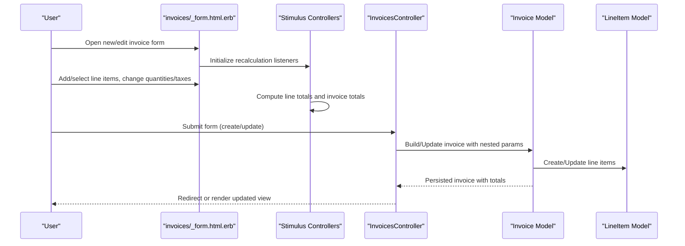

**Diagram sources**
- [_form.html.erb](file://app/views/invoices/_form.html.erb)
- [recalculate_controller.js](file://app/javascript/controllers/recalculate_controller.js)
- [invoices_controller.rb](file://app/controllers/invoices_controller.rb)
- [invoice.rb](file://app/models/invoice.rb)
- [line_item.rb](file://app/models/line_item.rb)

## Detailed Component Analysis

### Data Model Relationships
The core relationships define how invoices, clients, line items, and items interact.

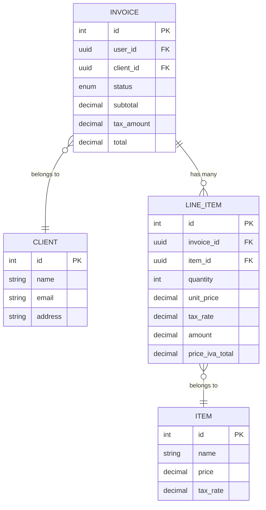

**Diagram sources**
- [invoice.rb](file://app/models/invoice.rb)
- [line_item.rb](file://app/models/line_item.rb)
- [item.rb](file://app/models/item.rb)
- [client.rb](file://app/models/client.rb)
- [20220926152532_add_user_ref_to_invoice.rb](file://db/migrate/20220926152532_add_user_ref_to_invoice.rb)
- [20220926154117_add_user_ref_to_client.rb](file://db/migrate/20220926154117_add_user_ref_to_client.rb)
- [20220926151310_create_line_items.rb](file://db/migrate/20220926151310_create_line_items.rb)
- [20220923194042_create_items.rb](file://db/migrate/20220923194042_create_items.rb)
- [20220924214542_create_clients.rb](file://db/migrate/20220924214542_create_clients.rb)
- [20231221084432_add_price_iva_total_to_line_items.rb](file://db/migrate/20231221084432_add_price_iva_total_to_line_items.rb)

**Section sources**
- [invoice.rb](file://app/models/invoice.rb)
- [line_item.rb](file://app/models/line_item.rb)
- [item.rb](file://app/models/item.rb)
- [client.rb](file://app/models/client.rb)
- [20220926152532_add_user_ref_to_invoice.rb](file://db/migrate/20220926152532_add_user_ref_to_invoice.rb)
- [20220926154117_add_user_ref_to_client.rb](file://db/migrate/20220926154117_add_user_ref_to_client.rb)
- [20220926151310_create_line_items.rb](file://db/migrate/20220926151310_create_line_items.rb)
- [20220923194042_create_items.rb](file://db/migrate/20220923194042_create_items.rb)
- [20220924214542_create_clients.rb](file://db/migrate/20220924214542_create_clients.rb)
- [20231221084432_add_price_iva_total_to_line_items.rb](file://db/migrate/20231221084432_add_price_iva_total_to_line_items.rb)

### Invoice Lifecycle
The lifecycle covers creation, editing, saving, and status transitions.

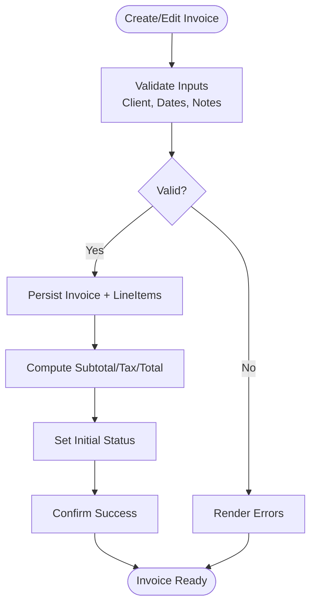

**Diagram sources**
- [invoices_controller.rb](file://app/controllers/invoices_controller.rb)
- [invoice.rb](file://app/models/invoice.rb)
- [line_item.rb](file://app/models/line_item.rb)

**Section sources**
- [invoices_controller.rb](file://app/controllers/invoices_controller.rb)
- [invoice.rb](file://app/models/invoice.rb)
- [line_item.rb](file://app/models/line_item.rb)

### Line Item Management
Line items support adding, selecting from existing items, updating quantities/prices/taxes, and removing rows.

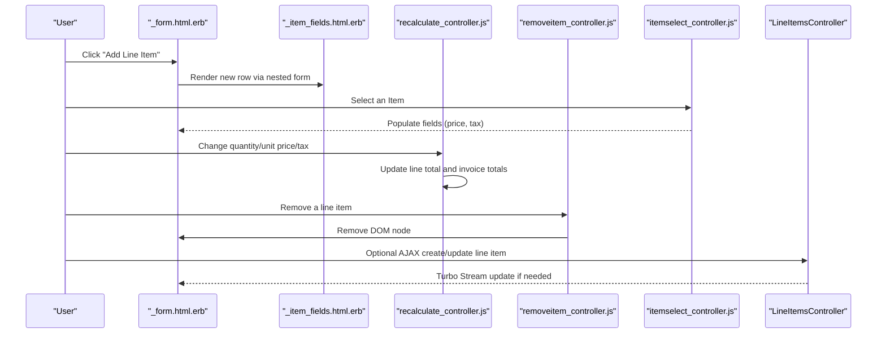

**Diagram sources**
- [_form.html.erb](file://app/views/invoices/_form.html.erb)
- [_item_fields.html.erb](file://app/views/invoices/_item_fields.html.erb)
- [recalculate_controller.js](file://app/javascript/controllers/recalculate_controller.js)
- [removeitem_controller.js](file://app/javascript/controllers/removeitem_controller.js)
- [itemselect_controller.js](file://app/javascript/controllers/itemselect_controller.js)
- [line_items_controller.rb](file://app/controllers/line_items_controller.rb)

**Section sources**
- [_form.html.erb](file://app/views/invoices/_form.html.erb)
- [_item_fields.html.erb](file://app/views/invoices/_item_fields.html.erb)
- [recalculate_controller.js](file://app/javascript/controllers/recalculate_controller.js)
- [removeitem_controller.js](file://app/javascript/controllers/removeitem_controller.js)
- [itemselect_controller.js](file://app/javascript/controllers/itemselect_controller.js)
- [line_items_controller.rb](file://app/controllers/line_items_controller.rb)

### Tax Calculations and Totals
Tax is applied at the line level and aggregated at the invoice level. The system supports different tax scenarios through per-line tax rates and optional IVA-specific totals.

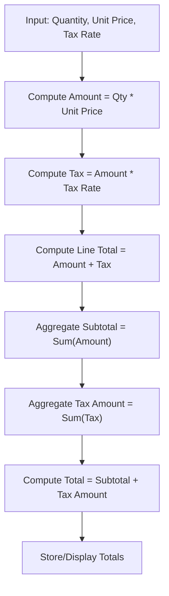

**Diagram sources**
- [line_item.rb](file://app/models/line_item.rb)
- [invoice.rb](file://app/models/invoice.rb)
- [20231221084432_add_price_iva_total_to_line_items.rb](file://db/migrate/20231221084432_add_price_iva_total_to_line_items.rb)

**Section sources**
- [line_item.rb](file://app/models/line_item.rb)
- [invoice.rb](file://app/models/invoice.rb)
- [20231221084432_add_price_iva_total_to_line_items.rb](file://db/migrate/20231221084432_add_price_iva_total_to_line_items.rb)

### Status Workflows
Invoices have a status field reflecting their lifecycle stage. Transitions typically move from draft to issued, then to paid upon payment confirmation.

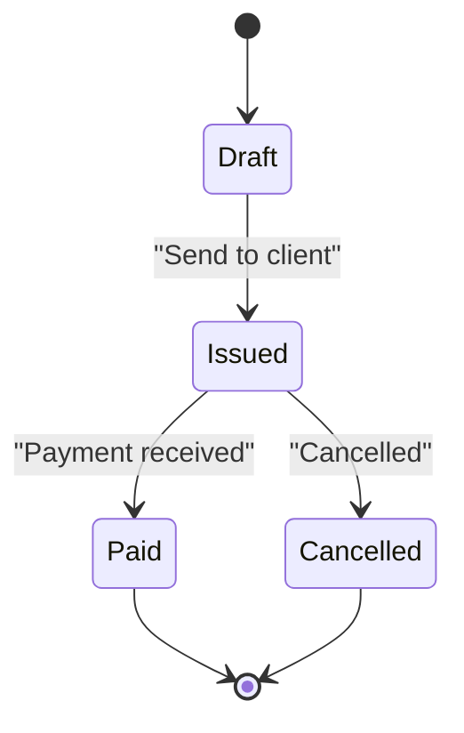

**Diagram sources**
- [invoice.rb](file://app/models/invoice.rb)
- [20221005170101_remove_not_false_to_reference.rb](file://db/migrate/20221005170101_remove_not_false_to_reference.rb)

**Section sources**
- [invoice.rb](file://app/models/invoice.rb)
- [20221005170101_remove_not_false_to_reference.rb](file://db/migrate/20221005170101_remove_not_false_to_reference.rb)

### Nested Form Implementation
The nested form allows managing multiple line items within a single invoice form. Partial rendering and data binding enable seamless updates.

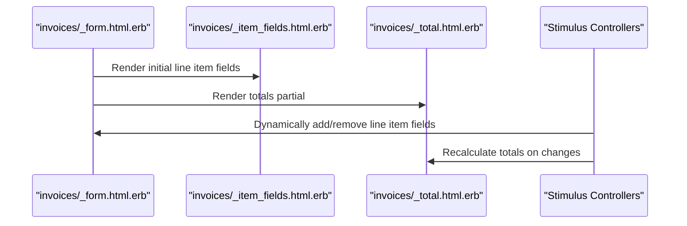

**Diagram sources**
- [_form.html.erb](file://app/views/invoices/_form.html.erb)
- [_item_fields.html.erb](file://app/views/invoices/_item_fields.html.erb)
- [_total.html.erb](file://app/views/invoices/_total.html.erb)
- [recalculate_controller.js](file://app/javascript/controllers/recalculate_controller.js)

**Section sources**
- [_form.html.erb](file://app/views/invoices/_form.html.erb)
- [_item_fields.html.erb](file://app/views/invoices/_item_fields.html.erb)
- [_total.html.erb](file://app/views/invoices/_total.html.erb)
- [recalculate_controller.js](file://app/javascript/controllers/recalculate_controller.js)

### Real-Time Calculations
Real-time updates are handled by Stimulus controllers listening to input changes and recalculating line and invoice totals without full page reloads.

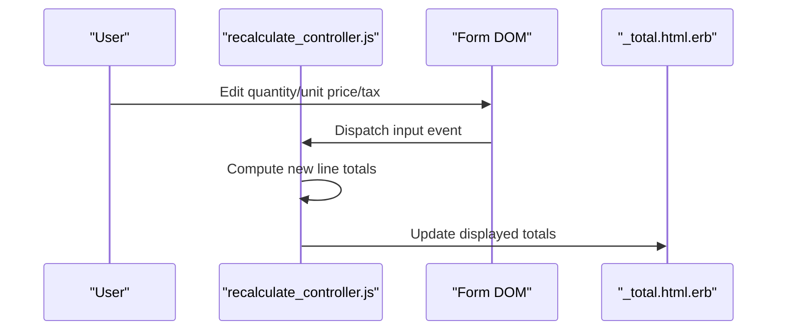

**Diagram sources**
- [recalculate_controller.js](file://app/javascript/controllers/recalculate_controller.js)
- [_total.html.erb](file://app/views/invoices/_total.html.erb)

**Section sources**
- [recalculate_controller.js](file://app/javascript/controllers/recalculate_controller.js)
- [_total.html.erb](file://app/views/invoices/_total.html.erb)

### Invoice Printing/Exporting
Printing and exporting are facilitated by the show view, which formats invoice details for print-friendly output.

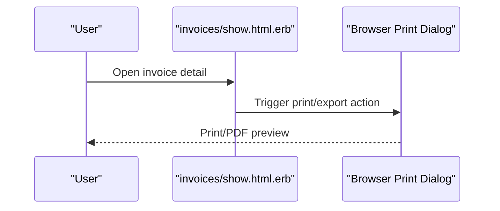

**Diagram sources**
- [show.html.erb](file://app/views/invoices/show.html.erb)

**Section sources**
- [show.html.erb](file://app/views/invoices/show.html.erb)

## Dependency Analysis
The following diagram illustrates key dependencies among controllers, models, and views.

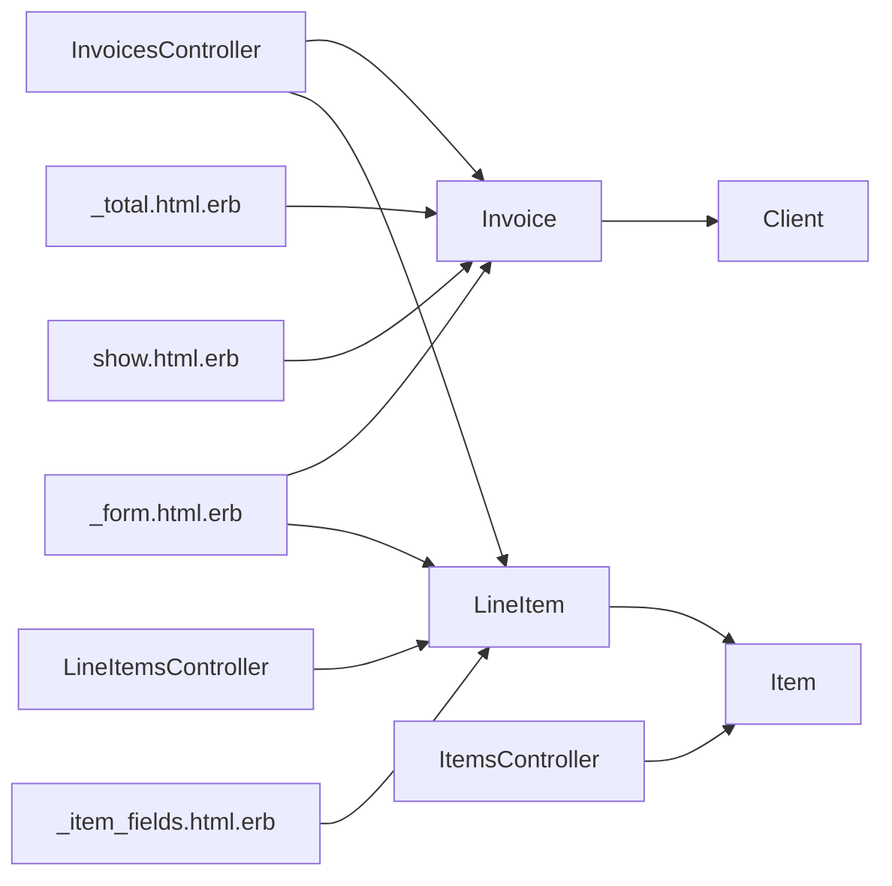

**Diagram sources**
- [invoices_controller.rb](file://app/controllers/invoices_controller.rb)
- [line_items_controller.rb](file://app/controllers/line_items_controller.rb)
- [items_controller.rb](file://app/controllers/items_controller.rb)
- [invoice.rb](file://app/models/invoice.rb)
- [line_item.rb](file://app/models/line_item.rb)
- [item.rb](file://app/models/item.rb)
- [client.rb](file://app/models/client.rb)
- [_form.html.erb](file://app/views/invoices/_form.html.erb)
- [_item_fields.html.erb](file://app/views/invoices/_item_fields.html.erb)
- [_total.html.erb](file://app/views/invoices/_total.html.erb)
- [show.html.erb](file://app/views/invoices/show.html.erb)

**Section sources**
- [invoices_controller.rb](file://app/controllers/invoices_controller.rb)
- [line_items_controller.rb](file://app/controllers/line_items_controller.rb)
- [items_controller.rb](file://app/controllers/items_controller.rb)
- [invoice.rb](file://app/models/invoice.rb)
- [line_item.rb](file://app/models/line_item.rb)
- [item.rb](file://app/models/item.rb)
- [client.rb](file://app/models/client.rb)
- [_form.html.erb](file://app/views/invoices/_form.html.erb)
- [_item_fields.html.erb](file://app/views/invoices/_item_fields.html.erb)
- [_total.html.erb](file://app/views/invoices/_total.html.erb)
- [show.html.erb](file://app/views/invoices/show.html.erb)

## Performance Considerations
- Prefer client-side recalculation for immediate feedback; keep server calls minimal.
- Use efficient aggregation methods for totals to avoid N+1 queries.
- Cache frequently accessed item prices and tax rates where appropriate.
- Debounce rapid input events to reduce unnecessary recalculations.

[No sources needed since this section provides general guidance]

## Troubleshooting Guide
Common issues and resolutions:
- Totals not updating: Ensure Stimulus controllers are properly bound and data attributes match expected selectors.
- Missing line item fields: Verify nested form partials are rendered and parameters are permitted in controller strong parameters.
- Tax discrepancies: Check per-line tax rates and ensure IVA totals are correctly computed and persisted.
- Status not transitioning: Validate callbacks and validations governing status changes.

**Section sources**
- [recalculate_controller.js](file://app/javascript/controllers/recalculate_controller.js)
- [_form.html.erb](file://app/views/invoices/_form.html.erb)
- [line_item.rb](file://app/models/line_item.rb)
- [invoice.rb](file://app/models/invoice.rb)

## Conclusion
The invoice management system provides a robust foundation for creating and managing invoices with accurate tax calculations and real-time updates. Its modular design separates concerns across models, controllers, views, and interactive JavaScript, enabling maintainability and scalability. By adhering to the documented patterns and best practices, teams can extend functionality such as advanced reporting, multi-currency support, and enhanced export options.

[No sources needed since this section summarizes without analyzing specific files]

## Appendices

### API Endpoints and Routes
Key routes involved in invoice operations:
- Invoices: index, new, create, show, edit, update, destroy
- Line Items: nested under invoices for create/update/destroy
- Items: CRUD for catalog management

**Section sources**
- [routes.rb](file://config/routes.rb)

### Database Schema Highlights
Relevant schema elements include:
- Invoices: user reference, client reference, status, totals
- Line Items: invoice reference, item reference, quantity, unit price, tax rate, amounts
- Items: name, price, tax rate
- Clients: contact and address details

**Section sources**
- [schema.rb](file://db/schema.rb)
- [20220926152532_add_user_ref_to_invoice.rb](file://db/migrate/20220926152532_add_user_ref_to_invoice.rb)
- [20220926154117_add_user_ref_to_client.rb](file://db/migrate/20220926154117_add_user_ref_to_client.rb)
- [20220926151310_create_line_items.rb](file://db/migrate/20220926151310_create_line_items.rb)
- [20220923194042_create_items.rb](file://db/migrate/20220923194042_create_items.rb)
- [20220924214542_create_clients.rb](file://db/migrate/20220924214542_create_clients.rb)
- [20231221084432_add_price_iva_total_to_line_items.rb](file://db/migrate/20231221084432_add_price_iva_total_to_line_items.rb)