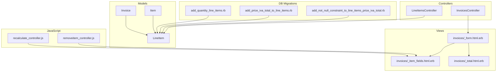
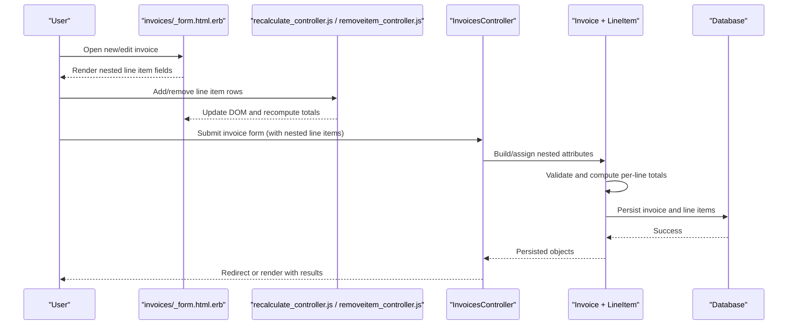
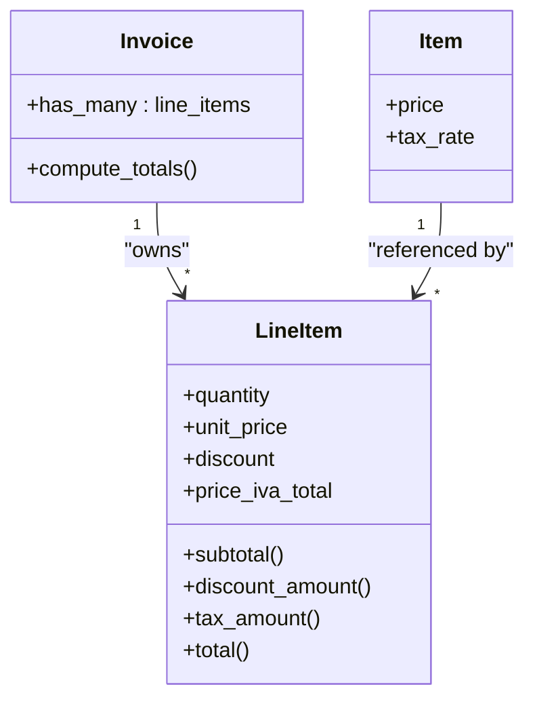
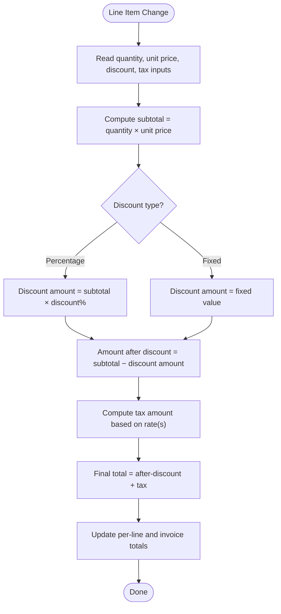
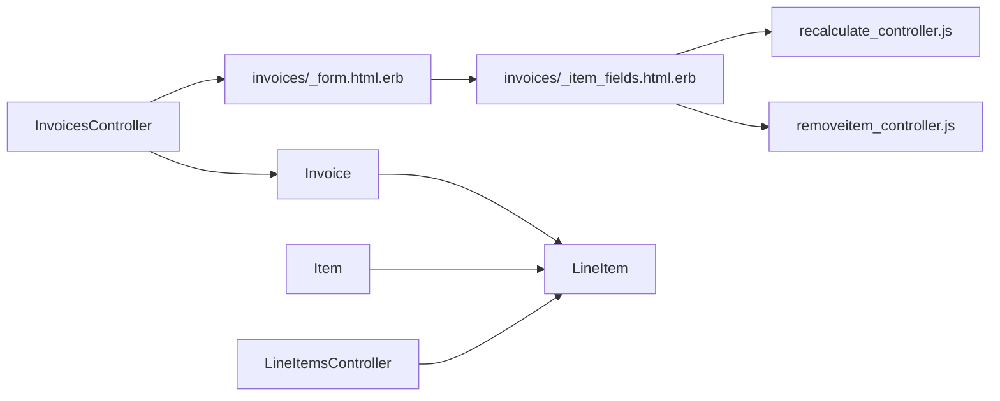

# Line Item Management

<cite>
**Referenced Files in This Document**
- [line_item.rb](file://app/models/line_item.rb)
- [invoice.rb](file://app/models/invoice.rb)
- [item.rb](file://app/models/item.rb)
- [line_items_controller.rb](file://app/controllers/line_items_controller.rb)
- [invoices_controller.rb](file://app/controllers/invoices_controller.rb)
- [_form.html.erb](file://app/views/invoices/_form.html.erb)
- [_item_fields.html.erb](file://app/views/invoices/_item_fields.html.erb)
- [_total.html.erb](file://app/views/invoices/_total.html.erb)
- [recalculate_controller.js](file://app/javascript/controllers/recalculate_controller.js)
- [removeitem_controller.js](file://app/javascript/controllers/removeitem_controller.js)
- [20221006171332_add_quantity_line_items.rb](file://db/migrate/20221006171332_add_quantity_line_items.rb)
- [20231221084432_add_price_iva_total_to_line_items.rb](file://db/migrate/20231221084432_add_price_iva_total_to_line_items.rb)
- [20231221085137_add_not_null_constraint_to_line_items_price_iva_total.rb](file://db/migrate/20231221085137_add_not_null_constraint_to_line_items_price_iva_total.rb)
</cite>

## Table of Contents
1. [Introduction](#introduction)
2. [Project Structure](#project-structure)
3. [Core Components](#core-components)
4. [Architecture Overview](#architecture-overview)
5. [Detailed Component Analysis](#detailed-component-analysis)
6. [Dependency Analysis](#dependency-analysis)
7. [Performance Considerations](#performance-considerations)
8. [Troubleshooting Guide](#troubleshooting-guide)
9. [Conclusion](#conclusion)

## Introduction
This document explains line item management within invoices, focusing on the LineItem model, its associations with Invoice and Item, and the calculation logic for quantities, unit pricing, discounts, and taxes. It also covers how line items are created, updated, and deleted both individually and in bulk, including the nested form implementation for adding multiple line items to an invoice. Finally, it documents dynamic addition/removal, real-time price updates, and validation rules.

## Project Structure
The line item feature spans models, controllers, views, JavaScript controllers, and database migrations:
- Models define relationships and calculations.
- Controllers handle individual and nested CRUD operations.
- Views render nested forms and totals.
- JavaScript controllers provide interactivity (add/remove rows, recalculation).
- Migrations define schema changes for quantity and tax fields.

**Diagram sources**
- [line_item.rb](file://app/models/line_item.rb)
- [invoice.rb](file://app/models/invoice.rb)
- [item.rb](file://app/models/item.rb)
- [line_items_controller.rb](file://app/controllers/line_items_controller.rb)
- [invoices_controller.rb](file://app/controllers/invoices_controller.rb)
- [_form.html.erb](file://app/views/invoices/_form.html.erb)
- [_item_fields.html.erb](file://app/views/invoices/_item_fields.html.erb)
- [_total.html.erb](file://app/views/invoices/_total.html.erb)
- [recalculate_controller.js](file://app/javascript/controllers/recalculate_controller.js)
- [removeitem_controller.js](file://app/javascript/controllers/removeitem_controller.js)
- [20221006171332_add_quantity_line_items.rb](file://db/migrate/20221006171332_add_quantity_line_items.rb)
- [20231221084432_add_price_iva_total_to_line_items.rb](file://db/migrate/20231221084432_add_price_iva_total_to_line_items.rb)
- [20231221085137_add_not_null_constraint_to_line_items_price_iva_total.rb](file://db/migrate/20231221085137_add_not_null_constraint_to_line_items_price_iva_total.rb)

**Section sources**
- [line_item.rb](file://app/models/line_item.rb)
- [invoice.rb](file://app/models/invoice.rb)
- [item.rb](file://app/models/item.rb)
- [line_items_controller.rb](file://app/controllers/line_items_controller.rb)
- [invoices_controller.rb](file://app/controllers/invoices_controller.rb)
- [_form.html.erb](file://app/views/invoices/_form.html.erb)
- [_item_fields.html.erb](file://app/views/invoices/_item_fields.html.erb)
- [_total.html.erb](file://app/views/invoices/_total.html.erb)
- [recalculate_controller.js](file://app/javascript/controllers/recalculate_controller.js)
- [removeitem_controller.js](file://app/javascript/controllers/removeitem_controller.js)
- [20221006171332_add_quantity_line_items.rb](file://db/migrate/20221006171332_add_quantity_line_items.rb)
- [20231221084432_add_price_iva_total_to_line_items.rb](file://db/migrate/20231221084432_add_price_iva_total_to_line_items.rb)
- [20231221085137_add_not_null_constraint_to_line_items_price_iva_total.rb](file://db/migrate/20231221085137_add_not_null_constraint_to_line_items_price_iva_total.rb)

## Core Components
- LineItem model: Represents a single line on an invoice, linking an Invoice and an Item, storing quantity, unit price, discount, and tax-related totals.
- Invoice model: Has many LineItems; aggregates totals from its line items.
- Item model: Provides default pricing and tax information used by LineItem.
- LineItemsController: Handles individual create/update/destroy actions for line items.
- InvoicesController: Manages nested creation and updating of line items when saving an invoice.
- Views: Nested form partials render multiple line items; totals partial computes invoice-level sums.
- JavaScript controllers: Provide dynamic add/remove of line item rows and real-time recalculation.

Key responsibilities:
- Data integrity via associations and validations.
- Calculation of per-line totals and invoice totals.
- User experience through dynamic UI and immediate feedback.

**Section sources**
- [line_item.rb](file://app/models/line_item.rb)
- [invoice.rb](file://app/models/invoice.rb)
- [item.rb](file://app/models/item.rb)
- [line_items_controller.rb](file://app/controllers/line_items_controller.rb)
- [invoices_controller.rb](file://app/controllers/invoices_controller.rb)
- [_form.html.erb](file://app/views/invoices/_form.html.erb)
- [_item_fields.html.erb](file://app/views/invoices/_item_fields.html.erb)
- [_total.html.erb](file://app/views/invoices/_total.html.erb)

## Architecture Overview
The system uses Rails nested attributes to manage line items as part of an invoice. The user edits an invoice form that includes a collection of line item fields. JavaScript enhances this form with dynamic row addition/removal and live recalculations. On save, the controller persists the invoice and its associated line items. Individual line items can also be managed directly via their own controller.

**Diagram sources**
- [_form.html.erb](file://app/views/invoices/_form.html.erb)
- [_item_fields.html.erb](file://app/views/invoices/_item_fields.html.erb)
- [recalculate_controller.js](file://app/javascript/controllers/recalculate_controller.js)
- [removeitem_controller.js](file://app/javascript/controllers/removeitem_controller.js)
- [invoices_controller.rb](file://app/controllers/invoices_controller.rb)
- [invoice.rb](file://app/models/invoice.rb)
- [line_item.rb](file://app/models/line_item.rb)

## Detailed Component Analysis

### LineItem Model
Responsibilities:
- Association to Invoice and Item.
- Storage of quantity, unit price, discount, and tax-related totals.
- Computation of subtotal, discount amount, tax amount, and total for the line.
- Validations ensuring data integrity (e.g., non-negative values, presence of required fields).

Calculation logic overview:
- Subtotal = quantity × unit price.
- Discount applied as either a percentage or fixed amount depending on configuration.
- Tax computed based on applicable rate(s), potentially using Item’s tax settings or explicit line-level tax inputs.
- Total = subtotal − discount + tax.

Complexity:
- Calculations are O(1) per line item.
- Aggregation across all line items is O(n) where n is the number of lines.

Optimization opportunities:
- Memoize computed totals if accessed frequently.
- Use database defaults and constraints to enforce non-negative values.

Error handling:
- Validation errors returned to the form for correction.
- Guard against negative quantities or prices.

**Section sources**
- [line_item.rb](file://app/models/line_item.rb)
- [20221006171332_add_quantity_line_items.rb](file://db/migrate/20221006171332_add_quantity_line_items.rb)
- [20231221084432_add_price_iva_total_to_line_items.rb](file://db/migrate/20231221084432_add_price_iva_total_to_line_items.rb)
- [20231221085137_add_not_null_constraint_to_line_items_price_iva_total.rb](file://db/migrate/20231221085137_add_not_null_constraint_to_line_items_price_iva_total.rb)

#### Class Diagram

**Diagram sources**
- [invoice.rb](file://app/models/invoice.rb)
- [item.rb](file://app/models/item.rb)
- [line_item.rb](file://app/models/line_item.rb)

### InvoicesController and Nested Attributes
Responsibilities:
- Permit nested parameters for line items when creating/updating invoices.
- Build initial empty line item rows for new invoices.
- Ensure transactional persistence of invoice and line items.

Flow:
- On create/update, assign nested attributes to build or update existing line items.
- Validate entire object graph; reject if any line item fails validation.
- Recalculate totals after assignment.

**Section sources**
- [invoices_controller.rb](file://app/controllers/invoices_controller.rb)
- [_form.html.erb](file://app/views/invoices/_form.html.erb)
- [_item_fields.html.erb](file://app/views/invoices/_item_fields.html.erb)

### LineItemsController (Individual Operations)
Responsibilities:
- Create a line item optionally linked to an existing invoice.
- Update a line item’s fields (quantity, unit price, discount).
- Destroy a line item independently.

Use cases:
- Quick-add a line item without opening the full invoice form.
- Bulk-like operations via repeated calls or API endpoints.

**Section sources**
- [line_items_controller.rb](file://app/controllers/line_items_controller.rb)

### Views and Nested Form Implementation
- invoices/_form.html.erb: Renders the main invoice form and delegates line item rendering to a partial.
- invoices/_item_fields.html.erb: Renders a single line item row with fields for item selection, quantity, unit price, discount, and tax-related inputs. Supports data attributes for JavaScript interactions.
- invoices/_total.html.erb: Displays computed totals for the invoice, aggregating line item totals.

Dynamic behavior:
- Add/remove buttons allow users to insert or delete line item rows.
- Real-time updates reflect changes immediately.

**Section sources**
- [_form.html.erb](file://app/views/invoices/_form.html.erb)
- [_item_fields.html.erb](file://app/views/invoices/_item_fields.html.erb)
- [_total.html.erb](file://app/views/invoices/_total.html.erb)

### JavaScript Interactivity
- recalculate_controller.js: Listens for changes in line item fields and recalculates per-line and invoice totals. Updates DOM elements without a page reload.
- removeitem_controller.js: Removes a line item row from the DOM and adjusts hidden indices to maintain correct parameter ordering.

Real-time price updates:
- When quantity, unit price, discount, or tax inputs change, totals are recomputed instantly.
- Ensures consistent display between client-side preview and server-side persistence.

**Section sources**
- [recalculate_controller.js](file://app/javascript/controllers/recalculate_controller.js)
- [removeitem_controller.js](file://app/javascript/controllers/removeitem_controller.js)

### Database Schema and Migrations
- Quantity field added to line items to support per-line quantities.
- Price IVA total field introduced to store tax-related totals at the line level.
- Not-null constraint enforced on the IVA total field to ensure data consistency.

Impact:
- Enables accurate tax computation and reporting.
- Prevents null totals, improving reliability of invoice summaries.

**Section sources**
- [20221006171332_add_quantity_line_items.rb](file://db/migrate/20221006171332_add_quantity_line_items.rb)
- [20231221084432_add_price_iva_total_to_line_items.rb](file://db/migrate/20231221084432_add_price_iva_total_to_line_items.rb)
- [20231221085137_add_not_null_constraint_to_line_items_price_iva_total.rb](file://db/migrate/20231221085137_add_not_null_constraint_to_line_items_price_iva_total.rb)

### Calculation Flowchart

**Diagram sources**
- [line_item.rb](file://app/models/line_item.rb)
- [recalculate_controller.js](file://app/javascript/controllers/recalculate_controller.js)

## Dependency Analysis
Relationships and coupling:
- LineItem depends on Invoice and Item for context and default values.
- InvoicesController depends on nested attribute configuration and view partials.
- JavaScript controllers depend on DOM structure and data attributes rendered by view partials.
- Migrations define schema dependencies that affect model validations and calculations.

Potential circular dependencies:
- None observed; relationships are unidirectional from Invoice and Item to LineItem.

External integration points:
- Currency formatting and localization may be handled elsewhere in the app; ensure consistent rounding and locale-aware displays.

**Diagram sources**
- [invoices_controller.rb](file://app/controllers/invoices_controller.rb)
- [_form.html.erb](file://app/views/invoices/_form.html.erb)
- [_item_fields.html.erb](file://app/views/invoices/_item_fields.html.erb)
- [recalculate_controller.js](file://app/javascript/controllers/recalculate_controller.js)
- [removeitem_controller.js](file://app/javascript/controllers/removeitem_controller.js)
- [invoice.rb](file://app/models/invoice.rb)
- [item.rb](file://app/models/item.rb)
- [line_item.rb](file://app/models/line_item.rb)
- [line_items_controller.rb](file://app/controllers/line_items_controller.rb)

**Section sources**
- [invoices_controller.rb](file://app/controllers/invoices_controller.rb)
- [_form.html.erb](file://app/views/invoices/_form.html.erb)
- [_item_fields.html.erb](file://app/views/invoices/_item_fields.html.erb)
- [recalculate_controller.js](file://app/javascript/controllers/recalculate_controller.js)
- [removeitem_controller.js](file://app/javascript/controllers/removeitem_controller.js)
- [invoice.rb](file://app/models/invoice.rb)
- [item.rb](file://app/models/item.rb)
- [line_item.rb](file://app/models/line_item.rb)
- [line_items_controller.rb](file://app/controllers/line_items_controller.rb)

## Performance Considerations
- Keep per-line calculations lightweight; avoid heavy computations inside loops.
- Debounce rapid input events if necessary to prevent excessive recalculations.
- Use database constraints to offload validation and reduce application-level checks.
- Consider caching computed totals on the model if accessed repeatedly during a request.

[No sources needed since this section provides general guidance]

## Troubleshooting Guide
Common issues and resolutions:
- Missing nested attributes: Ensure strong parameters include nested line item fields in the invoice controller.
- Invalid line item data: Check validations for quantity, unit price, and discount; present clear error messages in the form.
- Totals not updating: Verify JavaScript event listeners are attached and data attributes match expected selectors.
- Null IVA total errors: Confirm the not-null constraint is satisfied by providing valid tax inputs or defaults.

Validation tips:
- Enforce non-negative values for quantity and prices.
- Require item selection before allowing submission.
- Normalize discount percentages to a valid range.

**Section sources**
- [line_item.rb](file://app/models/line_item.rb)
- [invoices_controller.rb](file://app/controllers/invoices_controller.rb)
- [_item_fields.html.erb](file://app/views/invoices/_item_fields.html.erb)
- [20231221085137_add_not_null_constraint_to_line_items_price_iva_total.rb](file://db/migrate/20231221085137_add_not_null_constraint_to_line_items_price_iva_total.rb)

## Conclusion
Line item management integrates tightly across models, controllers, views, and JavaScript to deliver a robust and user-friendly invoicing experience. The design emphasizes clear associations, precise calculations, and responsive interactions. By adhering to the documented patterns and validations, developers can extend functionality while maintaining data integrity and performance.

[No sources needed since this section summarizes without analyzing specific files]