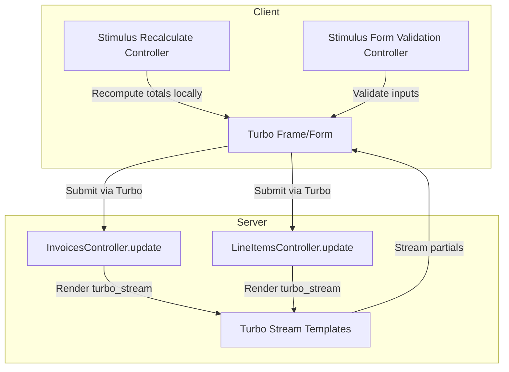
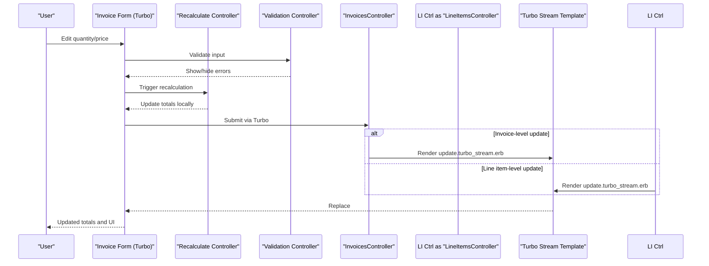

# Real-time Invoice Updates

<cite>
**Referenced Files in This Document**
- [invoices_controller.rb](file://app/controllers/invoices_controller.rb)
- [line_items_controller.rb](file://app/controllers/line_items_controller.rb)
- [update.turbo_stream.erb](file://app/views/invoices/update.turbo_stream.erb)
- [_total.html.erb](file://app/views/invoices/_total.html.erb)
- [_form.html.erb](file://app/views/invoices/_form.html.erb)
- [_item_fields.html.erb](file://app/views/invoices/_item_fields.html.erb)
- [recalculate_controller.js](file://app/javascript/controllers/recalculate_controller.js)
- [form_validation_controller.js](file://app/javascript/controllers/form_validation_controller.js)
- [application.js](file://app/javascript/application.js)
- [routes.rb](file://config/routes.rb)
</cite>

## Table of Contents
1. [Introduction](#introduction)
2. [Project Structure](#project-structure)
3. [Core Components](#core-components)
4. [Architecture Overview](#architecture-overview)
5. [Detailed Component Analysis](#detailed-component-analysis)
6. [Dependency Analysis](#dependency-analysis)
7. [Performance Considerations](#performance-considerations)
8. [Troubleshooting Guide](#troubleshooting-guide)
9. [Conclusion](#conclusion)
10. [Appendices](#appendices)

## Introduction
This document explains the real-time update system for invoices using Turbo Streams and Stimulus.js controllers. It focuses on how partial page updates occur when modifying line items, quantities, or prices; how totals are recalculated automatically; and how client-side validation is handled. It also covers Turbo Stream templates for invoice updates, event handling patterns, server-client state synchronization, examples for extending with custom real-time features, debugging strategies, and performance optimizations for large invoices.

## Project Structure
The real-time invoice update flow spans Rails controllers, Turbo Stream views, and Stimulus controllers:
- Controllers handle form submissions and respond with Turbo Stream fragments to update specific DOM regions.
- Turbo Stream templates render only the parts that changed (for example, totals).
- Stimulus controllers manage client-side behaviors such as recalculation and validation.



**Diagram sources**
- [invoices_controller.rb](file://app/controllers/invoices_controller.rb)
- [line_items_controller.rb](file://app/controllers/line_items_controller.rb)
- [update.turbo_stream.erb](file://app/views/invoices/update.turbo_stream.erb)
- [_total.html.erb](file://app/views/invoices/_total.html.erb)
- [recalculate_controller.js](file://app/javascript/controllers/recalculate_controller.js)
- [form_validation_controller.js](file://app/javascript/controllers/form_validation_controller.js)

**Section sources**
- [invoices_controller.rb](file://app/controllers/invoices_controller.rb)
- [line_items_controller.rb](file://app/controllers/line_items_controller.rb)
- [update.turbo_stream.erb](file://app/views/invoices/update.turbo_stream.erb)
- [_total.html.erb](file://app/views/invoices/_total.html.erb)
- [recalculate_controller.js](file://app/javascript/controllers/recalculate_controller.js)
- [form_validation_controller.js](file://app/javascript/controllers/form_validation_controller.js)

## Core Components
- Invoices controller responds to invoice updates with Turbo Stream to refresh totals and related UI.
- Line items controller handles per-line-item changes and streams back updated sections.
- Turbo Stream template renders a minimal fragment (e.g., totals) to replace existing content without full reloads.
- Stimulus recalculate controller performs local computations for immediate feedback before server confirmation.
- Stimulus form validation controller enforces client-side constraints and provides instant feedback.

Key responsibilities:
- Server: persist changes, compute authoritative totals, return targeted Turbo Stream responses.
- Client: provide instant UX via Stimulus, then reconcile with server state upon stream delivery.

**Section sources**
- [invoices_controller.rb](file://app/controllers/invoices_controller.rb)
- [line_items_controller.rb](file://app/controllers/line_items_controller.rb)
- [update.turbo_stream.erb](file://app/views/invoices/update.turbo_stream.erb)
- [_total.html.erb](file://app/views/invoices/_total.html.erb)
- [recalculate_controller.js](file://app/javascript/controllers/recalculate_controller.js)
- [form_validation_controller.js](file://app/javascript/controllers/form_validation_controller.js)

## Architecture Overview
The system uses Turbo Streams to deliver small HTML fragments that replace specific DOM nodes. Stimulus controllers enhance interactivity by computing values locally and validating inputs. The sequence below shows an invoice update flow:



**Diagram sources**
- [invoices_controller.rb](file://app/controllers/invoices_controller.rb)
- [line_items_controller.rb](file://app/controllers/line_items_controller.rb)
- [update.turbo_stream.erb](file://app/views/invoices/update.turbo_stream.erb)
- [_total.html.erb](file://app/views/invoices/_total.html.erb)
- [recalculate_controller.js](file://app/javascript/controllers/recalculate_controller.js)
- [form_validation_controller.js](file://app/javascript/controllers/form_validation_controller.js)

## Detailed Component Analysis

### Invoices Controller (Server-side update orchestration)
- Handles invoice updates and responds with Turbo Stream to refresh totals and related UI elements.
- Ensures server-authoritative totals are computed and streamed back to the client.
- Coordinates with line item updates to keep totals consistent.

Responsibilities:
- Accept invoice form submissions via Turbo.
- Persist changes and recompute totals.
- Render a Turbo Stream response targeting the totals region.

**Section sources**
- [invoices_controller.rb](file://app/controllers/invoices_controller.rb)
- [update.turbo_stream.erb](file://app/views/invoices/update.turbo_stream.erb)
- [_total.html.erb](file://app/views/invoices/_total.html.erb)

### Line Items Controller (Per-line-item updates)
- Processes individual line item modifications (quantity, price).
- Responds with Turbo Stream to update affected totals and any dependent UI.

Responsibilities:
- Validate and persist line item changes.
- Recompute totals based on updated line items.
- Stream back only the necessary DOM fragments.

**Section sources**
- [line_items_controller.rb](file://app/controllers/line_items_controller.rb)
- [update.turbo_stream.erb](file://app/views/invoices/update.turbo_stream.erb)
- [_total.html.erb](file://app/views/invoices/_total.html.erb)

### Turbo Stream Templates (Partial page updates)
- Renders minimal HTML fragments for targeted DOM replacement.
- Typically targets a container element (e.g., totals) to avoid full page reloads.

Usage patterns:
- Replace totals section after invoice or line item changes.
- Keep IDs stable so Turbo can match and replace nodes reliably.

**Section sources**
- [update.turbo_stream.erb](file://app/views/invoices/update.turbo_stream.erb)
- [_total.html.erb](file://app/views/invoices/_total.html.erb)

### Stimulus Recalculate Controller (Local total computation)
- Listens for changes in line item fields (quantity, price).
- Computes totals locally for immediate feedback.
- Reconciles with server-provided totals once Turbo Stream arrives.

Behavior highlights:
- Debounce rapid input changes if needed.
- Avoid redundant calculations by tracking dirty fields.
- Ensure computed totals do not conflict with server state.

**Section sources**
- [recalculate_controller.js](file://app/javascript/controllers/recalculate_controller.js)
- [_form.html.erb](file://app/views/invoices/_form.html.erb)
- [_item_fields.html.erb](file://app/views/invoices/_item_fields.html.erb)

### Stimulus Form Validation Controller (Client-side validation)
- Validates inputs before submission.
- Displays inline errors and prevents invalid submissions.
- Integrates with Turbo to maintain seamless UX.

Behavior highlights:
- Use native HTML validation attributes where possible.
- Provide clear error messages tied to specific fields.
- Coordinate with Turbo to show server-side errors via streams.

**Section sources**
- [form_validation_controller.js](file://app/javascript/controllers/form_validation_controller.js)
- [_form.html.erb](file://app/views/invoices/_form.html.erb)

### Application JavaScript and Controller Registration
- Boots Stimulus and registers controllers.
- Ensures all relevant controllers are available to data-controller attributes in forms.

**Section sources**
- [application.js](file://app/javascript/application.js)

### Routing Integration
- Routes define endpoints for invoice and line item updates.
- Turbo requests target these routes and expect Turbo Stream responses.

**Section sources**
- [routes.rb](file://config/routes.rb)

## Dependency Analysis
The following diagram maps key dependencies between controllers, views, and Stimulus controllers involved in real-time invoice updates.

```mermaid
graph LR
InvCtrl["InvoicesController"] --> StreamTpl["update.turbo_stream.erb"]
LI Ctrl["LineItemsController"] --> StreamTpl
StreamTpl --> TotalPartial["_total.html.erb"]
StimRecalc["Recalculate Controller"] --> Form["_form.html.erb"]
StimRecalc --> ItemFields["_item_fields.html.erb"]
StimValidate["Form Validation Controller"] --> Form
AppJS["application.js"] --> StimRecalc
AppJS --> StimValidate
Routes["routes.rb"] --> InvCtrl
Routes --> LI Ctrl
```

**Diagram sources**
- [invoices_controller.rb](file://app/controllers/invoices_controller.rb)
- [line_items_controller.rb](file://app/controllers/line_items_controller.rb)
- [update.turbo_stream.erb](file://app/views/invoices/update.turbo_stream.erb)
- [_total.html.erb](file://app/views/invoices/_total.html.erb)
- [recalculate_controller.js](file://app/javascript/controllers/recalculate_controller.js)
- [form_validation_controller.js](file://app/javascript/controllers/form_validation_controller.js)
- [_form.html.erb](file://app/views/invoices/_form.html.erb)
- [_item_fields.html.erb](file://app/views/invoices/_item_fields.html.erb)
- [application.js](file://app/javascript/application.js)
- [routes.rb](file://config/routes.rb)

**Section sources**
- [invoices_controller.rb](file://app/controllers/invoices_controller.rb)
- [line_items_controller.rb](file://app/controllers/line_items_controller.rb)
- [update.turbo_stream.erb](file://app/views/invoices/update.turbo_stream.erb)
- [_total.html.erb](file://app/views/invoices/_total.html.erb)
- [recalculate_controller.js](file://app/javascript/controllers/recalculate_controller.js)
- [form_validation_controller.js](file://app/javascript/controllers/form_validation_controller.js)
- [_form.html.erb](file://app/views/invoices/_form.html.erb)
- [_item_fields.html.erb](file://app/views/invoices/_item_fields.html.erb)
- [application.js](file://app/javascript/application.js)
- [routes.rb](file://config/routes.rb)

## Performance Considerations
For large invoices with many line items:
- Prefer Turbo Stream responses that target only changed regions (e.g., totals) to minimize DOM churn.
- Debounce client-side recalculation to avoid excessive computations during rapid edits.
- Use efficient selectors in Stimulus controllers and avoid unnecessary reflows.
- Keep IDs stable across updates to ensure Turbo can match nodes quickly.
- Consider lazy-loading heavy UI components outside the critical update path.
- Profile network payloads to ensure Turbo Stream fragments remain small.

[No sources needed since this section provides general guidance]

## Troubleshooting Guide
Common issues and resolutions:
- Totals not updating after submission:
  - Verify the Turbo Stream template targets the correct DOM ID for totals.
  - Confirm the controller action renders the Turbo Stream response.
- Local totals diverge from server totals:
  - Ensure the server recomputes totals and streams them back.
  - Check that the Stimulus recalculation does not override server-provided values.
- Validation errors not shown:
  - Confirm the validation controller is registered and attached to the form.
  - Ensure server-side errors are rendered via Turbo Stream when present.
- Turbo Stream not applied:
  - Inspect browser DevTools Network tab for turbo_stream responses.
  - Validate that the response Content-Type is correct and contains valid HTML fragments.

**Section sources**
- [update.turbo_stream.erb](file://app/views/invoices/update.turbo_stream.erb)
- [invoices_controller.rb](file://app/controllers/invoices_controller.rb)
- [line_items_controller.rb](file://app/controllers/line_items_controller.rb)
- [recalculate_controller.js](file://app/javascript/controllers/recalculate_controller.js)
- [form_validation_controller.js](file://app/javascript/controllers/form_validation_controller.js)

## Conclusion
The real-time invoice update system combines Turbo Streams for precise partial updates with Stimulus controllers for responsive client-side behavior. By streaming minimal fragments and performing local computations, the application delivers fast, interactive editing experiences while maintaining consistency with server state. Following the patterns outlined here will help you extend functionality, debug effectively, and optimize performance for complex invoices.

[No sources needed since this section summarizes without analyzing specific files]

## Appendices

### Implementing Custom Real-time Features
- Add a new Stimulus controller to listen for events (e.g., selection changes) and update related UI.
- Create a Turbo Stream template to replace the target region with updated content.
- Wire up the controller action to render the Turbo Stream response.
- Ensure IDs and data attributes are stable for reliable DOM matching.

[No sources needed since this section provides general guidance]

### Debugging Turbo Stream Issues
- Open browser DevTools Network tab and filter by turbo_stream to inspect responses.
- Verify the target element exists and has a unique ID.
- Log DOM mutations around the target region to confirm replacements.
- Temporarily disable Stimulus recalculation to isolate server vs. client discrepancies.

[No sources needed since this section provides general guidance]