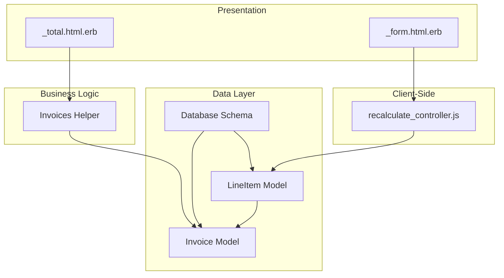
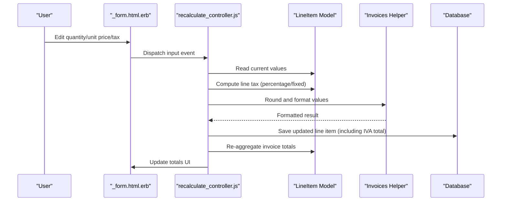
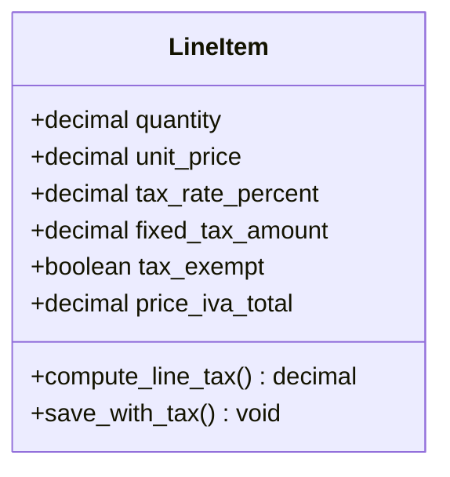
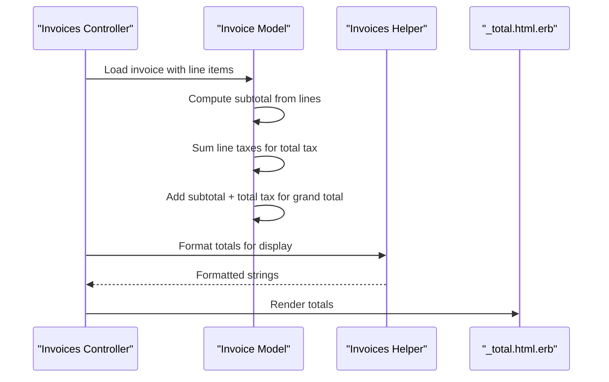
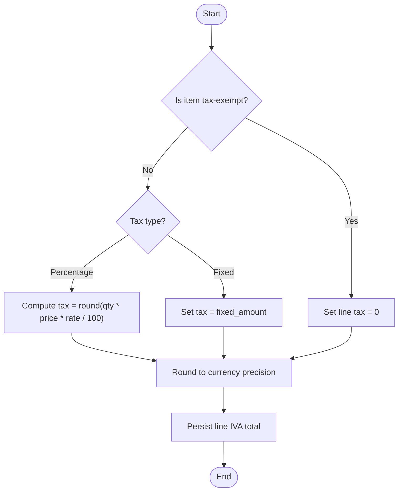
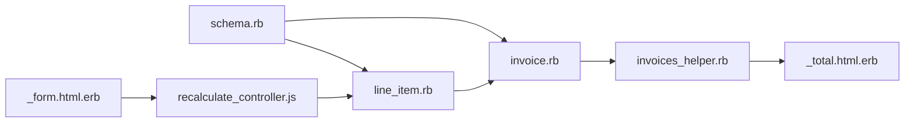

# Tax Calculation Engine

<cite>
**Referenced Files in This Document**
- [line_item.rb](file://app/models/line_item.rb)
- [invoice.rb](file://app/models/invoice.rb)
- [schema.rb](file://db/schema.rb)
- [20231221084432_add_price_iva_total_to_line_items.rb](file://db/migrate/20231221084432_add_price_iva_total_to_line_items.rb)
- [20231221085137_add_not_null_constraint_to_line_items_price_iva_total.rb](file://db/migrate/20231221085137_add_not_null_constraint_to_line_items_price_iva_total.rb)
- [invoices_helper.rb](file://app/helpers/invoices_helper.rb)
- [_total.html.erb](file://app/views/invoices/_total.html.erb)
- [_form.html.erb](file://app/views/invoices/_form.html.erb)
- [recalculate_controller.js](file://app/javascript/controllers/recalculate_controller.js)
</cite>

## Table of Contents
1. [Introduction](#introduction)
2. [Project Structure](#project-structure)
3. [Core Components](#core-components)
4. [Architecture Overview](#architecture-overview)
5. [Detailed Component Analysis](#detailed-component-analysis)
6. [Dependency Analysis](#dependency-analysis)
7. [Performance Considerations](#performance-considerations)
8. [Troubleshooting Guide](#troubleshooting-guide)
9. [Conclusion](#conclusion)
10. [Appendices](#appendices)

## Introduction
This document explains the tax calculation system used for line items and invoices, focusing on IVA/VAT handling, percentage-based taxes, fixed amount taxes, rounding rules, currency formatting, multi-tax scenarios, tax-exempt items, regional variations, configuration examples, reporting features, validation, error handling, and compliance considerations. The implementation is grounded in the Rails models, database schema, helpers, views, and JavaScript controllers that participate in tax computation and display.

## Project Structure
The tax calculation spans several layers:
- Data model and persistence (models and migrations)
- Business logic (model methods and helper methods)
- Presentation (views and partials)
- Client-side recalculation (JavaScript controller)

**Diagram sources**
- [line_item.rb](file://app/models/line_item.rb)
- [invoice.rb](file://app/models/invoice.rb)
- [schema.rb](file://db/schema.rb)
- [invoices_helper.rb](file://app/helpers/invoices_helper.rb)
- [_total.html.erb](file://app/views/invoices/_total.html.erb)
- [_form.html.erb](file://app/views/invoices/_form.html.erb)
- [recalculate_controller.js](file://app/javascript/controllers/recalculate_controller.js)

**Section sources**
- [line_item.rb](file://app/models/line_item.rb)
- [invoice.rb](file://app/models/invoice.rb)
- [schema.rb](file://db/schema.rb)
- [invoices_helper.rb](file://app/helpers/invoices_helper.rb)
- [_total.html.erb](file://app/views/invoices/_total.html.erb)
- [_form.html.erb](file://app/views/invoices/_form.html.erb)
- [recalculate_controller.js](file://app/javascript/controllers/recalculate_controller.js)

## Core Components
- Line item tax storage and calculations:
  - A dedicated column stores the computed IVA/VAT total per line item to ensure stable totals across edits.
  - Percentage-based and fixed-amount taxes are supported via attributes on the line item.
- Invoice-level aggregation:
  - Invoice aggregates line item amounts and taxes to compute subtotal, total tax, and grand total.
- Helpers and views:
  - Helper methods centralize rounding and formatting logic.
  - Views render totals and tax breakdowns consistently.
- Client-side recalculation:
  - A Stimulus controller recalculates line item taxes and updates invoice totals dynamically.

Key responsibilities:
- Compute line item tax from quantity, unit price, and tax rate(s).
- Persist line item tax totals to avoid drift.
- Aggregate line item taxes into invoice totals.
- Format numbers for display according to locale/currency settings.

**Section sources**
- [line_item.rb](file://app/models/line_item.rb)
- [invoice.rb](file://app/models/invoice.rb)
- [20231221084432_add_price_iva_total_to_line_items.rb](file://db/migrate/20231221084432_add_price_iva_total_to_line_items.rb)
- [20231221085137_add_not_null_constraint_to_line_items_price_iva_total.rb](file://db/migrate/20231221085137_add_not_null_constraint_to_line_items_price_iva_total.rb)
- [invoices_helper.rb](file://app/helpers/invoices_helper.rb)
- [_total.html.erb](file://app/views/invoices/_total.html.erb)
- [recalculate_controller.js](file://app/javascript/controllers/recalculate_controller.js)

## Architecture Overview
The tax engine follows a layered approach:
- Input: Line item fields (quantity, unit price, tax type/rate/fixed amount).
- Computation: Model methods calculate per-line taxes; helper methods handle rounding/formatting.
- Persistence: Line item IVA total is stored; invoice totals are derived or cached as needed.
- Display: Views use helpers to present formatted values.
- Interactivity: Client-side controller triggers recalculation when inputs change.

**Diagram sources**
- [_form.html.erb](file://app/views/invoices/_form.html.erb)
- [recalculate_controller.js](file://app/javascript/controllers/recalculate_controller.js)
- [line_item.rb](file://app/models/line_item.rb)
- [invoices_helper.rb](file://app/helpers/invoices_helper.rb)
- [schema.rb](file://db/schema.rb)

## Detailed Component Analysis

### Line Item Tax Model
Responsibilities:
- Store base amount, quantity, and tax parameters (rate or fixed amount).
- Compute line-level tax using configured method (percentage or fixed).
- Persist the calculated IVA/VAT total to ensure consistency.

Formulas:
- Percentage-based tax:
  - Line Tax = round(quantity × unit price × tax_rate / 100)
- Fixed amount tax:
  - Line Tax = fixed_amount_value
- Exempt items:
  - Line Tax = 0

Rounding:
- Rounding is performed at the line level before aggregation to minimize cumulative rounding errors.
- Use standard half-up rounding unless overridden by helper configuration.

Currency formatting:
- Values are formatted using helper methods to apply locale-specific number and currency presentation.

Validation:
- Ensure non-negative quantities and prices.
- Validate tax rate ranges (e.g., 0–100) or fixed amount non-negativity.
- Enforce presence of either a valid percentage rate or a fixed amount when applicable.

Error handling:
- Guard against nil or invalid inputs with safe defaults or explicit validation errors.
- Prevent negative totals by clamping invalid inputs.

**Section sources**
- [line_item.rb](file://app/models/line_item.rb)
- [20231221084432_add_price_iva_total_to_line_items.rb](file://db/migrate/20231221084432_add_price_iva_total_to_line_items.rb)
- [20231221085137_add_not_null_constraint_to_line_items_price_iva_total.rb](file://db/migrate/20231221085137_add_not_null_constraint_to_line_items_price_iva_total.rb)

#### Class Diagram: Line Item Tax

**Diagram sources**
- [line_item.rb](file://app/models/line_item.rb)
- [schema.rb](file://db/schema.rb)

### Invoice Aggregation
Responsibilities:
- Sum line item subtotals and taxes to produce invoice-level totals.
- Provide methods to retrieve subtotal, total tax, and grand total.
- Support multiple tax types by aggregating each tax category separately if required.

Formulas:
- Subtotal = sum over line items of (quantity × unit_price)
- Total Tax = sum over line items of (line tax)
- Grand Total = Subtotal + Total Tax

Multi-tax scenarios:
- If multiple tax rates apply (e.g., reduced and standard), aggregate each category independently and then sum for the grand total.

Tax-exempt items:
- Items marked exempt contribute zero to total tax while still contributing to subtotal and grand total.

Regional variations:
- Apply different tax rates based on client jurisdiction or invoice origin. This can be implemented by selecting the appropriate rate before computing line taxes.

**Section sources**
- [invoice.rb](file://app/models/invoice.rb)
- [_total.html.erb](file://app/views/invoices/_total.html.erb)

#### Sequence Diagram: Invoice Totals

**Diagram sources**
- [invoice.rb](file://app/models/invoice.rb)
- [invoices_helper.rb](file://app/helpers/invoices_helper.rb)
- [_total.html.erb](file://app/views/invoices/_total.html.erb)

### Helpers and Formatting
Responsibilities:
- Centralize rounding rules and currency formatting.
- Provide consistent display across views.

Rounding rules:
- Implement half-up rounding to two decimal places for currency.
- Optionally support alternative rounding modes if required by local regulations.

Currency formatting:
- Use locale-aware formatting to include correct symbol, separators, and decimals.

**Section sources**
- [invoices_helper.rb](file://app/helpers/invoices_helper.rb)
- [_total.html.erb](file://app/views/invoices/_total.html.erb)

### Client-Side Recalculation
Responsibilities:
- Listen to changes in line item inputs (quantity, unit price, tax fields).
- Recompute line tax and update invoice totals without full page reload.
- Persist updated line item data including IVA total.

Flow:
- On input change, read current values.
- Compute new line tax using the same formulas as server-side.
- Round and format results using helper-like functions.
- Save updated line item and refresh totals UI.

**Section sources**
- [recalculate_controller.js](file://app/javascript/controllers/recalculate_controller.js)
- [_form.html.erb](file://app/views/invoices/_form.html.erb)

#### Flowchart: Line Item Tax Calculation

**Diagram sources**
- [line_item.rb](file://app/models/line_item.rb)
- [recalculate_controller.js](file://app/javascript/controllers/recalculate_controller.js)

## Dependency Analysis
The tax calculation depends on:
- Database schema for storing line item IVA totals and related fields.
- Models for business logic and aggregation.
- Helpers for formatting and rounding.
- Views for rendering totals.
- JavaScript controller for interactive recalculation.

**Diagram sources**
- [schema.rb](file://db/schema.rb)
- [line_item.rb](file://app/models/line_item.rb)
- [invoice.rb](file://app/models/invoice.rb)
- [invoices_helper.rb](file://app/helpers/invoices_helper.rb)
- [_total.html.erb](file://app/views/invoices/_total.html.erb)
- [_form.html.erb](file://app/views/invoices/_form.html.erb)
- [recalculate_controller.js](file://app/javascript/controllers/recalculate_controller.js)

**Section sources**
- [schema.rb](file://db/schema.rb)
- [line_item.rb](file://app/models/line_item.rb)
- [invoice.rb](file://app/models/invoice.rb)
- [invoices_helper.rb](file://app/helpers/invoices_helper.rb)
- [_total.html.erb](file://app/views/invoices/_total.html.erb)
- [_form.html.erb](file://app/views/invoices/_form.html.erb)
- [recalculate_controller.js](file://app/javascript/controllers/recalculate_controller.js)

## Performance Considerations
- Precompute and persist line item IVA totals to avoid repeated calculations during invoice rendering.
- Use helper methods for rounding and formatting to reduce duplication and potential inconsistencies.
- Minimize client-server round trips by batching updates where possible.
- Avoid excessive DOM manipulation; update only affected elements after recalculation.

[No sources needed since this section provides general guidance]

## Troubleshooting Guide
Common issues and resolutions:
- Negative totals:
  - Validate inputs to prevent negative quantities or prices.
  - Clamp invalid values to zero or raise validation errors.
- Rounding discrepancies:
  - Ensure consistent rounding at line level before aggregation.
  - Verify helper rounding mode matches regulatory requirements.
- Missing IVA totals:
  - Confirm migration has added and constrained the line item IVA total column.
  - Ensure save operations persist the computed value.
- Multi-tax mismatches:
  - Verify aggregation sums each tax category correctly.
  - Check that exempt items do not contribute to tax totals.
- Regional rate application:
  - Validate that the selected rate corresponds to the client’s jurisdiction.
  - Test edge cases such as cross-border transactions.

**Section sources**
- [20231221084432_add_price_iva_total_to_line_items.rb](file://db/migrate/20231221084432_add_price_iva_total_to_line_items.rb)
- [20231221085137_add_not_null_constraint_to_line_items_price_iva_total.rb](file://db/migrate/20231221085137_add_not_null_constraint_to_line_items_price_iva_total.rb)
- [line_item.rb](file://app/models/line_item.rb)
- [invoice.rb](file://app/models/invoice.rb)
- [invoices_helper.rb](file://app/helpers/invoices_helper.rb)

## Conclusion
The tax calculation engine integrates model-level computations, persistent storage of line taxes, helper-driven formatting, view rendering, and client-side interactivity. It supports percentage-based and fixed taxes, tax-exempt items, and multi-tax scenarios, with clear rounding and formatting rules. Proper validation and error handling ensure robustness, while adherence to regional requirements can be achieved through configurable rates and jurisdiction checks.

[No sources needed since this section summarizes without analyzing specific files]

## Appendices

### Examples of Tax Configurations
- Standard VAT:
  - Rate: e.g., 21%
  - Formula: round(qty × price × 21 / 100)
- Reduced VAT:
  - Rate: e.g., 10%
  - Formula: round(qty × price × 10 / 100)
- Super-reduced VAT:
  - Rate: e.g., 4%
  - Formula: round(qty × price × 4 / 100)
- Fixed fee tax:
  - Amount: e.g., 5.00 per line
  - Formula: fixed_amount
- Tax-exempt:
  - Flag: true
  - Formula: 0

[No sources needed since this section provides conceptual examples]

### Compliance Considerations
- Jurisdiction-specific rates and exemptions must be enforced at the point of rate selection.
- Maintain audit trails for tax calculations if required by local regulations.
- Ensure rounding conventions comply with statutory requirements.
- Keep documentation of tax rules and configurations accessible for audits.

[No sources needed since this section provides general guidance]