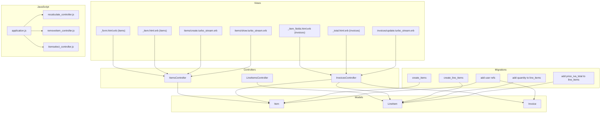
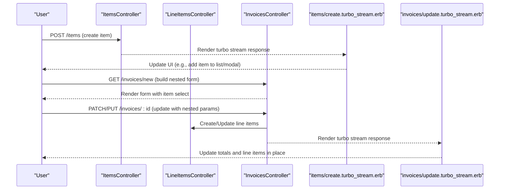
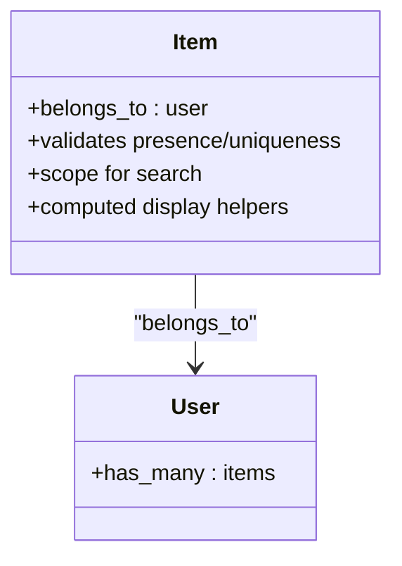
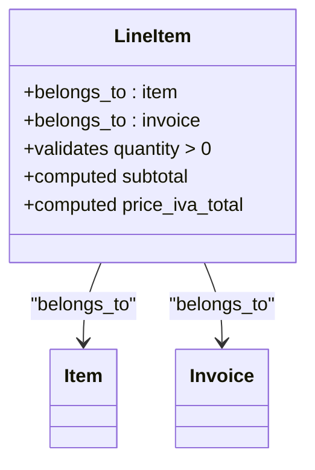
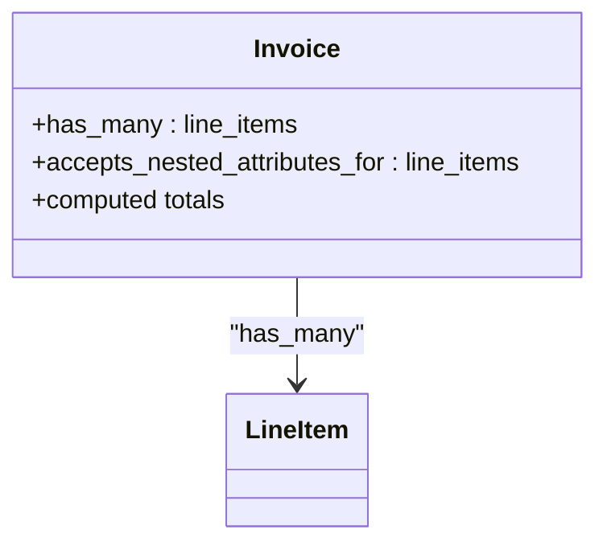
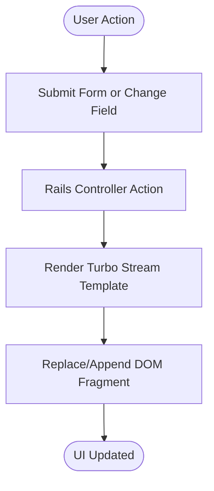
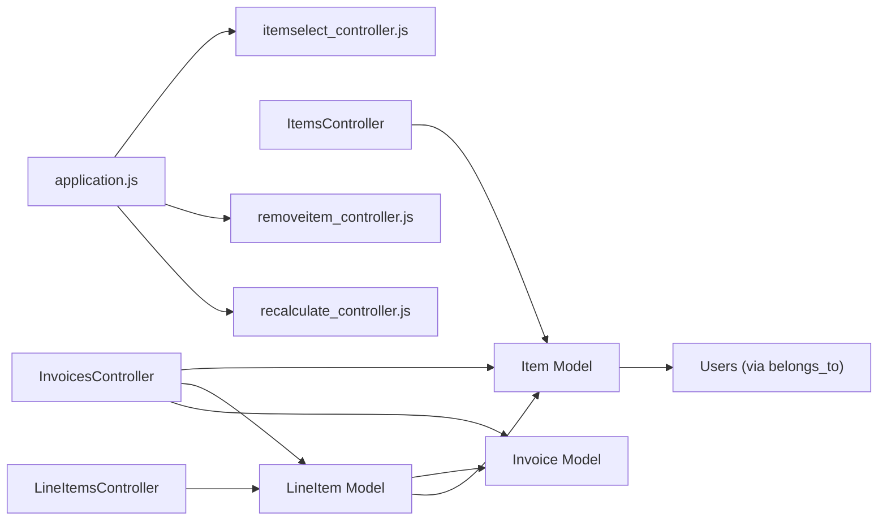

# Item Catalog System

<cite>
**Referenced Files in This Document**
- [item.rb](file://app/models/item.rb)
- [line_item.rb](file://app/models/line_item.rb)
- [invoice.rb](file://app/models/invoice.rb)
- [items_controller.rb](file://app/controllers/items_controller.rb)
- [line_items_controller.rb](file://app/controllers/line_items_controller.rb)
- [invoices_controller.rb](file://app/controllers/invoices_controller.rb)
- [create.turbo_stream.erb](file://app/views/items/create.turbo_stream.erb)
- [show.turbo_stream.erb](file://app/views/items/show.turbo_stream.erb)
- [update.turbo_stream.erb](file://app/views/invoices/update.turbo_stream.erb)
- [_form.html.erb](file://app/views/items/_form.html.erb)
- [_item.html.erb](file://app/views/items/_item.html.erb)
- [_item_fields.html.erb](file://app/views/invoices/_item_fields.html.erb)
- [_total.html.erb](file://app/views/invoices/_total.html.erb)
- [20220923194042_create_items.rb](file://db/migrate/20220923194042_create_items.rb)
- [20220926102115_devise_create_users.rb](file://db/migrate/20220926102115_devise_create_users.rb)
- [20220926151310_add_user_ref_to_itemss.rb](file://db/migrate/20220926151310_add_user_ref_to_itemss.rb)
- [20220926152532_add_user_ref_to_invoice.rb](file://db/migrate/20220926152532_add_user_ref_to_invoice.rb)
- [20220926154117_add_user_ref_to_client.rb](file://db/migrate/20220926154117_add_user_ref_to_client.rb)
- [20220926113947_create_line_items.rb](file://db/migrate/20220926113947_create_line_items.rb)
- [20221006171614_add_quantity_line_items.rb](file://db/migrate/20221006171614_add_quantity_line_items.rb)
- [20231221084432_add_price_iva_total_to_line_items.rb](file://db/migrate/20231221084432_add_price_iva_total_to_line_items.rb)
- [20231221085137_add_not_null_constraint_to_line_items_price_iva_total.rb](file://db/migrate/20231221085137_add_not_null_constraint_to_line_items_price_iva_total.rb)
- [routes.rb](file://config/routes.rb)
- [application.js](file://app/javascript/application.js)
- [recalculate_controller.js](file://app/javascript/controllers/recalculate_controller.js)
- [removeitem_controller.js](file://app/javascript/controllers/removeitem_controller.js)
- [itemselect_controller.js](file://app/javascript/controllers/itemselect_controller.js)
</cite>

## Table of Contents
1. [Introduction](#introduction)
2. [Project Structure](#project-structure)
3. [Core Components](#core-components)
4. [Architecture Overview](#architecture-overview)
5. [Detailed Component Analysis](#detailed-component-analysis)
6. [Dependency Analysis](#dependency-analysis)
7. [Performance Considerations](#performance-considerations)
8. [Troubleshooting Guide](#troubleshooting-guide)
9. [Conclusion](#conclusion)

## Introduction
This document explains the item catalog system used to manage products and services, their pricing and tax settings, and how items are reused across invoices via line items. It covers data models, controllers, views, Turbo Stream integration for real-time updates, search capabilities, and end-to-end workflows for creating and managing items and invoice lines.

## Project Structure
The item catalog spans models, controllers, views, migrations, and JavaScript controllers:
- Models: Item, LineItem, Invoice
- Controllers: ItemsController, LineItemsController, InvoicesController
- Views: Item forms and partials; invoice form with nested item fields; totals partial; Turbo Stream responses
- Migrations: Schema definitions for items, line items, and references to users and invoices
- JavaScript: Turbo Streams and Stimulus controllers for recalculation, removal, and item selection

**Diagram sources**
- [item.rb](file://app/models/item.rb)
- [line_item.rb](file://app/models/line_item.rb)
- [invoice.rb](file://app/models/invoice.rb)
- [items_controller.rb](file://app/controllers/items_controller.rb)
- [line_items_controller.rb](file://app/controllers/line_items_controller.rb)
- [invoices_controller.rb](file://app/controllers/invoices_controller.rb)
- [_form.html.erb](file://app/views/items/_form.html.erb)
- [_item.html.erb](file://app/views/items/_item.html.erb)
- [_item_fields.html.erb](file://app/views/invoices/_item_fields.html.erb)
- [_total.html.erb](file://app/views/invoices/_total.html.erb)
- [create.turbo_stream.erb](file://app/views/items/create.turbo_stream.erb)
- [show.turbo_stream.erb](file://app/views/items/show.turbo_stream.erb)
- [update.turbo_stream.erb](file://app/views/invoices/update.turbo_stream.erb)
- [application.js](file://app/javascript/application.js)
- [recalculate_controller.js](file://app/javascript/controllers/recalculate_controller.js)
- [removeitem_controller.js](file://app/javascript/controllers/removeitem_controller.js)
- [itemselect_controller.js](file://app/javascript/controllers/itemselect_controller.js)
- [20220923194042_create_items.rb](file://db/migrate/20220923194042_create_items.rb)
- [20220926113947_create_line_items.rb](file://db/migrate/20220926113947_create_line_items.rb)
- [20220926151310_add_user_ref_to_itemss.rb](file://db/migrate/20220926151310_add_user_ref_to_itemss.rb)
- [20220926152532_add_user_ref_to_invoice.rb](file://db/migrate/20220926152532_add_user_ref_to_invoice.rb)
- [20221006171614_add_quantity_line_items.rb](file://db/migrate/20221006171614_add_quantity_line_items.rb)
- [20231221084432_add_price_iva_total_to_line_items.rb](file://db/migrate/20231221084432_add_price_iva_total_to_line_items.rb)

**Section sources**
- [item.rb](file://app/models/item.rb)
- [line_item.rb](file://app/models/line_item.rb)
- [invoice.rb](file://app/models/invoice.rb)
- [items_controller.rb](file://app/controllers/items_controller.rb)
- [line_items_controller.rb](file://app/controllers/line_items_controller.rb)
- [invoices_controller.rb](file://app/controllers/invoices_controller.rb)
- [routes.rb](file://config/routes.rb)

## Core Components
- Item model: Represents a product or service with attributes such as name, description, unit price, and tax configuration. Items belong to a user for multi-tenancy.
- LineItem model: Represents an item instance within an invoice, including quantity and computed totals (subtotal, IVA/tax total).
- Invoice model: Aggregates multiple line items and computes invoice totals.

Key responsibilities:
- Item: CRUD operations, validation, and optional search scope.
- LineItem: Quantity handling, price calculations, and IVA totals.
- Invoice: Association management with line items and totals computation.

**Section sources**
- [item.rb](file://app/models/item.rb)
- [line_item.rb](file://app/models/line_item.rb)
- [invoice.rb](file://app/models/invoice.rb)
- [20220923194042_create_items.rb](file://db/migrate/20220923194042_create_items.rb)
- [20220926113947_create_line_items.rb](file://db/migrate/20220926113947_create_line_items.rb)
- [20221006171614_add_quantity_line_items.rb](file://db/migrate/20221006171614_add_quantity_line_items.rb)
- [20231221084432_add_price_iva_total_to_line_items.rb](file://db/migrate/20231221084432_add_price_iva_total_to_line_items.rb)

## Architecture Overview
The item catalog integrates with invoices through nested forms and Turbo Streams. Users create items once and reuse them across multiple invoices by adding line items that reference the same item.

**Diagram sources**
- [items_controller.rb](file://app/controllers/items_controller.rb)
- [line_items_controller.rb](file://app/controllers/line_items_controller.rb)
- [invoices_controller.rb](file://app/controllers/invoices_controller.rb)
- [create.turbo_stream.erb](file://app/views/items/create.turbo_stream.erb)
- [update.turbo_stream.erb](file://app/views/invoices/update.turbo_stream.erb)

## Detailed Component Analysis

### Item Model and Pricing/Tax Configuration
- Attributes typically include name, description, unit price, and tax-related fields (e.g., tax rate or flags). The schema is defined by the items migration.
- Multi-tenancy: Items belong to a user, ensuring isolation between users.
- Search: A scope or method may support filtering by name/description using unaccented text search.

**Diagram sources**
- [item.rb](file://app/models/item.rb)
- [20220926151310_add_user_ref_to_itemss.rb](file://db/migrate/20220926151310_add_user_ref_to_itemss.rb)

**Section sources**
- [item.rb](file://app/models/item.rb)
- [20220923194042_create_items.rb](file://db/migrate/20220923194042_create_items.rb)
- [20220926151310_add_user_ref_to_itemss.rb](file://db/migrate/20220926151310_add_user_ref_to_itemss.rb)

### LineItem Model and Totals
- Represents an item within an invoice with quantity and IVA/tax totals.
- Computed fields: subtotal, IVA total, and possibly grand total per line.
- Associations: belongs_to item, belongs_to invoice.

**Diagram sources**
- [line_item.rb](file://app/models/line_item.rb)
- [20220926113947_create_line_items.rb](file://db/migrate/20220926113947_create_line_items.rb)
- [20221006171614_add_quantity_line_items.rb](file://db/migrate/20221006171614_add_quantity_line_items.rb)
- [20231221084432_add_price_iva_total_to_line_items.rb](file://db/migrate/20231221084432_add_price_iva_total_to_line_items.rb)

**Section sources**
- [line_item.rb](file://app/models/line_item.rb)
- [20220926113947_create_line_items.rb](file://db/migrate/20220926113947_create_line_items.rb)
- [20221006171614_add_quantity_line_items.rb](file://db/migrate/20221006171614_add_quantity_line_items.rb)
- [20231221084432_add_price_iva_total_to_line_items.rb](file://db/migrate/20231221084432_add_price_iva_total_to_line_items.rb)
- [20231221085137_add_not_null_constraint_to_line_items_price_iva_total.rb](file://db/migrate/20231221085137_add_not_null_constraint_to_line_items_price_iva_total.rb)

### Invoice Integration and Nested Forms
- Invoices have many line items and compute totals from line items.
- Nested form allows selecting existing items and setting quantities; updating the invoice triggers recalculations and Turbo Stream updates.

**Diagram sources**
- [invoice.rb](file://app/models/invoice.rb)
- [line_item.rb](file://app/models/line_item.rb)

**Section sources**
- [invoice.rb](file://app/models/invoice.rb)
- [_item_fields.html.erb](file://app/views/invoices/_item_fields.html.erb)
- [_total.html.erb](file://app/views/invoices/_total.html.erb)

### CRUD Operations for Items
- Index: Lists items with pagination and search input.
- New/Create: Creates a new item; on success, renders a Turbo Stream response to update the UI without full reload.
- Edit/Update: Updates item details; can also use Turbo Stream for immediate feedback.
- Show: Displays item details; supports Turbo Stream rendering.
- Destroy: Removes an item if not referenced by active invoices.

Turbo Stream usage:
- Create action responds with a Turbo Stream template to append the new item into lists or modals.
- Show action can respond with a Turbo Stream to refresh inline content.

**Section sources**
- [items_controller.rb](file://app/controllers/items_controller.rb)
- [create.turbo_stream.erb](file://app/views/items/create.turbo_stream.erb)
- [show.turbo_stream.erb](file://app/views/items/show.turbo_stream.erb)
- [_form.html.erb](file://app/views/items/_form.html.erb)
- [_item.html.erb](file://app/views/items/_item.html.erb)

### Line Items Management
- Creation: Typically handled via nested attributes in the invoice form; alternatively, a dedicated controller can manage creation/removal.
- Removal: A Stimulus controller removes line item rows and triggers recalculation.
- Recalculation: When quantity or selected item changes, totals are updated via Turbo Streams or client-side logic.

**Section sources**
- [line_items_controller.rb](file://app/controllers/line_items_controller.rb)
- [_item_fields.html.erb](file://app/views/invoices/_item_fields.html.erb)
- [removeitem_controller.js](file://app/javascript/controllers/removeitem_controller.js)
- [recalculate_controller.js](file://app/javascript/controllers/recalculate_controller.js)

### Search Functionality
- Search inputs filter items by name/description using unaccented matching.
- Results are rendered via partials and can be refreshed via Turbo Streams when filters change.

**Section sources**
- [items_controller.rb](file://app/controllers/items_controller.rb)
- [_item.html.erb](file://app/views/items/_item.html.erb)

### Turbo Stream Integration for Real-Time Updates
- Items create/show actions render .turbo_stream.erb templates to update DOM fragments.
- Invoice updates render a Turbo Stream response to refresh line items and totals.
- Stimulus controllers coordinate behavior like removing items and recalculating totals.

**Diagram sources**
- [create.turbo_stream.erb](file://app/views/items/create.turbo_stream.erb)
- [show.turbo_stream.erb](file://app/views/items/show.turbo_stream.erb)
- [update.turbo_stream.erb](file://app/views/invoices/update.turbo_stream.erb)
- [recalculate_controller.js](file://app/javascript/controllers/recalculate_controller.js)
- [removeitem_controller.js](file://app/javascript/controllers/removeitem_controller.js)

**Section sources**
- [create.turbo_stream.erb](file://app/views/items/create.turbo_stream.erb)
- [show.turbo_stream.erb](file://app/views/items/show.turbo_stream.erb)
- [update.turbo_stream.erb](file://app/views/invoices/update.turbo_stream.erb)
- [recalculate_controller.js](file://app/javascript/controllers/recalculate_controller.js)
- [removeitem_controller.js](file://app/javascript/controllers/removeitem_controller.js)

### Reusing Items Across Multiple Invoices
- Items are created once and referenced by multiple invoices via line items.
- The invoice form includes an item selector; selecting an item populates default values (price, tax) which can be overridden per line item.
- Changing the selected item or quantity triggers recalculation and updates totals in real time.

**Section sources**
- [_item_fields.html.erb](file://app/views/invoices/_item_fields.html.erb)
- [itemselect_controller.js](file://app/javascript/controllers/itemselect_controller.js)
- [invoices_controller.rb](file://app/controllers/invoices_controller.rb)

## Dependency Analysis
- Model relationships:
  - Item belongs_to User
  - LineItem belongs_to Item, belongs_to Invoice
  - Invoice has_many LineItem
- Controller dependencies:
  - ItemsController manages Item lifecycle
  - LineItemsController manages LineItem lifecycle (if used directly)
  - InvoicesController orchestrates nested attributes and totals
- View dependencies:
  - Item partials and forms depend on ItemsController
  - Invoice nested fields and totals depend on InvoicesController and LineItem
- JavaScript dependencies:
  - application.js loads Stimulus controllers
  - recalculate_controller.js updates totals
  - removeitem_controller.js removes line items
  - itemselect_controller.js handles item selection in invoice forms

**Diagram sources**
- [item.rb](file://app/models/item.rb)
- [line_item.rb](file://app/models/line_item.rb)
- [invoice.rb](file://app/models/invoice.rb)
- [items_controller.rb](file://app/controllers/items_controller.rb)
- [line_items_controller.rb](file://app/controllers/line_items_controller.rb)
- [invoices_controller.rb](file://app/controllers/invoices_controller.rb)
- [application.js](file://app/javascript/application.js)
- [recalculate_controller.js](file://app/javascript/controllers/recalculate_controller.js)
- [removeitem_controller.js](file://app/javascript/controllers/removeitem_controller.js)
- [itemselect_controller.js](file://app/javascript/controllers/itemselect_controller.js)

**Section sources**
- [item.rb](file://app/models/item.rb)
- [line_item.rb](file://app/models/line_item.rb)
- [invoice.rb](file://app/models/invoice.rb)
- [items_controller.rb](file://app/controllers/items_controller.rb)
- [line_items_controller.rb](file://app/controllers/line_items_controller.rb)
- [invoices_controller.rb](file://app/controllers/invoices_controller.rb)
- [application.js](file://app/javascript/application.js)

## Performance Considerations
- Use database indexes on frequently searched columns (e.g., item name) to speed up search queries.
- Avoid N+1 queries when listing items or invoice line items by eager loading associations where appropriate.
- Keep Turbo Stream payloads minimal by rendering only necessary fragments.
- Debounce client-side recalculation to prevent excessive re-renders during rapid edits.

[No sources needed since this section provides general guidance]

## Troubleshooting Guide
Common issues and resolutions:
- Missing Turbo Stream responses: Ensure controller actions respond to turbo_stream format and corresponding .turbo_stream.erb templates exist.
- Totals not updating: Verify Stimulus controllers are loaded and event listeners are attached to relevant fields.
- Validation errors on line items: Check quantity constraints and required fields; ensure nested attributes are permitted in the controller.
- Unaccented search not working: Confirm database extension and collation settings for unaccented text search.

**Section sources**
- [create.turbo_stream.erb](file://app/views/items/create.turbo_stream.erb)
- [show.turbo_stream.erb](file://app/views/items/show.turbo_stream.erb)
- [update.turbo_stream.erb](file://app/views/invoices/update.turbo_stream.erb)
- [recalculate_controller.js](file://app/javascript/controllers/recalculate_controller.js)
- [removeitem_controller.js](file://app/javascript/controllers/removeitem_controller.js)

## Conclusion
The item catalog system provides a robust foundation for managing products/services, configuring prices and taxes, and reusing items across invoices. Through clear model relationships, controller orchestration, and Turbo Stream-driven UI updates, it delivers a responsive experience. Proper indexing, eager loading, and minimal payload strategies help maintain performance at scale.