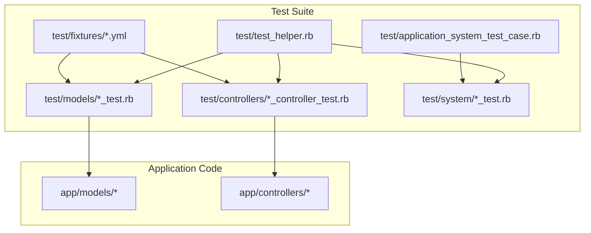
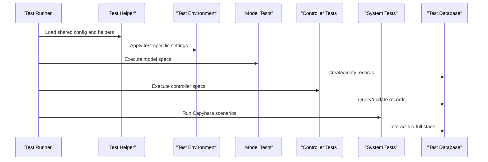
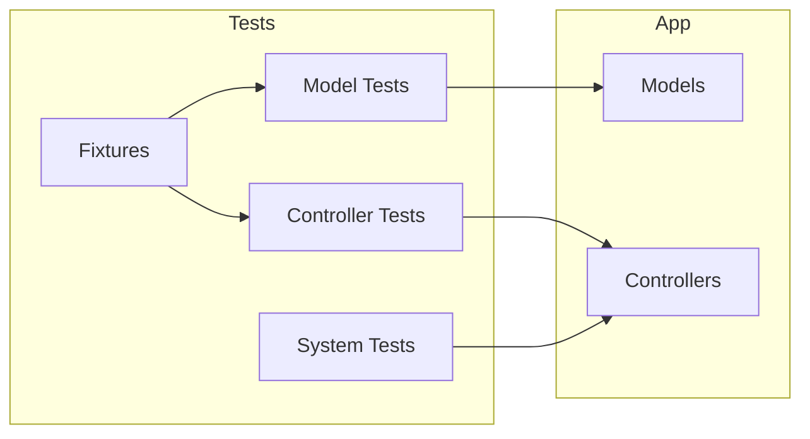

# Testing Strategy

<cite>
**Referenced Files in This Document**
- [test/test_helper.rb](file://test/test_helper.rb)
- [test/application_system_test_case.rb](file://test/application_system_test_case.rb)
- [test/models/invoice_test.rb](file://test/models/invoice_test.rb)
- [test/models/client_test.rb](file://test/models/client_test.rb)
- [test/models/item_test.rb](file://test/models/item_test.rb)
- [test/models/line_item_test.rb](file://test/models/line_item_test.rb)
- [test/models/user_test.rb](file://test/models/user_test.rb)
- [test/models/user_profile_test.rb](file://test/models/user_profile_test.rb)
- [test/controllers/invoices_controller_test.rb](file://test/controllers/invoices_controller_test.rb)
- [test/controllers/clients_controller_test.rb](file://test/controllers/clients_controller_test.rb)
- [test/controllers/items_controller_test.rb](file://test/controllers/items_controller_test.rb)
- [test/controllers/line_items_controller_test.rb](file://test/controllers/line_items_controller_test.rb)
- [test/system/items_test.rb](file://test/system/items_test.rb)
- [test/fixtures/invoices.yml](file://test/fixtures/invoices.yml)
- [test/fixtures/clients.yml](file://test/fixtures/clients.yml)
- [test/fixtures/items.yml](file://test/fixtures/items.yml)
- [test/fixtures/line_items.yml](file://test/fixtures/line_items.yml)
- [test/fixtures/users.yml](file://test/fixtures/users.yml)
- [test/fixtures/user_profiles.yml](file://test/fixtures/user_profiles.yml)
- [config/environments/test.rb](file://config/environments/test.rb)
- [app/models/invoice.rb](file://app/models/invoice.rb)
- [app/models/client.rb](file://app/models/client.rb)
- [app/models/item.rb](file://app/models/item.rb)
- [app/models/line_item.rb](file://app/models/line_item.rb)
- [app/models/user.rb](file://app/models/user.rb)
- [app/models/user_profile.rb](file://app/models/user_profile.rb)
- [app/controllers/invoices_controller.rb](file://app/controllers/invoices_controller.rb)
- [app/controllers/clients_controller.rb](file://app/controllers/clients_controller.rb)
- [app/controllers/items_controller.rb](file://app/controllers/items_controller.rb)
- [app/controllers/line_items_controller.rb](file://app/controllers/line_items_controller.rb)
</cite>

## Table of Contents
1. [Introduction](#introduction)
2. [Project Structure](#project-structure)
3. [Core Components](#core-components)
4. [Architecture Overview](#architecture-overview)
5. [Detailed Component Analysis](#detailed-component-analysis)
6. [Dependency Analysis](#dependency-analysis)
7. [Performance Considerations](#performance-considerations)
8. [Troubleshooting Guide](#troubleshooting-guide)
9. [Conclusion](#conclusion)

## Introduction
This document describes the testing strategy and implementation for the invoicing Rails application. It covers unit tests for models, integration tests for controllers, and system tests with Capybara. It also explains test data management using fixtures, outlines best practices for organizing tests, mocking external services, continuous integration setup, and code coverage requirements. The goal is to provide a clear, actionable guide for writing reliable tests that validate business logic, API endpoints, and user interactions.

## Project Structure
The test suite follows standard Rails conventions:
- Unit tests under test/models for model behavior and validations
- Integration tests under test/controllers for controller actions and request/response flows
- System tests under test/system for end-to-end browser interactions via Capybara
- Shared configuration in test/test_helper.rb and application-level system test case in test/application_system_test_case.rb
- Test data managed via YAML fixtures under test/fixtures

**Diagram sources**
- [test/test_helper.rb](file://test/test_helper.rb)
- [test/application_system_test_case.rb](file://test/application_system_test_case.rb)
- [test/models/invoice_test.rb](file://test/models/invoice_test.rb)
- [test/controllers/invoices_controller_test.rb](file://test/controllers/invoices_controller_test.rb)
- [test/system/items_test.rb](file://test/system/items_test.rb)
- [test/fixtures/invoices.yml](file://test/fixtures/invoices.yml)
- [app/models/invoice.rb](file://app/models/invoice.rb)
- [app/controllers/invoices_controller.rb](file://app/controllers/invoices_controller.rb)

**Section sources**
- [test/test_helper.rb](file://test/test_helper.rb)
- [test/application_system_test_case.rb](file://test/application_system_test_case.rb)
- [test/models/invoice_test.rb](file://test/models/invoice_test.rb)
- [test/controllers/invoices_controller_test.rb](file://test/controllers/invoices_controller_test.rb)
- [test/system/items_test.rb](file://test/system/items_test.rb)
- [test/fixtures/invoices.yml](file://test/fixtures/invoices.yml)
- [app/models/invoice.rb](file://app/models/invoice.rb)
- [app/controllers/invoices_controller.rb](file://app/controllers/invoices_controller.rb)

## Core Components
- Test helper and environment: Centralized configuration and shared helpers are defined in the test helper and per-environment settings.
- Model tests: Validate business rules, associations, and computed attributes for core domain entities.
- Controller tests: Exercise HTTP endpoints, parameter handling, redirects, and JSON responses.
- System tests: Drive real browser interactions through Capybara to validate complete user workflows.
- Fixtures: Provide deterministic seed data for consistent test runs.

Key responsibilities:
- Ensure isolation between tests (transactional or database cleaning strategies).
- Provide reusable helpers for authentication and common assertions.
- Keep system tests focused on user journeys rather than internal details.

**Section sources**
- [config/environments/test.rb](file://config/environments/test.rb)
- [test/test_helper.rb](file://test/test_helper.rb)
- [test/application_system_test_case.rb](file://test/application_system_test_case.rb)

## Architecture Overview
The testing architecture aligns with Rails conventions and separates concerns by layer:
- Unit tests verify model contracts and business logic in isolation.
- Integration tests assert controller behavior including routing, params, and response codes.
- System tests simulate user interactions across views and controllers.

[No diagram sources needed since this diagram shows conceptual workflow, not actual code structure]

## Detailed Component Analysis

### Unit Testing Approach for Models
Focus areas:
- Validations and callbacks
- Associations and referential integrity
- Business calculations and derived attributes
- Edge cases and error conditions

Recommended patterns:
- Use factory-like helpers or fixtures to build minimal valid records.
- Assert both positive and negative paths for validations.
- Isolate expensive computations; avoid network calls.

Example references:
- Invoice model tests covering totals, statuses, and associations
- Client model tests for presence and uniqueness constraints
- Item and LineItem tests for pricing and quantity validations
- User and UserProfile tests for profile fields and relationships

**Section sources**
- [test/models/invoice_test.rb](file://test/models/invoice_test.rb)
- [test/models/client_test.rb](file://test/models/client_test.rb)
- [test/models/item_test.rb](file://test/models/item_test.rb)
- [test/models/line_item_test.rb](file://test/models/line_item_test.rb)
- [test/models/user_test.rb](file://test/models/user_test.rb)
- [test/models/user_profile_test.rb](file://test/models/user_profile_test.rb)
- [app/models/invoice.rb](file://app/models/invoice.rb)
- [app/models/client.rb](file://app/models/client.rb)
- [app/models/item.rb](file://app/models/item.rb)
- [app/models/line_item.rb](file://app/models/line_item.rb)
- [app/models/user.rb](file://app/models/user.rb)
- [app/models/user_profile.rb](file://app/models/user_profile.rb)

### Integration Testing for Controllers
Scope:
- HTTP verbs and routes
- Parameter parsing and strong parameters
- Redirects, renders, and status codes
- JSON serialization for API endpoints

Patterns:
- Build fixtures or inline records for required dependencies.
- Authenticate when necessary using helper methods from the test helper.
- Assert both success and failure scenarios (e.g., invalid inputs).

Example references:
- Invoices controller tests for create, update, show, and index behaviors
- Clients controller tests for CRUD operations and Turbo Stream responses
- Items and LineItems controller tests for nested resource handling

**Section sources**
- [test/controllers/invoices_controller_test.rb](file://test/controllers/invoices_controller_test.rb)
- [test/controllers/clients_controller_test.rb](file://test/controllers/clients_controller_test.rb)
- [test/controllers/items_controller_test.rb](file://test/controllers/items_controller_test.rb)
- [test/controllers/line_items_controller_test.rb](file://test/controllers/line_items_controller_test.rb)
- [app/controllers/invoices_controller.rb](file://app/controllers/invoices_controller.rb)
- [app/controllers/clients_controller.rb](file://app/controllers/clients_controller.rb)
- [app/controllers/items_controller.rb](file://app/controllers/items_controller.rb)
- [app/controllers/line_items_controller.rb](file://app/controllers/line_items_controller.rb)

### System Testing with Capybara
Purpose:
- Validate end-to-end user flows such as creating items, navigating dashboards, and updating invoices.
- Verify UI interactions, form submissions, and Turbo Stream updates.

Best practices:
- Keep tests focused on user goals rather than implementation details.
- Use descriptive step names and assertions tied to visible content.
- Avoid flakiness by waiting for expected elements and avoiding arbitrary sleeps.

Example reference:
- System tests for items demonstrating creation and listing flows

**Section sources**
- [test/system/items_test.rb](file://test/system/items_test.rb)
- [test/application_system_test_case.rb](file://test/application_system_test_case.rb)

### Test Data Management with Fixtures
Strategy:
- Use YAML fixtures to define canonical datasets for models like invoices, clients, items, line items, users, and user profiles.
- Reference fixture records by name in tests for readability and stability.
- Keep fixtures minimal and composable; avoid duplication by leveraging associations.

Organization:
- One fixture file per model under test/fixtures.
- Maintain consistency with schema changes by keeping fixtures aligned with migrations.

**Section sources**
- [test/fixtures/invoices.yml](file://test/fixtures/invoices.yml)
- [test/fixtures/clients.yml](file://test/fixtures/clients.yml)
- [test/fixtures/items.yml](file://test/fixtures/items.yml)
- [test/fixtures/line_items.yml](file://test/fixtures/line_items.yml)
- [test/fixtures/users.yml](file://test/fixtures/users.yml)
- [test/fixtures/user_profiles.yml](file://test/fixtures/user_profiles.yml)

### Writing Tests for Business Logic
Guidelines:
- Identify invariants and critical calculations (e.g., invoice totals, tax computations).
- Write tests that assert these invariants under various input combinations.
- Prefer small, focused examples over large monolithic tests.

References:
- Model tests for invoice totals and related calculations
- Line item validations for price and quantity constraints

**Section sources**
- [test/models/invoice_test.rb](file://test/models/invoice_test.rb)
- [test/models/line_item_test.rb](file://test/models/line_item_test.rb)
- [app/models/invoice.rb](file://app/models/invoice.rb)
- [app/models/line_item.rb](file://app/models/line_item.rb)

### Writing Tests for API Endpoints
Approach:
- For JSON endpoints, assert response body structure and status codes.
- Validate serialization formats and field presence.
- Cover error responses for invalid payloads.

References:
- Controller tests for invoices, clients, items, and line items include JSON rendering expectations

**Section sources**
- [test/controllers/invoices_controller_test.rb](file://test/controllers/invoices_controller_test.rb)
- [test/controllers/clients_controller_test.rb](file://test/controllers/clients_controller_test.rb)
- [test/controllers/items_controller_test.rb](file://test/controllers/items_controller_test.rb)
- [test/controllers/line_items_controller_test.rb](file://test/controllers/line_items_controller_test.rb)

### Writing Tests for User Interactions
Approach:
- Use Capybara to navigate pages, fill forms, click buttons, and assert page content.
- Focus on user journeys such as creating an item and verifying it appears in the list.
- Ensure tests are resilient by asserting on stable selectors or text.

Reference:
- System tests for items demonstrate end-to-end creation and listing

**Section sources**
- [test/system/items_test.rb](file://test/system/items_test.rb)
- [test/application_system_test_case.rb](file://test/application_system_test_case.rb)

### Testing Setup and Configuration
Environment:
- Test environment configuration centralizes database, caching, and other runtime options.
- Test helper provides shared setup, teardown, and convenience methods.

Recommendations:
- Configure transactional tests or database cleaner to ensure isolation.
- Set up Capybara driver and default host for system tests.
- Enable background job adapters suitable for tests if applicable.

**Section sources**
- [config/environments/test.rb](file://config/environments/test.rb)
- [test/test_helper.rb](file://test/test_helper.rb)

### Continuous Integration Configuration
Guidance:
- Add CI steps to run model, controller, and system tests in parallel where possible.
- Cache dependencies and database seeds to speed up builds.
- Capture artifacts such as screenshots or logs for failed system tests.

Note:
- Integrate with your repository’s CI provider (e.g., GitHub Actions, CircleCI) and configure matrix builds for Ruby versions if needed.

[No sources needed since this section provides general guidance]

### Code Coverage Requirements
Targets:
- Aim for high branch and line coverage on critical paths (models and controllers).
- Exclude generated code and third-party integrations from coverage metrics.
- Enforce minimum thresholds in CI to prevent regressions.

Tools:
- Use a coverage gem integrated with the test runner to generate reports.
- Publish coverage summaries in CI artifacts.

[No sources needed since this section provides general guidance]

### Best Practices for Test Organization
- Group tests by feature or domain area to improve discoverability.
- Keep tests small and single-purpose; one assertion per concept when feasible.
- Use descriptive test names that read like specifications.
- Separate concerns: unit tests for pure logic, integration tests for request/response, system tests for UI flows.

[No sources needed since this section provides general guidance]

### Mocking External Services
Strategies:
- Stub HTTP requests to external APIs using a dedicated stubbing library.
- Replace mailers and background jobs with test-friendly adapters.
- Use service objects or modules to abstract external calls, enabling easy substitution in tests.

Examples:
- Stub email sending in mailer tests
- Mock payment or analytics services in controller or model specs

[No sources needed since this section provides general guidance]

### Performance Testing Considerations
- Profile slow queries in model and controller tests using query counters or logging.
- Use smaller datasets in tests to keep suites fast.
- Reserve heavy performance benchmarks for dedicated benchmark scripts outside the main test suite.

[No sources needed since this section provides general guidance]

## Dependency Analysis
Relationships among test layers and application components:

**Diagram sources**
- [test/models/invoice_test.rb](file://test/models/invoice_test.rb)
- [test/controllers/invoices_controller_test.rb](file://test/controllers/invoices_controller_test.rb)
- [test/system/items_test.rb](file://test/system/items_test.rb)
- [test/fixtures/invoices.yml](file://test/fixtures/invoices.yml)
- [app/models/invoice.rb](file://app/models/invoice.rb)
- [app/controllers/invoices_controller.rb](file://app/controllers/invoices_controller.rb)

**Section sources**
- [test/models/invoice_test.rb](file://test/models/invoice_test.rb)
- [test/controllers/invoices_controller_test.rb](file://test/controllers/invoices_controller_test.rb)
- [test/system/items_test.rb](file://test/system/items_test.rb)
- [test/fixtures/invoices.yml](file://test/fixtures/invoices.yml)
- [app/models/invoice.rb](file://app/models/invoice.rb)
- [app/controllers/invoices_controller.rb](file://app/controllers/invoices_controller.rb)

## Performance Considerations
- Prefer transactional tests to reduce database overhead.
- Minimize system tests; they are slower but essential for critical user journeys.
- Use selective test runs for development feedback loops.
- Avoid loading unnecessary assets in system tests unless required.

[No sources needed since this section provides general guidance]

## Troubleshooting Guide
Common issues and resolutions:
- Flaky system tests: Stabilize waits, avoid arbitrary sleeps, and assert on stable content.
- Fixture mismatches: Update fixtures after schema changes; use association references instead of hard IDs.
- Slow test runs: Parallelize where safe, prune unused fixtures, and isolate heavy operations.
- Authentication failures in tests: Ensure helper methods set session cookies or tokens consistently.

[No sources needed since this section provides general guidance]

## Conclusion
A robust testing strategy combines focused unit tests for business logic, comprehensive controller integration tests for API correctness, and targeted system tests for key user journeys. Effective test data management via fixtures ensures reliability, while thoughtful configuration and CI integration maintain quality at scale. Adhering to best practices for organization, mocking, and performance keeps the suite fast, readable, and trustworthy.