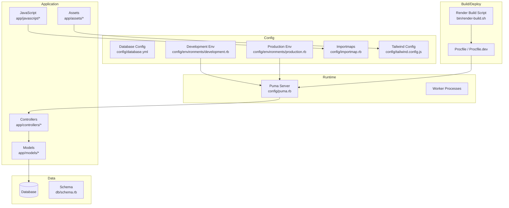
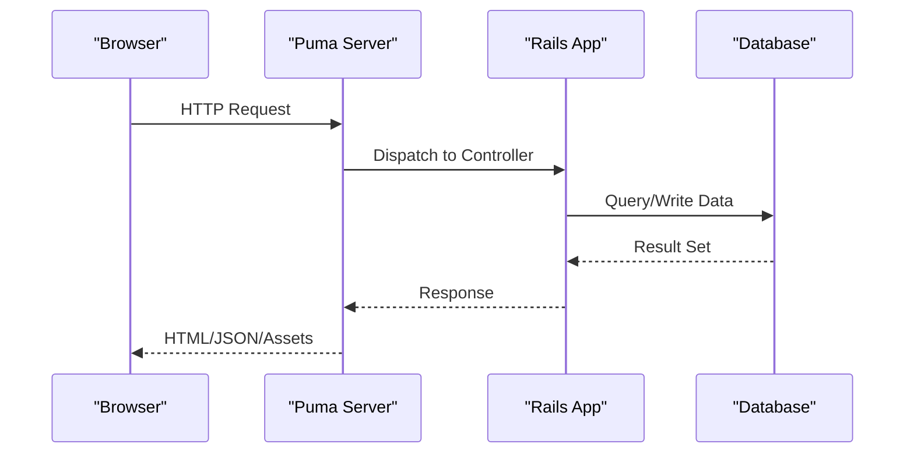
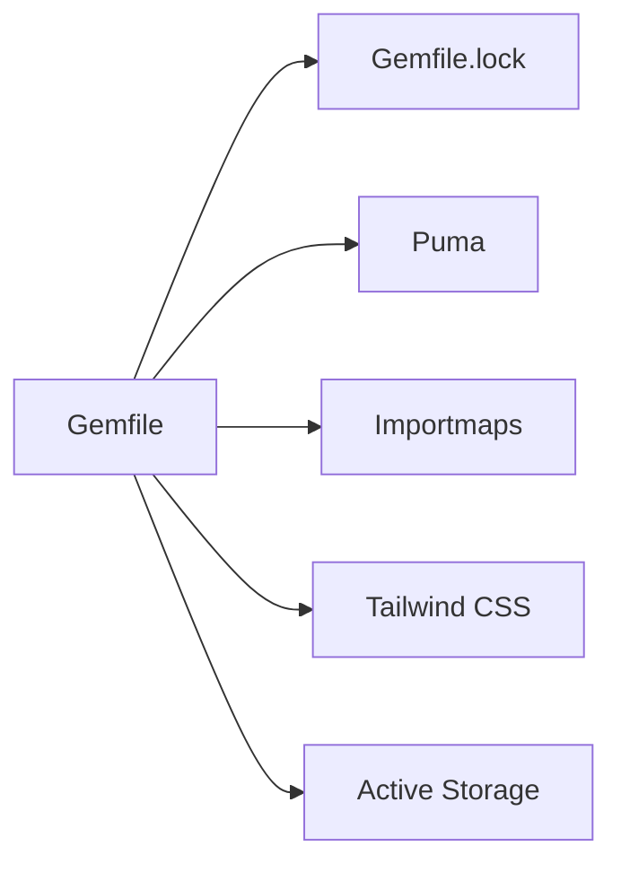

# Troubleshooting & FAQ

<cite>
**Referenced Files in This Document**
- [README.md](file://README.md)
- [Gemfile](file://Gemfile)
- [config/database.yml](file://config/database.yml)
- [config/environments/development.rb](file://config/environments/development.rb)
- [config/environments/production.rb](file://config/environments/production.rb)
- [config/puma.rb](file://config/puma.rb)
- [config/importmap.rb](file://config/importmap.rb)
- [config/tailwind.config.js](file://config/tailwind.config.js)
- [app/assets/stylesheets/application.tailwind.css](file://app/assets/stylesheets/application.tailwind.css)
- [app/javascript/application.js](file://app/javascript/application.js)
- [app/controllers/application_controller.rb](file://app/controllers/application_controller.rb)
- [app/models/application_record.rb](file://app/models/application_record.rb)
- [bin/render-build.sh](file://bin/render-build.sh)
- [Procfile](file://Procfile)
- [Procfile.dev](file://Procfile.dev)
- [Rakefile](file://Rakefile)
- [db/schema.rb](file://db/schema.rb)
- [log/](file://log/)
</cite>

## Table of Contents
1. Introduction
2. Project Structure
3. Core Components
4. Architecture Overview
5. Detailed Component Analysis
6. Dependency Analysis
7. Performance Considerations
8. Troubleshooting Guide
9. Conclusion
10. Appendices

## Introduction
This document provides a comprehensive troubleshooting guide and frequently asked questions for the project. It focuses on diagnosing and resolving common issues such as database connectivity problems, asset compilation failures, deployment errors, performance bottlenecks (slow queries, memory leaks), and migration-related concerns. It also includes guidance on debugging techniques, log analysis, profiling, monitoring, alerting, and upgrade/migration strategies.

## Project Structure
The application is a Rails-based system with:
- Controllers, models, views, helpers, JavaScript controllers, and assets under app/
- Configuration files under config/, including environment-specific settings, database configuration, Puma server setup, Importmaps, and Tailwind CSS
- Database migrations and schema under db/
- Build scripts and process definitions under bin/ and Procfile*
- Logs under log/

**Diagram sources**
- [config/puma.rb](file://config/puma.rb)
- [config/database.yml](file://config/database.yml)
- [config/environments/development.rb](file://config/environments/development.rb)
- [config/environments/production.rb](file://config/environments/production.rb)
- [config/importmap.rb](file://config/importmap.rb)
- [config/tailwind.config.js](file://config/tailwind.config.js)
- [app/javascript/application.js](file://app/javascript/application.js)
- [app/assets/stylesheets/application.tailwind.css](file://app/assets/stylesheets/application.tailwind.css)
- [bin/render-build.sh](file://bin/render-build.sh)
- [Procfile](file://Procfile)
- [Procfile.dev](file://Procfile.dev)
- [db/schema.rb](file://db/schema.rb)

**Section sources**
- [README.md](file://README.md)
- [Gemfile](file://Gemfile)
- [config/database.yml](file://config/database.yml)
- [config/environments/development.rb](file://config/environments/development.rb)
- [config/environments/production.rb](file://config/environments/production.rb)
- [config/puma.rb](file://config/puma.rb)
- [config/importmap.rb](file://config/importmap.rb)
- [config/tailwind.config.js](file://config/tailwind.config.js)
- [app/javascript/application.js](file://app/javascript/application.js)
- [app/assets/stylesheets/application.tailwind.css](file://app/assets/stylesheets/application.tailwind.css)
- [bin/render-build.sh](file://bin/render-build.sh)
- [Procfile](file://Procfile)
- [Procfile.dev](file://Procfile.dev)
- [db/schema.rb](file://db/schema.rb)

## Core Components
- Web server: Puma configured via config/puma.rb and process definitions in Procfile/Procfile.dev.
- Database: Configured in config/database.yml; schema managed by Rails migrations and db/schema.rb.
- Asset pipeline: Importmaps for JavaScript (config/importmap.rb, app/javascript/application.js) and Tailwind CSS (config/tailwind.config.js, app/assets/stylesheets/application.tailwind.css).
- Environment-specific behavior: development.rb and production.rb control logging, caching, and other runtime options.
- Application base classes: app/controllers/application_controller.rb and app/models/application_record.rb provide shared behavior.

Key areas to inspect during troubleshooting:
- Database connectivity and credentials
- Asset build outputs and cache directories
- Process startup logs and worker health
- Environment variables and secrets

**Section sources**
- [config/puma.rb](file://config/puma.rb)
- [Procfile](file://Procfile)
- [Procfile.dev](file://Procfile.dev)
- [config/database.yml](file://config/database.yml)
- [db/schema.rb](file://db/schema.rb)
- [config/importmap.rb](file://config/importmap.rb)
- [app/javascript/application.js](file://app/javascript/application.js)
- [config/tailwind.config.js](file://config/tailwind.config.js)
- [app/assets/stylesheets/application.tailwind.css](file://app/assets/stylesheets/application.tailwind.css)
- [config/environments/development.rb](file://config/environments/development.rb)
- [config/environments/production.rb](file://config/environments/production.rb)
- [app/controllers/application_controller.rb](file://app/controllers/application_controller.rb)
- [app/models/application_record.rb](file://app/models/application_record.rb)

## Architecture Overview
The request lifecycle flows from the browser through Puma to Rails controllers, which interact with models and the database. Assets are served either directly or compiled based on environment settings.

**Diagram sources**
- [config/puma.rb](file://config/puma.rb)
- [config/database.yml](file://config/database.yml)
- [app/controllers/application_controller.rb](file://app/controllers/application_controller.rb)
- [app/models/application_record.rb](file://app/models/application_record.rb)

## Detailed Component Analysis

### Database Connectivity and Queries
Common symptoms:
- Connection refused or authentication errors at startup
- Slow page loads due to N+1 queries or missing indexes
- Deadlocks or timeouts under load

Diagnostic steps:
- Verify database.yml entries and environment variables for credentials and host/port
- Confirm the database is reachable from the application host
- Inspect query logs in development and enable detailed logging in production if needed
- Use Rails console to run suspected queries and analyze execution plans

Performance tips:
- Add appropriate database indexes for filtered/sorted columns
- Use eager loading to avoid N+1 queries
- Paginate large result sets

**Section sources**
- [config/database.yml](file://config/database.yml)
- [config/environments/development.rb](file://config/environments/development.rb)
- [config/environments/production.rb](file://config/environments/production.rb)
- [app/models/application_record.rb](file://app/models/application_record.rb)
- [db/schema.rb](file://db/schema.rb)

### Asset Compilation and Frontend Issues
Common symptoms:
- Missing styles or broken UI after deploy
- JavaScript modules not found or failing to import
- Tailwind utilities not applied

Diagnostic steps:
- Ensure Tailwind config and source paths include your templates and components
- Validate that Tailwind CSS entry file is present and referenced
- Check Importmaps configuration and ensure all imported modules exist
- Clear asset caches and rebuild assets when necessary

Operational notes:
- In development, assets may be compiled on demand; in production, precompile before serving
- Monitor build logs for syntax errors or missing dependencies

**Section sources**
- [config/tailwind.config.js](file://config/tailwind.config.js)
- [app/assets/stylesheets/application.tailwind.css](file://app/assets/stylesheets/application.tailwind.css)
- [config/importmap.rb](file://config/importmap.rb)
- [app/javascript/application.js](file://app/javascript/application.js)

### Deployment and Build Failures
Common symptoms:
- Build script fails during asset compilation or dependency installation
- Worker processes fail to start due to misconfiguration
- Environment variables not available at runtime

Diagnostic steps:
- Review build logs from the deployment platform
- Validate Procfile and Procfile.dev entries match your runtime needs
- Ensure required binaries and native extensions compile successfully
- Confirm secrets and environment variables are set in the deployment environment

**Section sources**
- [bin/render-build.sh](file://bin/render-build.sh)
- [Procfile](file://Procfile)
- [Procfile.dev](file://Procfile.dev)

### Logging and Error Diagnostics
Where to look:
- Application logs under log/
- Server access/error logs from the hosting platform
- Database logs for slow queries and connection issues

Best practices:
- Enable structured logging in production
- Include request IDs for tracing across services
- Avoid logging sensitive data

**Section sources**
- [log/](file://log/)
- [config/environments/development.rb](file://config/environments/development.rb)
- [config/environments/production.rb](file://config/environments/production.rb)

## Dependency Analysis
External dependencies are declared in Gemfile and locked in Gemfile.lock. The application uses:
- Puma as the web server
- Importmaps for JavaScript module resolution
- Tailwind CSS for styling
- Active Storage and related migrations for file handling

**Diagram sources**
- [Gemfile](file://Gemfile)
- [config/puma.rb](file://config/puma.rb)
- [config/importmap.rb](file://config/importmap.rb)
- [config/tailwind.config.js](file://config/tailwind.config.js)

**Section sources**
- [Gemfile](file://Gemfile)
- [config/puma.rb](file://config/puma.rb)
- [config/importmap.rb](file://config/importmap.rb)
- [config/tailwind.config.js](file://config/tailwind.config.js)

## Performance Considerations
- Database:
  - Profile slow queries using logs and explain plans
  - Add indexes for high-cardinality filter/sort columns
  - Use counter caches and denormalization where appropriate
- Application:
  - Cache expensive computations and frequent reads
  - Paginate lists and use selective attribute loading
  - Tune Puma workers and threads according to CPU/memory capacity
- Assets:
  - Precompile and fingerprint assets in production
  - Minimize unused Tailwind utilities to reduce bundle size
- Monitoring:
  - Track response times, error rates, and resource usage
  - Set up alerts for anomalies and threshold breaches

[No sources needed since this section provides general guidance]

## Troubleshooting Guide

### Common Issues and Solutions

#### Database Connection Issues
Symptoms:
- Startup errors indicating connection failure
- Intermittent timeouts under load

Checklist:
- Validate database.yml settings and environment variables
- Confirm network reachability and firewall rules
- Test credentials in a local or staging environment
- Review database limits and connection pool settings

Resolution steps:
- Correct credentials and host/port
- Increase connection pool size if needed
- Implement retries/backoff for transient failures

**Section sources**
- [config/database.yml](file://config/database.yml)
- [config/environments/production.rb](file://config/environments/production.rb)

#### Asset Compilation Problems
Symptoms:
- Missing styles or broken layouts
- JavaScript import errors

Checklist:
- Ensure Tailwind config paths include relevant files
- Verify Tailwind CSS entry file exists and is referenced
- Confirm Importmaps entries point to existing modules
- Clear caches and rebuild assets

Resolution steps:
- Fix path mismatches and missing imports
- Rebuild assets and restart the server
- Validate output in browser dev tools

**Section sources**
- [config/tailwind.config.js](file://config/tailwind.config.js)
- [app/assets/stylesheets/application.tailwind.css](file://app/assets/stylesheets/application.tailwind.css)
- [config/importmap.rb](file://config/importmap.rb)
- [app/javascript/application.js](file://app/javascript/application.js)

#### Deployment Failures
Symptoms:
- Build script exits with errors
- Workers fail to start

Checklist:
- Inspect build logs for dependency or compilation errors
- Validate Procfile and Procfile.dev commands
- Ensure environment variables and secrets are present
- Confirm platform-specific requirements (e.g., Node version, native gems)

Resolution steps:
- Fix failing steps in the build script
- Pin compatible versions in Gemfile and package manifests
- Redeploy after resolving issues

**Section sources**
- [bin/render-build.sh](file://bin/render-build.sh)
- [Procfile](file://Procfile)
- [Procfile.dev](file://Procfile.dev)

#### Memory Leaks and High Memory Usage
Symptoms:
- Gradual memory growth over time
- Frequent process restarts or OOM kills

Diagnostic steps:
- Capture heap snapshots and profile allocations
- Identify long-lived objects and circular references
- Review background jobs and caching strategies

Mitigations:
- Limit object lifetimes and clear caches appropriately
- Use streaming responses for large payloads
- Scale horizontally and monitor per-process memory

[No sources needed since this section provides general guidance]

#### Slow Queries and Scalability Bottlenecks
Symptoms:
- Increased latency under load
- Database CPU spikes

Diagnostic steps:
- Analyze slow query logs and execution plans
- Identify N+1 patterns and add eager loading
- Add indexes for hot paths

Mitigations:
- Denormalize read-heavy fields
- Use read replicas and caching layers
- Tune Puma workers/threads and database connection pools

**Section sources**
- [config/environments/production.rb](file://config/environments/production.rb)
- [config/puma.rb](file://config/puma.rb)
- [config/database.yml](file://config/database.yml)

#### Migration and Upgrade Guides
- Upgrading Rails or gems:
  - Review changelogs for breaking changes
  - Run tests and fix deprecations incrementally
  - Update Gemfile and lockfiles, then redeploy
- Database schema changes:
  - Write backward-compatible migrations
  - Use zero-downtime strategies for column/index changes
  - Validate schema consistency with db/schema.rb

**Section sources**
- [db/schema.rb](file://db/schema.rb)
- [Rakefile](file://Rakefile)

#### Known Limitations and Workarounds
- Asset pipeline constraints:
  - Ensure all imports are resolvable by Importmaps
  - Keep Tailwind source paths accurate to avoid missing utilities
- Production caching:
  - Clear caches after deployments to avoid stale assets
- Platform-specific behaviors:
  - Verify environment variable injection and secret management

**Section sources**
- [config/importmap.rb](file://config/importmap.rb)
- [config/tailwind.config.js](file://config/tailwind.config.js)

### Debugging Techniques
- Local debugging:
  - Use development logs and interactive consoles
  - Reproduce issues with minimal datasets
- Remote debugging:
  - Correlate request IDs across logs
  - Use distributed tracing if applicable
- Log analysis:
  - Filter by severity and component
  - Aggregate metrics for trends

**Section sources**
- [config/environments/development.rb](file://config/environments/development.rb)
- [config/environments/production.rb](file://config/environments/production.rb)
- [log/](file://log/)

### Monitoring and Alerting Strategies
- Metrics to track:
  - Request latency percentiles
  - Error rates and types
  - Database query duration and connection pool utilization
  - Memory/CPU usage per process
- Alert thresholds:
  - Sudden increases in error rates
  - Latency p95 exceeding SLAs
  - Database saturation indicators
- Tools:
  - Platform dashboards and log aggregators
  - Custom health checks and readiness probes

[No sources needed since this section provides general guidance]

## Conclusion
Use this guide to systematically diagnose and resolve common issues across database connectivity, asset compilation, deployment, performance, and upgrades. Combine targeted diagnostics with proactive monitoring and alerting to maintain reliability and scalability.

## Appendices

### Quick Reference Checklist
- Database:
  - Verify credentials and connectivity
  - Review indexes and query plans
- Assets:
  - Validate Tailwind and Importmaps configurations
  - Rebuild assets and clear caches
- Deployment:
  - Inspect build logs and environment variables
  - Confirm Procfile commands
- Performance:
  - Profile slow endpoints and queries
  - Tune Puma and database pools
- Monitoring:
  - Set up dashboards and alerts
  - Establish runbooks for incidents

**Section sources**
- [config/database.yml](file://config/database.yml)
- [config/tailwind.config.js](file://config/tailwind.config.js)
- [config/importmap.rb](file://config/importmap.rb)
- [bin/render-build.sh](file://bin/render-build.sh)
- [Procfile](file://Procfile)
- [Procfile.dev](file://Procfile.dev)
- [config/puma.rb](file://config/puma.rb)
- [config/environments/production.rb](file://config/environments/production.rb)
- [log/](file://log/)