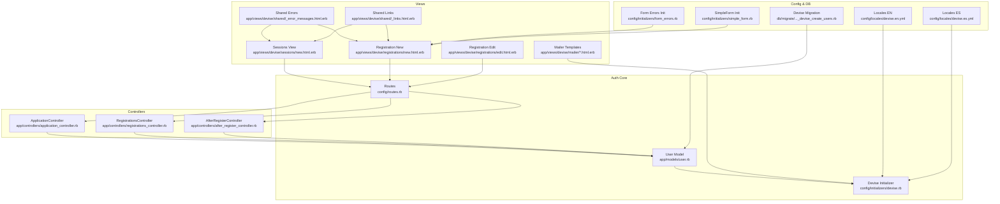
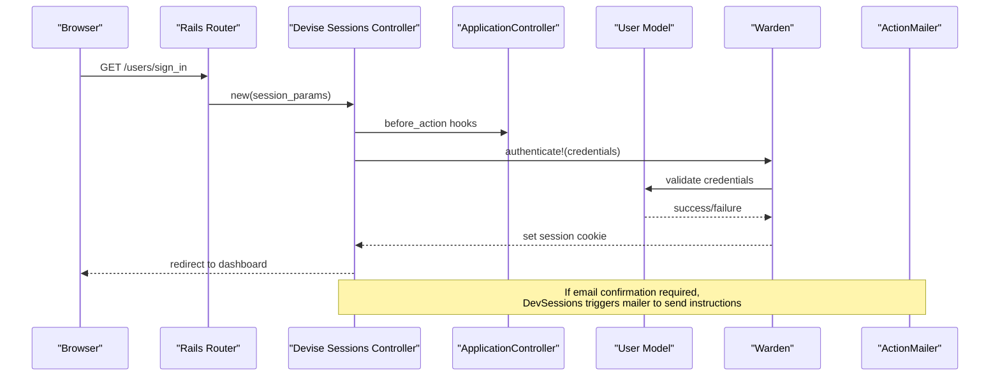
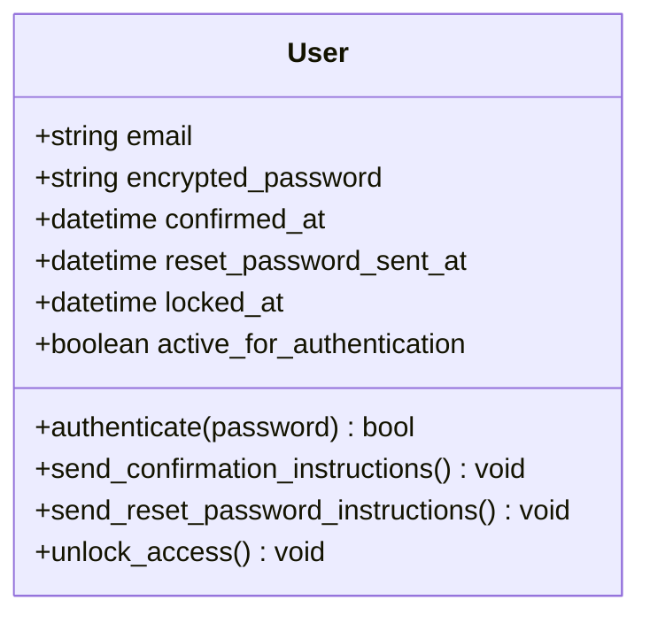
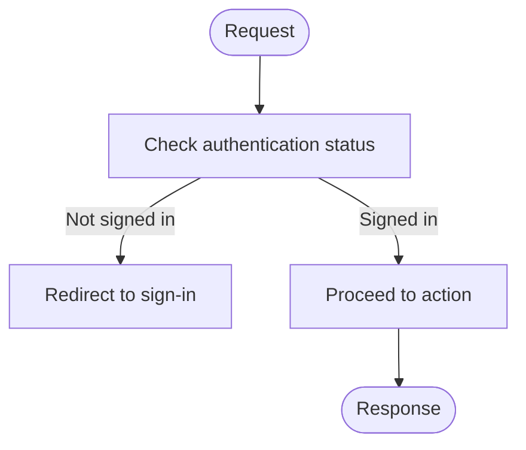
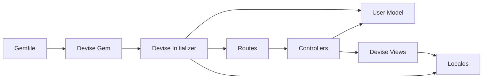

# Authentication & Devise Configuration

<cite>
**Referenced Files in This Document**
- [user.rb](file://app/models/user.rb)
- [devise.rb](file://config/initializers/devise.rb)
- [routes.rb](file://config/routes.rb)
- [application_controller.rb](file://app/controllers/application_controller.rb)
- [registrations_controller.rb](file://app/controllers/registrations_controller.rb)
- [after_register_controller.rb](file://app/controllers/after_register_controller.rb)
- [20220926102115_devise_create_users.rb](file://db/migrate/20220926102115_devise_create_users.rb)
- [new.html.erb](file://app/views/devise/sessions/new.html.erb)
- [new.html.erb](file://app/views/devise/registrations/new.html.erb)
- [edit.html.erb](file://app/views/devise/registrations/edit.html.erb)
- [shared/_error_messages.html.erb](file://app/views/devise/shared/_error_messages.html.erb)
- [shared/_links.html.erb](file://app/views/devise/shared/_links.html.erb)
- [mailer/reset_password_instructions.html.erb](file://app/views/devise/mailer/reset_password_instructions.html.erb)
- [mailer/confirmation_instructions.html.erb](file://app/views/devise/mailer/confirmation_instructions.html.erb)
- [mailer/unlock_instructions.html.erb](file://app/views/devise/mailer/unlock_instructions.html.erb)
- [mailer/password_change.html.erb](file://app/views/devise/mailer/password_change.html.erb)
- [mailer/email_changed.html.erb](file://app/views/devise/mailer/email_changed.html.erb)
- [devise.en.yml](file://config/locales/devise.en.yml)
- [devise.es.yml](file://config/locales/devise.es.yml)
- [form_errors.rb](file://config/initializers/form_errors.rb)
- [simple_form.rb](file://config/initializers/simple_form.rb)
- [Gemfile](file://Gemfile)
</cite>

## Table of Contents
1. [Introduction](#introduction)
2. [Project Structure](#project-structure)
3. [Core Components](#core-components)
4. [Architecture Overview](#architecture-overview)
5. [Detailed Component Analysis](#detailed-component-analysis)
6. [Dependency Analysis](#dependency-analysis)
7. [Performance Considerations](#performance-considerations)
8. [Troubleshooting Guide](#troubleshooting-guide)
9. [Conclusion](#conclusion)
10. [Appendices](#appendices)

## Introduction
This document explains the authentication system implemented with Devise in this Rails application. It covers the User model configuration, Devise modules setup, authentication flow, session management, password policies, and security configurations. It also provides guidance for customizing views, adding validation rules, implementing multi-factor authentication, troubleshooting common issues, optimizing performance, and following security best practices.

## Project Structure
The authentication-related code is organized across models, controllers, initializers, routes, migrations, views, and locales:
- Model: app/models/user.rb
- Devise initializer: config/initializers/devise.rb
- Routes: config/routes.rb
- Controllers: app/controllers/application_controller.rb, app/controllers/registrations_controller.rb, app/controllers/after_register_controller.rb
- Migration: db/migrate/20220926102115_devise_create_users.rb
- Views: app/views/devise/**/*
- Locales: config/locales/devise.*.yml
- Form helpers: config/initializers/form_errors.rb, config/initializers/simple_form.rb
- Dependencies: Gemfile

**Diagram sources**
- [user.rb](file://app/models/user.rb)
- [devise.rb](file://config/initializers/devise.rb)
- [routes.rb](file://config/routes.rb)
- [application_controller.rb](file://app/controllers/application_controller.rb)
- [registrations_controller.rb](file://app/controllers/registrations_controller.rb)
- [after_register_controller.rb](file://app/controllers/after_register_controller.rb)
- [new.html.erb](file://app/views/devise/sessions/new.html.erb)
- [new.html.erb](file://app/views/devise/registrations/new.html.erb)
- [edit.html.erb](file://app/views/devise/registrations/edit.html.erb)
- [shared/_error_messages.html.erb](file://app/views/devise/shared/_error_messages.html.erb)
- [shared/_links.html.erb](file://app/views/devise/shared/_links.html.erb)
- [mailer/reset_password_instructions.html.erb](file://app/views/devise/mailer/reset_password_instructions.html.erb)
- [mailer/confirmation_instructions.html.erb](file://app/views/devise/mailer/confirmation_instructions.html.erb)
- [mailer/unlock_instructions.html.erb](file://app/views/devise/mailer/unlock_instructions.html.erb)
- [mailer/password_change.html.erb](file://app/views/devise/mailer/password_change.html.erb)
- [mailer/email_changed.html.erb](file://app/views/devise/mailer/email_changed.html.erb)
- [devise.en.yml](file://config/locales/devise.en.yml)
- [devise.es.yml](file://config/locales/devise.es.yml)
- [form_errors.rb](file://config/initializers/form_errors.rb)
- [simple_form.rb](file://config/initializers/simple_form.rb)
- [20220926102115_devise_create_users.rb](file://db/migrate/20220926102115_devise_create_users.rb)

**Section sources**
- [user.rb](file://app/models/user.rb)
- [devise.rb](file://config/initializers/devise.rb)
- [routes.rb](file://config/routes.rb)
- [application_controller.rb](file://app/controllers/application_controller.rb)
- [registrations_controller.rb](file://app/controllers/registrations_controller.rb)
- [after_register_controller.rb](file://app/controllers/after_register_controller.rb)
- [20220926102115_devise_create_users.rb](file://db/migrate/20220926102115_devise_create_users.rb)
- [new.html.erb](file://app/views/devise/sessions/new.html.erb)
- [new.html.erb](file://app/views/devise/registrations/new.html.erb)
- [edit.html.erb](file://app/views/devise/registrations/edit.html.erb)
- [shared/_error_messages.html.erb](file://app/views/devise/shared/_error_messages.html.erb)
- [shared/_links.html.erb](file://app/views/devise/shared/_links.html.erb)
- [devise.en.yml](file://config/locales/devise.en.yml)
- [devise.es.yml](file://config/locales/devise.es.yml)
- [form_errors.rb](file://config/initializers/form_errors.rb)
- [simple_form.rb](file://config/initializers/simple_form.rb)

## Core Components
- User model: Declares Devise modules and any custom validations or callbacks.
- Devise initializer: Configures modules, mailer settings, token strategies, and security options.
- Routes: Mounts Devise routes and integrates them with application controllers.
- Controllers: Application controller sets up before_action hooks; RegistrationsController may override default behavior; AfterRegisterController handles post-registration flows.
- Views: Customized Devise views for sessions, registrations, shared partials, and mailers.
- Locales: Internationalization for Devise messages.
- Form helpers: Global form error rendering and SimpleForm configuration.

**Section sources**
- [user.rb](file://app/models/user.rb)
- [devise.rb](file://config/initializers/devise.rb)
- [routes.rb](file://config/routes.rb)
- [application_controller.rb](file://app/controllers/application_controller.rb)
- [registrations_controller.rb](file://app/controllers/registrations_controller.rb)
- [after_register_controller.rb](file://app/controllers/after_register_controller.rb)
- [new.html.erb](file://app/views/devise/sessions/new.html.erb)
- [new.html.erb](file://app/views/devise/registrations/new.erb)
- [edit.html.erb](file://app/views/devise/registrations/edit.html.erb)
- [shared/_error_messages.html.erb](file://app/views/devise/shared/_error_messages.html.erb)
- [shared/_links.html.erb](file://app/views/devise/shared/_links.html.erb)
- [devise.en.yml](file://config/locales/devise.en.yml)
- [devise.es.yml](file://config/locales/devise.es.yml)
- [form_errors.rb](file://config/initializers/form_errors.rb)
- [simple_form.rb](file://config/initializers/simple_form.rb)

## Architecture Overview
The authentication architecture centers on Devise’s Warden-based stack integrated into Rails:
- Requests to login/register/reset-password are routed through Devise controllers mounted by routes.
- Controllers invoke the User model with Devise modules (e.g., :database_authenticatable, :registerable).
- Sessions are managed via cookies configured in the Devise initializer.
- Email workflows use ActionMailer templates under app/views/devise/mailer.
- Validation and error display leverage SimpleForm and shared partials.

**Diagram sources**
- [routes.rb](file://config/routes.rb)
- [application_controller.rb](file://app/controllers/application_controller.rb)
- [user.rb](file://app/models/user.rb)
- [devise.rb](file://config/initializers/devise.rb)
- [new.html.erb](file://app/views/devise/sessions/new.html.erb)

## Detailed Component Analysis

### User Model and Devise Modules
- The User model includes Devise modules that enable authentication features such as database authentication, registration, confirmations, password resets, and unlocks.
- Custom validations can be added to enforce business rules beyond Devise defaults.
- Callbacks can be used to integrate with other domain logic (e.g., creating a profile after sign-up).

**Diagram sources**
- [user.rb](file://app/models/user.rb)
- [20220926102115_devise_create_users.rb](file://db/migrate/20220926102115_devise_create_users.rb)

**Section sources**
- [user.rb](file://app/models/user.rb)
- [20220926102115_devise_create_users.rb](file://db/migrate/20220926102115_devise_create_users.rb)

### Devise Initializer and Security Settings
- The initializer configures which modules are enabled, mailer delivery settings, token expiration windows, and cookie/session options.
- Security-related options include secure cookie flags, timeout durations, and lockout behavior.

Key areas to review:
- Module declarations
- Mailer sender and host settings
- Token expiration and reconfirmation requirements
- Cookie secure flag and HTTP-only settings
- Lock strategy and unlock methods

**Section sources**
- [devise.rb](file://config/initializers/devise.rb)

### Routes and Controller Integration
- Devise routes are mounted to provide standard endpoints for sign-in, sign-out, registration, password reset, and confirmation.
- ApplicationController typically sets up before_action hooks to require authentication and handle unauthorized access.
- RegistrationsController may override default behavior to customize registration fields or post-registration redirects.
- AfterRegisterController orchestrates post-signup steps like setting user preferences or completing onboarding.

**Diagram sources**
- [routes.rb](file://config/routes.rb)
- [application_controller.rb](file://app/controllers/application_controller.rb)
- [registrations_controller.rb](file://app/controllers/registrations_controller.rb)
- [after_register_controller.rb](file://app/controllers/after_register_controller.rb)

**Section sources**
- [routes.rb](file://config/routes.rb)
- [application_controller.rb](file://app/controllers/application_controller.rb)
- [registrations_controller.rb](file://app/controllers/registrations_controller.rb)
- [after_register_controller.rb](file://app/controllers/after_register_controller.rb)

### Session Management
- Sessions are established upon successful authentication and maintained via cookies configured in the Devise initializer.
- Sign-out clears the session and invalidates tokens as per configuration.
- Timeout and timeout_recoverable behaviors can be tuned for idle sessions.

Operational notes:
- Ensure secure cookie flags are enabled in production.
- Configure appropriate timeout values based on security requirements.
- Use proper sign-out endpoints to clear server-side state if using additional session stores.

**Section sources**
- [devise.rb](file://config/initializers/devise.rb)
- [routes.rb](file://config/routes.rb)

### Password Policies and Validation
- Password strength and complexity can be enforced via custom validations in the User model.
- Devise supports password length constraints and reconfirmation when email changes.
- Reset password flows are controlled by token expiration and delivery settings.

Recommendations:
- Add presence and format validations for password confirmation.
- Enforce minimum length and character diversity.
- Require reconfirmation after email updates.

**Section sources**
- [user.rb](file://app/models/user.rb)
- [devise.rb](file://config/initializers/devise.rb)

### Customizing Authentication Views
- Override Devise views by placing templates under app/views/devise.
- Shared partials centralize error messages and navigation links.
- Mailer templates allow branding and content customization for emails.

Common customizations:
- Styling and layout adjustments for sign-in and registration forms.
- Adding extra fields to registration forms and handling strong parameters.
- Localizing labels and error messages via locale files.

**Section sources**
- [new.html.erb](file://app/views/devise/sessions/new.html.erb)
- [new.html.erb](file://app/views/devise/registrations/new.html.erb)
- [edit.html.erb](file://app/views/devise/registrations/edit.html.erb)
- [shared/_error_messages.html.erb](file://app/views/devise/shared/_error_messages.html.erb)
- [shared/_links.html.erb](file://app/views/devise/shared/_links.html.erb)
- [devise.en.yml](file://config/locales/devise.en.yml)
- [devise.es.yml](file://config/locales/devise.es.yml)

### Email Workflows and Mailer Templates
- Devise sends confirmation, reset password, unlock, password change, and email change notifications using ActionMailer.
- Templates reside under app/views/devise/mailer and can be customized for branding and localization.

Configuration points:
- Mailer sender address and default URL options.
- Hostname and protocol settings for generated links.

**Section sources**
- [mailer/reset_password_instructions.html.erb](file://app/views/devise/mailer/reset_password_instructions.html.erb)
- [mailer/confirmation_instructions.html.erb](file://app/views/devise/mailer/confirmation_instructions.html.erb)
- [mailer/unlock_instructions.html.erb](file://app/views/devise/mailer/unlock_instructions.html.erb)
- [mailer/password_change.html.erb](file://app/views/devise/mailer/password_change.html.erb)
- [mailer/email_changed.html.erb](file://app/views/devise/mailer/email_changed.html.erb)
- [devise.rb](file://config/initializers/devise.rb)

### Multi-Factor Authentication (MFA)
To implement MFA:
- Add an MFA module or gem compatible with Devise (for example, TOTP-based authenticator).
- Extend the User model with MFA fields and verification logic.
- Integrate MFA checks into the authentication flow (e.g., challenge step after password verification).
- Provide UI for enabling/disabling MFA and entering verification codes.
- Update routes and controllers to handle MFA challenges and recovery codes.

Security considerations:
- Store secret keys securely and rotate periodically.
- Rate-limit verification attempts.
- Provide secure recovery mechanisms.

[No sources needed since this section provides general guidance]

## Dependency Analysis
Authentication depends on Devise and related gems, routes, controllers, models, views, and locales. The initializer wires modules and security options, while routes expose endpoints consumed by views and controllers.

**Diagram sources**
- [Gemfile](file://Gemfile)
- [devise.rb](file://config/initializers/devise.rb)
- [routes.rb](file://config/routes.rb)
- [user.rb](file://app/models/user.rb)
- [new.html.erb](file://app/views/devise/sessions/new.html.erb)
- [devise.en.yml](file://config/locales/devise.en.yml)

**Section sources**
- [Gemfile](file://Gemfile)
- [devise.rb](file://config/initializers/devise.rb)
- [routes.rb](file://config/routes.rb)
- [user.rb](file://app/models/user.rb)
- [new.html.erb](file://app/views/devise/sessions/new.html.erb)
- [devise.en.yml](file://config/locales/devise.en.yml)

## Performance Considerations
- Minimize N+1 queries in authentication-related controllers by eager loading associated records where necessary.
- Cache frequently accessed user attributes only if safe and consistent with security policies.
- Tune Devise timeout and lockout settings to balance security and user experience.
- Use background jobs for heavy operations triggered during registration (e.g., sending welcome emails) to avoid blocking requests.
- Keep view rendering lightweight; prefer partials and avoid expensive computations in templates.

[No sources needed since this section provides general guidance]

## Troubleshooting Guide
Common issues and resolutions:
- Missing Devise routes: Ensure Devise routes are mounted and not overridden by conflicting routes.
- Unauthenticated redirects: Verify before_action hooks and route protection.
- Email delivery failures: Check mailer configuration, SMTP settings, and hostname.
- Invalid CSRF or session errors: Confirm secure cookie flags and environment-specific settings.
- Form validation errors: Inspect shared error partials and locale messages.

Useful references:
- Devise initializer for configuration details.
- Shared error partials for displaying validation feedback.
- Locale files for message text and formatting.

**Section sources**
- [devise.rb](file://config/initializers/devise.rb)
- [shared/_error_messages.html.erb](file://app/views/devise/shared/_error_messages.html.erb)
- [devise.en.yml](file://config/locales/devise.en.yml)
- [devise.es.yml](file://config/locales/devise.es.yml)

## Conclusion
This authentication system leverages Devise to provide robust, configurable identity management. By carefully tuning the User model, Devise initializer, routes, controllers, views, and locales, you can achieve secure, user-friendly authentication flows. For advanced needs like MFA, extend the User model and integrate additional verification steps while maintaining strong security practices.

[No sources needed since this section summarizes without analyzing specific files]

## Appendices

### Security Best Practices
- Enable secure cookies and HTTPS-only settings in production.
- Enforce strong password policies and consider rate limiting failed attempts.
- Regularly update Devise and related gems to patch vulnerabilities.
- Avoid logging sensitive data such as passwords or tokens.
- Use separate environments for development and production with distinct secrets.

[No sources needed since this section provides general guidance]

### Custom Validation Rules Example Outline
- Add presence and format validations for password and confirmation.
- Implement custom validators for password strength.
- Trigger reconfirmation when email changes.

[No sources needed since this section provides general guidance]

### Localization Tips
- Override Devise messages in locale files for both English and Spanish.
- Ensure all view strings are localized consistently.

**Section sources**
- [devise.en.yml](file://config/locales/devise.en.yml)
- [devise.es.yml](file://config/locales/devise.es.yml)