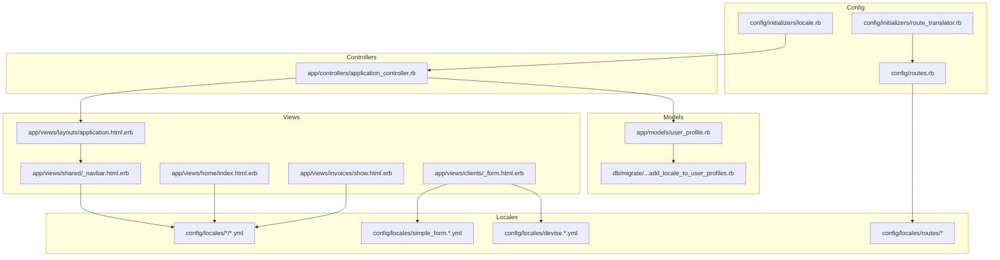
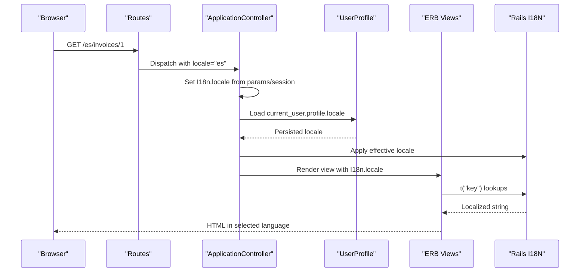
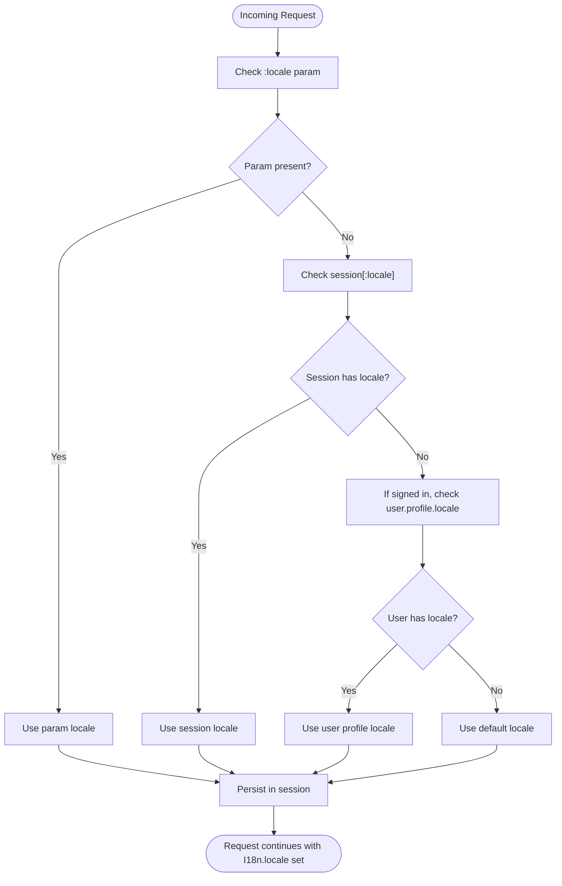
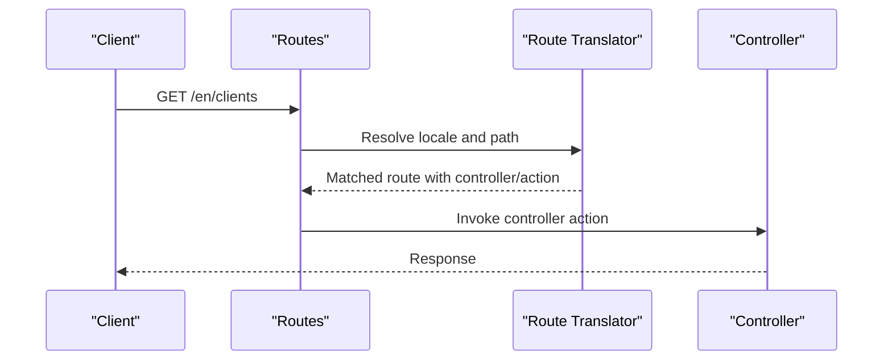
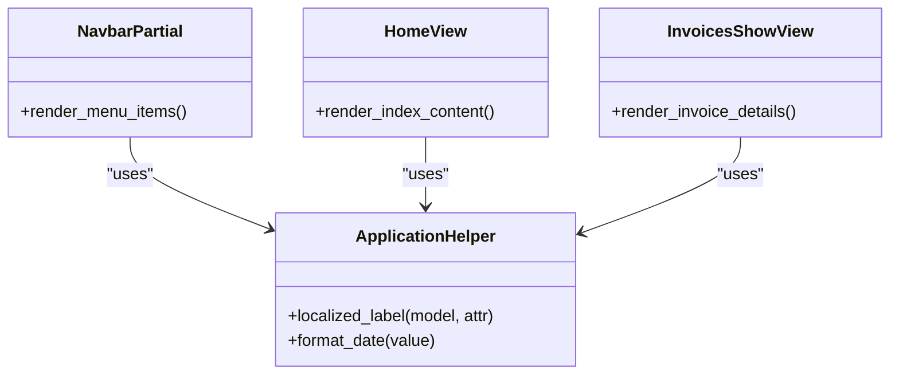
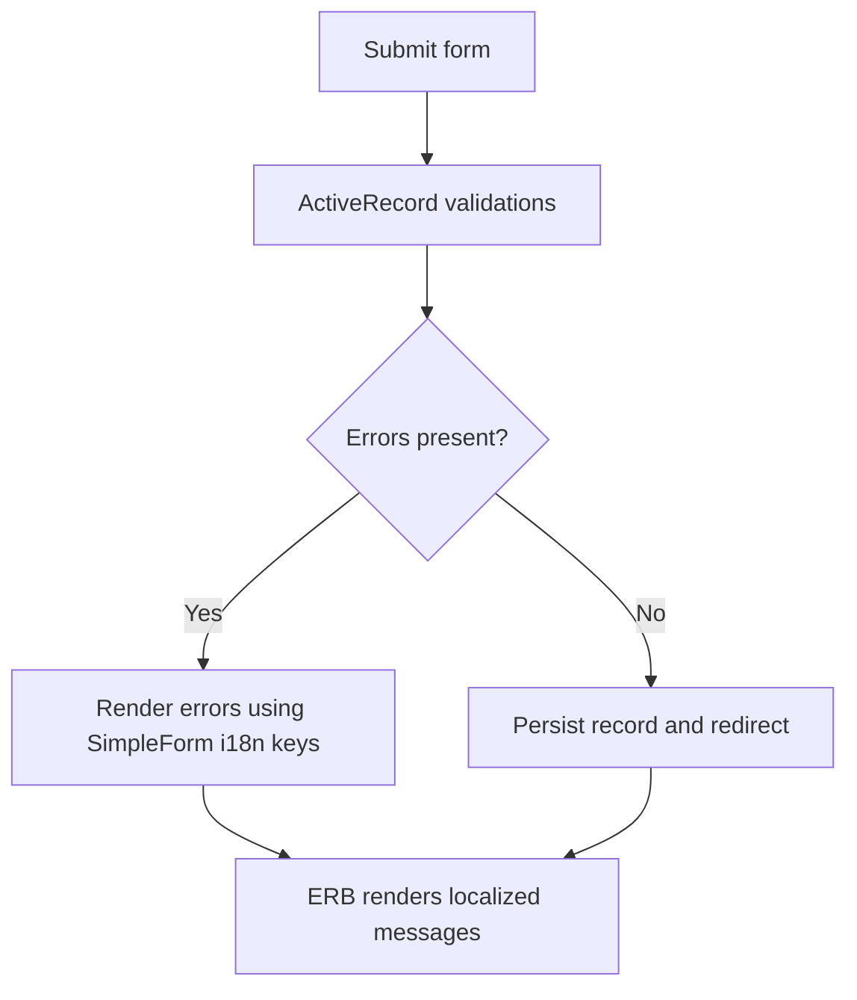
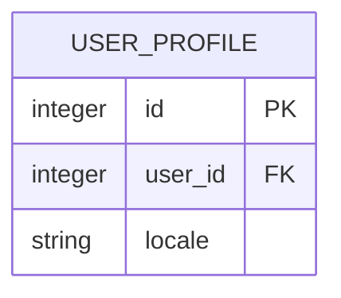
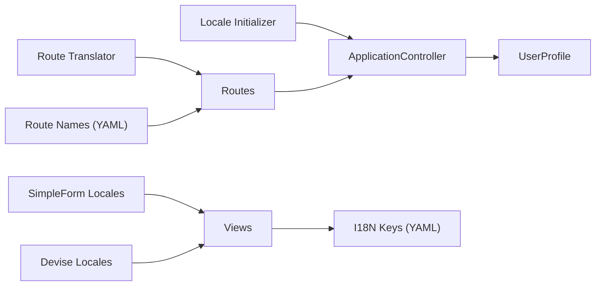

# Multi-language & Localization

<cite>
**Referenced Files in This Document**
- [config/initializers/locale.rb](file://config/initializers/locale.rb)
- [config/initializers/route_translator.rb](file://config/initializers/route_translator.rb)
- [config/routes.rb](file://config/routes.rb)
- [app/controllers/application_controller.rb](file://app/controllers/application_controller.rb)
- [db/migrate/20231224164322_add_locale_to_user_profiles.rb](file://db/migrate/20231224164322_add_locale_to_user_profiles.rb)
- [app/models/user_profile.rb](file://app/models/user_profile.rb)
- [config/locales/simple_form.en.yml](file://config/locales/simple_form.en.yml)
- [config/locales/devise.en.yml](file://config/locales/devise.en.yml)
- [config/locales/devise.es.yml](file://config/locales/devise.es.yml)
- [config/locales/home/en.yml](file://config/locales/home/en.yml)
- [config/locales/home/es.yml](file://config/locales/home/es.yml)
- [config/locales/invoices/en.yml](file://config/locales/invoices/en.yml)
- [config/locales/invoices/es.yml](file://config/locales/invoices/es.yml)
- [config/locales/clients/en.yml](file://config/locales/clients/en.yml)
- [config/locales/clients/es.yml](file://config/locales/clients/es.yml)
- [config/locales/items/en.yml](file://config/locales/items/en.yml)
- [config/locales/items/es.yml](file://config/locales/items/es.yml)
- [config/locales/dashboard/en.yml](file://config/locales/dashboard/en.yml)
- [config/locales/dashboard/es.yml](file://config/locales/dashboard/es.yml)
- [config/locales/mailers/en.yml](file://config/locales/mailers/en.yml)
- [config/locales/mailers/es.yml](file://config/locales/mailers/es.yml)
- [config/locales/shared/navbar/en.yml](file://config/locales/shared/navbar/en.yml)
- [config/locales/shared/navbar/es.yml](file://config/locales/shared/navbar/es.yml)
- [config/locales/shared/sidebar/en.yml](file://config/locales/shared/sidebar/en.yml)
- [config/locales/shared/sidebar/es.yml](file://config/locales/shared/sidebar/es.yml)
- [config/locales/routes/en.yml](file://config/locales/routes/en.yml)
- [config/locales/routes/es.yml](file://config/locales/routes/es.yml)
- [config/locales/defaults/en.yml](file://config/locales/defaults/en.yml)
- [config/locales/defaults/es.yml](file://config/locales/defaults/es.yml)
- [config/locales/defaults/en-GB.yml](file://config/locales/defaults/en-GB.yml)
- [config/locales/defaults/es-ES.yml](file://config/locales/defaults/es-ES.yml)
- [config/locales/registration/en.yml](file://config/locales/registration/en.yml)
- [config/locales/registration/es.yml](file://config/locales/registration/es.yml)
- [app/views/layouts/application.html.erb](file://app/views/layouts/application.html.erb)
- [app/views/shared/_navbar.html.erb](file://app/views/shared/_navbar.html.erb)
- [app/views/home/index.html.erb](file://app/views/home/index.html.erb)
- [app/views/invoices/show.html.erb](file://app/views/invoices/show.html.erb)
- [app/views/clients/_form.html.erb](file://app/views/clients/_form.html.erb)
- [app/helpers/application_helper.rb](file://app/helpers/application_helper.rb)
- [test/test_helper.rb](file://test/test_helper.rb)
</cite>

## Table of Contents
1. [Introduction](#introduction)
2. [Project Structure](#project-structure)
3. [Core Components](#core-components)
4. [Architecture Overview](#architecture-overview)
5. [Detailed Component Analysis](#detailed-component-analysis)
6. [Dependency Analysis](#dependency-analysis)
7. [Performance Considerations](#performance-considerations)
8. [Troubleshooting Guide](#troubleshooting-guide)
9. [Conclusion](#conclusion)
10. [Appendices](#appendices)

## Introduction
This document explains the multi-language support implementation across the application, focusing on:
- Locale detection and persistence
- Translation key organization and file structure
- Dynamic language switching at runtime
- Route translation with locale segments
- Form label localization and error message internationalization
- Context-specific translations (namespaces, defaults, variants)
- Adding new languages and managing translation files
- Performance considerations for large translation sets
- Testing strategies for localized content

## Project Structure
The localization setup follows Rails conventions with additional configuration for route translation and user-level locale preference.

**Diagram sources**
- [config/initializers/locale.rb](file://config/initializers/locale.rb)
- [config/initializers/route_translator.rb](file://config/initializers/route_translator.rb)
- [config/routes.rb](file://config/routes.rb)
- [app/controllers/application_controller.rb](file://app/controllers/application_controller.rb)
- [app/models/user_profile.rb](file://app/models/user_profile.rb)
- [db/migrate/20231224164322_add_locale_to_user_profiles.rb](file://db/migrate/20231224164322_add_locale_to_user_profiles.rb)
- [app/views/layouts/application.html.erb](file://app/views/layouts/application.html.erb)
- [app/views/shared/_navbar.html.erb](file://app/views/shared/_navbar.html.erb)
- [app/views/home/index.html.erb](file://app/views/home/index.html.erb)
- [app/views/invoices/show.html.erb](file://app/views/invoices/show.html.erb)
- [app/views/clients/_form.html.erb](file://app/views/clients/_form.html.erb)
- [config/locales/simple_form.en.yml](file://config/locales/simple_form.en.yml)
- [config/locales/devise.en.yml](file://config/locales/devise.en.yml)
- [config/locales/devise.es.yml](file://config/locales/devise.es.yml)
- [config/locales/routes/en.yml](file://config/locales/routes/en.yml)
- [config/locales/routes/es.yml](file://config/locales/routes/es.yml)

**Section sources**
- [config/initializers/locale.rb](file://config/initializers/locale.rb)
- [config/initializers/route_translator.rb](file://config/initializers/route_translator.rb)
- [config/routes.rb](file://config/routes.rb)
- [app/controllers/application_controller.rb](file://app/controllers/application_controller.rb)
- [app/models/user_profile.rb](file://app/models/user_profile.rb)
- [db/migrate/20231224164322_add_locale_to_user_profiles.rb](file://db/migrate/20231224164322_add_locale_to_user_profiles.rb)
- [app/views/layouts/application.html.erb](file://app/views/layouts/application.html.erb)
- [app/views/shared/_navbar.html.erb](file://app/views/shared/_navbar.html.erb)
- [app/views/home/index.html.erb](file://app/views/home/index.html.erb)
- [app/views/invoices/show.html.erb](file://app/views/invoices/show.html.erb)
- [app/views/clients/_form.html.erb](file://app/views/clients/_form.html.erb)
- [config/locales/simple_form.en.yml](file://config/locales/simple_form.en.yml)
- [config/locales/devise.en.yml](file://config/locales/devise.en.yml)
- [config/locales/devise.es.yml](file://config/locales/devise.es.yml)
- [config/locales/routes/en.yml](file://config/locales/routes/en.yml)
- [config/locales/routes/es.yml](file://config/locales/routes/es.yml)

## Core Components
- Locale detection and persistence:
  - Initializer configures default and request-scoped locale resolution.
  - Controller sets current locale from session, params, or user profile.
  - User profile stores a persistent locale preference.
- Route translation:
  - Route translator initializer enables i18n-aware routes.
  - Routes include locale scope and per-locale route names.
- Views and helpers:
  - Layouts and partials use t() to render localized strings.
  - Forms leverage SimpleForm and Devise i18n keys.

**Section sources**
- [config/initializers/locale.rb](file://config/initializers/locale.rb)
- [app/controllers/application_controller.rb](file://app/controllers/application_controller.rb)
- [app/models/user_profile.rb](file://app/models/user_profile.rb)
- [db/migrate/20231224164322_add_locale_to_user_profiles.rb](file://db/migrate/20231224164322_add_locale_to_user_profiles.rb)
- [config/initializers/route_translator.rb](file://config/initializers/route_translator.rb)
- [config/routes.rb](file://config/routes.rb)
- [app/views/layouts/application.html.erb](file://app/views/layouts/application.html.erb)
- [app/views/shared/_navbar.html.erb](file://app/views/shared/_navbar.html.erb)
- [app/views/home/index.html.erb](file://app/views/home/index.html.erb)
- [app/views/invoices/show.html.erb](file://app/views/invoices/show.html.erb)
- [app/views/clients/_form.html.erb](file://app/views/clients/_form.html.erb)
- [config/locales/simple_form.en.yml](file://config/locales/simple_form.en.yml)
- [config/locales/devise.en.yml](file://config/locales/devise.en.yml)
- [config/locales/devise.es.yml](file://config/locales/devise.es.yml)

## Architecture Overview
The system composes several layers to provide full-stack localization:

**Diagram sources**
- [config/routes.rb](file://config/routes.rb)
- [config/initializers/route_translator.rb](file://config/initializers/route_translator.rb)
- [app/controllers/application_controller.rb](file://app/controllers/application_controller.rb)
- [app/models/user_profile.rb](file://app/models/user_profile.rb)
- [app/views/layouts/application.html.erb](file://app/views/layouts/application.html.erb)

## Detailed Component Analysis

### Locale Detection and Persistence
- Request-time detection:
  - The controller reads locale from URL params, session, or fallbacks to a default.
  - It persists the chosen locale in the session for subsequent requests.
- Persistent user preference:
  - UserProfile includes a locale attribute persisted via migration.
  - When authenticated, the controller can prefer the user’s stored locale.
- Default behavior:
  - Initializer defines default locale and available locales.

**Diagram sources**
- [app/controllers/application_controller.rb](file://app/controllers/application_controller.rb)
- [app/models/user_profile.rb](file://app/models/user_profile.rb)
- [db/migrate/20231224164322_add_locale_to_user_profiles.rb](file://db/migrate/20231224164322_add_locale_to_user_profiles.rb)
- [config/initializers/locale.rb](file://config/initializers/locale.rb)

**Section sources**
- [app/controllers/application_controller.rb](file://app/controllers/application_controller.rb)
- [app/models/user_profile.rb](file://app/models/user_profile.rb)
- [db/migrate/20231224164322_add_locale_to_user_profiles.rb](file://db/migrate/20231224164322_add_locale_to_user_profiles.rb)
- [config/initializers/locale.rb](file://config/initializers/locale.rb)

### Route Translation
- Global route scope includes a dynamic :locale segment.
- Route translator initializer enables i18n-aware routing.
- Per-locale route name mappings are provided under routes locales.

**Diagram sources**
- [config/routes.rb](file://config/routes.rb)
- [config/initializers/route_translator.rb](file://config/initializers/route_translator.rb)
- [config/locales/routes/en.yml](file://config/locales/routes/en.yml)
- [config/locales/routes/es.yml](file://config/locales/routes/es.yml)

**Section sources**
- [config/routes.rb](file://config/routes.rb)
- [config/initializers/route_translator.rb](file://config/initializers/route_translator.rb)
- [config/locales/routes/en.yml](file://config/locales/routes/en.yml)
- [config/locales/routes/es.yml](file://config/locales/routes/es.yml)

### Views and Helpers
- Layouts and shared partials call t() to render navigation and UI text.
- Feature views (home, invoices, clients) use namespaced keys for clarity.
- Helpers centralize common formatting and labels.

**Diagram sources**
- [app/helpers/application_helper.rb](file://app/helpers/application_helper.rb)
- [app/views/shared/_navbar.html.erb](file://app/views/shared/_navbar.html.erb)
- [app/views/home/index.html.erb](file://app/views/home/index.html.erb)
- [app/views/invoices/show.html.erb](file://app/views/invoices/show.html.erb)

**Section sources**
- [app/helpers/application_helper.rb](file://app/helpers/application_helper.rb)
- [app/views/shared/_navbar.html.erb](file://app/views/shared/_navbar.html.erb)
- [app/views/home/index.html.erb](file://app/views/home/index.html.erb)
- [app/views/invoices/show.html.erb](file://app/views/invoices/show.html.erb)

### Form Label Localization and Error Messages
- SimpleForm integration uses dedicated locale files for field labels and validation messages.
- Devise integrates through its own locale files for authentication flows.
- Controllers and models rely on these keys to display consistent messages.

**Diagram sources**
- [config/locales/simple_form.en.yml](file://config/locales/simple_form.en.yml)
- [config/locales/devise.en.yml](file://config/locales/devise.en.yml)
- [config/locales/devise.es.yml](file://config/locales/devise.es.yml)
- [app/views/clients/_form.html.erb](file://app/views/clients/_form.html.erb)

**Section sources**
- [config/locales/simple_form.en.yml](file://config/locales/simple_form.en.yml)
- [config/locales/devise.en.yml](file://config/locales/devise.en.yml)
- [config/locales/devise.es.yml](file://config/locales/devise.es.yml)
- [app/views/clients/_form.html.erb](file://app/views/clients/_form.html.erb)

### Data Model Integration
- UserProfile stores a user’s preferred locale.
- Migration adds the locale column to persist the choice.

**Diagram sources**
- [app/models/user_profile.rb](file://app/models/user_profile.rb)
- [db/migrate/20231224164322_add_locale_to_user_profiles.rb](file://db/migrate/20231224164322_add_locale_to_user_profiles.rb)

**Section sources**
- [app/models/user_profile.rb](file://app/models/user_profile.rb)
- [db/migrate/20231224164322_add_locale_to_user_profiles.rb](file://db/migrate/20231224164322_add_locale_to_user_profiles.rb)

## Dependency Analysis
Key dependencies among localization components:

**Diagram sources**
- [config/initializers/locale.rb](file://config/initializers/locale.rb)
- [config/initializers/route_translator.rb](file://config/initializers/route_translator.rb)
- [config/routes.rb](file://config/routes.rb)
- [app/controllers/application_controller.rb](file://app/controllers/application_controller.rb)
- [app/models/user_profile.rb](file://app/models/user_profile.rb)
- [config/locales/simple_form.en.yml](file://config/locales/simple_form.en.yml)
- [config/locales/devise.en.yml](file://config/locales/devise.en.yml)
- [config/locales/routes/en.yml](file://config/locales/routes/en.yml)

**Section sources**
- [config/initializers/locale.rb](file://config/initializers/locale.rb)
- [config/initializers/route_translator.rb](file://config/initializers/route_translator.rb)
- [config/routes.rb](file://config/routes.rb)
- [app/controllers/application_controller.rb](file://app/controllers/application_controller.rb)
- [app/models/user_profile.rb](file://app/models/user_profile.rb)
- [config/locales/simple_form.en.yml](file://config/locales/simple_form.en.yml)
- [config/locales/devise.en.yml](file://config/locales/devise.en.yml)
- [config/locales/routes/en.yml](file://config/locales/routes/en.yml)

## Performance Considerations
- Lazy loading:
  - Ensure only needed locales are loaded in production; avoid eager-loading all YAML files unless necessary.
- Key scoping:
  - Organize keys by feature namespaces to reduce lookup overhead and improve maintainability.
- Defaults and variants:
  - Use default locale files and region variants (e.g., en-GB, es-ES) to minimize duplication while keeping lookups fast.
- Caching:
  - Rails caches I18n translations in production; verify cache warming if custom loaders are used.
- Large datasets:
  - For very large translation sets, consider splitting into multiple files and loading selectively based on feature flags or modules.

[No sources needed since this section provides general guidance]

## Troubleshooting Guide
Common issues and resolutions:
- Missing translation keys:
  - Verify that the requested key exists in the active locale and falls back correctly to the default.
- Incorrect route locale:
  - Confirm that routes include the :locale segment and that route name maps exist for each locale.
- Form messages not localizing:
  - Ensure SimpleForm and Devise locale files are present and keys match model attributes and error messages.
- User locale not applied:
  - Check that the UserProfile locale is persisted and that the controller applies it when the user is signed in.

**Section sources**
- [config/locales/simple_form.en.yml](file://config/locales/simple_form.en.yml)
- [config/locales/devise.en.yml](file://config/locales/devise.en.yml)
- [config/locales/devise.es.yml](file://config/locales/devise.es.yml)
- [config/locales/routes/en.yml](file://config/locales/routes/en.yml)
- [config/locales/routes/es.yml](file://config/locales/routes/es.yml)
- [app/controllers/application_controller.rb](file://app/controllers/application_controller.rb)
- [app/models/user_profile.rb](file://app/models/user_profile.rb)

## Conclusion
The application implements a robust, layered approach to localization:
- Centralized locale detection with session and user preferences
- Clear namespace-based translation organization
- Route translation with per-locale naming
- Integrated form and Devise message localization
- Scalable patterns for adding languages and context-specific keys

Adhering to the patterns outlined here will keep the codebase maintainable and performant as more languages and features are added.

[No sources needed since this section summarizes without analyzing specific files]

## Appendices

### How to Add a New Language
- Create locale files:
  - Add a directory for each feature under config/locales/<feature>/<lang>.yml.
  - Include defaults and region variants where applicable.
- Update initializers:
  - Register the new locale in the locale initializer.
- Update routes:
  - Provide per-locale route name mappings for the new language.
- Persist user preference:
  - Allow users to select the new language and save it to UserProfile.
- Seed defaults:
  - Populate any required default keys to prevent missing translation warnings.

**Section sources**
- [config/initializers/locale.rb](file://config/initializers/locale.rb)
- [config/locales/routes/en.yml](file://config/locales/routes/en.yml)
- [config/locales/routes/es.yml](file://config/locales/routes/es.yml)
- [app/models/user_profile.rb](file://app/models/user_profile.rb)

### Managing Translation Files
- Organization:
  - Group keys by feature (home, invoices, clients, items, dashboard, mailers, registration).
  - Keep shared UI elements under shared namespaces (navbar, sidebar).
- Defaults and variants:
  - Maintain base defaults (en.yml, es.yml) and regional variants (en-GB.yml, es-ES.yml).
- Consistency:
  - Use helper methods to standardize label generation and formatting.

**Section sources**
- [config/locales/home/en.yml](file://config/locales/home/en.yml)
- [config/locales/home/es.yml](file://config/locales/home/es.yml)
- [config/locales/invoices/en.yml](file://config/locales/invoices/en.yml)
- [config/locales/invoices/es.yml](file://config/locales/invoices/es.yml)
- [config/locales/clients/en.yml](file://config/locales/clients/en.yml)
- [config/locales/clients/es.yml](file://config/locales/clients/es.yml)
- [config/locales/items/en.yml](file://config/locales/items/en.yml)
- [config/locales/items/es.yml](file://config/locales/items/es.yml)
- [config/locales/dashboard/en.yml](file://config/locales/dashboard/en.yml)
- [config/locales/dashboard/es.yml](file://config/locales/dashboard/es.yml)
- [config/locales/mailers/en.yml](file://config/locales/mailers/en.yml)
- [config/locales/mailers/es.yml](file://config/locales/mailers/es.yml)
- [config/locales/shared/navbar/en.yml](file://config/locales/shared/navbar/en.yml)
- [config/locales/shared/navbar/es.yml](file://config/locales/shared/navbar/es.yml)
- [config/locales/shared/sidebar/en.yml](file://config/locales/shared/sidebar/en.yml)
- [config/locales/shared/sidebar/es.yml](file://config/locales/shared/sidebar/es.yml)
- [config/locales/defaults/en.yml](file://config/locales/defaults/en.yml)
- [config/locales/defaults/es.yml](file://config/locales/defaults/es.yml)
- [config/locales/defaults/en-GB.yml](file://config/locales/defaults/en-GB.yml)
- [config/locales/defaults/es-ES.yml](file://config/locales/defaults/es-ES.yml)
- [config/locales/registration/en.yml](file://config/locales/registration/en.yml)
- [config/locales/registration/es.yml](file://config/locales/registration/es.yml)

### Implementing Context-Specific Translations
- Namespacing:
  - Use feature-scoped keys (e.g., home.index.title, invoices.show.total).
- Defaults:
  - Provide fallback values in default locale files to ensure graceful degradation.
- Variants:
  - Override keys in regional variants for locale-specific nuances.

**Section sources**
- [config/locales/defaults/en.yml](file://config/locales/defaults/en.yml)
- [config/locales/defaults/es.yml](file://config/locales/defaults/es.yml)
- [config/locales/defaults/en-GB.yml](file://config/locales/defaults/en-GB.yml)
- [config/locales/defaults/es-ES.yml](file://config/locales/defaults/es-ES.yml)

### Testing Strategies for Localized Content
- Unit tests:
  - Assert that expected keys resolve to non-empty strings for each supported locale.
- Controller tests:
  - Verify that setting locale via params or session affects response rendering.
- System tests:
  - Simulate user selecting a language and confirm UI updates accordingly.
- Fixture data:
  - Use fixtures to validate model-related messages and labels.

**Section sources**
- [test/test_helper.rb](file://test/test_helper.rb)