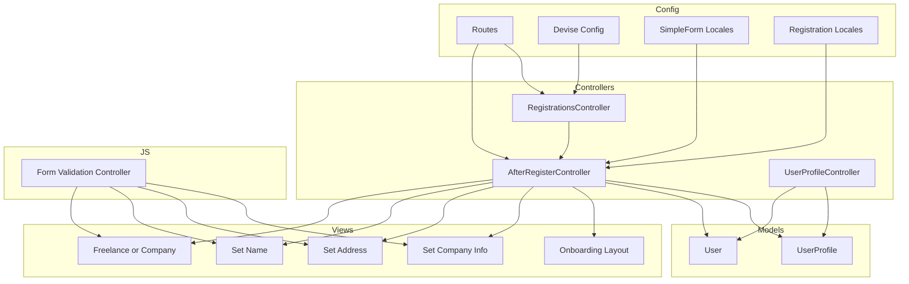
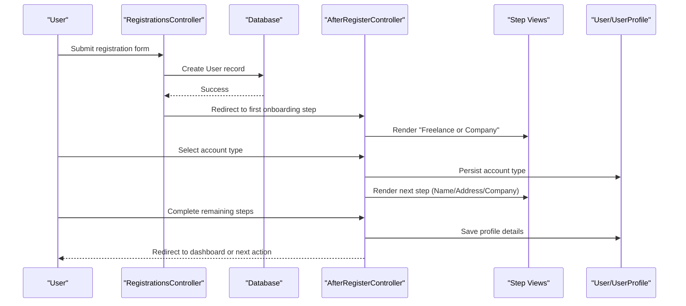
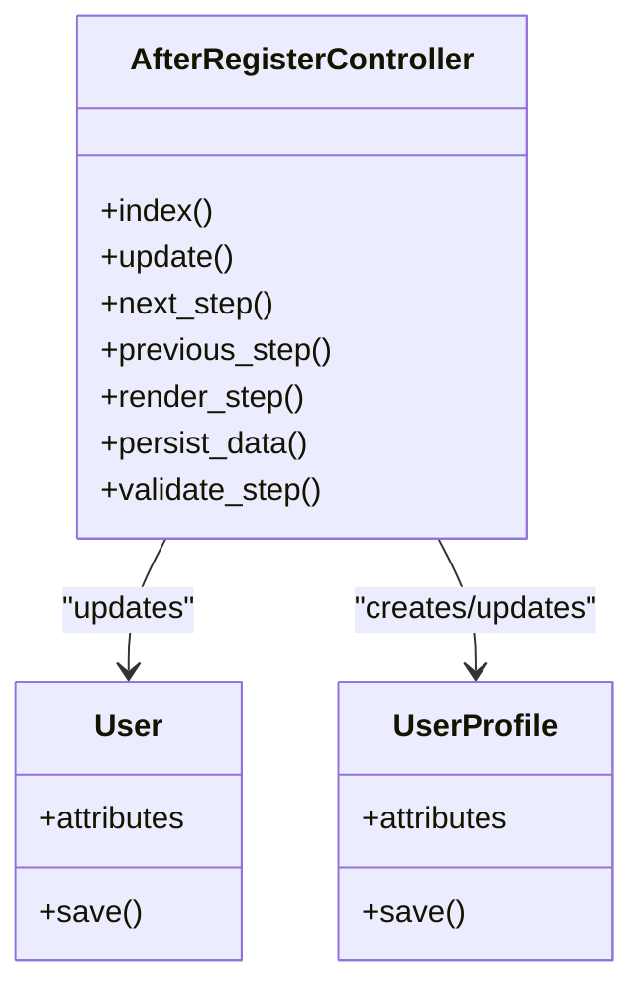
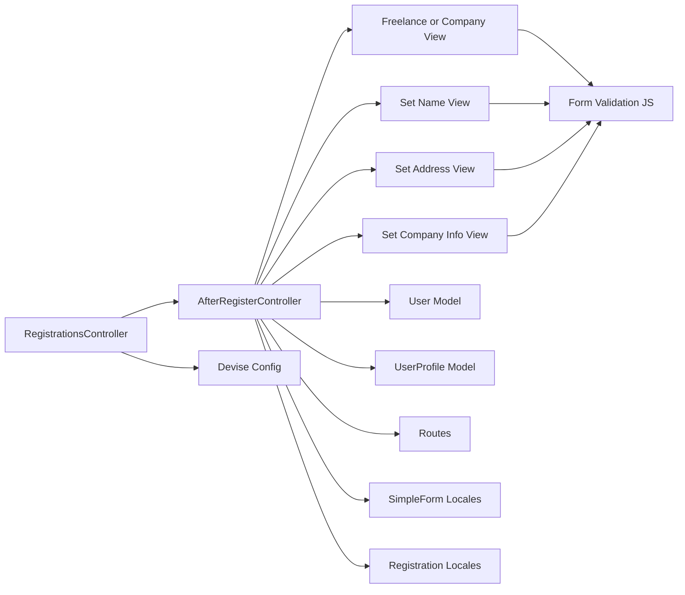

# Registration & Onboarding Flow

<cite>
**Referenced Files in This Document**
- [after_register_controller.rb](file://app/controllers/after_register_controller.rb)
- [registrations_controller.rb](file://app/controllers/registrations_controller.rb)
- [user_profile_controller.rb](file://app/controllers/user_profile_controller.rb)
- [freelance_or_company.html.erb](file://app/views/after_register/freelance_or_company.html.erb)
- [set_name.html.erb](file://app/views/after_register/set_name.html.erb)
- [set_address.html.erb](file://app/views/after_register/set_address.html.erb)
- [set_company_info.html.erb](file://app/views/after_register/set_company_info.html.erb)
- [_links.html.erb](file://app/views/after_register/_links.html.erb)
- [onboarding.html.erb](file://app/views/layouts/onboarding.html.erb)
- [routes.rb](file://config/routes.rb)
- [devise.rb](file://config/initializers/devise.rb)
- [simple_form.en.yml](file://config/locales/simple_form.en.yml)
- [registration/en.yml](file://config/locales/registration/en.yml)
- [user.rb](file://app/models/user.rb)
- [user_profile.rb](file://app/models/user_profile.rb)
- [form_validation_controller.js](file://app/javascript/controllers/form_validation_controller.js)
</cite>

## Table of Contents
1. [Introduction](#introduction)
2. [Project Structure](#project-structure)
3. [Core Components](#core-components)
4. [Architecture Overview](#architecture-overview)
5. [Detailed Component Analysis](#detailed-component-analysis)
6. [Dependency Analysis](#dependency-analysis)
7. [Performance Considerations](#performance-considerations)
8. [Troubleshooting Guide](#troubleshooting-guide)
9. [Conclusion](#conclusion)
10. [Appendices](#appendices)

## Introduction
This document explains the user registration and onboarding workflow, focusing on:
- Multi-step registration process after account creation
- Freelancer vs company account selection
- Profile completion flows (name, address, company info)
- AfterRegisterController logic, form validations, and data persistence
- Customization examples for adding steps, new account types, and conditional fields
- Error handling, progress tracking, and UX optimization during onboarding

The flow is designed to be progressive, guiding users through essential profile setup while keeping each step focused and simple.

## Project Structure
Key files involved in registration and onboarding:
- Controllers:
  - After registration controller orchestrating multi-step onboarding
  - Devise registrations controller for initial sign-up
  - User profile controller for profile updates
- Views:
  - Step views under app/views/after_register
  - Onboarding layout
- Models:
  - User and UserProfile entities
- Routes:
  - Onboarding routes and Devise mount
- Locales:
  - SimpleForm and registration messages
- JavaScript:
  - Client-side validation controller

**Diagram sources**
- [after_register_controller.rb](file://app/controllers/after_register_controller.rb)
- [registrations_controller.rb](file://app/controllers/registrations_controller.rb)
- [user_profile_controller.rb](file://app/controllers/user_profile_controller.rb)
- [freelance_or_company.html.erb](file://app/views/after_register/freelance_or_company.html.erb)
- [set_name.html.erb](file://app/views/after_register/set_name.html.erb)
- [set_address.html.erb](file://app/views/after_register/set_address.html.erb)
- [set_company_info.html.erb](file://app/views/after_register/set_company_info.html.erb)
- [onboarding.html.erb](file://app/views/layouts/onboarding.html.erb)
- [routes.rb](file://config/routes.rb)
- [devise.rb](file://config/initializers/devise.rb)
- [simple_form.en.yml](file://config/locales/simple_form.en.yml)
- [registration/en.yml](file://config/locales/registration/en.yml)
- [user.rb](file://app/models/user.rb)
- [user_profile.rb](file://app/models/user_profile.rb)
- [form_validation_controller.js](file://app/javascript/controllers/form_validation_controller.js)

**Section sources**
- [after_register_controller.rb](file://app/controllers/after_register_controller.rb)
- [registrations_controller.rb](file://app/controllers/registrations_controller.rb)
- [user_profile_controller.rb](file://app/controllers/user_profile_controller.rb)
- [freelance_or_company.html.erb](file://app/views/after_register/freelance_or_company.html.erb)
- [set_name.html.erb](file://app/views/after_register/set_name.html.erb)
- [set_address.html.erb](file://app/views/after_register/set_address.html.erb)
- [set_company_info.html.erb](file://app/views/after_register/set_company_info.html.erb)
- [onboarding.html.erb](file://app/views/layouts/onboarding.html.erb)
- [routes.rb](file://config/routes.rb)
- [devise.rb](file://config/initializers/devise.rb)
- [simple_form.en.yml](file://config/locales/simple_form.en.yml)
- [registration/en.yml](file://config/locales/registration/en.yml)
- [user.rb](file://app/models/user.rb)
- [user_profile.rb](file://app/models/user_profile.rb)
- [form_validation_controller.js](file://app/javascript/controllers/form_validation_controller.js)

## Core Components
- AfterRegisterController: Orchestrates multi-step onboarding, persists selections, and guides users through profile completion.
- RegistrationsController: Handles initial account creation via Devise and redirects to onboarding.
- UserProfileController: Manages profile updates post-onboarding.
- Views: Provide step-by-step forms with localized labels and errors.
- Models: User and UserProfile store core identity and profile details.
- Routes: Define onboarding endpoints and Devise mounts.
- Locales: Provide translations for form fields and error messages.
- JavaScript: Enhances client-side validation and UX.

**Section sources**
- [after_register_controller.rb](file://app/controllers/after_register_controller.rb)
- [registrations_controller.rb](file://app/controllers/registrations_controller.rb)
- [user_profile_controller.rb](file://app/controllers/user_profile_controller.rb)
- [user.rb](file://app/models/user.rb)
- [user_profile.rb](file://app/models/user_profile.rb)
- [routes.rb](file://config/routes.rb)
- [simple_form.en.yml](file://config/locales/simple_form.en.yml)
- [registration/en.yml](file://config/locales/registration/en.yml)
- [form_validation_controller.js](file://app/javascript/controllers/form_validation_controller.js)

## Architecture Overview
High-level sequence from registration to onboarding completion:

**Diagram sources**
- [registrations_controller.rb](file://app/controllers/registrations_controller.rb)
- [after_register_controller.rb](file://app/controllers/after_register_controller.rb)
- [freelance_or_company.html.erb](file://app/views/after_register/freelance_or_company.html.erb)
- [set_name.html.erb](file://app/views/after_register/set_name.html.erb)
- [set_address.html.erb](file://app/views/after_register/set_address.html.erb)
- [set_company_info.html.erb](file://app/views/after_register/set_company_info.html.erb)
- [user.rb](file://app/models/user.rb)
- [user_profile.rb](file://app/models/user_profile.rb)

## Detailed Component Analysis

### AfterRegisterController Logic
Responsibilities:
- Route users through sequential steps based on account type
- Validate inputs per step
- Persist data to User and UserProfile models
- Handle errors and maintain session state across steps
- Provide navigation helpers and progress indicators

Key behaviors:
- Step routing: Determines current step and next step based on persisted data
- Conditional rendering: Shows company-specific fields only when company is selected
- Data persistence: Updates User and UserProfile attributes atomically where appropriate
- Error handling: Displays localized errors and retains partial input

Customization points:
- Add new steps by defining actions and views
- Introduce additional account types by extending selection logic
- Implement conditional fields using helper methods that check account type

**Section sources**
- [after_register_controller.rb](file://app/controllers/after_register_controller.rb)
- [freelance_or_company.html.erb](file://app/views/after_register/freelance_or_company.html.erb)
- [set_name.html.erb](file://app/views/after_register/set_name.html.erb)
- [set_address.html.erb](file://app/views/after_register/set_address.html.erb)
- [set_company_info.html.erb](file://app/views/after_register/set_company_info.html.erb)
- [_links.html.erb](file://app/views/after_register/_links.html.erb)

#### Class Diagram

**Diagram sources**
- [after_register_controller.rb](file://app/controllers/after_register_controller.rb)
- [user.rb](file://app/models/user.rb)
- [user_profile.rb](file://app/models/user_profile.rb)

### Form Validations and Data Persistence
Validation strategy:
- Server-side validations enforced in controllers and models
- Client-side enhancements via JavaScript controller for immediate feedback
- Localized error messages using SimpleForm and registration locales

Persistence strategy:
- Atomic updates within transactional blocks where necessary
- Separate model updates for User and UserProfile to keep concerns clear
- Guard clauses to prevent overwriting sensitive fields

Example customization:
- Add a new required field to the name step and update validations accordingly
- Introduce conditional company tax ID field shown only for company accounts

**Section sources**
- [simple_form.en.yml](file://config/locales/simple_form.en.yml)
- [registration/en.yml](file://config/locales/registration/en.yml)
- [form_validation_controller.js](file://app/javascript/controllers/form_validation_controller.js)
- [user.rb](file://app/models/user.rb)
- [user_profile.rb](file://app/models/user_profile.rb)

### Account Type Selection (Freelancer vs Company)
Flow:
- Initial step presents two options: freelancer or company
- Selection determines subsequent steps and visible fields
- Choice is persisted early to guide later rendering and validations

UX considerations:
- Clear visual distinction between options
- Immediate feedback upon selection
- Skip irrelevant steps based on choice

**Section sources**
- [freelance_or_company.html.erb](file://app/views/after_register/freelance_or_company.html.erb)
- [after_register_controller.rb](file://app/controllers/after_register_controller.rb)

### Profile Completion Flows
Steps typically include:
- Set name: Personal or business name depending on account type
- Set address: Billing/shipping location
- Set company info: Optional fields for company accounts (e.g., tax ID, website)

Data mapping:
- Name fields map to UserProfile attributes
- Address fields map to UserProfile attributes
- Company fields conditionally mapped to UserProfile attributes

Progress tracking:
- Navigation links indicate completed steps
- Visual progress bar or step indicator in the onboarding layout

**Section sources**
- [set_name.html.erb](file://app/views/after_register/set_name.html.erb)
- [set_address.html.erb](file://app/views/after_register/set_address.html.erb)
- [set_company_info.html.erb](file://app/views/after_register/set_company_info.html.erb)
- [_links.html.erb](file://app/views/after_register/_links.html.erb)
- [onboarding.html.erb](file://app/views/layouts/onboarding.html.erb)

### Adding New Steps and Account Types
To add a new step:
- Define a new action in AfterRegisterController
- Create corresponding view under app/views/after_register
- Update step routing logic to include the new step
- Persist data to relevant models

To add a new account type:
- Extend selection UI to include the new option
- Update controller logic to branch into specific steps
- Add validations and persistence rules for the new type

Conditional form fields:
- Use helper methods to show/hide fields based on account type
- Apply conditional validations in controller/model layers

**Section sources**
- [after_register_controller.rb](file://app/controllers/after_register_controller.rb)
- [freelance_or_company.html.erb](file://app/views/after_register/freelance_or_company.html.erb)
- [set_company_info.html.erb](file://app/views/after_register/set_company_info.html.erb)

### Error Handling and UX Optimization
Error handling:
- Display localized errors near relevant fields
- Preserve user input on validation failures
- Provide actionable guidance for corrections

UX optimization:
- Keep steps short and focused
- Use inline validation hints
- Offer skip options where appropriate
- Ensure mobile-friendly layouts

**Section sources**
- [simple_form.en.yml](file://config/locales/simple_form.en.yml)
- [registration/en.yml](file://config/locales/registration/en.yml)
- [form_validation_controller.js](file://app/javascript/controllers/form_validation_controller.js)
- [onboarding.html.erb](file://app/views/layouts/onboarding.html.erb)

## Dependency Analysis
Relationships among components:

**Diagram sources**
- [registrations_controller.rb](file://app/controllers/registrations_controller.rb)
- [after_register_controller.rb](file://app/controllers/after_register_controller.rb)
- [freelance_or_company.html.erb](file://app/views/after_register/freelance_or_company.html.erb)
- [set_name.html.erb](file://app/views/after_register/set_name.html.erb)
- [set_address.html.erb](file://app/views/after_register/set_address.html.erb)
- [set_company_info.html.erb](file://app/views/after_register/set_company_info.html.erb)
- [user.rb](file://app/models/user.rb)
- [user_profile.rb](file://app/models/user_profile.rb)
- [devise.rb](file://config/initializers/devise.rb)
- [routes.rb](file://config/routes.rb)
- [simple_form.en.yml](file://config/locales/simple_form.en.yml)
- [registration/en.yml](file://config/locales/registration/en.yml)
- [form_validation_controller.js](file://app/javascript/controllers/form_validation_controller.js)

**Section sources**
- [registrations_controller.rb](file://app/controllers/registrations_controller.rb)
- [after_register_controller.rb](file://app/controllers/after_register_controller.rb)
- [routes.rb](file://config/routes.rb)
- [devise.rb](file://config/initializers/devise.rb)
- [simple_form.en.yml](file://config/locales/simple_form.en.yml)
- [registration/en.yml](file://config/locales/registration/en.yml)
- [form_validation_controller.js](file://app/javascript/controllers/form_validation_controller.js)

## Performance Considerations
- Minimize database writes by batching updates within a single request when possible
- Avoid heavy computations in step transitions; defer to background jobs if needed
- Cache static configuration used across steps (e.g., country lists)
- Optimize client-side validation to reduce unnecessary server round-trips
- Use efficient queries to fetch minimal data required for each step

[No sources needed since this section provides general guidance]

## Troubleshooting Guide
Common issues and resolutions:
- Validation errors not displaying:
  - Verify SimpleForm locale keys exist
  - Ensure controller assigns errors to the correct model instance
- Missing fields persisting:
  - Check strong parameters and permitted attributes
  - Confirm model associations are correctly updated
- Conditional fields not showing:
  - Inspect account type flag and helper methods controlling visibility
- Progress indicator incorrect:
  - Review step routing logic and persisted flags

Debugging tips:
- Log step transitions and attribute changes
- Use browser dev tools to inspect form submissions
- Test with sample payloads for each step

**Section sources**
- [simple_form.en.yml](file://config/locales/simple_form.en.yml)
- [registration/en.yml](file://config/locales/registration/en.yml)
- [after_register_controller.rb](file://app/controllers/after_register_controller.rb)

## Conclusion
The registration and onboarding workflow provides a structured, extensible path for new users to complete their profiles. By separating concerns across controllers, views, models, and locales, the system remains maintainable and customizable. The design supports multiple account types, conditional fields, and robust error handling, ensuring a smooth user experience.

[No sources needed since this section summarizes without analyzing specific files]

## Appendices

### Example: Adding a New Step
- Define a new action in AfterRegisterController
- Create a view under app/views/after_register
- Update step routing to include the new step
- Persist data to relevant models and handle validations

**Section sources**
- [after_register_controller.rb](file://app/controllers/after_register_controller.rb)
- [set_name.html.erb](file://app/views/after_register/set_name.html.erb)

### Example: Adding a New Account Type
- Extend selection UI to include the new option
- Update controller branching logic
- Add validations and persistence rules for the new type
- Adjust conditional fields and step routing

**Section sources**
- [freelance_or_company.html.erb](file://app/views/after_register/freelance_or_company.html.erb)
- [after_register_controller.rb](file://app/controllers/after_register_controller.rb)

### Example: Implementing Conditional Fields
- Use helper methods to determine visibility based on account type
- Apply conditional validations in controller/model layers
- Ensure localized labels and errors for dynamic fields

**Section sources**
- [set_company_info.html.erb](file://app/views/after_register/set_company_info.html.erb)
- [simple_form.en.yml](file://config/locales/simple_form.en.yml)
- [registration/en.yml](file://config/locales/registration/en.yml)