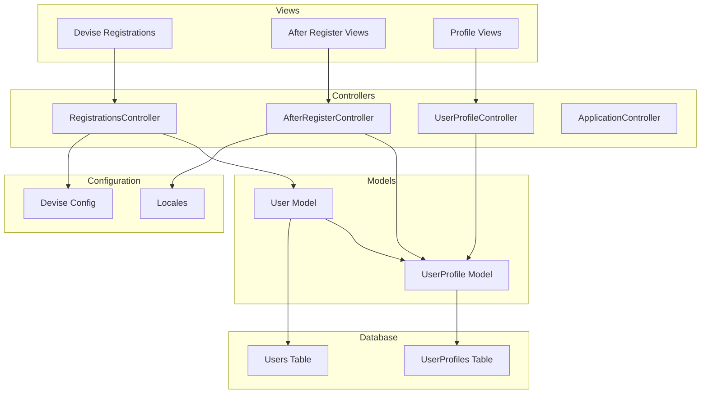
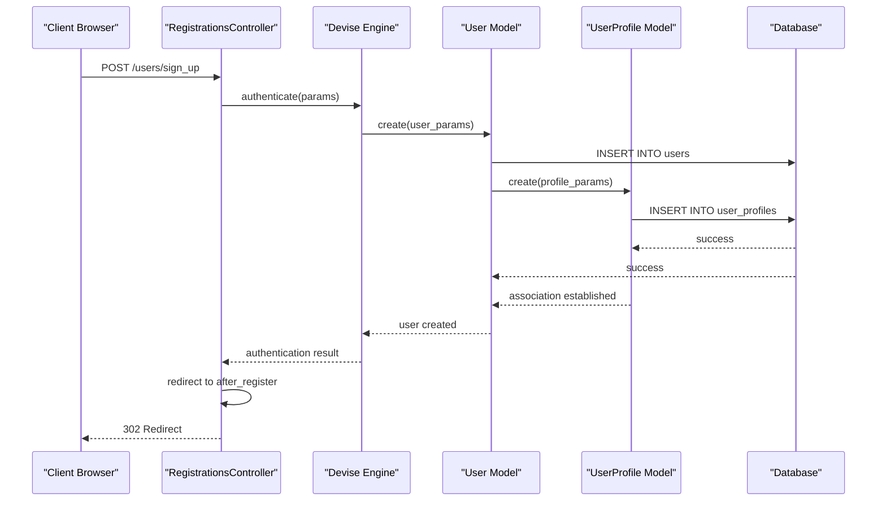
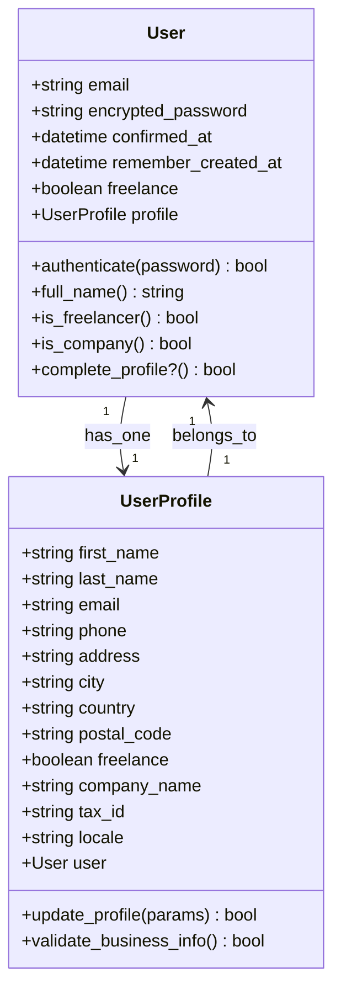
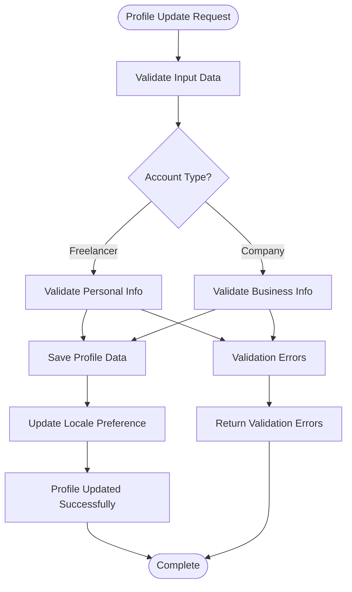
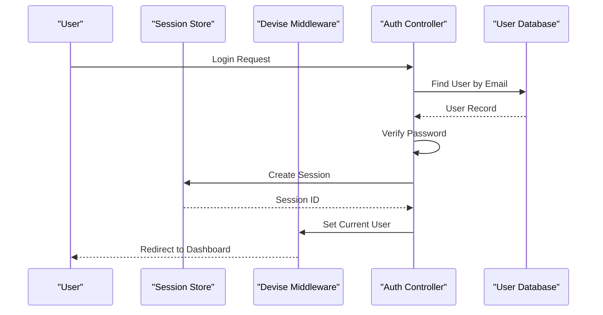
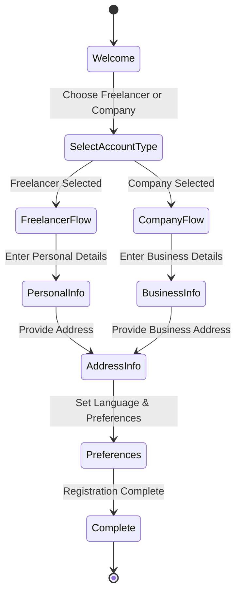
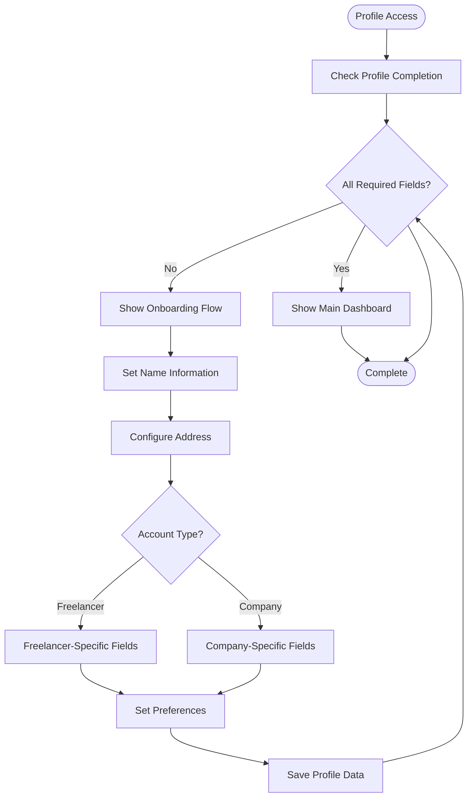
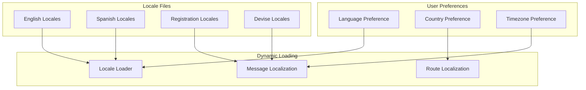
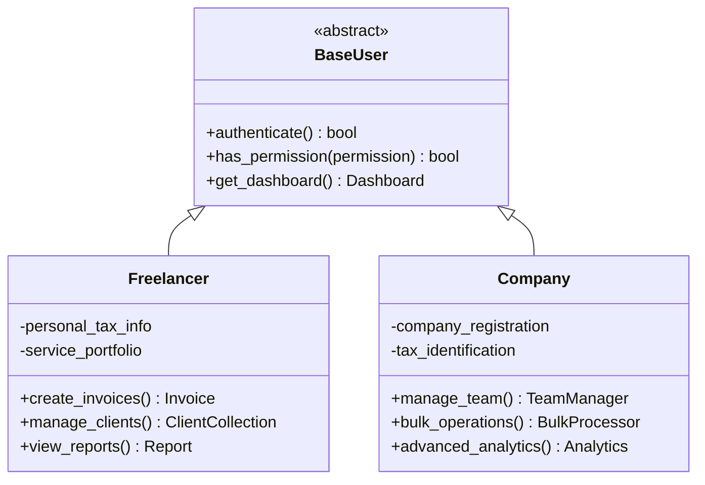

# User Management System

<cite>
**Referenced Files in This Document**
- [user.rb](file://app/models/user.rb)
- [user_profile.rb](file://app/models/user_profile.rb)
- [devise.rb](file://config/initializers/devise.rb)
- [registrations_controller.rb](file://app/controllers/registrations_controller.rb)
- [after_register_controller.rb](file://app/controllers/after_register_controller.rb)
- [user_profile_controller.rb](file://app/controllers/user_profile_controller.rb)
- [application_controller.rb](file://app/controllers/application_controller.rb)
- [20220926102115_devise_create_users.rb](file://db/migrate/20220926102115_devise_create_users.rb)
- [20221005084737_create_user_profiles.rb](file://db/migrate/20221005084737_create_user_profiles.rb)
- [20221005145529_add_freelance_column.rb](file://db/migrate/20221005145529_add_freelance_column.rb)
- [20221005165749_add_user_profile_to_user.rb](file://db/migrate/20221005165749_add_user_profile_to_user.rb)
- [20221006171332_add_first_and_last_name_user_profile.rb](file://db/migrate/20221006171332_add_first_and_last_name_user_profile.rb)
- [20221126124039_add_email_column_user_profile.rb](file://db/migrate/20221126124039_add_email_column_user_profile.rb)
- [20231224164322_add_locale_to_user_profiles.rb](file://db/migrate/20231224164322_add_locale_to_user_profiles.rb)
- [new.html.erb](file://app/views/devise/registrations/new.html.erb)
- [edit.html.erb](file://app/views/devise/registrations/edit.html.erb)
- [freelance_or_company.html.erb](file://app/views/after_register/freelance_or_company.html.erb)
- [set_address.html.erb](file://app/views/after_register/set_address.html.erb)
- [set_company_info.html.erb](file://app/views/after_register/set_company_info.html.erb)
- [set_name.html.erb](file://app/views/after_register/set_name.html.erb)
- [_account.html.erb](file://app/views/devise/registrations/_account.html.erb)
- [_address.html.erb](file://app/views/devise/registrations/_address.html.erb)
- [_contact.html.erb](file://app/views/devise/registrations/_contact.html.erb)
- [_personal.html.erb](file://app/views/devise/registrations/_personal.html.erb)
- [_preferencias.html.erb](file://app/views/devise/registrations/_preferencias.html.erb)
- [en.yml](file://config/locales/registration/en.yml)
- [es.yml](file://config/locales/registration/es.yml)
- [devise.en.yml](file://config/locales/devise.en.yml)
- [devise.es.yml](file://config/locales/devise.es.yml)
</cite>

## Table of Contents
1. [Introduction](#introduction)
2. [Project Structure](#project-structure)
3. [Core Components](#core-components)
4. [Architecture Overview](#architecture-overview)
5. [Detailed Component Analysis](#detailed-component-analysis)
6. [Authentication Implementation](#authentication-implementation)
7. [User Registration Flow](#user-registration-flow)
8. [Profile Management](#profile-management)
9. [Multi-Language Support](#multi-language-support)
10. [Security Considerations](#security-considerations)
11. [Role-Based Access Control](#role-based-access-control)
12. [Performance Considerations](#performance-considerations)
13. [Troubleshooting Guide](#troubleshooting-guide)
14. [Conclusion](#conclusion)

## Introduction

The user management system in this Rails application provides a comprehensive authentication and user profile management solution built on Devise. The system supports both freelancer and company account types, multi-language capabilities, and a sophisticated after-registration workflow that guides users through profile completion.

The architecture follows Rails conventions with clear separation between authentication logic (handled by Devise), user data models, and custom business logic for profile management and account type differentiation.

## Project Structure

The user management system is organized across multiple layers following Rails MVC patterns:

**Diagram sources**
- [registrations_controller.rb](file://app/controllers/registrations_controller.rb)
- [after_register_controller.rb](file://app/controllers/after_register_controller.rb)
- [user_profile_controller.rb](file://app/controllers/user_profile_controller.rb)
- [user.rb](file://app/models/user.rb)
- [user_profile.rb](file://app/models/user_profile.rb)

## Core Components

### User Model Architecture

The User model serves as the core authentication entity, extending Devise's functionality to support additional user attributes and relationships. The model implements validation rules, associations, and custom methods for user management.

### UserProfile Model

The UserProfile model contains detailed user information including personal details, address information, preferences, and account type specifications. It maintains a one-to-one relationship with the User model and includes locale support for internationalization.

### Authentication Controllers

The system uses customized controllers to handle registration flows, post-registration workflows, and profile management operations. These controllers extend Devise's default behavior while providing custom business logic.

**Section sources**
- [user.rb](file://app/models/user.rb)
- [user_profile.rb](file://app/models/user_profile.rb)
- [registrations_controller.rb](file://app/controllers/registrations_controller.rb)
- [after_register_controller.rb](file://app/controllers/after_register_controller.rb)
- [user_profile_controller.rb](file://app/controllers/user_profile_controller.rb)

## Architecture Overview

The user management system follows a layered architecture pattern with clear separation of concerns:

**Diagram sources**
- [registrations_controller.rb](file://app/controllers/registrations_controller.rb)
- [user.rb](file://app/models/user.rb)
- [user_profile.rb](file://app/models/user_profile.rb)
- [20220926102115_devise_create_users.rb](file://db/migrate/20220926102115_devise_create_users.rb)
- [20221005084737_create_user_profiles.rb](file://db/migrate/20221005084737_create_user_profiles.rb)

## Detailed Component Analysis

### User Model Analysis

The User model extends Devise's base class and implements comprehensive validation and business logic:

**Diagram sources**
- [user.rb](file://app/models/user.rb)
- [user_profile.rb](file://app/models/user_profile.rb)
- [20221005165749_add_user_profile_to_user.rb](file://db/migrate/20221005165749_add_user_profile_to_user.rb)

#### Key Features:
- **Authentication Integration**: Extends Devise for secure authentication
- **Account Type Support**: Differentiates between freelancer and company accounts
- **Profile Association**: One-to-one relationship with UserProfile
- **Validation Rules**: Comprehensive input validation and business rule enforcement
- **Helper Methods**: Utility methods for account type checking and profile completion status

**Section sources**
- [user.rb](file://app/models/user.rb)
- [20220926102115_devise_create_users.rb](file://db/migrate/20220926102115_devise_create_users.rb)
- [20221005145529_add_freelance_column.rb](file://db/migrate/20221005145529_add_freelance_column.rb)

### UserProfile Model Analysis

The UserProfile model manages detailed user information and business-specific data:

**Diagram sources**
- [user_profile.rb](file://app/models/user_profile.rb)
- [20221006171332_add_first_and_last_name_user_profile.rb](file://db/migrate/20221006171332_add_first_and_last_name_user_profile.rb)
- [20221126124039_add_email_column_user_profile.rb](file://db/migrate/20221126124039_add_email_column_user_profile.rb)
- [20231224164322_add_locale_to_user_profiles.rb](file://db/migrate/20231224164322_add_locale_to_user_profiles.rb)

#### Database Schema Evolution:
The UserProfile model has evolved through multiple migrations to support different account types and internationalization requirements.

**Section sources**
- [user_profile.rb](file://app/models/user_profile.rb)
- [20221005084737_create_user_profiles.rb](file://db/migrate/20221005084737_create_user_profiles.rb)
- [20221006171332_add_first_and_last_name_user_profile.rb](file://db/migrate/20221006171332_add_first_and_last_name_user_profile.rb)

## Authentication Implementation

### Devise Configuration

The authentication system is built on Devise with custom configurations for enhanced security and user experience:

**Diagram sources**
- [devise.rb](file://config/initializers/devise.rb)
- [application_controller.rb](file://app/controllers/application_controller.rb)

#### Security Features:
- **Password Encryption**: Secure password hashing with bcrypt
- **Session Management**: Secure session handling with configurable timeouts
- **Email Confirmation**: Optional email verification for new accounts
- **Remember Me**: Persistent login functionality
- **Brute Force Protection**: Account lockout mechanisms

**Section sources**
- [devise.rb](file://config/initializers/devise.rb)
- [application_controller.rb](file://app/controllers/application_controller.rb)

## User Registration Flow

### Multi-Step Registration Process

The registration system implements a guided, multi-step process that adapts based on account type selection:

**Diagram sources**
- [registrations_controller.rb](file://app/controllers/registrations_controller.rb)
- [after_register_controller.rb](file://app/controllers/after_register_controller.rb)
- [freelance_or_company.html.erb](file://app/views/after_register/freelance_or_company.html.erb)

### Registration Controllers

The system uses specialized controllers to manage different aspects of the registration process:

#### RegistrationsController
Handles initial user registration and basic account setup.

#### AfterRegisterController
Manages the post-registration workflow including profile completion and account type configuration.

#### UserProfileController
Provides CRUD operations for user profile management after account creation.

**Section sources**
- [registrations_controller.rb](file://app/controllers/registrations_controller.rb)
- [after_register_controller.rb](file://app/controllers/after_register_controller.rb)
- [user_profile_controller.rb](file://app/controllers/user_profile_controller.rb)

## Profile Management

### Profile Completion Workflow

The profile management system ensures users complete their profiles with all necessary information:

**Diagram sources**
- [user_profile_controller.rb](file://app/controllers/user_profile_controller.rb)
- [set_name.html.erb](file://app/views/after_register/set_name.html.erb)
- [set_address.html.erb](file://app/views/after_register/set_address.html.erb)
- [set_company_info.html.erb](file://app/views/after_register/set_company_info.html.erb)

### Account Type Specific Features

#### Freelancer Accounts
- Personal information fields
- Tax identification numbers
- Banking information for payments
- Service description and portfolio

#### Company Accounts
- Business registration details
- Corporate tax information
- Multiple user management
- Billing and invoicing settings

**Section sources**
- [user_profile_controller.rb](file://app/controllers/user_profile_controller.rb)
- [set_name.html.erb](file://app/views/after_register/set_name.html.erb)
- [set_address.html.erb](file://app/views/after_register/set_address.html.erb)
- [set_company_info.html.erb](file://app/views/after_register/set_company_info.html.erb)

## Multi-Language Support

### Internationalization Architecture

The system implements comprehensive multi-language support through Rails' i18n framework:

**Diagram sources**
- [en.yml](file://config/locales/registration/en.yml)
- [es.yml](file://config/locales/registration/es.yml)
- [devise.en.yml](file://config/locales/devise.en.yml)
- [devise.es.yml](file://config/locales/devise.es.yml)
- [20231224164322_add_locale_to_user_profiles.rb](file://db/migrate/20231224164322_add_locale_to_user_profiles.rb)

### Language Persistence

User language preferences are stored in the UserProfile model and applied globally throughout the application session.

**Section sources**
- [en.yml](file://config/locales/registration/en.yml)
- [es.yml](file://config/locales/registration/es.yml)
- [devise.en.yml](file://config/locales/devise.en.yml)
- [devise.es.yml](file://config/locales/devise.es.yml)
- [20231224164322_add_locale_to_user_profiles.rb](file://db/migrate/20231224164322_add_locale_to_user_profiles.rb)

## Security Considerations

### Password Policy Implementation

The authentication system enforces comprehensive password security policies:

- **Minimum Length Requirements**: Enforced through Devise configuration
- **Complexity Rules**: Mixed character requirements for enhanced security
- **Password History**: Prevention of password reuse
- **Secure Storage**: Bcrypt encryption with salt rounds
- **Session Security**: HTTP-only cookies and secure flags

### Session Management

- **Timeout Configuration**: Automatic session expiration
- **Concurrent Session Control**: Configurable limits on active sessions
- **CSRF Protection**: Built-in cross-site request forgery protection
- **XSS Prevention**: Content security policy implementation

### Data Validation

Comprehensive input validation prevents SQL injection, XSS attacks, and other common vulnerabilities through Rails' built-in sanitization and custom validation rules.

**Section sources**
- [devise.rb](file://config/initializers/devise.rb)
- [application_controller.rb](file://app/controllers/application_controller.rb)

## Role-Based Access Control

### Account Type Permissions

The system implements role-based access control through account type differentiation:

**Diagram sources**
- [user.rb](file://app/models/user.rb)
- [user_profile.rb](file://app/models/user_profile.rb)

### Permission Matrix

| Feature | Freelancer | Company |
|---------|------------|---------|
| Basic Invoicing | ✓ | ✓ |
| Client Management | ✓ | ✓ |
| Team Management | ✗ | ✓ |
| Advanced Analytics | Limited | Full |
| API Access | Standard | Extended |
| Custom Branding | ✗ | ✓ |

**Section sources**
- [user.rb](file://app/models/user.rb)
- [user_profile.rb](file://app/models/user_profile.rb)

## Performance Considerations

### Database Optimization

- **Index Strategy**: Optimized indexes on frequently queried columns
- **Eager Loading**: N+1 query prevention through proper associations
- **Connection Pooling**: Efficient database connection management
- **Caching Strategy**: Redis-backed caching for user sessions and preferences

### Query Optimization

- **Selective Loading**: Only load required user attributes
- **Batch Operations**: Efficient bulk updates for profile changes
- **Lazy Loading**: Deferred loading of large profile sections

### Memory Management

- **Object Pooling**: Reuse of user objects where possible
- **Garbage Collection**: Proper cleanup of temporary user instances
- **Streaming Responses**: Large profile exports use streaming

## Troubleshooting Guide

### Common Authentication Issues

#### Login Failures
- **Invalid Credentials**: Verify email and password combination
- **Account Locked**: Check for too many failed login attempts
- **Email Not Confirmed**: Ensure email confirmation was completed

#### Registration Problems
- **Duplicate Email**: Check for existing user accounts
- **Validation Errors**: Review form field requirements
- **Redirect Loops**: Clear browser cache and cookies

#### Profile Management Issues
- **Permission Denied**: Verify account type and permissions
- **Data Validation**: Check required fields and format requirements
- **Locale Issues**: Verify language preference settings

### Debugging Tools

- **Rails Console**: Direct database access for user inspection
- **Log Analysis**: Authentication flow debugging through logs
- **Session Inspection**: Active session monitoring and management

**Section sources**
- [registrations_controller.rb](file://app/controllers/registrations_controller.rb)
- [user_profile_controller.rb](file://app/controllers/user_profile_controller.rb)

## Conclusion

The user management system provides a robust, scalable foundation for user authentication and profile management. The modular architecture allows for easy extension and customization while maintaining security best practices. The multi-language support and flexible account type system make it suitable for diverse user bases and international deployments.

Key strengths include comprehensive Devise integration, intuitive user onboarding flows, and extensible profile management. The system's design facilitates future enhancements such as advanced role-based permissions, social authentication, and enhanced security features.