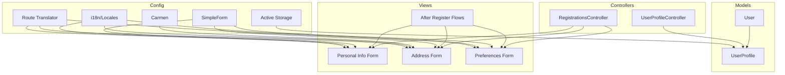
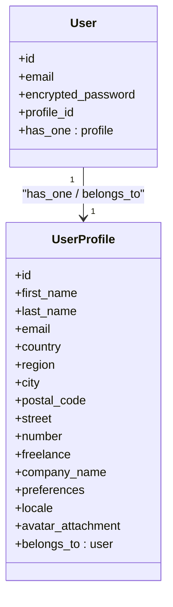
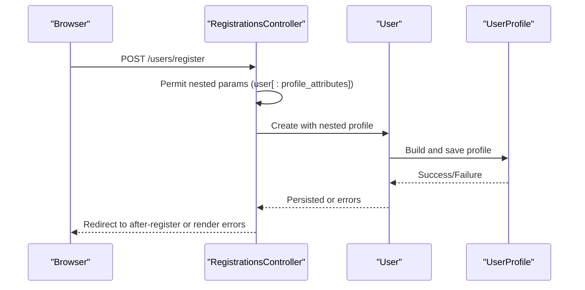
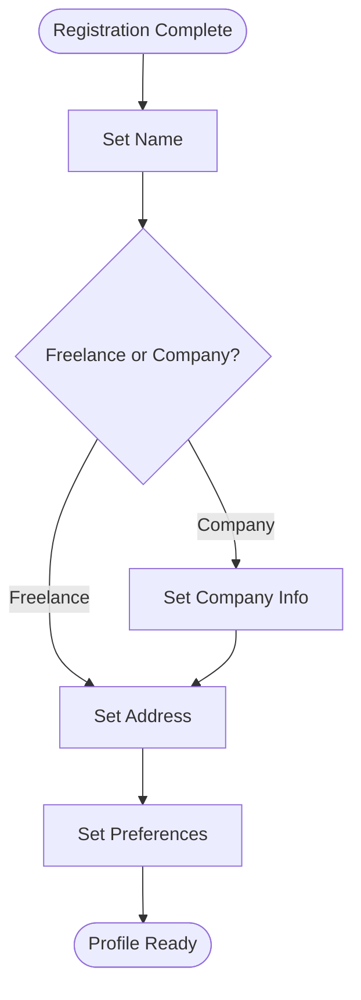
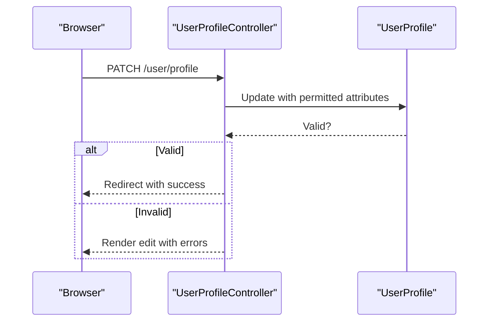
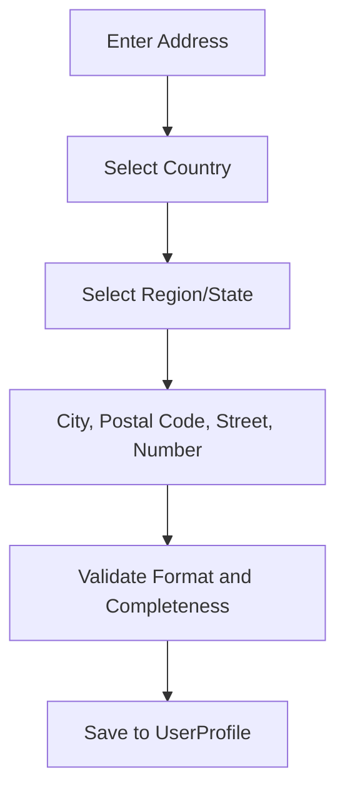
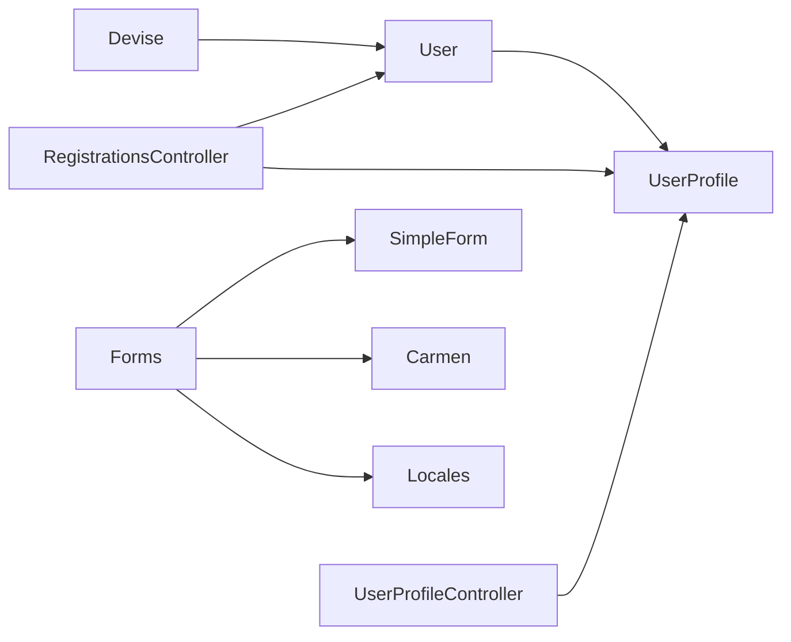

# User Profile & Preferences

<cite>
**Referenced Files in This Document**
- [user_profile.rb](file://app/models/user_profile.rb)
- [user.rb](file://app/models/user.rb)
- [user_profile_controller.rb](file://app/controllers/user_profile_controller.rb)
- [devise_create_users.rb](file://db/migrate/20220926102115_devise_create_users.rb)
- [create_user_profiles.rb](file://db/migrate/20221005084737_create_user_profiles.rb)
- [add_freelance_column.rb](file://db/migrate/20221005145529_add_freelance_column.rb)
- [add_user_profile_to_user.rb](file://db/migrate/20221005165749_add_user_profile_to_user.rb)
- [remove_first_and_last_name_users.rb](file://db/migrate/20221006170844_remove_first_and_last_name_users.rb)
- [add_first_and_last_name_user_profile.rb](file://db/migrate/20221006171332_add_first_and_last_name_user_profile.rb)
- [add_email_column_user_profile.rb](file://db/migrate/20221126124039_add_email_column_user_profile.rb)
- [add_locale_to_user_profiles.rb](file://db/migrate/20231224164322_add_locale_to_user_profiles.rb)
- [schema.rb](file://db/schema.rb)
- [registrations_controller.rb](file://app/controllers/registrations_controller.rb)
- [_personal.html.erb](file://app/views/devise/registrations/_personal.html.erb)
- [_address.html.erb](file://app/views/devise/registrations/_address.html.erb)
- [_preferencias.html.erb](file://app/views/devise/registrations/_preferencias.html.erb)
- [set_address.html.erb](file://app/views/after_register/set_address.html.erb)
- [set_name.html.erb](file://app/views/after_register/set_name.html.erb)
- [freelance_or_company.html.erb](file://app/views/after_register/freelance_or_company.html.erb)
- [set_company_info.html.erb](file://app/views/after_register/set_company_info.html.erb)
- [simple_form.rb](file://config/initializers/simple_form.rb)
- [carmen.rb](file://config/initializers/carmen.rb)
- [locale.rb](file://config/initializers/locale.rb)
- [route_translator.rb](file://config/initializers/route_translator.rb)
- [storage.yml](file://config/storage.yml)
- [application.html.erb](file://app/views/layouts/application.html.erb)
- [home_privacy.html.erb](file://app/views/home/privacy.html.erb)
</cite>

## Table of Contents
1. [Introduction](#introduction)
2. [Project Structure](#project-structure)
3. [Core Components](#core-components)
4. [Architecture Overview](#architecture-overview)
5. [Detailed Component Analysis](#detailed-component-analysis)
6. [Dependency Analysis](#dependency-analysis)
7. [Performance Considerations](#performance-considerations)
8. [Troubleshooting Guide](#troubleshooting-guide)
9. [Conclusion](#conclusion)
10. [Appendices](#appendices)

## Introduction
This document explains user profile management and preference settings in the application. It covers the UserProfile model structure, its relationship with the User model, data validation rules, address management, personal information handling, and preference storage. It also provides guidance for extending profiles with custom fields, implementing profile completion tracking, addressing privacy considerations, integrating profile photo uploads, and supporting internationalization for user data.

## Project Structure
User profile functionality spans models, controllers, views, migrations, and configuration:
- Models: User and UserProfile define core entities and relationships.
- Controllers: Devise registrations controller and a dedicated user profile controller manage updates.
- Views: Registration forms and after-register flows collect personal info, address, and preferences.
- Migrations: Define schema evolution for users and profiles, including locale support.
- Configuration: Simple Form, Carmen (countries), i18n, routing translations, and Active Storage are configured.

[No sources needed since this diagram shows conceptual workflow, not actual code structure]

## Core Components
- User model: Authentication identity via Devise; no longer stores first/last name directly.
- UserProfile model: Holds personal details, address, preferences, locale, and optional profile photo.
- RegistrationsController: Extends Devise to accept nested profile attributes during registration.
- UserProfileController: Provides update actions for editing profile and preferences.
- After-register views: Guided flows to complete name, address, company info, and preferences.

Key responsibilities:
- Data capture: Personal info, address, preferences.
- Validation: Presence, format, and business rules enforced at model and form layers.
- Internationalization: Locale selection and translated labels/messages.
- Storage: Active Storage integration for profile photos.

**Section sources**
- [user.rb](file://app/models/user.rb)
- [user_profile.rb](file://app/models/user_profile.rb)
- [registrations_controller.rb](file://app/controllers/registrations_controller.rb)
- [user_profile_controller.rb](file://app/controllers/user_profile_controller.rb)
- [_personal.html.erb](file://app/views/devise/registrations/_personal.html.erb)
- [_address.html.erb](file://app/views/devise/registrations/_address.html.erb)
- [_preferencias.html.erb](file://app/views/devise/registrations/_preferencias.html.erb)
- [set_address.html.erb](file://app/views/after_register/set_address.html.erb)
- [set_name.html.erb](file://app/views/after_register/set_name.html.erb)
- [freelance_or_company.html.erb](file://app/views/after_register/freelance_or_company.html.erb)
- [set_company_info.html.erb](file://app/views/after_register/set_company_info.html.erb)

## Architecture Overview
The system separates authentication (User) from profile data (UserProfile). Registration and profile edits use nested attributes to persist related records atomically. Address inputs leverage Carmen for country/region helpers. Preferences are stored as structured attributes on UserProfile. Locale is persisted per profile to localize UI and messages.

**Diagram sources**
- [user.rb](file://app/models/user.rb)
- [user_profile.rb](file://app/models/user_profile.rb)
- [add_user_profile_to_user.rb](file://db/migrate/20221005165749_add_user_profile_to_user.rb)
- [create_user_profiles.rb](file://db/migrate/20221005084737_create_user_profiles.rb)
- [add_freelance_column.rb](file://db/migrate/20221005145529_add_freelance_column.rb)
- [add_email_column_user_profile.rb](file://db/migrate/20221126124039_add_email_column_user_profile.rb)
- [add_locale_to_user_profiles.rb](file://db/migrate/20231224164322_add_locale_to_user_profiles.rb)

## Detailed Component Analysis

### User Model
- Purpose: Authentication and authorization via Devise.
- Relationship: Has one UserProfile; foreign key added by migration.
- Evolution: First and last name were moved out of User into UserProfile.

Validation and behavior:
- Email uniqueness and presence handled by Devise.
- Password encryption and confirmation managed by Devise.

Extensibility:
- Add callbacks or scopes for account lifecycle.
- Integrate with external auth providers if needed.

**Section sources**
- [devise_create_users.rb](file://db/migrate/20220926102115_devise_create_users.rb)
- [add_user_profile_to_user.rb](file://db/migrate/20221005165749_add_user_profile_to_user.rb)
- [remove_first_and_last_name_users.rb](file://db/migrate/20221006170844_remove_first_and_last_name_users.rb)
- [user.rb](file://app/models/user.rb)

### UserProfile Model
- Purpose: Store personal information, address, preferences, locale, and avatar.
- Relationship: Belongs to User; created automatically during registration.

Attributes overview:
- Personal: first_name, last_name, email.
- Address: country, region, city, postal_code, street, number.
- Business: freelance flag, company_name.
- Preferences: structured hash or serialized fields.
- Localization: locale.
- Media: avatar attachment via Active Storage.

Validation strategy:
- Presence validations for required fields based on context (e.g., freelance vs company).
- Format validations for email and postal codes.
- Conditional validations depending on freelance/company mode.

Internationalization:
- Locale attribute drives localized rendering and messages.
- Labels and help text sourced from locales.

Privacy:
- Sensitive fields should be treated carefully; avoid logging.
- Provide mechanisms to clear or redact sensitive data.

Extensibility:
- Add new fields through migrations and validations.
- Use strong parameters in controllers to permit new attributes.

**Section sources**
- [create_user_profiles.rb](file://db/migrate/20221005084737_create_user_profiles.rb)
- [add_freelance_column.rb](file://db/migrate/20221005145529_add_freelance_column.rb)
- [add_first_and_last_name_user_profile.rb](file://db/migrate/20221006171332_add_first_and_last_name_user_profile.rb)
- [add_email_column_user_profile.rb](file://db/migrate/20221126124039_add_email_column_user_profile.rb)
- [add_locale_to_user_profiles.rb](file://db/migrate/20231224164322_add_locale_to_user_profiles.rb)
- [user_profile.rb](file://app/models/user_profile.rb)

### Registration Flow (Nested Attributes)
- The registrations controller accepts nested profile attributes to create both User and UserProfile in one transaction.
- Strong parameters must include permitted profile fields.
- On success, redirect to after-register completion flow.

**Diagram sources**
- [registrations_controller.rb](file://app/controllers/registrations_controller.rb)
- [create_user_profiles.rb](file://db/migrate/20221005084737_create_user_profiles.rb)
- [_personal.html.erb](file://app/views/devise/registrations/_personal.html.erb)
- [_address.html.erb](file://app/views/devise/registrations/_address.html.erb)
- [_preferencias.html.erb](file://app/views/devise/registrations/_preferencias.html.erb)

**Section sources**
- [registrations_controller.rb](file://app/controllers/registrations_controller.rb)
- [_personal.html.erb](file://app/views/devise/registrations/_personal.html.erb)
- [_address.html.erb](file://app/views/devise/registrations/_address.html.erb)
- [_preferencias.html.erb](file://app/views/devise/registrations/_preferencias.html.erb)

### After-Register Completion Flow
- Guided steps to finalize profile: set name, choose freelance or company, set address, set company info, and preferences.
- Each step persists relevant attributes on UserProfile.

**Diagram sources**
- [set_name.html.erb](file://app/views/after_register/set_name.html.erb)
- [freelance_or_company.html.erb](file://app/views/after_register/freelance_or_company.html.erb)
- [set_address.html.erb](file://app/views/after_register/set_address.html.erb)
- [set_company_info.html.erb](file://app/views/after_register/set_company_info.html.erb)

**Section sources**
- [set_name.html.erb](file://app/views/after_register/set_name.html.erb)
- [freelance_or_company.html.erb](file://app/views/after_register/freelance_or_company.html.erb)
- [set_address.html.erb](file://app/views/after_register/set_address.html.erb)
- [set_company_info.html.erb](file://app/views/after_register/set_company_info.html.erb)

### Profile Editing and Preferences
- UserProfileController handles updates for personal info, address, and preferences.
- Strong parameters restrict updatable fields.
- Validation feedback is shown using Simple Form.

**Diagram sources**
- [user_profile_controller.rb](file://app/controllers/user_profile_controller.rb)
- [_preferencias.html.erb](file://app/views/devise/registrations/_preferencias.html.erb)

**Section sources**
- [user_profile_controller.rb](file://app/controllers/user_profile_controller.rb)
- [_preferencias.html.erb](file://app/views/devise/registrations/_preferencias.html.erb)

### Address Management
- Country and region selection powered by Carmen.
- City, postal code, street, and number captured for full address.
- Validations ensure completeness when required.

**Diagram sources**
- [_address.html.erb](file://app/views/devise/registrations/_address.html.erb)
- [carmen.rb](file://config/initializers/carmen.rb)

**Section sources**
- [_address.html.erb](file://app/views/devise/registrations/_address.html.erb)
- [carmen.rb](file://config/initializers/carmen.rb)

### Personal Information Handling
- First and last name moved from User to UserProfile.
- Email may be duplicated in UserProfile for display purposes while relying on Devise for authentication.

Best practices:
- Keep primary email authoritative in User.
- Use UserProfile.email for display-only contexts.

**Section sources**
- [remove_first_and_last_name_users.rb](file://db/migrate/20221006170844_remove_first_and_last_name_users.rb)
- [add_first_and_last_name_user_profile.rb](file://db/migrate/20221006171332_add_first_and_last_name_user_profile.rb)
- [add_email_column_user_profile.rb](file://db/migrate/20221126124039_add_email_column_user_profile.rb)
- [_personal.html.erb](file://app/views/devise/registrations/_personal.html.erb)

### Preference Storage
- Preferences stored as structured data on UserProfile.
- Use Simple Form collections for checkboxes, radios, and selects.
- Persist locale alongside preferences for consistent UX.

**Section sources**
- [_preferencias.html.erb](file://app/views/devise/registrations/_preferencias.html.erb)
- [add_locale_to_user_profiles.rb](file://db/migrate/20231224164322_add_locale_to_user_profiles.rb)

### Extending User Profiles
Steps to add custom fields:
1. Create a migration to add columns to user_profiles.
2. Update validations in UserProfile.
3. Permit new attributes in controller strong parameters.
4. Add form fields in relevant views.
5. Update after-register flows if needed.
6. Add i18n keys for labels and messages.

Example paths:
- Migration pattern: see [add_locale_to_user_profiles.rb](file://db/migrate/20231224164322_add_locale_to_user_profiles.rb)
- Controller permitting: see [user_profile_controller.rb](file://app/controllers/user_profile_controller.rb)
- Form fields: see [_personal.html.erb](file://app/views/devise/registrations/_personal.html.erb), [_address.html.erb](file://app/views/devise/registrations/_address.html.erb), [_preferencias.html.erb](file://app/views/devise/registrations/_preferencias.html.erb)

**Section sources**
- [add_locale_to_user_profiles.rb](file://db/migrate/20231224164322_add_locale_to_user_profiles.rb)
- [user_profile_controller.rb](file://app/controllers/user_profile_controller.rb)
- [_personal.html.erb](file://app/views/devise/registrations/_personal.html.erb)
- [_address.html.erb](file://app/views/devise/registrations/_address.html.erb)
- [_preferencias.html.erb](file://app/views/devise/registrations/_preferencias.html.erb)

### Profile Completion Tracking
Implement a method to compute completion percentage:
- Required fields checklist depends on freelance vs company mode.
- Count filled required fields and divide by total required.
- Expose helper methods in UserProfile or presenters.

Suggested approach:
- Add a method that returns an array of required field names.
- Compute percentage and expose it to views for progress indicators.

[No sources needed since this section provides general guidance]

### Data Privacy Considerations
- Treat personal and business data as sensitive; avoid logging.
- Provide options to clear or anonymize data upon request.
- Enforce access controls so users can only edit their own profiles.
- Comply with applicable regulations (e.g., GDPR) regarding consent and data retention.

References:
- Privacy policy view: [home_privacy.html.erb](file://app/views/home/privacy.html.erb)

**Section sources**
- [home_privacy.html.erb](file://app/views/home/privacy.html.erb)

### Profile Photo Uploads
- Use Active Storage to attach an avatar to UserProfile.
- Configure storage service in storage.yml.
- Add file upload field in profile edit view.
- Validate file type and size in model or controller.

Configuration references:
- Active Storage setup: [storage.yml](file://config/storage.yml)
- Layout includes assets: [application.html.erb](file://app/views/layouts/application.html.erb)

**Section sources**
- [storage.yml](file://config/storage.yml)
- [application.html.erb](file://app/views/layouts/application.html.erb)

### Internationalization Support
- Locale stored per UserProfile to personalize UI and messages.
- Simple Form and routes are configured for translation.
- Ensure all labels and help texts are keyed in locales.

Configuration references:
- Simple Form config: [simple_form.rb](file://config/initializers/simple_form.rb)
- Route translator: [route_translator.rb](file://config/initializers/route_translator.rb)
- Locale initializer: [locale.rb](file://config/initializers/locale.rb)

**Section sources**
- [simple_form.rb](file://config/initializers/simple_form.rb)
- [route_translator.rb](file://config/initializers/route_translator.rb)
- [locale.rb](file://config/initializers/locale.rb)

## Dependency Analysis
Relationships and coupling:
- User depends on Devise for authentication.
- UserProfile depends on User via foreign key.
- Controllers depend on models and strong parameters.
- Views depend on Simple Form, Carmen, and i18n.

**Diagram sources**
- [user.rb](file://app/models/user.rb)
- [user_profile.rb](file://app/models/user_profile.rb)
- [registrations_controller.rb](file://app/controllers/registrations_controller.rb)
- [user_profile_controller.rb](file://app/controllers/user_profile_controller.rb)
- [simple_form.rb](file://config/initializers/simple_form.rb)
- [carmen.rb](file://config/initializers/carmen.rb)
- [locale.rb](file://config/initializers/locale.rb)

**Section sources**
- [user.rb](file://app/models/user.rb)
- [user_profile.rb](file://app/models/user_profile.rb)
- [registrations_controller.rb](file://app/controllers/registrations_controller.rb)
- [user_profile_controller.rb](file://app/controllers/user_profile_controller.rb)
- [simple_form.rb](file://config/initializers/simple_form.rb)
- [carmen.rb](file://config/initializers/carmen.rb)
- [locale.rb](file://config/initializers/locale.rb)

## Performance Considerations
- Avoid N+1 queries when displaying multiple profiles; use includes or joins.
- Cache computed profile completion percentages if frequently accessed.
- Limit Active Storage variants to necessary sizes.
- Use database indexes on frequently queried fields (e.g., email, locale).

[No sources needed since this section provides general guidance]

## Troubleshooting Guide
Common issues and resolutions:
- Nested attributes not saving: verify strong parameters include profile attributes.
- Address dropdowns empty: confirm Carmen initializer and asset pipeline.
- Locale not applied: check locale persistence and route translator configuration.
- File upload failures: review Active Storage configuration and storage backend permissions.

Relevant files:
- Strong parameters and updates: [user_profile_controller.rb](file://app/controllers/user_profile_controller.rb)
- Registration params: [registrations_controller.rb](file://app/controllers/registrations_controller.rb)
- Carmen setup: [carmen.rb](file://config/initializers/carmen.rb)
- i18n setup: [locale.rb](file://config/initializers/locale.rb), [route_translator.rb](file://config/initializers/route_translator.rb)
- Active Storage: [storage.yml](file://config/storage.yml)

**Section sources**
- [user_profile_controller.rb](file://app/controllers/user_profile_controller.rb)
- [registrations_controller.rb](file://app/controllers/registrations_controller.rb)
- [carmen.rb](file://config/initializers/carmen.rb)
- [locale.rb](file://config/initializers/locale.rb)
- [route_translator.rb](file://config/initializers/route_translator.rb)
- [storage.yml](file://config/storage.yml)

## Conclusion
The user profile system cleanly separates authentication from profile data, supports guided onboarding, and provides robust foundations for extensions. With proper validations, i18n, and Active Storage integration, it enables secure, accessible, and internationally aware user experiences. Follow the extension guidelines to add fields, track completion, and maintain privacy standards.

[No sources needed since this section summarizes without analyzing specific files]

## Appendices

### Database Schema Summary
Key tables and columns relevant to profiles:
- Users: authentication fields and profile reference.
- User Profiles: personal info, address, preferences, locale, and avatar attachment.

For exact column definitions, refer to:
- [schema.rb](file://db/schema.rb)

**Section sources**
- [schema.rb](file://db/schema.rb)